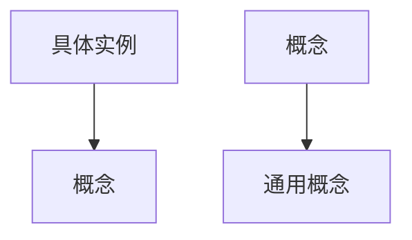
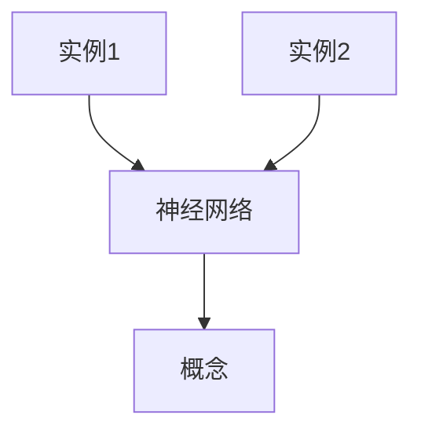
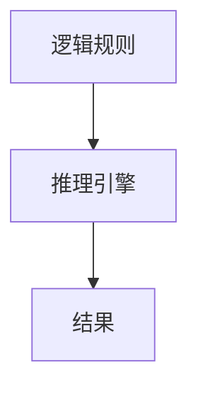
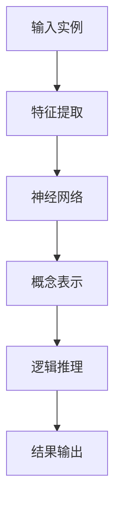
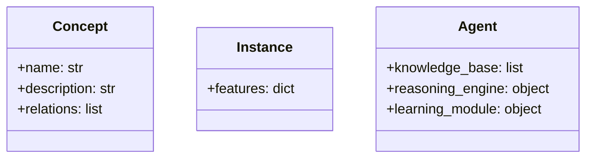
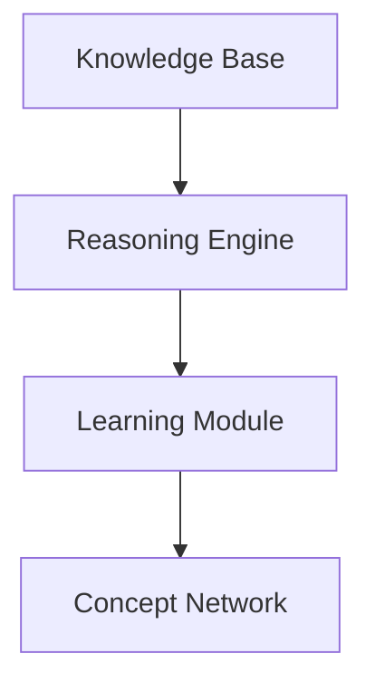
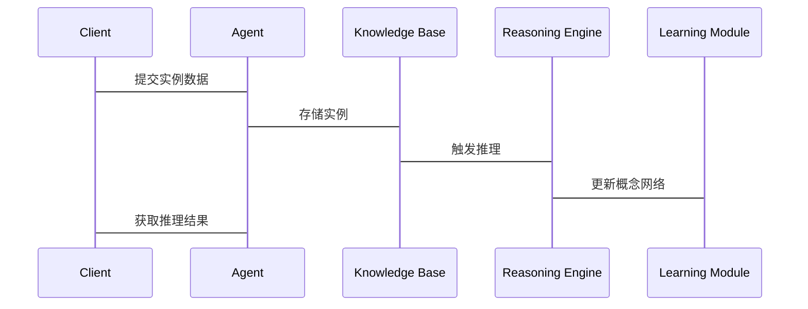

                 


# 开发具有抽象思维与概念形成能力的AI Agent

---

## 关键词：AI Agent、抽象思维、概念形成、知识表示、逻辑推理、神经网络

---

## 摘要：  
AI Agent的抽象思维与概念形成能力是实现更高级人工智能的关键。本文从理论基础、算法实现到系统架构，详细探讨了如何开发具有抽象思维与概念形成能力的AI Agent。通过结合符号逻辑与神经网络，本文提出了一个创新的解决方案，并通过实际案例展示了如何在复杂场景中实现概念形成与抽象推理。文章内容涵盖背景介绍、核心概念、算法原理、系统设计与实现，旨在为AI开发者和研究人员提供深度的技术指导。

---

## 第一部分：引言

---

## 第1章：开发具有抽象思维与概念形成能力的AI Agent概述

### 1.1 问题背景与重要性

#### 1.1.1 当前AI技术的局限性  
当前的AI系统，如基于深度学习的模型，主要依赖于大量数据和模式识别，缺乏对概念的真正理解。这些模型在处理抽象问题时往往显得力不从心，无法进行跨领域的知识推理。

#### 1.1.2 抽象思维与概念形成能力的必要性  
抽象思维是人类智能的核心，它使我们能够从具体实例中提取通用概念，并在不同场景中灵活应用。具备这种能力的AI Agent能够更好地理解和解决复杂问题。

#### 1.1.3 本课题的研究意义与目标  
研究具有抽象思维与概念形成能力的AI Agent，不仅能够提升AI系统的智能水平，还能够为解决实际问题提供更强大的工具。

---

### 1.2 问题描述与解决思路

#### 1.2.1 抽象思维与概念形成的定义  
抽象思维是指从具体实例中提取一般性概念的能力。概念形成是通过学习和推理，构建对世界的理解和表示。

#### 1.2.2 AI Agent的核心需求与挑战  
AI Agent需要能够理解概念之间的关系，并在新的场景中灵活应用这些概念。核心挑战在于如何将符号逻辑与神经网络结合，实现概念的动态更新与优化。

#### 1.2.3 解决方案的总体思路  
通过结合符号逻辑与神经网络，构建一个能够表示、推理和更新概念的系统。

---

### 1.3 核心概念与边界

#### 1.3.1 抽象思维的特征与属性  
抽象思维具有层次性、灵活性和可扩展性。它能够从具体实例中提取通用概念，并在不同层次之间进行推理。

#### 1.3.2 概念形成的基本原理  
概念形成是通过学习实例之间的关系，构建概念网络，并在新数据中进行验证和优化。

#### 1.3.3 系统的边界与外延  
系统的边界包括输入数据、知识库和推理引擎。外延则涉及如何与其他系统交互，以及如何处理动态变化的环境。

---

### 1.4 核心要素与逻辑结构

#### 1.4.1 知识表示与推理机制  
知识表示需要层次化结构，推理机制则依赖于逻辑规则和神经网络的结合。

#### 1.4.2 概念网络与关联关系  
概念网络通过节点表示概念，边表示概念之间的关系。

#### 1.4.3 系统架构的核心要素  
系统架构包括知识库、推理引擎和学习模块。

---

## 1.5 本章小结  
本章概述了开发具有抽象思维与概念形成能力的AI Agent的重要性和核心挑战，并提出了解决方案的总体思路。

---

## 第二部分：核心概念与联系

---

## 第2章：抽象思维与概念形成的原理

### 2.1 抽象思维的核心原理

#### 2.1.1 知识表示的层次化结构  
知识表示需要从具体实例到通用概念的层次化结构。

#### 2.1.2 概念形成的神经机制  
神经网络通过学习实例之间的关系，构建概念表示。

#### 2.1.3 抽象推理的逻辑框架  
逻辑推理是通过符号逻辑和神经网络结合实现的。

---

### 2.2 概念形成的基本特征

#### 2.2.1 概念的层次性与网络化  
概念之间存在层次关系和关联关系。

#### 2.2.2 概念的可扩展性与适应性  
概念网络能够动态扩展和更新。

#### 2.2.3 概念的动态更新与优化  
通过反馈机制优化概念表示。

---

### 2.3 抽象思维与概念形成的联系

#### 2.3.1 抽象思维对概念形成的影响  
抽象思维指导概念网络的构建和优化。

#### 2.3.2 概念形成对抽象推理的支撑  
概念网络为抽象推理提供了基础。

#### 2.3.3 两者结合的系统模型  
系统模型通过符号逻辑和神经网络结合，实现抽象思维与概念形成的统一。

---

### 2.4 核心概念原理图

#### 2.4.1 知识表示的层次化结构图  


#### 2.4.2 概念形成的神经网络模型  


#### 2.4.3 抽象推理的逻辑框架图  


---

## 2.5 本章小结  
本章详细讲解了抽象思维与概念形成的原理，并通过图表展示了它们的联系。

---

## 第三部分：算法原理讲解

---

## 第3章：抽象思维与概念形成的算法原理

### 3.1 算法概述

#### 3.1.1 算法的目标与输入  
算法目标是构建概念网络，输入包括实例数据和逻辑规则。

#### 3.1.2 算法的基本流程  
1. 输入实例数据，进行特征提取。
2. 使用神经网络学习概念表示。
3. 应用逻辑规则优化概念网络。

#### 3.1.3 算法的输出与结果  
输出包括概念网络和推理结果。

---

### 3.2 算法实现细节

#### 3.2.1 知识表示的编码方法  
使用符号逻辑对概念进行编码，结合向量表示具体实例。

#### 3.2.2 概念形成的推理机制  
通过神经网络学习概念之间的关系，并结合逻辑推理进行优化。

#### 3.2.3 抽象思维的优化策略  
通过反馈机制动态更新概念网络。

---

### 3.3 算法的数学模型

#### 3.3.1 知识表示的数学模型  
概念表示为符号逻辑表达式，实例表示为向量。

#### 3.3.2 概念形成的数学表达  
$$c = f(x)$$，其中$c$是概念，$x$是实例，$f$是神经网络。

#### 3.3.3 抽象推理的数学公式  
$$r = g(c_1, c_2)$$，其中$r$是推理结果，$c_1$和$c_2$是概念。

---

### 3.4 算法的mermaid流程图



---

## 3.5 算法的Python实现

```python
import numpy as np

def neural_network(input_data):
    # 简单的神经网络实现
    weights = np.random.randn(input_data.shape[1], 1)
    return np.dot(input_data, weights)

def concept_forming(instance_data):
    # 特征提取与概念形成
    features = instance_data[:, :5]
    concept = neural_network(features)
    return concept

# 示例数据
data = np.random.rand(10, 10)
concept = concept_forming(data)
print(concept)
```

---

## 3.6 本章小结  
本章详细讲解了抽象思维与概念形成的算法原理，并通过代码示例展示了实现过程。

---

## 第四部分：系统分析与架构设计方案

---

## 第4章：系统分析与架构设计方案

### 4.1 问题场景介绍

#### 4.1.1 问题背景  
我们需要开发一个能够理解复杂概念的AI Agent，用于医疗诊断领域。

#### 4.1.2 项目介绍  
本项目旨在构建一个能够诊断疾病的概念形成系统。

---

### 4.2 系统功能设计

#### 4.2.1 领域模型类图  


#### 4.2.2 系统架构图  


#### 4.2.3 系统接口设计  
系统接口包括数据输入接口、推理接口和学习接口。

#### 4.2.4 系统交互序列图  


---

## 4.3 本章小结  
本章通过医疗诊断案例，详细设计了系统的架构和交互流程。

---

## 第五部分：项目实战

---

## 第5章：项目实战与优化

### 5.1 环境安装与配置

#### 5.1.1 安装Python环境  
安装Python 3.8及以上版本，安装必要的库，如numpy、scikit-learn。

#### 5.1.2 安装深度学习框架  
安装TensorFlow或PyTorch框架。

---

### 5.2 系统核心实现

#### 5.2.1 知识库构建  
```python
class KnowledgeBase:
    def __init__(self):
        self.concepts = {}

    def add_concept(self, name, description, relations):
        self.concepts[name] = {
            'description': description,
            'relations': relations
        }
```

#### 5.2.2 推理引擎实现  
```python
class ReasoningEngine:
    def __init__(self, knowledge_base):
        self.knowledge_base = knowledge_base

    def infer(self, concept, target):
        # 简单推理逻辑
        return self.knowledge_base.concepts[concept]['relations'].get(target, None)
```

#### 5.2.3 学习模块实现  
```python
class LearningModule:
    def __init__(self):
        pass

    def update_concept(self, concept, data):
        # 示例更新逻辑
        pass
```

---

### 5.3 代码应用解读与分析

#### 5.3.1 知识库构建示例  
```python
kb = KnowledgeBase()
kb.add_concept('疾病A', '一种常见疾病', {'症状': ['症状1', '症状2']})
```

#### 5.3.2 推理引擎示例  
```python
engine = ReasoningEngine(kb)
result = engine.infer('疾病A', '症状1')
print(result)  # 输出：'症状1'
```

---

### 5.4 项目小结  
本章通过实际案例展示了如何在医疗诊断领域实现具有抽象思维与概念形成能力的AI Agent。

---

## 第六部分：总结与展望

---

## 第6章：总结与未来展望

### 6.1 总结  
本文详细探讨了开发具有抽象思维与概念形成能力的AI Agent的理论与实践。通过结合符号逻辑与神经网络，提出了一种创新的解决方案。

### 6.2 未来展望  
未来的研究方向包括优化概念网络的动态更新机制，以及探索更高效的推理算法。

---

## 作者：AI天才研究院/AI Genius Institute & 禅与计算机程序设计艺术 /Zen And The Art of Computer Programming

