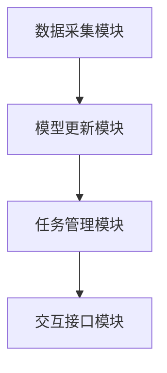
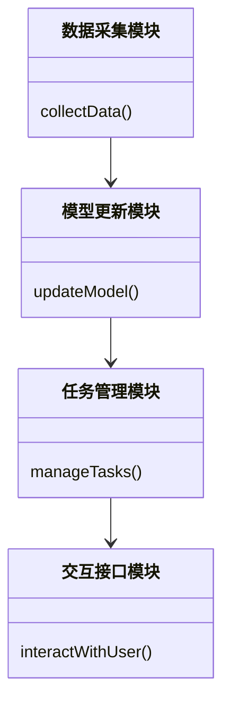
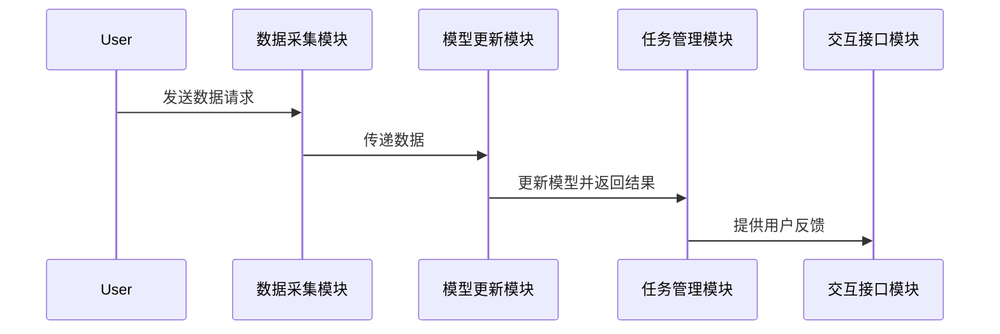

                 


# 开发具有持续学习能力的AI Agent

## 关键词：持续学习，AI Agent，机器学习，深度学习，强化学习，在线学习，增量学习

## 摘要

在当前快速变化的数字时代，开发具有持续学习能力的AI Agent变得越来越重要。这种AI Agent能够不断地从新数据和新任务中学习，并适应不断变化的环境。本文将详细探讨持续学习的基本概念、核心算法、系统架构设计以及实际项目中的应用。通过理论分析和实践案例，我们将帮助读者理解如何构建一个能够持续学习的AI Agent，并掌握相关的开发技巧。

---

# 第1章: AI Agent与持续学习概述

## 1.1 AI Agent的基本概念

### 1.1.1 AI Agent的定义与特点

AI Agent（人工智能代理）是一种智能系统，能够感知环境、执行任务并做出决策。它具有以下特点：

1. **自主性**：AI Agent能够自主决策，无需外部干预。
2. **反应性**：能够实时感知环境并做出反应。
3. **目标导向**：基于目标或任务执行操作。
4. **学习能力**：能够通过经验或数据改进性能。

### 1.1.2 持续学习的必要性

在动态环境中，AI Agent需要不断适应新任务和新数据。持续学习使其能够：

1. **适应新环境**：在变化的环境中保持高效。
2. **处理新任务**：扩展处理不同类型任务的能力。
3. **优化性能**：通过不断学习提升准确性。

### 1.1.3 持续学习AI Agent的应用场景

- **自动驾驶**：实时处理新数据，应对复杂交通情况。
- **智能助手**：根据用户行为调整服务策略。
- **机器人控制**：在动态环境中执行复杂动作。

---

## 1.2 持续学习的核心机制

### 1.2.1 在线学习与离线学习的区别

- **在线学习**：实时处理数据，适用于动态环境。
- **离线学习**：批量处理历史数据，适用于静态环境。

### 1.2.2 模型可微调性和自适应性

- **可微调性**：模型能够通过少量新数据快速调整。
- **自适应性**：模型能够根据环境变化自动优化。

### 1.2.3 持续学习的挑战与解决方案

- **数据稀疏性**：新数据不足时，模型可能无法有效更新。
- **模型遗忘**：长期训练可能导致旧知识遗忘。

解决方案包括经验重放、知识蒸馏和增量学习等方法。

---

# 第2章: 持续学习的核心算法

## 2.1 基于模型无关的方法

### 2.1.1 使用经验重放的DQN算法

DQN（Deep Q-Network）算法通过经验重放缓解经验不足问题：

- **经验回放机制**：将经验存储在回放库中，并随机采样进行训练。
- **数学公式**：$$ Q(s, a) = r + \gamma \max Q(s', a') $$

### 2.1.2 知识蒸馏在持续学习中的应用

- **知识蒸馏**：将复杂模型的知识迁移到简单模型。
- **KL散度公式**：$$ L_{KL} = KL(p_{student}(y|x), p_{teacher}(y|x)) $$

### 2.1.3 增量式支持向量机的原理

- **增量式学习**：逐步更新模型，适应新数据。

---

## 2.2 基于模型相关的方法

### 2.2.1 模型参数的渐进式更新

- **渐进式更新**：逐步调整模型参数，保持稳定性和高效性。

### 2.2.2 网络架构的动态调整

- **动态调整**：根据任务需求调整网络结构，提升性能。

### 2.2.3 模型压缩与轻量化设计

- **模型压缩**：减少模型大小，提升推理速度。

---

## 2.3 算法对比与选择策略

### 2.3.1 不同算法的优缺点分析

| 算法类型       | 优点                           | 缺点                           |
|----------------|--------------------------------|--------------------------------|
| 模型无关方法   | 灵活性高，适用于多种任务       | 需要大量存储和计算资源         |
| 模型相关方法   | 参数更新高效，模型性能稳定     | 灵活性较低，适用于特定任务     |

### 2.3.2 根据任务选择合适算法的策略

- **任务类型**：根据任务需求选择算法。
- **数据规模**：数据量大的任务适合模型无关方法。

### 2.3.3 算法性能评估指标

- **准确率**：模型在测试集上的准确率。
- **收敛速度**：模型达到稳定所需的训练时间。

---

# 第3章: 持续学习的数学模型与公式

## 3.1 经验重放机制的数学模型

### 3.1.1 DQN算法的数学公式

- **Q-learning公式**：$$ Q(s, a) = r + \gamma \max Q(s', a') $$
- **经验回放公式**：从回放库中随机采样经验进行训练。

## 3.2 知识蒸馏的数学模型

### 3.2.1 知识蒸馏的核心公式

- **KL散度公式**：$$ L_{KL} = KL(p_{student}(y|x), p_{teacher}(y|x)) $$

## 3.3 增量式学习的数学模型

### 3.3.1 增量式线性回归公式

- **增量式更新公式**：$$ \theta_{t+1} = \theta_t + \eta (y_t - \hat{y}_t)x_t $$

---

# 第4章: 持续学习算法的系统架构设计

## 4.1 系统功能设计

### 4.1.1 系统功能模块划分

- **数据采集模块**：收集新数据。
- **模型更新模块**：更新模型参数。
- **任务管理模块**：管理任务队列。
- **交互接口模块**：与用户或外部系统交互。

### 4.1.2 系统功能流程图



## 4.2 系统架构设计

### 4.2.1 分层架构设计

- **感知层**：负责数据采集和环境感知。
- **决策层**：负责模型更新和任务决策。
- **执行层**：负责与外部系统交互。

### 4.2.2 微服务架构设计

- **数据服务**：提供数据接口。
- **模型服务**：负责模型训练和更新。
- **任务服务**：管理任务队列。

### 4.2.3 模块之间的交互关系



## 4.3 系统接口设计

### 4.3.1 API接口设计

- **数据接口**：提供数据采集和存储接口。
- **模型接口**：提供模型训练和推理接口。

### 4.3.2 系统交互流程图



---

# 第5章: 项目实战与案例分析

## 5.1 环境配置

- **安装必要的库**：TensorFlow、Keras、OpenAI Gym等。
- **代码实现**：实现一个简单的持续学习AI Agent。

## 5.2 核心实现

### 5.2.1 经验重放机制的代码实现

```python
import random
import numpy as np

class DQNAgent:
    def __init__(self, state_space, action_space):
        self.state_space = state_space
        self.action_space = action_space
        self.memory = []
        self.gamma = 0.95

    def remember(self, state, action, reward, next_state):
        self.memory.append((state, action, reward, next_state))

    def replay(self, batch_size):
        if len(self.memory) < batch_size:
            return
        minibatch = random.sample(self.memory, batch_size)
        for state, action, reward, next_state in minibatch:
            target = reward + self.gamma * np.max(self.model.predict(next_state)[0])
            current = self.model.predict(state)[0]
            current[action] = target
            self.model.fit(state, current, epochs=1, verbose=0)
```

## 5.3 案例分析

### 5.3.1 持续学习在自动驾驶中的应用

- **应用场景**：实时处理交通数据，动态调整驾驶策略。
- **案例分析**：通过经验重放机制，自动驾驶系统能够快速学习新交通规则和道路情况。

### 5.3.2 智能助手的持续学习优化

- **应用场景**：根据用户行为优化服务策略。
- **案例分析**：通过增量式学习，智能助手能够快速适应用户的偏好变化。

## 5.4 项目总结

- **实现过程**：从环境配置到代码实现，详细展示了持续学习AI Agent的开发流程。
- **案例分析**：通过实际案例，说明了持续学习在不同场景中的应用。

---

# 第6章: 持续学习的最佳实践

## 6.1 注意事项

- **数据质量**：确保数据的多样性和代表性。
- **模型稳定性和收敛性**：选择合适的算法和参数，确保模型稳定。
- **模型压缩和优化**：优化模型大小和推理速度，提升实际应用效果。

## 6.2 未来的趋势

- **混合学习策略**：结合在线和离线学习，提升模型性能。
- **自适应模型架构**：动态调整网络结构，适应不同任务需求。

## 6.3 总结

持续学习是开发具有强适应性和智能性的AI Agent的关键。通过合理的算法选择和系统架构设计，我们可以构建能够不断学习和优化的智能系统。

---

# 作者信息

作者：AI天才研究院/AI Genius Institute & 禅与计算机程序设计艺术 /Zen And The Art of Computer Programming

---

# 参考文献

- LeCun, Y., Bengio, Y., & Hinton, G. (2015). Deep learning. Nature, 521(7552), 436-444.
- Mnih, V., et al. (2015). Human-level control through deep reinforcement learning. Nature, 518(7537), 529-533.

---

# 关键词标签

#AI #MachineLearning #DeepLearning #ReinforcementLearning #ContinuousLearning #AIProgramming #TechnicalBlog

