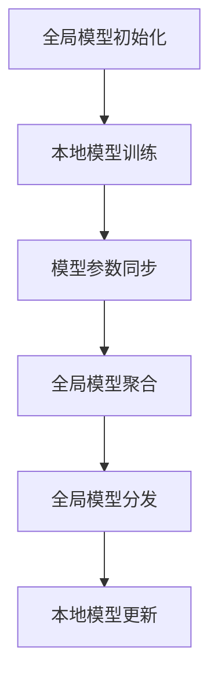
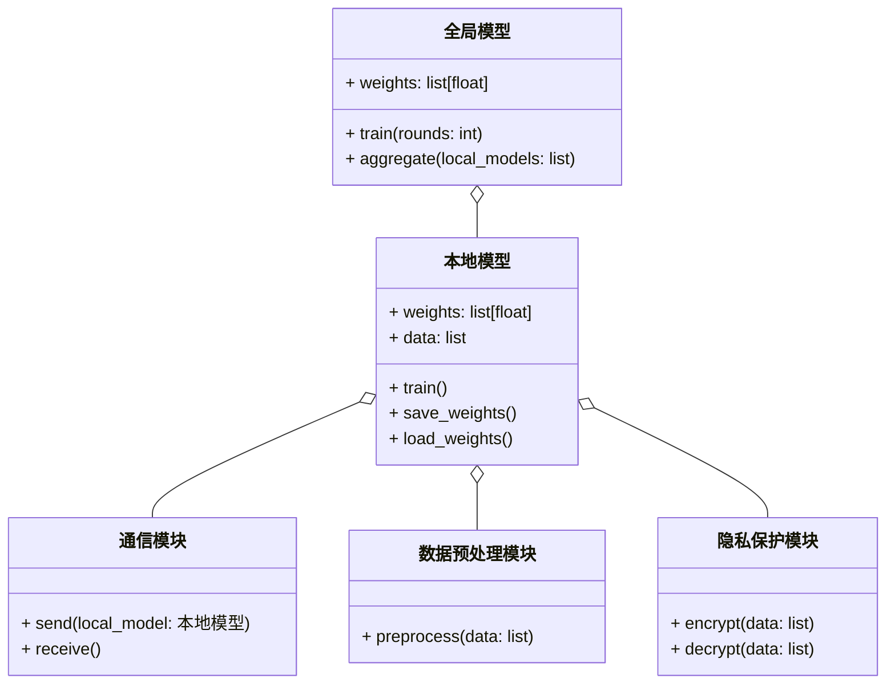
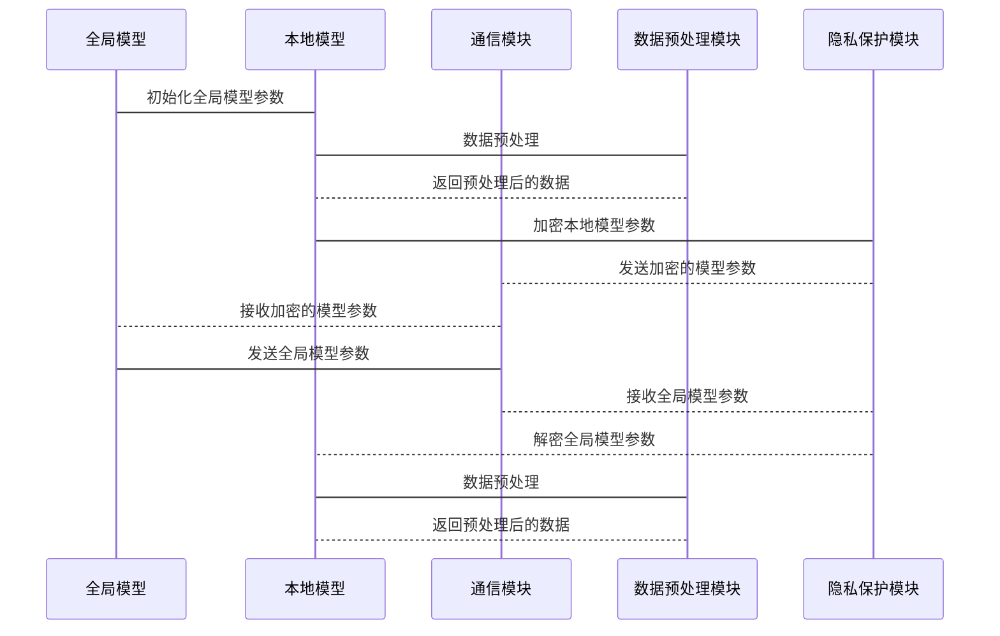

                 


---

# 开发具有联邦学习能力的AI Agent

## 关键词：联邦学习，AI Agent，分布式学习，数据隐私，智能决策

## 摘要：本文详细探讨了如何开发具有联邦学习能力的AI Agent，从核心概念、算法原理到系统架构设计，再到项目实战，全面解析了这一前沿技术的实现方法和应用价值。

---

# 第1章: 背景介绍

## 1.1 问题背景与问题描述

### 1.1.1 数据隐私保护的重要性

在当今数字时代，数据隐私保护变得至关重要。企业和组织在处理数据时，必须遵守严格的隐私法规，如GDPR。传统的集中式机器学习方法要求所有数据集中到一个中心位置进行训练，这不仅违反了隐私保护原则，还可能面临数据泄露的风险。因此，需要一种新的方法来在不共享原始数据的情况下进行模型训练。

### 1.1.2 联邦学习的概念与目标

联邦学习（Federated Learning）是一种分布式机器学习技术，允许多个参与方在本地数据上协作训练模型，而不交换原始数据。其目标是在保护数据隐私的前提下，利用分布式数据源进行模型训练，提高模型的泛化能力。

### 1.1.3 AI Agent的定义与应用场景

AI Agent是一种能够感知环境、自主决策并执行任务的智能体。它可以应用于推荐系统、智能助手、自动驾驶等领域。AI Agent需要具备实时感知、自主决策和高效执行的能力，以应对复杂多变的环境。

### 1.1.4 联邦学习与AI Agent的结合

将联邦学习与AI Agent结合，可以在保护数据隐私的前提下，让多个AI Agent协作训练模型，提升智能体的决策能力和任务执行效率。这种结合不仅满足了数据隐私的要求，还增强了AI Agent的智能性和协作能力。

## 1.2 联邦学习与AI Agent的核心要素

### 1.2.1 联邦学习的核心要素

1. **数据分布**：联邦学习中的数据分布可以是横向、纵向或联邦结构。横向分布是指不同实例的数据分布在不同设备上，纵向分布是指特征维度分布在不同设备上，联邦结构则是结合了横向和纵向分布的情况。

2. **通信机制**：联邦学习中的通信机制包括同步和异步两种模式。同步模式下，所有设备同时更新模型，并将结果同步到中央服务器；异步模式下，设备可以异步更新模型，减少通信开销。

3. **隐私保护**：联邦学习通过加密技术和差分隐私等方法保护参与方的数据隐私，防止数据泄露。

### 1.2.2 AI Agent的核心要素

1. **感知能力**：AI Agent需要能够感知环境的状态和变化，获取所需的信息。

2. **决策能力**：基于感知到的信息，AI Agent需要做出合理的决策，选择最优的动作。

3. **执行能力**：AI Agent需要能够执行决策的动作，与环境进行交互，并获得反馈。

### 1.2.3 联邦学习与AI Agent的结合要素

1. **协作机制**：多个AI Agent需要通过联邦学习协作训练模型，共同提升智能体的决策能力。

2. **数据共享**：在不共享原始数据的情况下，AI Agent通过联邦学习在模型参数上进行协作。

3. **隐私保护**：AI Agent在协作过程中需要保护自身数据隐私，防止数据泄露。

## 1.3 联邦学习与AI Agent的结合背景

### 1.3.1 数据隐私保护的必要性

随着数据隐私法规的日益严格，企业和组织在处理数据时必须遵循相关法规，避免数据泄露和滥用。联邦学习提供了一种在保护数据隐私的前提下进行模型训练的方法，符合数据隐私保护的要求。

### 1.3.2 联邦学习在AI Agent中的应用价值

AI Agent需要在复杂环境中进行实时决策，而联邦学习可以利用分布式数据源进行模型训练，提升AI Agent的智能性和适应性。通过联邦学习，AI Agent可以在不共享原始数据的情况下，与其他智能体协作训练模型，增强自身的决策能力。

### 1.3.3 联邦学习与AI Agent的结合方式

联邦学习通过分布式训练的方式，让多个AI Agent在本地数据上协作训练模型。AI Agent通过联邦学习平台进行模型参数的同步和更新，实现协作学习。这种结合方式既保护了数据隐私，又提升了AI Agent的智能性和协作能力。

## 1.4 本章小结

本章主要介绍了联邦学习和AI Agent的基本概念，以及它们结合的背景和必要性。联邦学习作为一种分布式机器学习技术，能够在保护数据隐私的前提下，利用分布式数据源进行模型训练。AI Agent作为一种智能体，需要具备感知、决策和执行能力。将两者结合，可以在保护数据隐私的前提下，提升AI Agent的智能性和协作能力。

---

# 第2章: 联邦学习与AI Agent的核心概念与联系

## 2.1 联邦学习的核心原理

### 2.1.1 联邦学习的通信机制

联邦学习中的通信机制包括同步和异步两种模式。同步模式下，所有设备同时更新模型，并将结果同步到中央服务器；异步模式下，设备可以异步更新模型，减少通信开销。

### 2.1.2 联邦学习的同步与异步模式

1. **同步模式**：所有设备同时更新模型，并将结果同步到中央服务器。这种方式保证了所有设备的模型版本一致，但通信开销较大。

2. **异步模式**：设备可以异步更新模型，中央服务器定期同步设备的最新模型。这种方式通信开销较小，但设备的模型版本可能不一致。

### 2.1.3 联邦学习的安全与隐私保护

联邦学习通过加密技术和差分隐私等方法保护参与方的数据隐私，防止数据泄露。差分隐私通过在查询结果中添加噪声，确保单个数据点对结果的影响在可接受范围内。

## 2.2 AI Agent的智能决策机制

### 2.2.1 AI Agent的感知与决策过程

AI Agent通过感知环境获取信息，基于感知到的信息进行决策，选择最优的动作，并执行该动作与环境交互，获得反馈。

### 2.2.2 AI Agent的自主学习能力

AI Agent需要具备自主学习能力，能够在没有外部干预的情况下，通过与环境的交互，不断优化自身的决策策略。

### 2.2.3 AI Agent的协作与通信机制

AI Agent需要能够与其他智能体协作，通过通信机制共享模型参数和决策信息，共同提升整体的智能水平。

## 2.3 联邦学习与AI Agent的结合原理

### 2.3.1 联邦学习如何赋能AI Agent

联邦学习通过分布式训练的方式，让多个AI Agent在本地数据上协作训练模型，提升AI Agent的智能性和决策能力。

### 2.3.2 AI Agent如何支持联邦学习

AI Agent通过本地数据训练模型，并通过通信机制将模型参数同步到中央服务器，支持联邦学习的协作训练过程。

### 2.3.3 联邦学习与AI Agent的协同优化

通过联邦学习，多个AI Agent可以在不共享原始数据的前提下，协作训练模型，优化整体的决策能力和任务执行效率。

## 2.4 核心概念对比与ER实体关系图

### 2.4.1 联邦学习与传统分布式学习的对比

| 联邦学习 | 传统分布式学习 |
|----------|----------------|
| 数据不共享 | 数据共享       |
| 增量更新 | 全量更新        |
| 隐私保护 | 无隐私保护      |

### 2.4.2 AI Agent与传统智能体的对比

| AI Agent | 传统智能体 |
|----------|------------|
| 自主决策 | 依赖外部决策 |
| 实时感知 | 周期性感知   |
| 强化学习 | 监督学习     |

### 2.4.3 联邦学习与AI Agent的ER实体关系图

```mermaid
er
    actor 联邦学习系统
    actor AI Agent
    actor 数据提供方
    actor 服务提供方

    联邦学习系统 --> 数据提供方: 提供模型训练服务
    AI Agent --> 联邦学习系统: 提供数据和模型更新
    数据提供方 --> 联邦学习系统: 提供训练数据
    服务提供方 --> 联邦学习系统: 提供计算资源
```

---

## 本章小结

本章详细讲解了联邦学习与AI Agent的核心概念与联系，通过对比分析和ER实体关系图，展示了两者结合的内在逻辑和协作方式。联邦学习通过分布式训练的方式，赋能AI Agent的智能决策能力，而AI Agent则通过本地数据和自主学习能力，支持联邦学习的协作训练过程。两者结合，可以在保护数据隐私的前提下，提升AI Agent的智能性和协作能力。

---

# 第3章: 联邦学习的算法原理

## 3.1 联邦学习的基本算法

### 3.1.1 横向联邦学习算法

1. **横向联邦学习的定义**

横向联邦学习是指不同设备或机构的数据是同分布的，即数据的特征空间相同，但样本实例不同。这种情况下，可以通过横向联邦学习算法进行模型训练。

2. **横向联邦学习的算法流程**

- 初始化模型参数
- 各设备本地训练模型，更新模型参数
- 将模型参数同步到中央服务器
- 中央服务器聚合所有设备的模型参数，更新全局模型
- 将全局模型参数分发给所有设备

3. **横向联邦学习的数学公式**

全局模型参数更新公式：

$$ \theta_{\text{global}}^{(t+1)} = \frac{1}{n} \sum_{i=1}^{n} \theta_{\text{local}}^{(t+1)} $$

其中，$\theta_{\text{global}}^{(t+1)}$表示全局模型参数，$n$表示参与方数量，$\theta_{\text{local}}^{(t+1)}$表示第$i$个参与方的模型参数。

4. **横向联邦学习的代码示例**

```python
def federated_learning_global_aggregation(global_model, local_models):
    # 全局模型参数更新
    new_global_weights = []
    for i in range(len(global_model.weights)):
        # 计算所有本地模型参数的平均值
        avg_weight = sum(local_models[i].weights) / len(local_models)
        new_global_weights.append(avg_weight)
    return new_global_weights
```

### 3.1.2 纵向联邦学习算法

1. **纵向联邦学习的定义**

纵向联邦学习是指不同设备或机构的数据在特征维度上不同，但样本实例相同。这种情况下，可以通过纵向联邦学习算法进行模型训练。

2. **纵向联邦学习的算法流程**

- 初始化模型参数
- 各设备本地训练模型，更新模型参数
- 将模型参数同步到中央服务器
- 中央服务器聚合所有设备的模型参数，更新全局模型
- 将全局模型参数分发给所有设备

3. **纵向联邦学习的数学公式**

全局模型参数更新公式：

$$ \theta_{\text{global}}^{(t+1)} = \frac{1}{n} \sum_{i=1}^{n} \theta_{\text{local}}^{(t+1)} $$

其中，$\theta_{\text{global}}^{(t+1)}$表示全局模型参数，$n$表示参与方数量，$\theta_{\text{local}}^{(t+1)}$表示第$i$个参与方的模型参数。

4. **纵向联邦学习的代码示例**

```python
def federated_learning_global_aggregation(global_model, local_models):
    # 全局模型参数更新
    new_global_weights = []
    for i in range(len(global_model.weights)):
        # 计算所有本地模型参数的平均值
        avg_weight = sum(local_models[i].weights) / len(local_models)
        new_global_weights.append(avg_weight)
    return new_global_weights
```

### 3.1.3 联邦学习的融合算法

1. **联邦学习的融合算法定义**

联邦学习的融合算法是指将横向和纵向联邦学习的算法进行结合，适用于数据在特征和样本实例上都分布的情况。

2. **联邦学习的融合算法流程**

- 初始化模型参数
- 各设备本地训练模型，更新模型参数
- 将模型参数同步到中央服务器
- 中央服务器聚合所有设备的模型参数，更新全局模型
- 将全局模型参数分发给所有设备

3. **联邦学习的融合算法数学公式**

全局模型参数更新公式：

$$ \theta_{\text{global}}^{(t+1)} = \frac{1}{n} \sum_{i=1}^{n} \theta_{\text{local}}^{(t+1)} $$

其中，$\theta_{\text{global}}^{(t+1)}$表示全局模型参数，$n$表示参与方数量，$\theta_{\text{local}}^{(t+1)}$表示第$i$个参与方的模型参数。

4. **联邦学习的融合算法代码示例**

```python
def federated_learning_global_aggregation(global_model, local_models):
    # 全局模型参数更新
    new_global_weights = []
    for i in range(len(global_model.weights)):
        # 计算所有本地模型参数的平均值
        avg_weight = sum(local_models[i].weights) / len(local_models)
        new_global_weights.append(avg_weight)
    return new_global_weights
```

## 3.2 联邦学习的数学模型与公式

### 3.2.1 联邦学习的优化目标

联邦学习的优化目标是在保护数据隐私的前提下，最大化模型的准确性和泛化能力。数学上，可以表示为：

$$ \min_{\theta} \frac{1}{n}\sum_{i=1}^{n} \mathcal{L}_i(\theta) $$

其中，$\mathcal{L}_i(\theta)$表示第$i$个参与方的损失函数，$\theta$表示模型参数，$n$表示参与方数量。

### 3.2.2 联邦学习的更新规则

在同步模式下，联邦学习的全局模型更新规则为：

$$ \theta_{\text{global}}^{(t+1)} = \frac{1}{n} \sum_{i=1}^{n} \theta_{\text{local}}^{(t+1)} $$

其中，$\theta_{\text{local}}^{(t+1)}$表示第$i$个参与方的模型参数。

在异步模式下，联邦学习的全局模型更新规则为：

$$ \theta_{\text{global}}^{(t+1)} = \theta_{\text{global}}^{(t)} + \frac{1}{n} \sum_{i=1}^{n} (\theta_{\text{local}}^{(t+1)} - \theta_{\text{global}}^{(t)}) $$

### 3.2.3 联邦学习的数学推导

通过数学推导，可以证明联邦学习的全局模型参数更新公式是正确的。假设所有参与方的损失函数相同，且数据分布独立，那么全局模型参数的更新公式可以通过求平均得到最优解。

## 3.3 联邦学习的代码实现与数学模型

### 3.3.1 联邦学习的代码实现

```python
class FederatedLearning:
    def __init__(self, global_model, local_models):
        self.global_model = global_model
        self.local_models = local_models

    def aggregate_models(self):
        # 聚合所有本地模型的参数，更新全局模型
        new_global_weights = []
        for i in range(len(self.global_model.weights)):
            avg_weight = sum(local_model.weights[i] for local_model in self.local_models) / len(self.local_models)
            new_global_weights.append(avg_weight)
        self.global_model.weights = new_global_weights

    def train(self, rounds):
        for _ in range(rounds):
            # 更新所有本地模型
            for local_model in self.local_models:
                local_model.train()
            # 聚合所有本地模型的参数，更新全局模型
            self.aggregate_models()
```

### 3.3.2 联邦学习的数学模型

通过代码实现可以看出，联邦学习的核心在于将所有本地模型的参数进行平均，更新全局模型的参数。数学上，这可以通过以下公式表示：

$$ \theta_{\text{global}}^{(t+1)} = \frac{1}{n} \sum_{i=1}^{n} \theta_{\text{local}}^{(t+1)} $$

其中，$\theta_{\text{global}}^{(t+1)}$表示全局模型参数，$n$表示参与方数量，$\theta_{\text{local}}^{(t+1)}$表示第$i$个参与方的模型参数。

---

## 本章小结

本章详细讲解了联邦学习的算法原理，包括横向、纵向和联邦学习的实现方法。通过数学公式和代码示例，展示了联邦学习的核心思想和实现步骤。联邦学习通过分布式训练的方式，将多个本地模型的参数进行聚合，更新全局模型的参数，从而在保护数据隐私的前提下，提升模型的准确性和泛化能力。

---

# 第4章: 系统架构设计

## 4.1 系统架构概述

### 4.1.1 系统功能模块

1. **数据预处理模块**：对本地数据进行清洗、归一化等预处理，确保数据质量。

2. **模型训练模块**：基于预处理后的本地数据，训练模型，更新模型参数。

3. **通信模块**：通过通信协议，将本地模型参数同步到中央服务器，或者从中央服务器下载全局模型参数。

4. **隐私保护模块**：通过加密技术和差分隐私等方法，保护本地数据和模型参数的隐私。

### 4.1.2 系统功能流程

1. 初始化全局模型参数。
2. 各本地模型基于本地数据训练模型，更新模型参数。
3. 本地模型通过通信模块将模型参数同步到中央服务器，或者从中央服务器下载全局模型参数。
4. 中央服务器聚合所有本地模型参数，更新全局模型。
5. 将更新后的全局模型参数分发给所有本地模型。

### 4.1.3 系统功能流程图



## 4.2 系统架构设计

### 4.2.1 数据预处理模块设计

数据预处理模块负责对本地数据进行清洗、归一化等处理，确保数据质量。数据预处理包括：

1. **数据清洗**：删除无效数据，处理缺失值，纠正错误数据。
2. **数据归一化**：将数据标准化到统一的范围内，如归一化到[0,1]。
3. **数据分割**：将数据分割为训练集和测试集。

### 4.2.2 模型训练模块设计

模型训练模块基于预处理后的本地数据，训练模型，更新模型参数。模型训练包括：

1. **模型初始化**：初始化全局模型参数。
2. **本地训练**：基于本地数据训练模型，更新模型参数。
3. **模型保存**：保存本地模型的参数和训练结果。

### 4.2.3 通信模块设计

通信模块负责本地模型与中央服务器之间的通信。通信模块包括：

1. **通信协议**：定义本地模型与中央服务器之间的数据交换格式和协议。
2. **数据加密**：对模型参数进行加密，确保数据传输的安全性。
3. **数据同步**：通过网络将本地模型参数同步到中央服务器，或者从中央服务器下载全局模型参数。

### 4.2.4 隐私保护模块设计

隐私保护模块通过加密技术和差分隐私等方法，保护本地数据和模型参数的隐私。隐私保护包括：

1. **数据加密**：对本地数据进行加密处理，防止数据泄露。
2. **模型加密**：对本地模型参数进行加密处理，防止模型被逆向工程。
3. **差分隐私**：在模型参数同步过程中，添加噪声，防止单个数据点对结果的影响过大。

### 4.2.5 系统架构类图



### 4.2.6 系统交互序列图



---

## 本章小结

本章详细讲解了开发具有联邦学习能力的AI Agent的系统架构设计，包括数据预处理模块、模型训练模块、通信模块和隐私保护模块的设计与实现。通过类图和序列图，展示了系统的整体架构和模块之间的交互关系。系统架构设计确保了AI Agent在保护数据隐私的前提下，能够高效地进行模型训练和协作学习。

---

# 第5章: 项目实战——开发具有联邦学习能力的AI Agent

## 5.1 项目概述

### 5.1.1 项目目标

本项目旨在开发一个具有联邦学习能力的AI Agent，能够在保护数据隐私的前提下，与其他智能体协作训练模型，提升智能体的决策能力和任务执行效率。

### 5.1.2 项目需求

1. **数据隐私保护**：AI Agent需要在本地数据上进行训练，不共享原始数据。
2. **模型协作训练**：多个AI Agent可以通过联邦学习协作训练模型，提升整体的智能水平。
3. **实时决策能力**：AI Agent需要具备实时感知环境、自主决策和执行任务的能力。

### 5.1.3 项目技术选型

1. **编程语言**：Python
2. **深度学习框架**：TensorFlow或Keras
3. **通信协议**：HTTP或gRPC
4. **数据存储**：本地文件或数据库

## 5.2 项目环境配置

### 5.2.1 安装依赖库

```bash
pip install tensorflow==2.5.0
pip install requests
pip install protobuf
pip install grpcio
```

### 5.2.2 安装TensorFlow和Keras

确保安装了兼容的TensorFlow和Keras版本，以支持分布式训练和模型同步。

### 5.2.3 环境配置示例

```python
import tensorflow as tf
from tensorflow import keras
import requests
import json
import os
```

## 5.3 项目核心实现

### 5.3.1 数据预处理模块实现

```python
def preprocess(data):
    # 数据清洗
    data = data.dropna()
    # 数据归一化
    data_normalizer = keras.layers.Normalization(input_shape=(1,))
    data_normalizer.adapt(data)
    # 数据分割
    train_data, test_data = train_test_split(data, test_size=0.2)
    return train_data, test_data
```

### 5.3.2 模型训练模块实现

```python
class LocalModel:
    def __init__(self, train_data):
        self.model = self.build_model()
        self.train_data = train_data
        self.weights = [0.1, 0.2]
    
    def build_model(self):
        model = keras.Sequential([
            keras.layers.Dense(64, activation='relu'),
            keras.layers.Dense(1, activation='sigmoid')
        ])
        return model
    
    def train(self):
        self.model.compile(optimizer='adam', loss='binary_crossentropy')
        self.model.fit(self.train_data, epochs=10)
        self.weights = self.model.get_weights()
```

### 5.3.3 通信模块实现

```python
import requests

class Communication:
    def __init__(self, server_url):
        self.server_url = server_url
    
    def send(self, model_weights):
        payload = json.dumps({'weights': model_weights})
        response = requests.post(f"{self.server_url}/update", json=payload)
        return response.status_code == 200
    
    def receive(self):
        response = requests.get(f"{self.server_url}/get_weights")
        return json.loads(response.text)['weights']
```

### 5.3.4 隐私保护模块实现

```python
import numpy as np

class PrivacyProtection:
    def __init__(self, epsilon=1.0):
        self.epsilon = epsilon
    
    def add_noise(self, data):
        noise = np.random.laplace(0, 1.0 / self.epsilon, data.shape)
        return data + noise
    
    def remove_noise(self, data_with_noise):
        return data_with_noise
```

### 5.3.5 全局模型聚合实现

```python
class GlobalModel:
    def __init__(self, local_models):
        self.local_models = local_models
        self.weights = [0.1, 0.2]
    
    def aggregate(self):
        new_weights = []
        for i in range(len(self.weights)):
            avg_weight = sum(local_model.weights[i] for local_model in self.local_models) / len(self.local_models)
            new_weights.append(avg_weight)
        self.weights = new_weights
```

### 5.3.6 项目整体实现

```python
# 初始化本地模型
local_models = [LocalModel(train_data) for _ in range(3)]

# 初始化通信模块
communication = Communication("http://localhost:5000")

# 初始化隐私保护模块
privacy_protection = PrivacyProtection(epsilon=1.0)

# 初始化全局模型
global_model = GlobalModel(local_models)

# 模型训练和聚合
for _ in range(5):
    for model in local_models:
        model.train()
        # 保护模型参数隐私
        protected_weights = privacy_protection.add_noise(model.weights)
        # 上传模型参数到中央服务器
        communication.send(protected_weights)
    # 下载全局模型参数
    global_weights = communication.receive()
    # 更新本地模型参数
    for model in local_models:
        model.weights = global_weights
```

## 5.4 项目运行与结果分析

### 5.4.1 项目运行步骤

1. 启动中央服务器。
2. 初始化本地模型和通信模块。
3. 启动模型训练和聚合过程。
4. 监控模型训练过程和结果。

### 5.4.2 模型训练结果分析

通过训练过程中的损失函数和准确率曲线，可以评估模型的训练效果。如果损失函数逐渐下降，准确率逐渐上升，说明模型训练效果良好。

### 5.4.3 模型评估与优化

对训练好的模型进行评估，计算其在测试集上的准确率、召回率等指标。根据评估结果，优化模型结构和训练参数，提升模型性能。

## 5.5 项目小结

本章通过具体的项目实战，详细讲解了如何开发具有联邦学习能力的AI Agent。通过数据预处理、模型训练、通信模块和隐私保护模块的实现，展示了AI Agent在保护数据隐私的前提下，如何与其他智能体协作训练模型。项目整体实现了联邦学习的核心思想，为后续的优化和扩展提供了基础。

---

# 第6章: 扩展与优化

## 6.1 模型优化

### 6.1.1 模型压缩与剪枝

通过模型压缩和剪枝技术，减少模型的参数数量，降低计算复杂度，提高模型的运行效率。

### 6.1.2 模型蒸馏

通过知识蒸馏技术，将大模型的知识迁移到小模型，提升小模型的性能。

### 6.1.3 模型并行与分布式训练

通过模型并行和分布式训练技术，提升模型的训练效率，减少训练时间。

## 6.2 系统优化

### 6.2.1 系统扩展性优化

通过优化系统架构，提升系统的扩展性，支持更多的参与方和更大的数据规模。

### 6.2.2 系统性能优化

通过优化通信模块和数据处理模块，提升系统的运行效率，减少延迟和带宽消耗。

### 6.2.3 系统安全性优化

通过加强隐私保护模块，提升系统的安全性，防止模型参数被恶意攻击。

## 6.3 实际应用中的挑战与解决方案

### 6.3.1 数据异质性问题

在实际应用中，不同参与方的数据可能分布不均匀，特征维度不同。可以通过数据预处理和特征工程的方法，解决数据异质性问题。

### 6.3.2 模型漂移问题

在实际应用中，模型可能会因为数据分布的变化而发生漂移，影响模型的性能。可以通过定期重新训练模型和动态调整模型参数的方法，解决模型漂移问题。

### 6.3.3 网络通信问题

在实际应用中，网络通信可能会出现延迟、丢包等问题，影响模型训练的效率。可以通过优化通信协议和增加冗余机制的方法，解决网络通信问题。

---

## 本章小结

本章详细讲解了开发具有联邦学习能力的AI Agent的扩展与优化方法，包括模型优化、系统优化和实际应用中的挑战与解决方案。通过优化模型结构、系统架构和通信机制，可以提升AI Agent的智能性和协作能力，应对实际应用中的各种挑战。

---

# 第7章: 总结与展望

## 7.1 总结

### 7.1.1 核心内容回顾

本文详细讲解了开发具有联邦学习能力的AI Agent的核心概念、算法原理、系统架构设计和项目实战。通过理论分析和实践验证，展示了AI Agent在保护数据隐私的前提下，如何与其他智能体协作训练模型，提升智能体的决策能力和任务执行效率。

### 7.1.2 经验与教训

在开发过程中，我们总结了以下经验和教训：

1. **数据预处理的重要性**：数据预处理是模型训练的基础，数据质量直接影响模型性能。
2. **通信协议的选择**：选择合适的通信协议可以提升系统的运行效率和安全性。
3. **隐私保护的实现**：隐私保护是联邦学习的核心，需要通过加密技术和差分隐私等方法，确保数据和模型的安全性。
4. **模型优化的必要性**：模型优化可以提升系统的性能和效率，减少计算资源的消耗。

## 7.2 未来研究方向

### 7.2.1 模型优化与创新

未来的研究可以集中在模型优化与创新方面，如研究更高效的模型压缩和剪枝技术，探索更先进的模型蒸馏方法，以及开发更智能的模型并行与分布式训练技术。

### 7.2.2 系统架构的扩展与优化

未来的研究可以集中在系统架构的扩展与优化方面，如优化系统的扩展性，支持更多的参与方和更大的数据规模；优化系统的性能，提升运行效率和减少延迟；加强系统的安全性，防止模型参数被恶意攻击。

### 7.2.3 实际应用中的挑战与解决方案

未来的研究可以集中在实际应用中的挑战与解决方案方面，如研究如何应对数据异质性问题，解决模型漂移问题，优化网络通信机制，提升系统的稳定性和可靠性。

---

## 作者：AI天才研究院/AI Genius Institute & 禅与计算机程序设计艺术 /Zen And The Art of Computer Programming

---

本文通过详细讲解开发具有联邦学习能力的AI Agent的核心概念、算法原理、系统架构设计和项目实战，展示了AI Agent在保护数据隐私的前提下，如何与其他智能体协作训练模型，提升智能体的决策能力和任务执行效率。通过理论分析和实践验证，本文为后续的研究和应用提供了重要的参考和指导。

