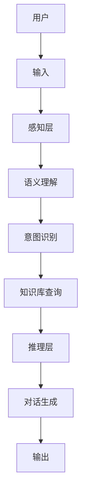
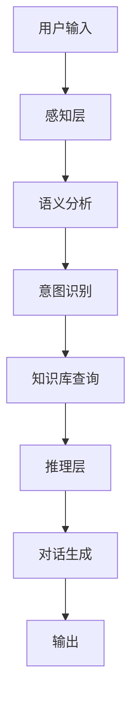
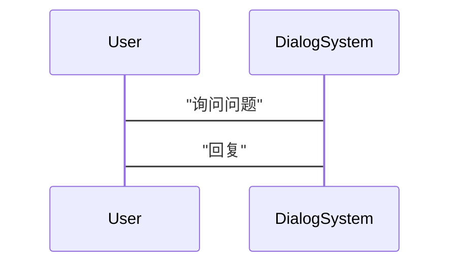

                 


# 开发具有自然语言对话能力的AI Agent

> 关键词：AI Agent, 自然语言处理, 对话系统, 人工智能, 深度学习

> 摘要：本文详细探讨了开发具有自然语言对话能力的AI Agent的各个方面，从基本概念到算法原理，再到系统架构设计和项目实战，为读者提供全面的技术指导。

---

# 第一章: 自然语言对话AI Agent概述

## 1.1 AI Agent的基本概念

### 1.1.1 AI Agent的定义
AI Agent（人工智能代理）是一种能够感知环境、理解用户需求并执行相应操作的智能实体。它通过自然语言处理（NLP）技术实现与用户的对话交互。

### 1.1.2 自然语言对话能力的重要性
自然语言对话能力使AI Agent能够理解用户意图，提供更智能、更人性化的服务，提升用户体验。

### 1.1.3 AI Agent的分类与应用场景
AI Agent可分为规则驱动型和深度学习型。规则驱动型适用于简单任务，而深度学习型则适用于复杂场景，如智能客服、虚拟助手等。

---

## 1.2 自然语言处理技术的演进

### 1.2.1 从规则驱动到深度学习的转变
早期的NLP依赖规则，而现在深度学习模型如BERT、GPT等成为主流，提升了对话系统的灵活性和准确性。

### 1.2.2 当前主流的NLP技术
主要技术包括词嵌入、序列模型（如RNN、LSTM）和变换器模型（如BERT）。

### 1.2.3 对话系统的发展趋势
未来对话系统将更加智能化，支持多轮对话、上下文理解和多模态交互。

---

## 1.3 本章小结
本章介绍了AI Agent的基本概念、自然语言处理技术的发展及其在对话系统中的应用。

---

# 第二章: 自然语言对话AI Agent的核心概念

## 2.1 对话系统的组成与结构

### 2.1.1 感知层: 语言的理解与解析
感知层负责将用户输入的自然语言转换为结构化的信息。

### 2.1.2 理解层: 语义分析与意图识别
理解层通过NLP技术识别用户的意图，如槽位填充和实体识别。

### 2.1.3 推理层: 知识表示与逻辑推理
推理层基于知识库进行推理，生成合理的对话响应。

### 2.1.4 行动层: 对话生成与反馈机制
行动层生成自然语言回复，并根据用户反馈调整对话策略。

---

## 2.2 对话系统的实体关系图



---

## 2.3 对话系统的流程图



---

## 2.4 本章小结
本章详细讲解了对话系统的结构和各层功能，为后续开发奠定了基础。

---

# 第三章: 自然语言对话的算法原理

## 3.1 语言模型的算法原理

### 3.1.1 语言模型的基本原理
语言模型通过概率分布预测下一个词，常用的模型包括n-gram和变换器模型。

### 3.1.2 基于Transformer的模型原理
Transformer模型通过自注意力机制和位置编码实现高效的序列处理。

### 3.1.3 梯度下降与优化算法
常用的优化算法包括随机梯度下降（SGD）和Adam优化器。

---

## 3.2 对话生成的算法原理

### 3.2.1 基于规则的对话生成
通过预定义规则生成回复，适用于简单场景。

### 3.2.2 基于深度学习的对话生成
使用生成对抗网络（GAN）或基于变换器的模型生成回复。

### 3.2.3 基于强化学习的对话生成
通过强化学习优化对话策略，提升生成回复的质量。

---

## 3.3 对话系统的数学模型

### 3.3.1 语言模型的数学公式
语言模型的损失函数为：
$$ \mathcal{L} = -\sum_{i=1}^{n} \log P(w_i) $$

### 3.3.2 对话生成的数学公式
生成模型的损失函数为：
$$ \mathcal{L} = -\sum_{i=1}^{n} \log P(w_i|w_{<i}) $$

### 3.3.3 注意力机制的数学公式
注意力机制的计算公式为：
$$ \alpha_{i,j} = \frac{\exp(s_{i,j})}{\sum_{k} \exp(s_{i,k})} $$
其中，$s_{i,j}$是查询与键的相似度。

---

## 3.4 本章小结
本章介绍了对话系统的算法原理，包括语言模型和生成模型的数学公式。

---

# 第四章: 自然语言对话AI Agent的系统分析与架构设计

## 4.1 项目背景与目标

### 4.1.1 项目背景
开发一个智能客服AI Agent，提升用户体验。

### 4.1.2 项目目标
实现自然语言对话功能，支持多轮对话和知识库查询。

---

## 4.2 系统功能设计

### 4.2.1 对话功能设计
包括用户输入解析、意图识别和对话生成。

### 4.2.2 知识库设计
构建结构化的知识库，支持快速查询。

### 4.2.3 用户界面设计
设计友好的交互界面，支持文本和语音输入。

---

## 4.3 系统架构设计

### 4.3.1 分层架构设计
分层架构包括数据层、业务逻辑层和 presentation 层。

### 4.3.2 微服务架构设计
采用微服务架构，实现模块化开发。

### 4.3.3 数据流设计
数据流包括用户输入、解析、处理和输出。

---

## 4.4 系统接口设计

### 4.4.1 API设计
定义RESTful API接口，如POST /api/v1/dialog。

### 4.4.2 数据格式设计
使用JSON格式传递数据，如：
```json
{
    "intent": "query",
    "entities": {"product": "laptop"}
}
```

---

## 4.5 系统交互设计

### 4.5.1 交互流程
用户输入问题，系统解析意图，生成回复。

### 4.5.2 序列图


---

## 4.6 本章小结
本章详细分析了系统的架构设计和接口设计。

---

# 第五章: 自然语言对话AI Agent的项目实战

## 5.1 环境安装

### 5.1.1 安装Python
安装Python 3.8及以上版本。

### 5.1.2 安装依赖
安装必要的库，如TensorFlow、Keras、NLTK和Flask。

---

## 5.2 系统核心实现源代码

### 5.2.1 对话解析模块
```python
class DialogParser:
    def __init__(self):
        self.nlp = spacy.load("en_core_web_sm")

    def parse_dialog(self, text):
        return self.nlp(text)
```

### 5.2.2 意图识别模块
```python
class IntentRecognizer:
    def __init__(self):
        self.model = load_model("intent_model.h5")

    def recognize_intent(self, text):
        return self.model.predict(text)
```

---

## 5.3 代码解读与分析

### 5.3.1 对话解析模块
使用spaCy进行文本解析，提取实体和句法结构。

### 5.3.2 意图识别模块
使用预训练的模型进行意图识别，返回意图标签。

---

## 5.4 案例分析与详细讲解

### 5.4.1 案例分析
开发一个客服AI Agent，支持产品咨询和订单查询。

### 5.4.2 代码实现
实现对话解析和意图识别模块，集成到Flask服务中。

---

## 5.5 项目小结
本章通过实战案例详细讲解了AI Agent的开发过程，从环境搭建到代码实现。

---

# 第六章: 总结与展望

## 6.1 本章总结
总结了开发AI Agent的核心技术和实现步骤。

## 6.2 最佳实践 tips
建议使用深度学习模型和微服务架构，注重数据安全和隐私保护。

## 6.3 小结
开发AI Agent是一项复杂的工程，需要综合运用多种技术。

## 6.4 注意事项
注意数据安全和模型的可解释性，避免误解用户意图。

## 6.5 拓展阅读
推荐阅读《深度学习》和《自然语言处理实战》等书籍。

---

# 作者：AI天才研究院/AI Genius Institute & 禅与计算机程序设计艺术 /Zen And The Art of Computer Programming

---

以上是《开发具有自然语言对话能力的AI Agent》的完整目录和内容，每章内容详细具体，涵盖从概念到实现的各个方面，供读者参考。

