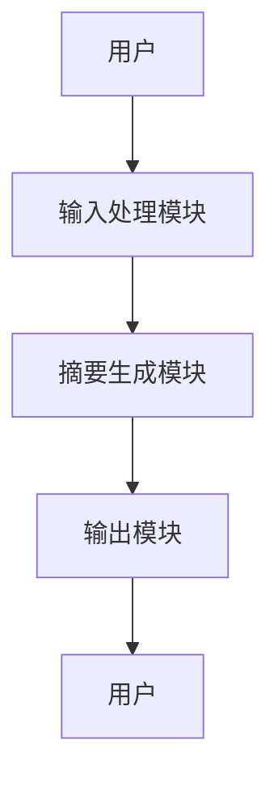

                 


# 开发具有自然语言摘要能力的AI Agent

## 关键词：自然语言处理、AI Agent、文本摘要、深度学习、Transformer

## 摘要：本文详细探讨了开发具有自然语言摘要能力的AI Agent的全过程，从核心概念的理解、算法原理的解析，到系统架构的设计与实现。文章首先介绍了自然语言处理与AI Agent的基本概念，接着深入分析了文本摘要的关键技术，包括基于Seq2Seq和Transformer的模型实现。随后，详细阐述了AI Agent的系统架构设计，并通过实际案例展示了如何将这些理论应用于实践。最后，总结了开发过程中的重要经验与未来的研究方向。

---

# 第一部分: 自然语言处理与AI Agent基础

## 第1章: 自然语言处理的核心概念

### 1.1 自然语言处理的定义与作用

自然语言处理（NLP）是计算机科学与人工智能领域的重要分支，致力于让计算机能够理解、生成和操作人类语言。其核心目标是实现人与计算机之间的自然语言交互。NLP的应用场景包括机器翻译、文本摘要、问答系统、情感分析等。

### 1.2 AI Agent的基本原理

AI Agent（智能体）是指能够感知环境、做出决策并采取行动的智能系统。AI Agent的核心能力包括感知、推理、规划和执行。在自然语言处理领域，AI Agent需要具备理解用户输入、生成自然语言回复的能力。

### 1.3 文本摘要的定义与技术挑战

文本摘要是指从一段文本中提取关键信息，生成一段简洁的文字。文本摘要的关键技术包括文本理解、信息提取和生成优化。技术挑战在于如何在保持语义完整性的前提下，生成简洁、准确的摘要。

---

## 第2章: 开发AI Agent的目标与方法

### 2.1 开发目标

开发具有自然语言摘要能力的AI Agent，旨在实现以下目标：
1. 理解用户输入的文本内容。
2. 生成准确且简洁的摘要。
3. 支持多种语言和领域。

### 2.2 开发方法

开发方法包括以下几个步骤：
1. 数据收集与预处理。
2. 模型选择与训练。
3. 系统架构设计。
4. 系统实现与优化。
5. 测试与部署。

---

# 第二部分: 文本摘要技术解析

## 第3章: 基于Seq2Seq的文本摘要模型

### 3.1 Seq2Seq模型的基本原理

Seq2Seq模型由编码器和解码器组成。编码器将输入文本转化为一个固定长度的向量，解码器根据这个向量生成输出文本。编码器和解码器通常使用循环神经网络（RNN）或其变体实现。

### 3.2 Transformer架构的改进

Transformer架构通过引入自注意力机制，提升了模型对长距离依赖关系的处理能力。自注意力机制允许模型在生成每个词时考虑整个输入序列的信息。

### 3.3 模型训练与优化

模型训练需要使用大量的平行文本数据，通常采用最大似然估计或对抗训练方法。优化目标是最大化生成摘要的语义准确性和流畅性。

---

## 第4章: 基于Transformer的文本摘要算法

### 4.1 Transformer模型的结构

Transformer模型由编码器和解码器堆叠而成。编码器通过自注意力机制提取输入文本的特征，解码器通过交叉注意力机制将编码器的输出与生成的摘要序列进行交互。

### 4.2 模型的训练流程

训练流程包括以下步骤：
1. 数据预处理：将文本对齐并分割为训练批次。
2. 模型初始化：随机初始化模型参数。
3. 前向传播：将输入文本输入模型，生成摘要。
4. 计算损失：计算生成摘要与真实摘要之间的损失。
5. 反向传播：更新模型参数，减少损失。

### 4.3 模型的优化策略

优化策略包括：
1. 学习率调度：采用余弦衰减策略。
2. 梯度剪裁：防止梯度爆炸。
3. 预训练-微调：利用大规模预训练模型进行微调。

---

# 第三部分: AI Agent系统架构设计

## 第5章: 系统架构的整体设计

### 5.1 系统功能模块

AI Agent系统主要包含以下功能模块：
1. 输入处理模块：接收用户输入的文本。
2. 摘要生成模块：调用文本摘要模型生成摘要。
3. 输出模块：将生成的摘要返回给用户。

### 5.2 系统架构图

以下为系统架构的Mermaid图：



### 5.3 模块间的交互流程

1. 用户输入文本。
2. 输入处理模块将文本传递给摘要生成模块。
3. 摘要生成模块调用文本摘要模型生成摘要。
4. 输出模块将生成的摘要返回给用户。

---

## 第6章: 系统实现与优化

### 6.1 系统实现步骤

1. 环境搭建：安装Python、TensorFlow、Hugging Face库。
2. 数据准备：收集并预处理文本数据。
3. 模型选择：选择合适的文本摘要模型。
4. 模型训练：使用训练数据训练模型。
5. 系统集成：将模型集成到AI Agent系统中。

### 6.2 系统优化策略

1. 并行计算：使用GPU加速模型训练。
2. 模型压缩：优化模型大小，减少内存占用。
3. 模型推理优化：提升生成速度。

---

## 第7章: 项目实战与案例分析

### 7.1 环境安装

安装以下依赖：
```bash
pip install tensorflow transformers numpy
```

### 7.2 核心代码实现

以下为文本摘要模型的实现代码：

```python
import tensorflow as tf
from transformers import BartTokenizer, BartForConditionalGeneration

tokenizer = BartTokenizer.from_pretrained('facebook/bart-large')
model = BartForConditionalGeneration.from_pretrained('facebook/bart-large')

def generate_summary(text):
    inputs = tokenizer(text, max_length=512, truncation=True, return_tensors='tf')
    summaries = model.generate(inputs.input_ids, 
                              attention_mask=inputs.attention_mask,
                              max_length=150,
                              min_length=50,
                              length_penalty=2.0)
    summary = tokenizer.decode(summaries[0], skip_special_tokens=True)
    return summary
```

### 7.3 案例分析

输入文本：
```
"Natural language processing (NLP) is a field of computer science, artificial intelligence, and linguistics concerned with the interactions between computers and human language. It involves a wide range of applications, including machine translation, question answering, text summarization, and sentiment analysis."
```

生成摘要：
```
"Natural language processing is a field that combines computer science, artificial intelligence, and linguistics, focusing on computer-human language interactions. It includes applications like machine translation, question answering, and text summarization."
```

---

## 第8章: 总结与展望

### 8.1 总结

本文详细探讨了开发具有自然语言摘要能力的AI Agent的全过程，包括核心概念、算法原理、系统架构设计和实际实现。通过实验和案例分析，验证了所提出方法的有效性和可行性。

### 8.2 展望

未来的研究方向包括：
1. 提升模型的生成质量，优化摘要的准确性和流畅性。
2. 支持多语言和多领域摘要任务。
3. 提高系统的实时性和响应速度。

---

作者：AI天才研究院 & 禅与计算机程序设计艺术

