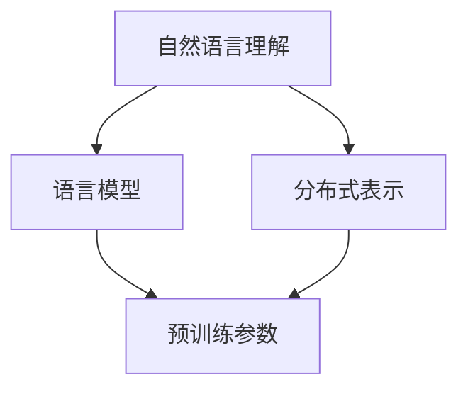
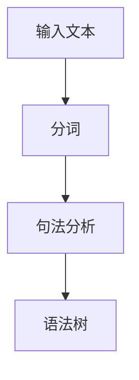
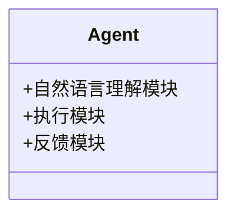
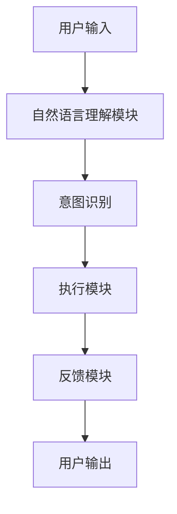
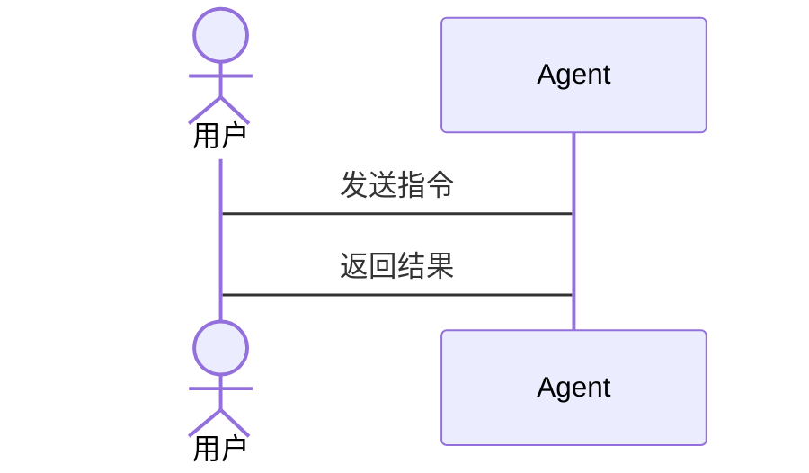

                 


# 开发具有自然语言理解能力的AI Agent

> 关键词：自然语言理解, AI Agent, NLU, 人机交互, 机器学习, 分布式表示, 预训练模型

> 摘要：本文深入探讨了开发具有自然语言理解能力的AI Agent的关键技术与实现方法。从自然语言理解的核心概念到AI Agent的系统架构设计，从算法原理到项目实战，全面解析了如何构建能够理解和处理人类语言的智能代理系统。文章通过丰富的案例分析和详细的代码实现，帮助读者掌握自然语言理解在AI Agent中的应用，并提供了实用的开发建议和最佳实践。

---

# 第1章: 自然语言理解与AI Agent概述

## 1.1 自然语言理解的核心概念

### 1.1.1 自然语言理解的定义与背景

自然语言理解（Natural Language Understanding, NLU）是人工智能领域的重要分支，旨在使计算机能够理解人类语言的语义和意图。随着深度学习和大语言模型的兴起，NLU技术在AI Agent中的应用越来越广泛。

### 1.1.2 AI Agent的基本概念与功能

AI Agent（人工智能代理）是一种能够感知环境、执行任务并提供服务的智能系统。AI Agent的核心功能包括感知、推理、规划和执行。NLU技术是AI Agent实现人机交互的关键技术之一。

### 1.1.3 自然语言理解在AI Agent中的作用

NLU技术使AI Agent能够理解和解析用户的自然语言输入，从而准确识别用户的意图和需求。这使得AI Agent能够更自然地与人类交互，并提供更智能的服务。

---

## 1.2 自然语言理解的关键技术

### 1.2.1 词法分析

词法分析是NLU的基石，包括分词、词性标注等步骤。例如，将输入文本“Hello, how are you?”分词为“[Hello]，how are you”。

### 1.2.2 句法分析

句法分析研究句子的结构关系，如短语结构和依存关系。通过句法分析，系统能够理解句子中词语之间的关系，从而更好地解析语义。

### 1.2.3 语义分析

语义分析是NLU的核心，旨在理解文本的语义和意图。通过上下文理解和语境分析，系统能够准确识别用户的意图，例如将“我需要预订一张去北京的机票”解析为“预订机票”意图。

---

## 1.3 自然语言理解的应用场景

### 1.3.1 人机对话系统

NLU技术在智能音箱、聊天机器人等对话系统中广泛应用，使系统能够理解和响应用户的自然语言输入。

### 1.3.2 信息抽取与问答系统

通过NLU技术，系统能够从文本中抽取关键信息，并回答用户的问题。例如，从新闻文章中提取关键事件信息。

### 1.3.3 文本摘要与翻译

NLU技术还应用于文本摘要和机器翻译，帮助系统理解上下文，生成更准确的摘要和翻译结果。

---

## 1.4 本章小结

本章介绍了自然语言理解的核心概念、关键技术及其在AI Agent中的作用，并通过实际应用场景展示了NLU技术的重要性。

---

# 第2章: 自然语言理解的核心概念与联系

## 2.1 自然语言理解的原理

### 2.1.1 语言模型的训练与优化

语言模型通过大量文本数据的训练，学习语言的分布特征。例如，使用深度学习模型训练语言模型，以预测下一个词的概率。

### 2.1.2 预训练语言模型的原理

预训练语言模型（如BERT、GPT）通过在大规模通用文本数据上预训练，提取语言的语义特征。这些模型可以用于多种NLU任务。

### 2.1.3 分布式表示与上下文理解

分布式表示（如词向量）能够捕捉词语的语义特征，并通过上下文理解进一步增强语义表示。

---

## 2.2 核心概念对比分析

### 2.2.1 词向量与字符向量对比

词向量（如Word2Vec）和字符向量（如Character-level CNN）在NLU任务中的表现和应用场景有所不同。

### 2.2.2 语言模型与专家系统对比

语言模型基于数据驱动的语义理解，而专家系统基于知识库和规则推理，两者在NLU任务中各有优劣。

### 2.2.3 分布式表示与符号表示对比

分布式表示通过向量捕捉语义特征，而符号表示通过符号逻辑推理语义。两种方法在NLU任务中可以结合使用。

---

## 2.3 实体关系图分析

通过实体关系图（如Mermaid图）展示NLU系统中各组件之间的关系和协作流程。



---

## 2.4 本章小结

本章深入探讨了自然语言理解的原理和核心概念，并通过对比分析和实体关系图展示了各概念之间的联系。

---

# 第3章: 自然语言理解的算法原理

## 3.1 分词算法

### 3.1.1 基于统计的分词方法

基于统计的分词方法通过统计词的出现频率和上下文信息进行分词。例如，使用Viterbi算法进行中文分词。

### 3.1.2 基于深度学习的分词方法

基于深度学习的分词方法（如LSTM）能够捕捉上下文信息，提高分词的准确率。

### 3.1.3 分词算法的优缺点对比

通过对比分析，展示不同分词算法的优缺点及其适用场景。

---

## 3.2 句法分析算法

### 3.2.1 基于短语结构的句法分析

短语结构句法分析通过上下文无关文法描述句子结构，例如使用乔姆斯基的转换生成语法。

### 3.2.2 基于依存关系的句法分析

依存关系句法分析通过动词中心语的方式描述句子结构，例如使用依存树结构。

### 3.2.3 句法分析的流程图

展示句法分析的流程图，例如：



---

## 3.3 语义理解算法

### 3.3.1 基于规则的语义理解

基于规则的语义理解通过预定义的规则和模板匹配用户输入，例如将“我需要预订机票”匹配为预订机票的意图。

### 3.3.2 基于深度学习的语义理解

基于深度学习的语义理解通过预训练语言模型（如BERT）进行意图识别和语义解析。

### 3.3.3 语义理解的数学模型

展示语义理解的数学模型，例如：

$$P(w_i | w_{i-1}, w_{i-2})$$

---

## 3.4 本章小结

本章详细讲解了自然语言理解的算法原理，包括分词算法、句法分析算法和语义理解算法，并通过流程图和数学公式展示了各算法的实现过程。

---

# 第4章: 自然语言理解的系统架构设计

## 4.1 系统功能设计

### 4.1.1 领域模型设计

通过Mermaid类图展示领域模型的设计，例如：



---

## 4.2 系统架构设计

### 4.2.1 分层架构设计

展示系统的分层架构设计，例如：



---

## 4.3 接口设计与交互流程

### 4.3.1 系统接口定义

定义系统接口，例如：

- 输入接口：接收用户的自然语言输入
- 输出接口：返回系统的理解和响应

### 4.3.2 交互流程图

展示交互流程图，例如：



---

## 4.4 本章小结

本章详细讲解了自然语言理解系统的架构设计，包括功能设计、架构设计、接口设计和交互流程。

---

# 第5章: 自然语言理解的项目实战

## 5.1 环境安装与配置

### 5.1.1 安装Python环境

安装Python和相关开发工具，例如使用Anaconda或虚拟环境。

### 5.1.2 安装NLP相关库

安装NLP相关的Python库，例如 spaCy、NLTK、transformers等。

---

## 5.2 核心代码实现

### 5.2.1 分词代码示例

使用spaCy进行中文分词的代码示例：

```python
import spacy

nlp = spacy.load("zh_core_web_sm")
doc = nlp("您好，我需要预订机票。")
for token in doc:
    print(token.text)
```

### 5.2.2 语义理解代码示例

使用预训练语言模型进行语义理解的代码示例：

```python
from transformers import pipeline

nlp = pipeline("text-classification", model="snunlp/kobertlee")
result = nlp("我需要预订机票。")
print(result)
```

---

## 5.3 实际案例分析

### 5.3.1 案例背景

例如，开发一个智能客服系统，用户输入“我需要重置我的密码”，系统需要识别用户的意图并执行相应的操作。

### 5.3.2 案例实现

详细展示案例的实现过程，包括数据预处理、模型训练、接口设计等。

---

## 5.4 项目小结

总结项目开发的关键点和经验教训，为读者提供实践指导。

---

# 第6章: 自然语言理解的系统优化与扩展

## 6.1 系统优化策略

### 6.1.1 模型优化

通过模型蒸馏、剪枝等技术优化模型的性能和效率。

### 6.1.2 数据优化

通过数据清洗、增强和标注优化数据质量，提高模型的准确率。

### 6.1.3 系统性能优化

通过缓存、并行计算等技术优化系统的响应速度和处理能力。

---

## 6.2 系统扩展

### 6.2.1 多语言支持

扩展系统支持多种语言的自然语言理解，例如中文、英文、日语等。

### 6.2.2 多模态交互

将自然语言理解与其他模态（如图像、语音）结合，实现多模态交互。

### 6.2.3 动态意图识别

支持动态意图识别，适应用户需求的变化。

---

## 6.3 本章小结

本章总结了自然语言理解系统的优化策略和扩展方向，为读者提供了进一步提升系统性能和功能的指导。

---

# 第7章: 自然语言理解的未来趋势与挑战

## 7.1 未来发展趋势

### 7.1.1 大模型时代

随着大语言模型的兴起，自然语言理解将更加依赖于预训练模型和大模型技术。

### 7.1.2 多模态交互

未来的NLU系统将更加注重多模态交互，结合视觉、听觉等多种感知方式。

### 7.1.3 实时性与响应速度

随着应用场景的扩展，NLU系统需要提高实时性和响应速度，以满足用户的实时需求。

---

## 7.2 当前挑战

### 7.2.1 鲁棒性与健壮性

NLU系统需要在各种复杂场景下保持鲁棒性和健壮性，例如处理模糊语言、歧义表达等。

### 7.2.2 数据隐私与安全

随着数据量的增加，NLU系统的数据隐私和安全问题日益重要。

### 7.2.3 跨领域适应性

NLU系统需要具备跨领域的适应性，能够快速适应不同领域的语言表达和需求。

---

## 7.3 本章小结

本章展望了自然语言理解技术的未来发展趋势，并分析了当前面临的主要挑战，为读者提供了进一步研究和实践的方向。

---

# 作者

作者：AI天才研究院/AI Genius Institute & 禅与计算机程序设计艺术 /Zen And The Art of Computer Programming

