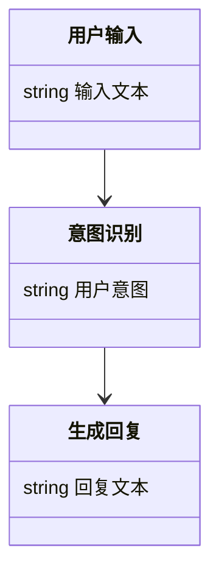

                 


# 开发具有自然语言生成与理解能力的AI Agent

> 关键词：自然语言处理（NLP）、人工智能（AI）、AI Agent、生成模型、理解模型、对话系统

> 摘要：本文详细探讨了开发具有自然语言生成与理解能力的AI Agent的核心技术与实现方法。文章从背景与概念出发，分析了自然语言生成与理解的核心技术，并深入讲解了AI Agent的设计与实现。通过系统分析与架构设计，结合实际项目案例，展示了如何将自然语言生成与理解技术集成到AI Agent中，并总结了开发中的最佳实践与经验。

---

## 第一部分: 背景与概念

### 第1章: 自然语言生成与理解的背景与概念

#### 1.1 问题背景
- **自然语言处理（NLP）**：研究如何让计算机理解和生成人类语言的技术，是人工智能领域的重要分支。
- **AI Agent**：一种智能代理系统，能够感知环境、自主决策并执行任务，广泛应用于客服、智能助手等领域。

#### 1.2 问题描述
- 当前NLP技术在处理复杂语境和生成自然语言方面仍存在局限性。
- AI Agent需要结合生成与理解技术，才能实现更智能的交互和任务处理。

#### 1.3 问题解决
- 通过结合生成与理解模型，提升AI Agent的对话能力和任务执行效率。
- 使用深度学习模型优化生成与理解的准确性。

#### 1.4 边界与外延
- NLP的边界：仅处理语言信息，不涉及图像或音频。
- AI Agent的外延：可集成多种技术，如视觉识别和语音处理。

### 第2章: 自然语言生成与理解的核心技术

#### 2.1 自然语言生成技术
- **基于规则的生成方法**：简单但难以应对复杂语境。
- **统计模型**：通过分析数据生成语言，但依赖大量训练数据。
- **深度学习模型**：如GPT，能够生成高质量文本。

#### 2.2 自然语言理解技术
- **基于规则的理解方法**：通过语法规则解析句子结构。
- **统计模型**：利用概率模型分析文本含义。
- **深度学习模型**：如BERT，能够捕捉上下文信息。

#### 2.3 对比分析
- 生成与理解的异同：生成注重创造文本，理解注重解析意图。
- 性能指标：生成关注文本流畅度，理解关注准确率。

---

## 第二部分: AI Agent的设计与实现

### 第3章: AI Agent的基本架构

#### 3.1 架构类型
- **基于规则的架构**：简单但缺乏灵活性。
- **基于知识图谱的架构**：依赖知识库进行推理。
- **基于深度学习的架构**：通过神经网络处理语言信息。

#### 3.2 生成与理解模块的实现
- **生成模块**：采用预训练模型，如GPT，生成自然语言文本。
- **理解模块**：使用BERT模型，分析用户意图。

#### 3.3 对话系统设计
- **基于生成模型的对话系统**：实时生成回复，但准确性较低。
- **基于理解模型的对话系统**：通过理解用户意图，生成准确回复。

---

## 第三部分: 系统分析与架构设计

### 第4章: 系统分析

#### 4.1 系统功能需求分析
- **用户输入处理**：接收用户的自然语言输入。
- **意图识别**：分析用户需求，生成相应回复。
- **任务执行**：根据用户指令，执行相关任务。

#### 4.2 领域模型设计


#### 4.3 系统架构设计


#### 4.4 系统接口设计
- **用户接口**：处理输入输出，提供友好的交互界面。
- **API接口**：与其他系统集成，提供服务调用。

---

## 第四部分: 项目实战

### 第5章: 项目实战

#### 5.1 环境安装
- **Python**：安装Python 3.8以上版本。
- **库依赖**：安装TensorFlow、Keras、Hugging Face Transformers等库。

#### 5.2 核心实现
```python
from transformers import GPT2LMHeadModel, GPT2Tokenizer

# 加载预训练模型
tokenizer = GPT2Tokenizer.from_pretrained('gpt2')
model = GPT2LMHeadModel.from_pretrained('gpt2')

# 生成文本
input_text = "今天天气很好，"
input_ids = tokenizer.encode(input_text, return_tensors='pt')
outputs = model.generate(input_ids, max_length=50, do_sample=True)
print(tokenizer.decode(outputs[0], skip_special_tokens=True))
```

#### 5.3 实际案例分析
- **案例1**：智能客服系统，处理用户咨询。
- **案例2**：智能助手，执行任务如设置提醒。

---

## 第五部分: 总结与展望

### 第6章: 总结与展望

#### 6.1 最佳实践Tips
- **模型优化**：选择合适的预训练模型，优化生成与理解的性能。
- **数据处理**：确保数据质量，减少噪声影响。

#### 6.2 小结
- 本文详细探讨了自然语言生成与理解技术在AI Agent中的应用，展示了如何设计和实现一个高效的AI Agent系统。

#### 6.3 展望
- 结合多模态技术，提升AI Agent的交互能力。
- 深化生成与理解模型的研究，提高准确性和流畅度。

---

作者：AI天才研究院（AI Genius Institute） & 禅与计算机程序设计艺术（Zen And The Art of Computer Programming）

---

**摘要**：本文系统地探讨了开发具有自然语言生成与理解能力的AI Agent的核心技术与实现方法。通过分析NLP技术的现状与挑战，结合AI Agent的设计与实现，展示了如何将这些技术集成到实际应用中。通过实际案例分析和系统架构设计，为开发者提供了宝贵的实践经验与最佳实践建议。

