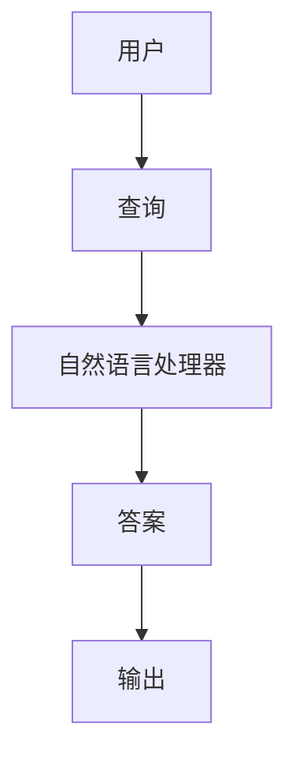
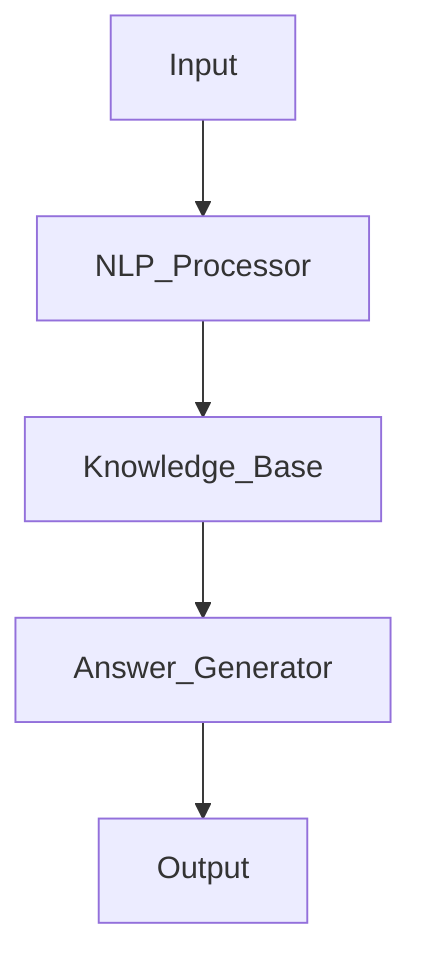
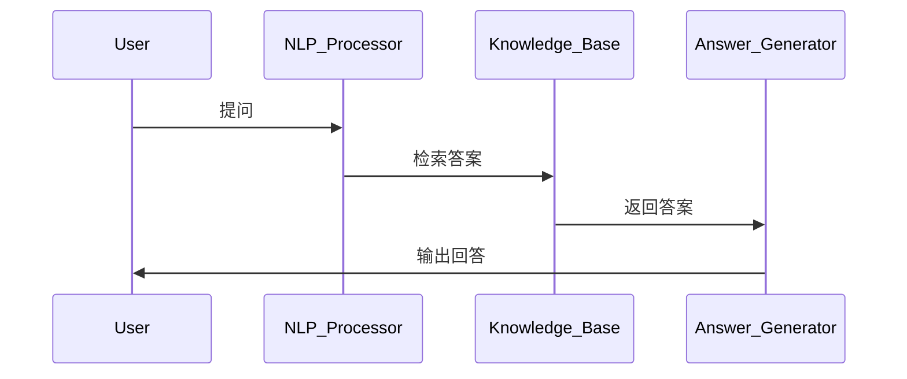

                 


# 开发具有自然语言问答能力的AI Agent

## 关键词
- 自然语言问答
- AI Agent
- 人工智能
- 机器学习
- 深度学习

## 摘要
本文将详细介绍开发具有自然语言问答能力的AI Agent的过程，从背景介绍、核心概念、算法原理到系统架构设计，再到项目实战和最佳实践。通过逐步分析，帮助读者理解如何构建一个能够理解和回答自然语言问题的AI Agent。

---

# 第一部分: 自然语言问答与AI Agent的背景介绍

## 第1章: 自然语言问答的背景与问题背景

### 1.1 问题背景

#### 1.1.1 自然语言处理的发展历程
自然语言处理（NLP）是人工智能领域的重要分支，经历了从简单规则匹配到深度学习驱动的预训练模型的演变。早期的NLP技术依赖于词典和规则，而现代技术则基于神经网络模型，如词嵌入、序列模型和 transformer 架构。

#### 1.1.2 AI Agent的定义与特点
AI Agent 是一种能够感知环境、自主决策并执行任务的智能实体。它具有以下特点：
1. **自主性**：能够在没有外部干预的情况下独立运行。
2. **反应性**：能够实时感知环境并做出反应。
3. **目标导向**：具有明确的目标，并能够采取行动来实现目标。
4. **学习能力**：能够通过数据和经验不断优化自身性能。

#### 1.1.3 自然语言问答的定义与特点
自然语言问答（NLP QA）是指通过自然语言处理技术，使计算机能够理解和回答用户提出的问题。其特点包括：
1. **交互性**：用户可以通过自然语言与系统进行交互。
2. **上下文理解**：能够理解上下文，回答相关问题。
3. **多样性**：能够处理多种语言和方言。

### 1.2 问题描述

#### 1.2.1 自然语言问答的核心问题
自然语言问答的核心问题是理解用户的问题，并生成准确的回答。这涉及以下几个方面：
1. **问题理解**：识别用户的问题类型（如事实性问题、开放性问题）。
2. **语义分析**：理解问题的深层含义。
3. **知识检索**：从知识库中找到相关答案。
4. **答案生成**：生成符合语法和语义的答案。

#### 1.2.2 AI Agent在自然语言问答中的角色
AI Agent 在自然语言问答中充当用户与系统之间的桥梁，负责接收用户的输入、处理请求并返回结果。它需要具备以下能力：
1. **语言理解**：理解用户的输入。
2. **推理能力**：基于上下文进行推理。
3. **知识库管理**：管理和查询知识库。
4. **结果输出**：以自然语言形式输出结果。

#### 1.2.3 当前技术的局限性与挑战
当前自然语言问答技术面临以下挑战：
1. **语义理解**：如何准确理解用户的意图。
2. **知识表示**：如何有效地表示和存储知识。
3. **实时性**：如何在实时环境下快速响应。
4. **多语言支持**：如何支持多种语言和方言。

### 1.3 问题解决

#### 1.3.1 自然语言问答的关键技术
自然语言问答的关键技术包括：
1. **分词与词性标注**：将文本分割成词，并标注词性。
2. **句法分析**：分析句子的结构和语法关系。
3. **语义理解**：理解句子的语义含义。
4. **知识检索**：从知识库中检索相关答案。
5. **答案生成**：生成符合语法和语义的答案。

#### 1.3.2 AI Agent的实现方法
AI Agent 的实现方法包括：
1. **基于规则的方法**：通过预定义的规则进行匹配和回答。
2. **基于统计的方法**：利用统计学习模型进行模式匹配。
3. **基于深度学习的方法**：利用神经网络模型进行语义理解。

#### 1.3.3 当前解决方案的优缺点
- **基于规则的方法**：优点是简单易懂，缺点是灵活性差，难以处理复杂问题。
- **基于统计的方法**：优点是能够处理大量数据，缺点是依赖于数据质量和特征工程。
- **基于深度学习的方法**：优点是能够自动学习特征，缺点是需要大量数据和计算资源。

### 1.4 边界与外延

#### 1.4.1 自然语言问答的边界
自然语言问答的边界包括：
1. **输入范围**：仅限于自然语言文本。
2. **输出范围**：仅限于自然语言文本。
3. **知识范围**：仅限于已知的知识库。

#### 1.4.2 AI Agent的应用场景
AI Agent 的应用场景包括：
1. **客服系统**：用于回答用户的问题。
2. **智能助手**：用于帮助用户完成任务。
3. **教育系统**：用于辅助教学。

#### 1.4.3 技术的外延与扩展
技术的外延与扩展包括：
1. **多轮对话**：支持连续的对话。
2. **多语言支持**：支持多种语言和方言。
3. **情感分析**：分析用户的情感倾向。

### 1.5 概念结构与核心要素

#### 1.5.1 自然语言问答的核心要素
自然语言问答的核心要素包括：
1. **输入**：用户提出的问题。
2. **处理**：自然语言处理技术。
3. **输出**：生成的回答。

#### 1.5.2 AI Agent的组成结构
AI Agent 的组成结构包括：
1. **感知模块**：接收用户的输入。
2. **处理模块**：处理输入并生成回答。
3. **输出模块**：输出回答。

#### 1.5.3 两者的关联与区别
自然语言问答与AI Agent 的关联在于，自然语言问答是AI Agent 的核心功能之一。区别在于，AI Agent 是一个整体系统，而自然语言问答是其中的一个模块。

## 第2章: 自然语言问答的核心概念与联系

### 2.1 核心概念原理

#### 2.1.1 自然语言处理的基本原理
自然语言处理的基本原理包括：
1. **分词**：将文本分割成词。
2. **词性标注**：标注每个词的词性。
3. **句法分析**：分析句子的结构和语法关系。
4. **语义理解**：理解句子的语义含义。

#### 2.1.2 AI Agent的工作原理
AI Agent 的工作原理包括：
1. **接收输入**：接收用户的输入。
2. **处理输入**：利用自然语言处理技术进行处理。
3. **生成回答**：根据处理结果生成回答。
4. **输出回答**：输出回答给用户。

#### 2.1.3 自然语言问答的实现机制
自然语言问答的实现机制包括：
1. **问题理解**：理解用户的问题。
2. **知识检索**：从知识库中检索相关答案。
3. **答案生成**：生成符合语法和语义的答案。

### 2.2 概念属性特征对比

| 属性       | 自然语言处理         | AI Agent            |
|------------|--------------------|---------------------|
| 输入        | 文本                | 文本或语音          |
| 输出        | 词、句或结构化数据   | 自然语言文本        |
| 技术        | 依赖于NLP技术        | 依赖于NLP和AI技术    |
| 目标        | 理解和处理文本       | 理解和回答问题      |
| 应用场景    | 信息提取、文本分类   | 客服、智能助手、教育 |

### 2.3 ER实体关系图



---

# 第二部分: 自然语言问答的算法原理

## 第3章: 自然语言问答的算法原理

### 3.1 算法原理概述

#### 3.1.1 自然语言处理的算法
自然语言处理的算法包括：
1. **分词算法**：如最大匹配法、动态规划法。
2. **词性标注算法**：如HMM（隐马尔可夫模型）。
3. **句法分析算法**：如基于规则的句法分析、基于统计的句法分析。

#### 3.1.2 AI Agent的算法
AI Agent 的算法包括：
1. **决策树**：用于分类问题。
2. **支持向量机**：用于分类和回归问题。
3. **神经网络**：用于深度学习任务。

#### 3.1.3 自然语言问答的算法
自然语言问答的算法包括：
1. **基于规则的问答系统**：通过预定义的规则进行匹配。
2. **基于统计的问答系统**：利用统计学习模型进行模式匹配。
3. **基于深度学习的问答系统**：利用神经网络模型进行语义理解。

### 3.2 分词算法实现

#### 3.2.1 分词流程
1. **输入文本**：例如，“今天天气怎么样？”
2. **分词处理**：将文本分割成“今天”、“天气”、“怎么样”。
3. **输出结果**：返回分词结果。

#### 3.2.2 分词代码实现

```python
def segment(text):
    # 分词处理逻辑
    pass
```

### 3.3 词性标注算法实现

#### 3.3.1 词性标注流程
1. **输入分词结果**：例如，“今天 天气 怎么样”。
2. **词性标注**：例如，“今天（DT） 天气（NN） 怎么样（AD）”。
3. **输出结果**：返回词性标注结果。

#### 3.3.2 词性标注代码实现

```python
def pos_tagging(segmented_text):
    # 词性标注逻辑
    pass
```

### 3.4 答案生成算法

#### 3.4.1 答案生成流程
1. **输入问题**：例如，“今天天气怎么样？”。
2. **语义理解**：理解用户的问题意图。
3. **知识检索**：从知识库中检索相关答案。
4. **答案生成**：生成符合语法和语义的答案。

#### 3.4.2 答案生成代码实现

```python
def generate_answer(question):
    # 答案生成逻辑
    pass
```

### 3.5 算法优化

#### 3.5.1 算法选择
选择合适的算法是优化的关键。例如，对于分词任务，可以使用动态规划法；对于词性标注任务，可以使用HMM模型。

#### 3.5.2 参数调整
通过调整算法参数，如学习率、批量大小等，来优化模型性能。

#### 3.5.3 模型评估
通过评估指标，如准确率、召回率、F1值等，来衡量模型性能。

---

# 第三部分: 自然语言问答的系统架构设计

## 第4章: 系统架构设计

### 4.1 系统功能设计

#### 4.1.1 功能模块划分
1. **输入模块**：接收用户的输入。
2. **处理模块**：进行自然语言处理。
3. **知识库模块**：存储和检索知识。
4. **输出模块**：输出回答结果。

#### 4.1.2 功能流程
1. 用户输入问题。
2. 系统接收输入并进行自然语言处理。
3. 系统从知识库中检索相关答案。
4. 系统生成回答并输出。

### 4.2 系统架构设计

#### 4.2.1 系统架构图



#### 4.2.2 模块设计
1. **输入模块**：接收用户的输入。
2. **处理模块**：进行自然语言处理。
3. **知识库模块**：存储和检索知识。
4. **输出模块**：输出回答结果。

### 4.3 接口设计

#### 4.3.1 输入接口
- **输入类型**：文本或语音。
- **输入格式**：字符串或音频文件。

#### 4.3.2 输出接口
- **输出类型**：文本或语音。
- **输出格式**：字符串或音频文件。

### 4.4 系统交互设计

#### 4.4.1 交互流程
1. 用户输入问题。
2. 系统接收输入并进行自然语言处理。
3. 系统从知识库中检索相关答案。
4. 系统生成回答并输出。

#### 4.4.2 交互图



---

# 第四部分: 自然语言问答的项目实战

## 第5章: 项目实战

### 5.1 环境安装

#### 5.1.1 环境要求
1. **操作系统**：Windows、Linux、macOS。
2. **Python版本**：Python 3.6+。
3. **依赖库**：如jieba、spacy、transformers等。

#### 5.1.2 安装依赖
```bash
pip install jieba spacy transformers
```

### 5.2 系统核心实现

#### 5.2.1 分词实现

```python
import jieba

def segment(text):
    return jieba.lcut(text)
```

#### 5.2.2 词性标注实现

```python
import spacy

nlp = spacy.load("zh_core_web_sm")

def pos_tagging(segmented_text):
    doc = nlp(" ".join(segmented_text))
    return [(word.text, word.pos_) for word in doc]
```

#### 5.2.3 答案生成实现

```python
from transformers import pipeline

qa_pipeline = pipeline("question-answering", model="deepseek/roberta-base-squad2")

def generate_answer(question, context):
    return qa_pipeline(question=question, context=context)['answer']
```

### 5.3 代码应用解读与分析

#### 5.3.1 分词代码解读
- 使用 `jieba` 库进行中文分词。
- 输入文本，输出分词结果。

#### 5.3.2 词性标注代码解读
- 使用 `spacy` 库进行中文词性标注。
- 输入分词结果，输出词性和词义。

#### 5.3.3 答案生成代码解读
- 使用 `transformers` 库进行问题回答。
- 输入问题和上下文，输出答案。

### 5.4 实际案例分析

#### 5.4.1 案例1
- **问题**：今天天气怎么样？
- **处理过程**：分词、词性标注、答案生成。
- **输出**：天气晴朗，温度适宜。

#### 5.4.2 案例2
- **问题**：如何学习编程？
- **处理过程**：分词、词性标注、答案生成。
- **输出**：建议从基础开始学习，多练习。

### 5.5 项目小结

#### 5.5.1 实践总结
- 分词是自然语言处理的基础。
- 词性标注有助于理解句子结构。
- 答案生成是自然语言问答的核心。

#### 5.5.2 经验分享
- 选择合适的工具和库可以提高开发效率。
- 数据质量和模型训练是关键。

---

# 第五部分: 自然语言问答的最佳实践

## 第6章: 最佳实践

### 6.1 性能优化

#### 6.1.1 算法优化
- 使用更高效的算法，如预训练模型。
- 调整模型参数，如学习率、批量大小。

#### 6.1.2 系统优化
- 优化数据存储和检索效率。
- 使用缓存机制减少重复计算。

### 6.2 模型调优

#### 6.2.1 数据增强
- 通过数据增强技术提高模型的泛化能力。

#### 6.2.2 模型微调
- 在特定领域数据上进行微调，提高模型性能。

### 6.3 安全性

#### 6.3.1 数据安全
- 确保数据存储和传输的安全性。
- 防止数据泄露和篡改。

#### 6.3.2 系统安全
- 防止恶意攻击和漏洞利用。
- 定期进行安全测试和修复。

### 6.4 可扩展性

#### 6.4.1 知识库扩展
- 定期更新和扩展知识库内容。
- 支持多语言和多领域。

#### 6.4.2 系统扩展
- 支持高并发请求。
- 优化系统架构，提高扩展性。

## 第7章: 小结

通过本文的详细讲解，我们了解了开发具有自然语言问答能力的AI Agent的过程，从背景介绍、核心概念、算法原理到系统架构设计，再到项目实战和最佳实践。希望本文能够帮助读者系统地理解如何构建一个能够理解和回答自然语言问题的AI Agent。

---

# 作者

**作者：AI天才研究院/AI Genius Institute & 禅与计算机程序设计艺术 /Zen And The Art of Computer Programming**

