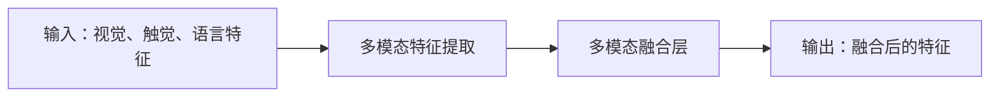
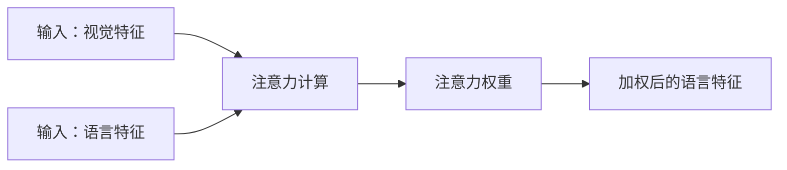
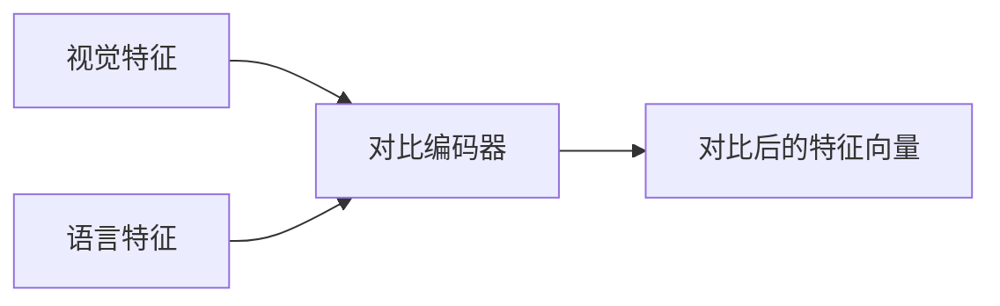

                 


# 目录大纲：《开发具有视觉-触觉-语言多模态融合能力的AI Agent》

---

## 1. 背景介绍

### 1.1 多模态AI Agent概述
- **1.1.1 多模态数据的定义**  
  - 多模态数据的特征与分类  
  - 不同模态之间的关联性分析  
- **1.1.2 多模态AI的必要性**  
  - 单模态AI的局限性  
  - 多模态融合的优势  
- **1.1.3 多模态AI Agent的应用场景**  
  - 智能机器人、虚拟助手、自动驾驶等实际应用案例  

### 1.2 多模态融合的重要性  
- **1.2.1 单模态的局限性**  
  - 仅依赖视觉或语言的信息不足  
- **1.2.2 多模态融合的优势**  
  - 提高感知的准确性和鲁棒性  
- **1.2.3 当前技术挑战**  
  - 数据异构性、模态间关联性低等问题  

---

## 2. 视觉、触觉与语言模态分析

### 2.1 视觉模态
- **2.1.1 视觉数据的特征**  
  - 图像分辨率、颜色空间、纹理特征等  
- **2.1.2 常见视觉模型**  
  - CNN、Transformer等视觉模型的优缺点  
- **2.1.3 视觉信息处理流程**  
  - 图像采集、预处理、特征提取、目标检测等  

### 2.2 触觉模态
- **2.2.1 触觉数据的特征**  
  - 力反馈、温度、纹理等  
- **2.2.2 触觉模型的应用**  
  - 在机器人和假肢中的应用  
- **2.2.3 触觉信息处理流程**  
  - 数据采集、特征提取、力反馈控制等  

### 2.3 语言模态
- **2.3.1 语言数据的特征**  
  - 语义、语法、情感分析等  
- **2.3.2 常见语言模型**  
  - Transformer、BERT等语言模型的优缺点  
- **2.3.3 语言信息处理流程**  
  - 词嵌入、句法分析、语义理解等  

### 2.4 多模态融合方法
- **2.4.1 晚期融合与早期融合**  
  - 晚期融合：多模态特征提取后进行融合  
  - 早期融合：在特征提取过程中进行融合  
- **2.4.2 跨模态注意力机制**  
  - 注意力机制的原理  
  - 跨模态注意力模型的设计与实现  
- **2.4.3 模态权重调整方法**  
  - 根据任务需求动态调整模态权重  

---

## 3. 多模态数据融合算法

### 3.1 基于深度学习的多模态融合
- **3.1.1 晚期融合网络结构**  
  - 各模态特征提取后进行融合的网络结构  
  - 使用全连接层或Transformer进行融合  
- **3.1.2 早期融合网络结构**  
  - 在特征提取阶段进行模态间交互的网络结构  
  - 如多模态Transformer的交叉注意力机制  
- **3.1.3 深度融合模型**  
  - 多模态深度融合的模型设计与优化  

#### 图3.1：多模态深度融合模型的Mermaid图


#### 图3.2：跨模态注意力机制的Mermaid图


### 3.2 跨模态对比学习
- **3.2.1 对比学习的基本原理**  
  - 对比损失函数的定义与计算  
  - 对比学习的优势：增强特征的判别性  
- **3.2.2 跨模态对比网络**  
  - 跨模态对比模型的结构设计  
  - 使用SimCLR等对比学习框架进行跨模态对齐  

#### 图3.3：跨模态对比学习的Mermaid图


---

## 4. 跨模态注意力机制的实现

### 4.1 注意力机制的原理
- **4.1.1 注意力机制的定义**  
  - 通过权重分配关注重要信息  
- **4.1.2 跨模态注意力的实现**  
  - 使用多头注意力机制进行跨模态交互  

#### 图4.1：多头注意力机制的Mermaid图


### 4.2 跨模态注意力模型
- **4.2.1 跨模态注意力的数学公式**  
  - 注意力权重计算公式：  
  $$\text{Attention}(Q, K, V) = \text{softmax}(\frac{QK^T}{\sqrt{d}})V$$  
  - 其中，Q、K、V分别为查询、键、值向量，d为维度  
- **4.2.2 实现细节与优化**  
  - 参数初始化、训练策略、模型调优  

---

## 5. 系统架构设计

### 5.1 系统功能设计
- **5.1.1 领域模型设计**  
  - 使用Mermaid类图表示各模块之间的关系  
  ```mermaid
  classDiagram
      class 视觉模块 {
          输入：图像数据
          输出：视觉特征
      }
      class 语言模块 {
          输入：文本数据
          输出：语言特征
      }
      class 触觉模块 {
          输入：力反馈数据
          输出：触觉特征
      }
      class 融合模块 {
          输入：多模态特征
          输出：融合特征
      }
      class 决策模块 {
          输入：融合特征
          输出：决策指令
      }
      视觉模块 --> 融合模块
      语言模块 --> 融合模块
      触觉模块 --> 融合模块
      融合模块 --> 决策模块
  ```

- **5.1.2 系统架构设计**  
  - 使用Mermaid架构图表示系统的整体结构  
  ```mermaid
  graph LR
      A[输入：视觉、语言、触觉数据] --> B[数据预处理]
      B --> C[多模态特征提取]
      C --> D[多模态融合]
      D --> E[决策模块]
      E --> F[输出：决策指令]
  ```

### 5.2 接口与交互设计
- **5.2.1 系统接口设计**  
  - API接口定义：RESTful API或RPC接口  
- **5.2.2 系统交互流程**  
  - 使用Mermaid序列图表示交互流程  
  ```mermaid
  sequenceDiagram
      participant A: 用户
      participant B: 视觉模块
      participant C: 语言模块
      participant D: 触觉模块
      participant E: 融合模块
      participant F: 决策模块
      A -> B: 发送视觉数据
      A -> C: 发送语言数据
      A -> D: 发送触觉数据
      B, C, D --> E: 提供特征
      E --> F: 提供融合特征
      F --> A: 返回决策指令
  ```

---

## 6. 项目实战

### 6.1 环境安装与配置
- **6.1.1 工具安装**  
  - 安装Python、TensorFlow、PyTorch等框架  
- **6.1.2 数据集准备**  
  - 下载多模态数据集（如ImageNet、COCO等）  

### 6.2 核心代码实现
- **6.2.1 多模态特征提取**  
  ```python
  import tensorflow as tf
  def extract_visual_features(image):
      model = tf.keras.Model(inputs=model.inputs, outputs=model.layers[-2].output)
      return model.predict(image)
  ```

- **6.2.2 多模态融合层**  
  ```python
  class MultiModalFuse(tf.keras.layers.Layer):
      def __init__(self, units=128):
          super(MultiModalFuse, self).__init__()
          self.units = units
          self.w1 = tf.keras.layers.Dense(units, activation='relu')
          self.w2 = tf.keras.layers.Dense(units, activation='relu')
      def call(self, inputs):
          visual = inputs[0]
          language = inputs[1]
          fused = tf.keras.layers.concatenate([self.w1(visual), self.w2(language)])
          return fused
  ```

- **6.2.3 融合模型训练**  
  ```python
  def train_model(train_dataset, val_dataset, epochs=100):
      model = build_multimodal_model()
      model.compile(optimizer='adam', loss='binary_crossentropy', metrics=['accuracy'])
      history = model.fit(train_dataset, val_dataset, epochs=epochs, verbose=1)
      return model, history
  ```

### 6.3 项目小结
- **6.3.1 项目总结**  
  - 通过实际案例理解多模态融合的实现  
- **6.3.2 实践中的注意事项**  
  - 数据预处理的重要性、模型调优的技巧  

---

## 7. 总结与展望

### 7.1 总结
- **7.1.1 核心内容回顾**  
  - 多模态融合的原理、算法与实现  
- **7.1.2 本书的收获**  
  - 掌握多模态AI Agent的开发方法  

### 7.2 未来展望
- **7.2.1 技术发展趋势**  
  - 更高效的融合方法、更强大的模型架构  
- **7.2.2 应用场景扩展**  
  - 在医疗、教育、娱乐等领域的广泛应用  

---

## 8. 附录

### 8.1 工具安装指南
- Python包安装：pip install tensorflow keras等  

### 8.2 数据集介绍
- 常见多模态数据集的来源与特点  

### 8.3 参考文献
- 书中的引用文献和论文列表  

---

## 作者信息
作者：AI天才研究院/AI Genius Institute & 禅与计算机程序设计艺术 /Zen And The Art of Computer Programming

