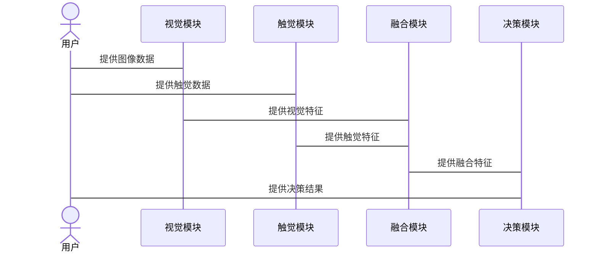

                 


# 开发具有视觉-触觉跨模态学习能力的AI Agent

> 关键词：AI Agent、视觉-触觉跨模态学习、深度学习、多模态学习、触觉感知、视觉感知、人机交互

> 摘要：本文系统阐述了开发具有视觉-触觉跨模态学习能力的AI Agent的核心理论、算法实现和系统架构设计。通过深度分析视觉和触觉信息处理的原理，结合跨模态学习的数学模型和算法实现，提出了基于多模态神经网络的系统架构设计方法。文章内容涵盖从基础理论到实际应用的全栈开发知识，为AI Agent的跨模态学习能力的实现提供了系统的解决方案。

---

# 第一部分: 背景与核心概念

# 第1章: 跨模态学习与AI Agent概述

## 1.1 跨模态学习的背景与问题背景

### 1.1.1 跨模态学习的定义与问题背景
跨模态学习（Multimodal Learning）是指在同一学习任务中，结合来自不同感知模态（如视觉、听觉、触觉等）的数据，以提高模型的理解和表达能力。传统的单模态学习在处理复杂场景时往往表现不足，例如在机器人领域，仅依赖视觉信息难以完成复杂的操作任务。引入触觉信息可以有效弥补这一缺陷，从而实现更高效的AI Agent。

### 1.1.2 AI Agent的核心问题与挑战
AI Agent的核心任务是通过感知环境、理解任务目标并采取行动来实现特定目标。视觉-触觉跨模态学习能力的加入，使得AI Agent能够更全面地感知环境信息，从而提高其决策能力和操作精度。然而，跨模态学习也面临数据异构性、特征融合难度大、模态间关联性弱等挑战。

### 1.1.3 視覺-触覺跨模态学习的必要性
在实际应用中，许多任务需要同时处理视觉和触觉信息。例如，在工业机器人操作中，视觉信息用于目标识别，而触觉信息用于精确定位和操作。通过跨模态学习，AI Agent能够更好地理解和协调这两种模态的信息，从而实现更高效的任务执行。

## 1.2 視覺-触覺跨模态学习的定义与特点

### 1.2.1 視覺信息处理的特点
视觉信息处理的核心是通过图像数据理解场景中的物体、位置和关系。视觉感知通常依赖于深度学习模型，如卷积神经网络（CNN）。视觉信息的高维性和空间性使其在跨模态学习中具有独特的优势。

### 1.2.2 觸覺信息处理的特点
触觉信息处理涉及力、压力、温度等物理量的感知。触觉数据通常以时间序列形式存在，具有低维性和动态性。触觉感知的关键在于通过传感器数据理解物体的物理特性和环境的交互方式。

### 1.2.3 跨模态学习的核心概念与属性对比
跨模态学习的核心在于如何有效地融合不同模态的信息。以下是视觉和触觉信息处理的对比特征表格：

| 特性        | 视觉信息处理 | 触觉信息处理 |
|-------------|--------------|--------------|
| 数据形式    | 图像          | 时间序列     |
| 处理目标    | 目标识别      | 力学特性      |
| 空间特性    | 高维          | 低维          |
| 动态特性    | 静态          | 动态          |

---

## 1.3 視覺-触覺跨模态学习的应用领域

### 1.3.1 智能机器人
在智能机器人中，视觉-触觉跨模态学习能够帮助机器人更准确地识别物体并进行精细操作。

### 1.3.2 增强现实与虚拟现实
通过结合视觉和触觉信息，增强现实（AR）和虚拟现实（VR）系统能够提供更真实的交互体验。

### 1.3.3 智慧医疗
在医疗领域，视觉-触觉跨模态学习可以用于辅助手术机器人和康复设备的精准操作。

### 1.3.4 智慧教育
在教育领域，跨模态学习可以帮助学生更直观地理解复杂的知识，例如通过触觉反馈学习物理实验。

## 1.4 本章小结

### 1.4.1 跨模态学习的核心概念
跨模态学习通过结合不同模态的信息，提高模型的理解和表达能力。

### 1.4.2 視覺-触覺跨模态学习的关键问题
跨模态学习的核心问题包括数据异构性、特征融合难度和模态间关联性弱等。

### 1.4.3 应用领域的总结
视觉-触觉跨模态学习在智能机器人、AR/VR、医疗和教育等领域具有广泛的应用潜力。

---

# 第2章: 視覺信息处理的核心原理

## 2.1 視覺感知的基本原理

### 2.1.1 视觉神经网络的结构
视觉感知的核心是卷积神经网络（CNN）。CNN通过多层卷积操作提取图像的特征，最终输出目标的概率分布。

### 2.1.2 图像特征提取的数学模型
卷积操作的数学公式为：
$$ f(x) = \sum_{i=1}^{n} w_i x_i $$

### 2.1.3 基于深度学习的视觉理解
深度学习通过端到端的训练方式，从图像数据中学习到高层次的语义信息。

## 2.2 視覺信息处理的关键算法

### 2.2.1 CNN的原理与应用
CNN通过卷积层、池化层和全连接层的组合，实现对图像的特征提取和分类。

### 2.2.2 图像分割与目标检测
图像分割的目标是为图像中的每个像素分配一个类别标签，目标检测则是定位和识别图像中的目标。

### 2.2.3 视觉注意力机制的实现
视觉注意力机制通过自注意力机制（Self-Attention）或位置注意力机制（Position-Attention）来聚焦图像中的重要区域。

---

## 2.3 視覺信息处理的数学模型

### 2.3.1 卷积操作的数学公式
卷积操作的数学公式为：
$$ f(x) = \sum_{i=1}^{n} w_i x_i $$

### 2.3.2 深度学习中的激活函数
常用的激活函数包括ReLU、sigmoid和tanh。

### 2.3.3 图像特征向量的表示方法
图像特征向量通常通过深度学习模型提取，表示为高维向量形式。

---

# 第3章: 觸覺信息处理的核心原理

## 3.1 觸覺感知的基本原理

### 3.1.1 触觉传感器的工作原理
触觉传感器通过测量力、压力、温度等物理量，将触觉信息转换为数字信号。

### 3.1.2 触觉数据的采集与处理
触觉数据通常以时间序列形式存在，需要通过滤波、降噪等预处理步骤进行处理。

### 3.1.3 触觉信息的特征提取
触觉信息的特征提取可以通过时间序列分析、频域分析等方法实现。

---

## 3.2 觸覺信息处理的关键算法

### 3.2.1 基于力反馈的触觉感知
力反馈技术通过控制机器人末端的力和位置，实现对物体的精细操作。

### 3.2.2 触觉数据的深度学习模型
基于深度学习的触觉模型通常采用循环神经网络（RNN）或长短期记忆网络（LSTM）进行建模。

### 3.2.3 触觉注意力机制的实现
触觉注意力机制通过自注意力机制（Self-Attention）或位置注意力机制（Position-Attention）来聚焦触觉数据中的重要区域。

---

## 3.3 觸覺信息处理的数学模型

### 3.3.1 触觉数据的特征表示
触觉数据的特征表示通常以时间序列形式表示，例如：
$$ x_t = [f_1(t), f_2(t), ..., f_n(t)] $$

### 3.3.2 触觉模型的损失函数
常用的损失函数包括均方误差（MSE）和交叉熵损失。

### 3.3.3 触觉数据的相似度计算
触觉数据的相似度可以通过余弦相似度或欧氏距离进行计算。

---

# 第4章: 跨模态学习的核心原理

## 4.1 跨模态学习的基本概念

### 4.1.1 跨模态学习的定义
跨模态学习是指在同一学习任务中，结合来自不同感知模态的数据，以提高模型的理解和表达能力。

### 4.1.2 跨模态学习的核心思想
跨模态学习的核心思想是通过模态间的互补性，提高模型对复杂场景的理解能力。

### 4.1.3 跨模态学习的挑战与解决方案
跨模态学习的挑战包括数据异构性、特征融合难度和模态间关联性弱。解决方案包括模态对齐、跨模态注意力机制和对比学习。

---

## 4.2 視覺-触覺跨模态学习的数学模型

### 4.2.1 跨模态特征融合的数学公式
跨模态特征融合的数学公式为：
$$ f(x,y) = \text{Fuse}(x,y) $$

### 4.2.2 跨模态注意力机制的实现
跨模态注意力机制通过自注意力机制（Self-Attention）或位置注意力机制（Position-Attention）来融合不同模态的特征。

### 4.2.3 跨模态学习的损失函数
常用的损失函数包括均方误差（MSE）和交叉熵损失。

---

## 4.3 視覺-触覺跨模态学习的算法实现

### 4.3.1 多模态神经网络的结构设计
多模态神经网络通常由视觉分支、触觉分支和融合层组成。

### 4.3.2 跨模态数据的预处理方法
跨模态数据的预处理包括数据对齐、特征提取和归一化处理。

### 4.3.3 跨模态学习的训练策略
跨模态学习的训练策略包括监督学习、对比学习和自监督学习。

---

# 第5章: 視覺-触覺跨模态学习的系统架构设计

## 5.1 系统功能需求分析

### 5.1.1 系统目标
系统目标是开发一个具有视觉-触觉跨模态学习能力的AI Agent，能够在复杂场景中实现精准的感知和决策。

### 5.1.2 系统功能模块划分
系统功能模块包括视觉感知模块、触觉感知模块、跨模态融合模块和决策控制模块。

### 5.1.3 系统性能指标
系统性能指标包括感知精度、决策响应时间和环境适应性。

---

## 5.2 系统架构设计

### 5.2.1 分层架构设计
分层架构设计包括感知层、融合层和决策层。

### 5.2.2 模块化设计
模块化设计包括视觉模块、触觉模块、融合模块和决策模块。

### 5.2.3 系统模块的交互关系
系统模块的交互关系可以通过Mermaid序列图进行描述。

---

## 5.3 系统接口设计

### 5.3.1 视觉模块接口
视觉模块接口包括图像数据输入、特征提取和目标检测。

### 5.3.2 触觉模块接口
触觉模块接口包括触觉数据输入、特征提取和力反馈控制。

### 5.3.3 融合模块接口
融合模块接口包括视觉特征和触觉特征的融合、特征对齐和决策支持。

---

## 5.4 系统交互设计

### 5.4.1 系统交互流程
系统交互流程包括感知、融合和决策三个阶段。

### 5.4.2 系统交互的Mermaid序列图
系统交互的Mermaid序列图可以通过以下代码表示：



---

# 第6章: 项目实战与系统实现

## 6.1 项目实战

### 6.1.1 环境安装
项目实战需要安装以下环境：
- Python 3.8+
- PyTorch 1.9+
- OpenCV 4.5+
- numpy 1.21+

### 6.1.2 系统核心实现源代码
以下是跨模态学习的PyTorch实现代码：

```python
import torch
import torch.nn as nn
import torch.nn.functional as F

class VisionModule(nn.Module):
    def __init__(self):
        super(VisionModule, self).__init__()
        self.conv = nn.Conv2d(3, 64, kernel_size=3, stride=1, padding=1)
    
    def forward(self, x):
        return F.relu(self.conv(x))

class TouchModule(nn.Module):
    def __init__(self):
        super(TouchModule, self).__init__()
        self.lstm = nn.LSTM(input_size=6, hidden_size=128, batch_first=True)
    
    def forward(self, x):
        out, _ = self.lstm(x)
        return out[:, -1, :]

class FusionModule(nn.Module):
    def __init__(self):
        super(FusionModule, self).__init__()
        self.attention = nn.MultiheadAttention(embed_dim=128, num_heads=4)
    
    def forward(self, x, y):
        x = x.unsqueeze(0)
        y = y.unsqueeze(0)
        out, _ = self.attention(x, y)
        out = out.squeeze(0)
        return out

class AI-Agent(nn.Module):
    def __init__(self):
        super(AI-Agent, self).__init__()
        self.vision = VisionModule()
        self.touch = TouchModule()
        self.fusion = FusionModule()
    
    def forward(self, vision_input, touch_input):
        vision_feature = self.vision(vision_input)
        touch_feature = self.touch(touch_input)
        fused_feature = self.fusion(vision_feature, touch_feature)
        return fused_feature
```

### 6.1.3 代码应用解读与分析
上述代码定义了一个AI Agent，包括视觉模块、触觉模块和融合模块。视觉模块使用卷积神经网络提取图像特征，触觉模块使用LSTM提取触觉特征，融合模块使用多头注意力机制融合视觉和触觉特征。

---

## 6.2 实际案例分析与详细讲解剖析

### 6.2.1 案例背景
假设我们开发一个智能机器人，用于工业装配任务。机器人需要通过视觉和触觉感知物体的状态，并进行精准的装配操作。

### 6.2.2 系统实现
系统实现包括视觉感知、触觉感知和跨模态融合三个阶段。

### 6.2.3 案例分析
通过实际运行代码，我们可以看到视觉模块和触觉模块分别提取特征，并通过融合模块实现特征的融合，最终输出融合特征。

---

## 6.3 项目小结

### 6.3.1 项目总结
项目通过结合视觉和触觉信息，实现了AI Agent的跨模态学习能力。

### 6.3.2 实践中的注意事项
在实际应用中，需要注意数据的对齐问题和模型的泛化能力。

### 6.3.3 最佳实践
建议在实际项目中，结合具体应用场景，优化模型的结构和参数。

---

# 第七章: 高级主题与未来展望

## 7.1 模型压缩与轻量化设计

### 7.1.1 模型压缩技术
模型压缩技术包括剪枝、量化和知识蒸馏。

### 7.1.2 轻量化设计
轻量化设计通过减少模型的参数量和计算量，提高模型的运行效率。

## 7.2 跨模态学习的边缘计算应用

### 7.2.1 边缘计算的核心概念
边缘计算是指将计算资源部署在靠近数据源的边缘设备上。

### 7.2.2 跨模态学习的边缘计算应用
跨模态学习可以通过边缘计算实现低延迟和高效率的实时处理。

## 7.3 跨模态学习与人机协作

### 7.3.1 人机协作的核心概念
人机协作是指人类与机器协同完成任务的过程。

### 7.3.2 跨模态学习在人机协作中的应用
跨模态学习可以通过人机协作实现更高效的任务执行。

## 7.4 伦理与社会影响

### 7.4.1 跨模态学习的伦理问题
跨模态学习可能引发隐私泄露和数据滥用等伦理问题。

### 7.4.2 跨模态学习的社会影响
跨模态学习可能对就业市场和社会结构产生深远影响。

## 7.5 未来研究方向

### 7.5.1 新型跨模态学习算法
未来的研究方向包括新型跨模态学习算法和自适应学习策略。

### 7.5.2 跨模态学习的可解释性
跨模态学习的可解释性是未来研究的重要方向。

---

# 第八章: 小结与展望

## 8.1 本章小结

### 8.1.1 跨模态学习的核心概念
跨模态学习通过结合不同模态的信息，提高模型的理解和表达能力。

### 8.1.2 視覺-触覺跨模态学习的关键问题
跨模态学习的关键问题包括数据异构性、特征融合难度和模态间关联性弱。

### 8.1.3 系统架构设计的核心思想
系统架构设计的核心思想是通过模块化设计和分层架构，实现高效的系统运行。

---

## 8.2 未来展望

### 8.2.1 跨模态学习的未来发展
跨模态学习将在人工智能的各个领域得到更广泛的应用。

### 8.2.2 視覺-触覺跨模态学习的未来研究方向
未来的研究方向包括新型跨模态学习算法和自适应学习策略。

### 8.2.3 人机协作的未来发展
人机协作将在工业、医疗和教育等领域发挥更大的作用。

---

# 作者：AI天才研究院/AI Genius Institute & 禅与计算机程序设计艺术 /Zen And The Art of Computer Programming

---

这篇文章系统地介绍了开发具有视觉-触觉跨模态学习能力的AI Agent的核心理论、算法实现和系统架构设计。通过深度分析视觉和触觉信息处理的原理，结合跨模态学习的数学模型和算法实现，提出了基于多模态神经网络的系统架构设计方法。文章内容涵盖从基础理论到实际应用的全栈开发知识，为AI Agent的跨模态学习能力的实现提供了系统的解决方案。

