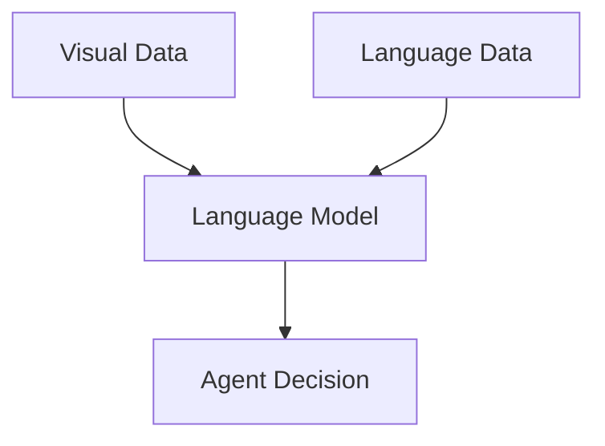
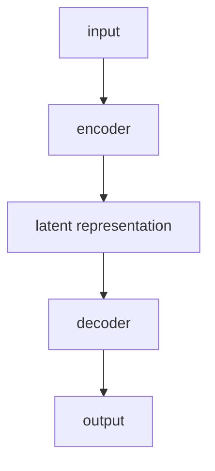

                 


# 《开发具有视觉-语言多模态理解能力的AI Agent》

## 关键词：视觉-语言多模态、AI Agent、多模态理解、自然语言处理、计算机视觉、机器学习

## 摘要：  
本文从概念到实现，全面解析视觉-语言多模态AI Agent的开发。涵盖算法原理、系统架构设计和实战项目，结合丰富的案例和代码示例，帮助读者掌握多模态理解的核心技术。

---

## 第一部分：背景介绍

### 第1章：AI Agent与多模态理解概述

#### 1.1 AI Agent的基本概念
- **AI Agent的定义与特点**  
  AI Agent（智能体）是能够感知环境、自主决策并执行任务的实体。它具备自主性、反应性、目标导向和社会性等特征。
  
- **多模态理解的必要性**  
  在真实场景中，数据往往是多模态的（如图像、文本、语音等）。AI Agent需要理解多种数据类型，以更好地处理复杂任务。
  
- **视觉-语言多模态理解的背景与意义**  
  结合视觉和语言信息可以提升AI Agent的感知和理解能力，使其能够处理更复杂的任务，如图像描述生成、视觉问答等。

#### 1.2 视觉-语言多模态理解的核心问题
- **问题背景与挑战**  
  多模态数据的异构性（不同数据类型具有不同的特征）和模态间关联的复杂性增加了理解和融合的难度。
  
- **问题描述与目标**  
  通过视觉和语言数据的协同处理，提升AI Agent对复杂场景的理解能力，实现更智能的交互和决策。
  
- **多模态数据的处理与融合**  
  需要设计有效的模型和算法，将视觉和语言信息有机结合，以实现多模态理解。

#### 1.3 本章小结
本章介绍了AI Agent的基本概念，强调了视觉-语言多模态理解的重要性，并指出了相关技术的挑战和目标。

---

## 第二部分：核心概念与联系

### 第2章：多模态数据处理与模型融合

#### 2.1 多模态数据的特征分析
- **视觉数据的特征**  
  图像和视频数据具有丰富的空间信息，但通常难以直接提取语义信息。
  
- **语言数据的特征**  
  文本和语音数据具有明确的语义信息，但缺乏空间和视觉上下文。

- **数据特征对比分析表**  
  | 特征维度 | 视觉数据 | 语言数据 |
  |----------|----------|----------|
  | 数据类型 | 图像/视频 | 文本/语音 |
  | 语义信息 | 丰富但隐含 | 明确但缺乏空间信息 |
  | 处理难度 | 高 | 中等 |

#### 2.2 多模态模型的融合方式
- **并行融合**  
  同时处理不同模态的数据，分别提取特征后进行融合。
  
- **串行融合**  
  按顺序处理模态数据，前一模态的输出作为后一模态的输入。
  
- **混合融合**  
  综合使用并行和串行融合方式，根据任务需求灵活调整。

#### 2.3 实体关系图（使用Mermaid流程图）


---

## 第三部分：算法原理讲解

### 第3章：视觉-语言多模态模型的算法原理

#### 3.1 多模态编码器-解码器架构
- **编码器结构**  
  将输入的多模态数据分别编码为隐含表示。
  
- **解码器结构**  
  根据编码结果生成目标输出（如文本描述）。



- **代码实现示例**
  ```python
  class MultiModalEncoder:
      def __init__(self, visual_dim, language_dim):
          self.visual_encoder = VisualNet(visual_dim)
          self.language_encoder = LanguageNet(language_dim)
  
      def forward(self, visual_input, language_input):
          visual_features = self.visual_encoder(visual_input)
          language_features = self.language_encoder(language_input)
          return visual_features, language_features
  
  class MultiModalDecoder:
      def __init__(self, input_dim, output_dim):
          self.decoder = Decoder(input_dim, output_dim)
  
      def forward(self, features):
          output = self.decoder(features)
          return output
  ```

#### 3.2 注意力机制在多模态融合中的应用
- **注意力机制的数学模型**
  $$\text{Attention}(Q, K, V) = \text{softmax}\left(\frac{QK^T}{\sqrt{d_k}}\right)V$$

- **代码实现示例**
  ```python
  def attention(Q, K, V):
      d_k = K.shape[-1]
      scores = (Q @ K.T) / np.sqrt(d_k)
      scores = softmax(scores)
      output = scores @ V
      return output
  ```

- **注意力机制的应用场景**
  在视觉-语言模型中，注意力机制用于捕捉模态间的重要关联，提升特征表达能力。

---

## 第四部分：系统分析与架构设计方案

### 第4章：AI Agent的系统架构设计

#### 4.1 系统功能模块设计
- **功能模块设计**
  ```mermaid
  classDiagram
      class Agent {
          - input: MultiModalInput
          - output: Action
          + process(input: MultiModalInput): Action
      }
      class VisualProcessor {
          - image: Image
          - features: VisualFeatures
          + extract_features(image: Image): VisualFeatures
      }
      class LanguageProcessor {
          - text: Text
          - features: LanguageFeatures
          + extract_features(text: Text): LanguageFeatures
      }
      Agent --> VisualProcessor
      Agent --> LanguageProcessor
  ```

- **系统架构图（Mermaid架构图）**
  ```mermaid
  graph TD
      A[Agent] --> B[VisualProcessor]
      A[Agent] --> C[LanguageProcessor]
      B[VisualProcessor] --> D[FeatureFusion]
      C[LanguageProcessor] --> D[FeatureFusion]
      D[FeatureFusion] --> E[DecisionMaker]
      E[DecisionMaker] --> A[Agent]
  ```

- **系统接口设计**
  - 输入接口：接收多模态输入数据（如图像和文本）。
  - 输出接口：生成目标输出（如文本描述或决策指令）。

- **系统交互流程图（Mermaid序列图）**
  ```mermaid
  sequenceDiagram
      Agent -> VisualProcessor: Provide image
      VisualProcessor -> Agent: Return visual features
      Agent -> LanguageProcessor: Provide text
      LanguageProcessor -> Agent: Return language features
      Agent -> FeatureFusion: Merge features
      FeatureFusion -> DecisionMaker: Generate decision
      DecisionMaker -> Agent: Return action
  ```

---

## 第五部分：项目实战

### 第5章：开发一个简单的视觉-语言AI Agent

#### 5.1 环境配置
- 安装必要的库：
  ```bash
  pip install numpy matplotlib torch torchvision
  ```

#### 5.2 系统核心实现源代码
- 多模态编码器实现：
  ```python
  import torch
  import torch.nn as nn

  class VisualEncoder(nn.Module):
      def __init__(self, input_dim, hidden_dim):
          super(VisualEncoder, self).__init__()
          self.encoder = nn.Sequential(
              nn.Conv2d(input_dim, hidden_dim, kernel_size=3, stride=1, padding=1),
              nn.ReLU()
          )
  
      def forward(self, x):
          return self.encoder(x)
  
  class LanguageEncoder(nn.Module):
      def __init__(self, input_dim, hidden_dim):
          super(LanguageEncoder, self).__init__()
          self.encoder = nn.Sequential(
              nn.Linear(input_dim, hidden_dim),
              nn.ReLU()
          )
  
      def forward(self, x):
          return self.encoder(x)
  ```

- 注意力机制实现：
  ```python
  def attention(Q, K, V):
      d_k = K.shape[-1]
      scores = (Q @ K.T) / np.sqrt(d_k)
      scores = nn.functional.softmax(scores, dim=-1)
      output = (V @ scores).squeeze(1)
      return output
  ```

#### 5.3 案例分析与详细解读
- 案例：图像描述生成
  - 输入：一张图片
  - 输出：描述图片的文本
  - 实现步骤：
    1. 对图像进行特征提取。
    2. 对文本进行特征提取。
    3. 使用注意力机制融合特征。
    4. 生成描述文本。

#### 5.4 项目总结
本项目展示了如何开发一个简单的视觉-语言AI Agent，通过实际案例分析，验证了多模态理解技术的有效性。

---

## 第六部分：最佳实践、小结、注意事项与扩展阅读

### 第6章：总结与展望

#### 6.1 最佳实践
- 数据预处理：确保多模态数据的同步和标准化。
- 模型选择：根据任务需求选择合适的模型架构。
- 跨模态对齐：注意不同模态数据的特征差异，合理设计对齐方法。

#### 6.2 小结
本文系统地介绍了视觉-语言多模态AI Agent的开发流程，从概念到实现，结合算法原理和系统设计，为读者提供了全面的技术指导。

#### 6.3 注意事项
- 数据隐私：注意保护用户数据，遵守相关法律法规。
- 模型泛化能力：避免过拟合，确保模型的泛化能力。
- 计算资源：多模态模型通常需要大量计算资源，建议使用GPU加速。

#### 6.4 拓展阅读
- [《Multi-modal Deep Learning for Vision and Language》](#)  
- [《Attention is All You Need》](#)  
- [《Vision-Language Pre-training: A Survey》](#)

---

## 作者：AI天才研究院 & 禅与计算机程序设计艺术

---

以上是《开发具有视觉-语言多模态理解能力的AI Agent》的技术博客文章的完整目录大纲。希望这篇结构清晰、内容详实的文章能为读者提供有价值的参考和指导。

