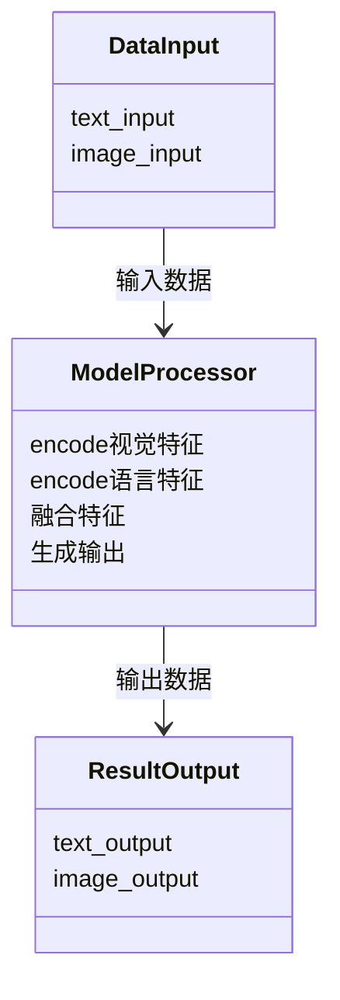
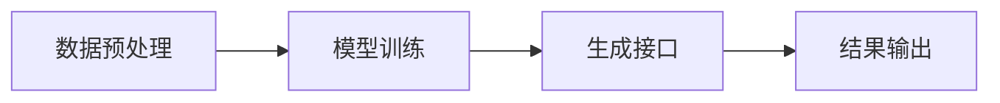
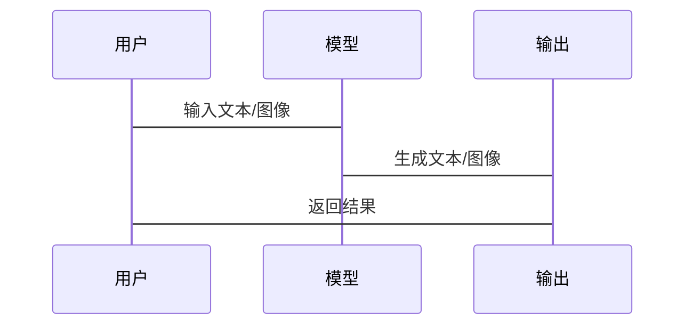

                 


# 开发具有视觉-语言多模态生成能力的AI Agent

## 关键词：AI Agent，多模态生成，视觉-语言，深度学习，生成模型

## 摘要：本文详细探讨了开发具有视觉-语言多模态生成能力的AI Agent的核心概念、算法原理、系统架构及项目实战。通过分析多模态数据的表示与融合、模型的训练目标与损失函数、生成策略与优化方法，结合系统架构设计、项目实战和扩展内容，为读者提供全面的技术指导，帮助其掌握开发此类AI Agent的技能。

---

# 第一部分: 背景与核心概念

## 第1章: AI Agent与多模态生成的背景

### 1.1 AI Agent的基本概念

#### 1.1.1 AI Agent的定义与分类

AI Agent（人工智能代理）是指能够感知环境并采取行动以实现目标的智能实体。根据功能和应用场景的不同，AI Agent可以分为多种类型，如基于规则的Agent、基于模型的规划Agent、强化学习Agent等。

#### 1.1.2 多模态生成的定义与特点

多模态生成是指AI Agent能够同时处理和生成多种数据类型的输出，如文本、图像、语音等。视觉-语言多模态生成特指AI Agent能够结合视觉和语言信息，生成与输入相关的视觉或语言输出。

#### 1.1.3 视觉-语言多模态生成的背景与意义

随着深度学习技术的发展，多模态生成技术在AI Agent中的应用越来越广泛。视觉-语言多模态生成能够提升AI Agent的交互能力和理解能力，使其能够更自然地与人类进行交流和协作。

### 1.2 多模态生成的背景与技术挑战

#### 1.2.1 多模态数据的特点与复杂性

多模态数据通常具有异构性、多样性和关联性等特点。不同数据类型之间的关联需要复杂的模型来处理，增加了开发的难度。

#### 1.2.2 当前多模态生成技术的发展现状

目前，多模态生成技术主要基于深度学习模型，如Transformer、GAN（生成对抗网络）等。视觉-语言生成在图像描述生成、文本到图像生成等领域取得了显著进展。

#### 1.2.3 视觉-语言生成的核心技术挑战

视觉-语言生成的核心挑战包括多模态数据的融合、生成模型的多样性、模型的可解释性等。

### 1.3 多模态生成在AI Agent中的应用领域

#### 1.3.1 视觉-语言生成在人机交互中的应用

AI Agent可以通过视觉-语言生成技术，提供更自然的交互方式，如图像描述生成、语音助手的可视化界面等。

#### 1.3.2 在图像描述生成中的应用

AI Agent能够生成与图像相关的文本描述，帮助用户更好地理解图像内容。

#### 1.3.3 在文本到图像生成中的应用

AI Agent可以根据输入的文本生成相应的图像，广泛应用于游戏开发、广告设计等领域。

---

## 第二部分: 视觉-语言多模态模型的核心概念

## 第2章: 视觉-语言多模态模型的原理与结构

### 2.1 多模态数据的表示与融合

#### 2.1.1 视觉特征的表示方法

视觉特征通常通过卷积神经网络（CNN）提取，如ResNet、VGG等模型。这些模型能够提取图像的低级和高级特征。

#### 2.1.2 语言特征的表示方法

语言特征通常通过Transformer模型提取，如BERT、GPT等。这些模型能够捕捉文本的语义信息。

#### 2.1.3 多模态数据的融合策略

多模态数据的融合策略包括早期融合和晚期融合。早期融合将不同模态的数据在特征提取阶段进行融合，而晚期融合则在高层进行特征融合。

### 2.2 多模态生成模型的架构

#### 2.2.1 基于Transformer的多模态生成模型

基于Transformer的多模态生成模型在视觉-语言任务中表现出色，如VIT、CLIP等模型。

#### 2.2.2 模型的编码器-解码器结构

编码器负责将输入数据编码为一个或多个潜在向量，解码器负责将潜在向量解码为输出数据。

#### 2.2.3 多模态注意力机制

多模态注意力机制允许模型在生成过程中关注不同的输入模态，如视觉和语言特征。

---

## 第三部分: 视觉-语言多模态生成的算法原理

## 第3章: 多模态生成模型的训练目标与损失函数

### 3.1 多模态生成模型的训练目标

#### 3.1.1 联合概率最大化目标

联合概率最大化目标旨在最大化输入和输出的联合概率，通常用于生成对抗网络（GAN）。

#### 3.1.2 对抗训练目标

对抗训练目标通过生成器和判别器的对抗训练，优化生成模型的输出分布。

#### 3.1.3 基于交叉熵的生成目标

基于交叉熵的生成目标通常用于文本生成任务，优化生成文本的条件概率。

### 3.2 损失函数的设计与分析

#### 3.2.1 交叉熵损失函数

交叉熵损失函数用于衡量生成样本与真实样本之间的差异，公式为：

$$
\text{CrossEntropy} = -\frac{1}{N}\sum_{i=1}^{N} \sum_{j=1}^{C} y_{ij}\log(p_{ij})
$$

其中，\(N\)是样本数量，\(C\)是类别数，\(y_{ij}\)是真实标签，\(p_{ij}\)是生成概率。

#### 3.2.2 GAN损失函数

生成对抗网络的损失函数包括生成器损失和判别器损失，公式为：

$$
\text{Generator Loss} = \mathbb{E}_{z}[D(G(z))]
$$

$$
\text{Discriminator Loss} = \mathbb{E}_{x}[D(x)] + \mathbb{E}_{z}[(1 - D(G(z)))
$$

---

## 第四部分: 系统分析与架构设计方案

## 第4章: 系统架构设计

### 4.1 问题场景介绍

#### 4.1.1 问题描述

开发一个能够同时处理视觉和语言信息的AI Agent，实现视觉-语言多模态生成。

#### 4.1.2 项目介绍

本项目旨在构建一个AI Agent，能够根据输入的文本生成相应的图像，或根据输入的图像生成描述性的文本。

### 4.2 系统功能设计

#### 4.2.1 领域模型设计

领域模型设计包括数据输入、模型处理、结果输出等模块。



#### 4.2.2 系统架构设计

系统架构设计包括数据预处理、模型训练、生成接口等模块。



#### 4.2.3 接口设计

接口设计包括输入接口和输出接口，支持文本和图像的输入输出。

#### 4.2.4 交互流程设计

交互流程设计包括用户输入、模型处理、结果输出等步骤。



---

## 第五部分: 项目实战

## 第5章: 项目实现

### 5.1 环境安装

#### 5.1.1 安装Python环境

```bash
python --version
pip install --upgrade pip
```

#### 5.1.2 安装深度学习库

```bash
pip install numpy
pip install tensorflow
pip install keras
pip install matplotlib
pip install transformers
```

### 5.2 系统核心实现

#### 5.2.1 数据准备

```python
import numpy as np
import tensorflow as tf
from tensorflow.keras import layers
import matplotlib.pyplot as plt
from transformers import BertTokenizer, TFBertModel
```

#### 5.2.2 模型训练

```python
# 定义模型结构
class VisualLanguageGenerator(tf.keras.Model):
    def __init__(self):
        super(VisualLanguageGenerator, self).__init__()
        self.vision_model = ...  # 视觉特征提取模型
        self.language_model = ...  # 语言特征提取模型
        self.decoder = ...  # 解码器

    def call(self, inputs):
        vision_features = self.vision_model(inputs['image'])
        language_features = self.language_model(inputs['text'])
        # 融合特征
        features = tf.concat([vision_features, language_features], axis=-1)
        outputs = self.decoder(features)
        return outputs

# 编译模型
model = VisualLanguageGenerator()
model.compile(optimizer='adam', loss='sparse_categorical_crossentropy')
```

#### 5.2.3 生成接口

```python
def generate_output(input_type, input_data):
    if input_type == 'text':
        # 根据输入文本生成图像
        image = model.generate_image(input_data)
        plt.imshow(image)
        plt.show()
    elif input_type == 'image':
        # 根据输入图像生成文本描述
        description = model.generate_text(input_data)
        print(description)
```

#### 5.2.4 优化调优

模型优化包括调整学习率、批量大小、训练轮数等参数。

---

## 第六部分: 扩展与展望

## 第6章: 未来研究方向与技术展望

### 6.1 未来技术挑战

#### 6.1.1 多模态生成的实时性优化

优化生成模型的计算效率，提升实时生成能力。

#### 6.1.2 多模态生成的可解释性增强

提高生成模型的可解释性，便于用户理解和信任。

#### 6.1.3 视觉-语言生成的多样性与质量提升

进一步提升生成内容的多样性和质量，减少模式坍缩和生成结果的单一性。

### 6.2 技术展望

#### 6.2.1 多模态生成的轻量化部署

优化模型结构，降低计算资源需求，便于在边缘设备上部署。

#### 6.2.2 多模态生成的安全性与鲁棒性

增强生成模型的安全性，防止对抗攻击，提升模型的鲁棒性。

#### 6.2.3 多模态生成的跨模态迁移能力

提升模型在不同模态之间的迁移能力，支持更多类型的生成任务。

---

## 第七部分: 最佳实践与注意事项

## 第7章: 最佳实践与注意事项

### 7.1 开发注意事项

#### 7.1.1 数据质量与多样性

确保训练数据的质量和多样性，避免模型过拟合。

#### 7.1.2 模型调优与优化

合理调整模型参数，进行充分的训练和验证，确保模型性能。

#### 7.1.3 生成结果的可解释性

提供生成结果的可解释性，便于用户理解和调试。

### 7.2 项目小结

通过本文的系统介绍和项目实战，读者可以全面掌握开发具有视觉-语言多模态生成能力的AI Agent的核心技术与实践方法。

---

## 作者

**作者：AI天才研究院/AI Genius Institute & 禅与计算机程序设计艺术 /Zen And The Art of Computer Programming**

