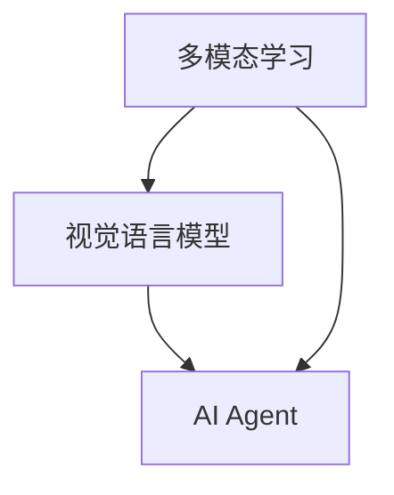
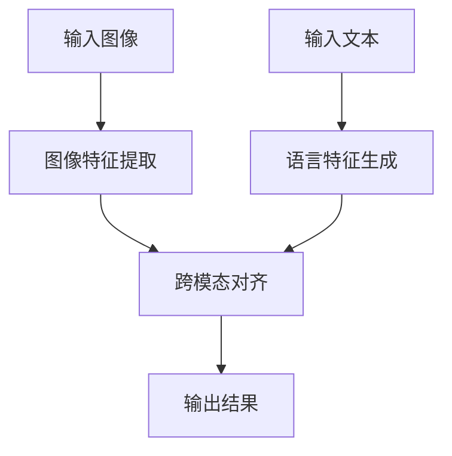
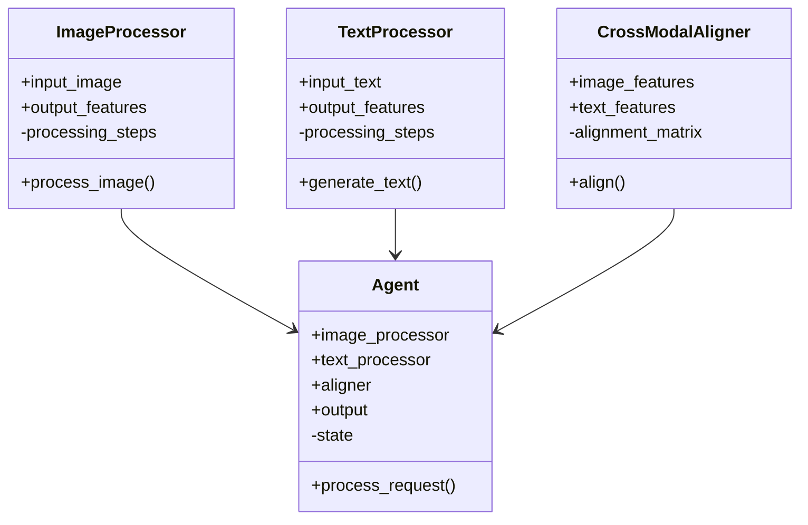
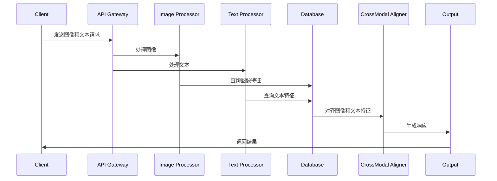

                 


# 开发具有视觉-语言理解能力的AI Agent

## 关键词：AI Agent, 视觉-语言理解, 多模态学习, 人工智能, 计算机视觉, 自然语言处理

## 摘要：  
本文详细探讨了开发具有视觉-语言理解能力的AI Agent的关键技术与实现方法。通过分析多模态学习的核心概念、视觉语言模型的算法原理以及AI Agent的系统架构设计，本文为读者提供了从理论到实践的全面指导。通过实际项目案例，展示了如何构建一个能够理解视觉和语言信息，并与人类进行自然交互的智能系统。本文还提供了最佳实践建议，帮助读者在实际开发中避免常见问题并优化系统性能。

---

# 第一章：背景与概念

## 1.1 问题背景

### 1.1.1 多模态AI的发展现状  
近年来，人工智能（AI）技术的快速发展，使得多模态学习成为研究热点。通过结合视觉、语言等多种模态信息，AI系统能够更好地理解和处理复杂场景中的问题。视觉-语言理解作为多模态学习的重要分支，正在逐步从实验室研究走向实际应用。

### 1.1.2 视觉-语言理解的挑战与机遇  
视觉-语言理解的核心挑战在于如何将图像中的视觉信息与语言信息进行有效融合。这需要解决跨模态信息对齐、语义理解以及实时性等问题。与此同时，随着深度学习技术的进步，视觉-语言模型在图像描述生成、问答系统和对话系统中的应用展现出巨大潜力。

### 1.1.3 AI Agent在实际场景中的应用需求  
AI Agent是一种能够感知环境、理解用户需求并执行任务的智能实体。在视觉-语言理解能力的支持下，AI Agent能够更自然地与人类交互，广泛应用于智能家居、机器人助手、医疗辅助等领域。

## 1.2 问题描述

### 1.2.1 视觉-语言理解的核心问题  
视觉-语言理解的核心问题包括：如何将图像特征与语言特征对齐，如何在不同模态之间建立有效的关联，以及如何处理语义歧义和跨模态噪声。

### 1.2.2 AI Agent的任务目标与功能  
AI Agent的目标是通过视觉-语言理解能力，实现对用户意图的准确捕捉和任务执行。其主要功能包括图像描述生成、基于图像的问答、对话交互等。

### 1.2.3 当前技术的局限性与改进方向  
当前技术的主要局限性在于跨模态对齐的精度不足、模型的泛化能力有限以及实时性问题。未来研究需要在模型架构优化、多模态数据预处理和轻量化技术方面进行改进。

## 1.3 问题解决

### 1.3.1 多模态学习的基本原理  
多模态学习通过联合学习不同模态的数据，提升模型的表达能力。其基本原理包括特征提取、模态对齐和联合推理三个步骤。

### 1.3.2 视觉-语言模型的构建方法  
视觉-语言模型的构建方法包括基于编码器-解码器架构的多模态模型，以及基于自注意力机制的跨模态交互模型。

### 1.3.3 AI Agent的交互机制设计  
AI Agent的交互机制设计需要考虑用户意图的理解、任务规划和反馈优化。通过结合视觉和语言信息，实现更自然的交互流程。

## 1.4 边界与外延

### 1.4.1 视觉-语言理解的边界条件  
视觉-语言理解的边界条件包括输入数据的质量、模型的训练数据范围以及应用场景的限制。

### 1.4.2 AI Agent的功能范围与限制  
AI Agent的功能范围主要集中在基于视觉和语言的交互任务上，其限制包括处理复杂场景的能力不足和对实时性要求较高的任务的处理能力有限。

### 1.4.3 相关领域的区别与联系  
相关领域包括计算机视觉、自然语言处理和人机交互。视觉-语言理解是这些领域的交叉点，通过结合各领域的优势，推动AI Agent的发展。

## 1.5 概念结构与核心要素

### 1.5.1 多模态数据的处理流程  
多模态数据的处理流程包括数据采集、预处理、特征提取、模态对齐和联合推理。

### 1.5.2 视觉-语言模型的输入输出结构  
视觉-语言模型的输入包括图像和文本，输出包括图像描述、问答结果或对话响应。

### 1.5.3 AI Agent的系统架构组成  
AI Agent的系统架构组成包括感知模块、理解模块、决策模块和执行模块。

## 1.6 本章小结  
本章从背景、问题、解决方案和边界条件等方面，全面介绍了开发具有视觉-语言理解能力的AI Agent的必要性和挑战。

---

# 第二章：核心概念与联系

## 2.1 多模态学习

### 2.1.1 多模态学习的定义与特点  
多模态学习是指同时利用多种模态信息（如图像、文本、语音等）进行学习的方法。其特点包括信息互补性、任务相关性和模型复杂性。

### 2.1.2 视觉与语言模态的特征对比  
视觉模态的特征包括空间结构和语义信息，语言模态的特征包括语义信息和语法结构。两者的对比分析有助于理解跨模态对齐的难点。

### 2.1.3 多模态模型的优势与挑战  
多模态模型的优势在于能够利用多种信息源提高任务性能，其挑战包括数据异构性、模型复杂性和计算效率问题。

## 2.2 视觉语言模型

### 2.2.1 视觉语言模型的分类  
视觉语言模型可以分为基于编码器-解码器的模型和基于自注意力机制的模型两类。

### 2.2.2 基于Transformer的视觉语言模型  
基于Transformer的视觉语言模型通过自注意力机制实现跨模态交互，具有强大的全局上下文捕捉能力。

### 2.2.3 模型的训练与推理过程  
模型的训练过程包括数据预处理、特征提取、模态对齐和损失函数优化。推理过程包括图像特征提取、语言特征生成和结果解码。

## 2.3 AI Agent

### 2.3.1 AI Agent的定义与功能  
AI Agent是一种能够感知环境、理解用户需求并执行任务的智能实体，其功能包括信息获取、决策制定和任务执行。

### 2.3.2 基于视觉语言理解的Agent设计  
基于视觉语言理解的Agent设计需要结合视觉和语言信息，实现对用户意图的准确理解。

### 2.3.3 Agent与人类用户的交互模式  
Agent与人类用户的交互模式包括基于文本的对话和基于图像的交互，其核心在于实现自然流畅的用户体验。

## 2.4 核心概念的联系

### 2.4.1 多模态学习与视觉语言理解的联系  
多模态学习为视觉语言理解提供了理论基础和技术支持，视觉语言理解则是多模态学习的重要应用领域。

### 2.4.2 AI Agent与视觉语言模型的结合  
AI Agent通过视觉语言模型实现对用户意图的理解和任务执行，是视觉语言模型的实际应用场景。

### 2.4.3 三者之间的关系图  
以下是三者之间的关系图：



---

# 第三章：算法原理

## 3.1 多模态模型的结构

### 3.1.1 编码器-解码器架构  
编码器-解码器架构是视觉语言模型的经典结构，编码器用于提取图像特征，解码器用于生成文本描述。

### 3.1.2 自注意力机制  
自注意力机制通过计算输入序列中各元素的权重，实现对全局信息的捕捉和利用。

## 3.2 视觉语言模型的实现

### 3.2.1 图像特征提取  
图像特征提取通常采用预训练的卷积神经网络（CNN），如ResNet或VGG。

### 3.2.2 语言特征生成  
语言特征生成基于Transformer编码器，通过自注意力机制提取文本的语义特征。

### 3.2.3 跨模态对齐  
跨模态对齐通过将图像特征和语言特征映射到相同的 latent 空间，实现模态之间的信息交互。

## 3.3 数学模型

### 3.3.1 图像特征提取公式  
$$
f_{\text{image}}(x) = \text{CNN}(x)
$$

### 3.3.2 语言特征生成公式  
$$
f_{\text{text}}(y) = \text{Transformer}(y)
$$

### 3.3.3 跨模态对齐公式  
$$
z = \text{align}(f_{\text{image}}, f_{\text{text}})
$$

### 3.3.4 最终输出  
$$
\hat{y} = \text{Decoder}(z)
$$

## 3.4 算法流程图



---

# 第四章：系统分析与架构设计

## 4.1 问题场景介绍

### 4.1.1 项目背景  
本项目旨在开发一个具有视觉-语言理解能力的AI Agent，能够通过图像和文本交互完成特定任务。

### 4.1.2 项目目标  
项目目标包括实现图像描述生成、基于图像的问答和对话交互功能。

## 4.2 系统功能设计

### 4.2.1 领域模型（Mermaid 类图）  
以下是系统的核心类图：



### 4.2.2 系统架构设计（Mermaid 架构图）  
以下是系统架构设计：


### 4.2.3 系统接口设计  
系统接口设计包括图像输入接口、文本输入接口、跨模态对齐接口和输出接口。

### 4.2.4 系统交互流程（Mermaid 序列图）  
以下是系统交互流程：



---

# 第五章：项目实战

## 5.1 环境安装

### 5.1.1 安装Python与相关库  
安装Python 3.8以上版本，并安装以下库：  
- `tensorflow` 或 `pytorch`  
- `numpy`  
- `pillow`  
- `transformers`  
- `mermaid`  

### 5.1.2 安装开发环境  
安装Jupyter Notebook或VS Code作为开发环境。

## 5.2 系统核心实现

### 5.2.1 图像描述生成  
以下是图像描述生成的代码示例：

```python
import tensorflow as tf
from tensorflow.keras.applications import ResNet50
from tensorflow.keras.preprocessing import image

# 加载预训练的ResNet50模型
model = ResNet50(weights='imagenet', include_top=False)

# 定义图像预处理函数
def preprocess_image(img_path):
    img = image.load_img(img_path, target_size=(224, 224))
    x = image.img_to_array(img)
    x = np.expand_dims(x, axis=0)
    x = tf.keras.applications.imagenet_utils.preprocess_input(x)
    return x

# 提取图像特征
img_features = model.predict(preprocess_image('input.jpg'))
```

### 5.2.2 对话系统实现  
以下是对话系统的代码示例：

```python
from transformers import GPT2Tokenizer, GPT2ModelWithLMHead

# 加载预训练的GPT-2模型
tokenizer = GPT2Tokenizer.from_pretrained('gpt2')
model = GPT2ModelWithLMHead.from_pretrained('gpt2')

# 定义对话历史
history = []

# 定义生成回复函数
def generate_response(message):
    global history
    history.append(message)
    inputs = tokenizer(' '.join(history), return_tensors='np')
    outputs = model.generate(inputs.input_ids, max_length=50)
    response = tokenizer.decode(outputs[0][0], skip_special_tokens=True)
    history.append(response)
    return response

# 示例对话
print(generate_response('告诉我你看到的图片内容。'))
```

## 5.3 代码应用解读与分析

### 5.3.1 图像特征提取代码解读  
上述代码使用ResNet50模型提取图像特征，通过预处理函数将输入图像转换为模型可接受的格式，并利用模型进行特征提取。

### 5.3.2 对话系统代码解读  
对话系统基于GPT-2模型，通过维护对话历史，生成与用户相关的回复。其核心在于利用预训练的语言模型实现自然的对话交互。

## 5.4 实际案例分析

### 5.4.1 案例描述  
用户输入一张图片和相关问题，AI Agent通过图像描述生成和对话系统回答问题。

### 5.4.2 系统测试与优化  
通过测试不同场景，优化模型的特征提取和语言生成能力，提升系统的准确性和响应速度。

## 5.5 项目小结  
本章通过实际项目案例，详细讲解了视觉-语言理解AI Agent的实现过程，包括环境配置、核心功能开发和系统优化。

---

# 第六章：最佳实践与总结

## 6.1 最佳实践 tips

### 6.1.1 数据预处理  
确保多模态数据的质量和一致性，进行数据清洗和增强。

### 6.1.2 模型调优  
选择合适的模型架构，进行超参数优化和模型剪枝。

### 6.1.3 安全与伦理  
确保数据隐私和模型使用的合规性，避免潜在的伦理问题。

## 6.2 小结  
本文系统地介绍了开发具有视觉-语言理解能力的AI Agent的关键技术与实现方法，从理论到实践为读者提供了全面的指导。

## 6.3 注意事项  
在实际开发中，需要注意数据异构性、模型复杂性和计算效率等问题，避免系统性能下降。

## 6.4 拓展阅读  
推荐阅读相关领域的最新论文和技术博客，深入了解多模态学习和视觉语言模型的前沿技术。

---

# 作者：AI天才研究院 & 禅与计算机程序设计艺术

---

以上为《开发具有视觉-语言理解能力的AI Agent》的完整目录大纲和部分内容示例。

