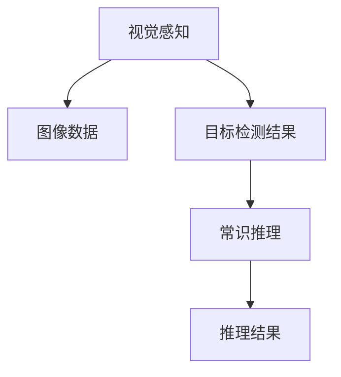
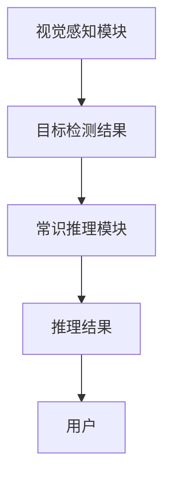
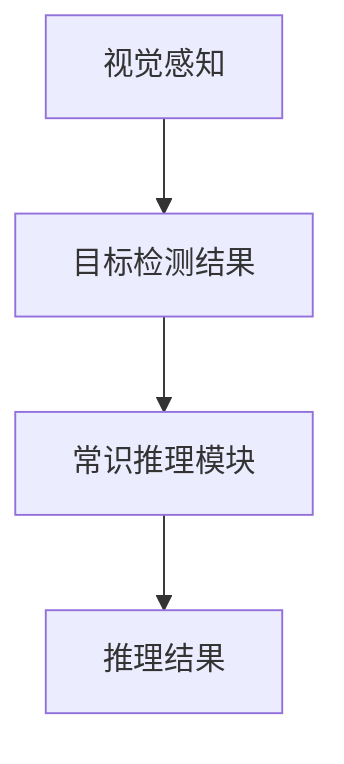

                 


# 开发具有视觉常识推理能力的AI Agent

> 关键词：视觉常识推理，AI Agent，多模态数据，知识图谱，符号逻辑推理，概率推理

> 摘要：本文详细探讨了开发具有视觉常识推理能力的AI Agent的核心技术，包括视觉感知与常识推理的结合、知识表示与推理机制、系统架构设计以及实际项目的实现。通过理论分析和实践案例，本文旨在为开发者提供从理论到实践的全面指导。

---

## 第1章: 视觉常识推理的背景与挑战

### 1.1 问题背景

#### 1.1.1 人工智能与视觉推理的结合
人工智能（AI）的进步推动了计算机视觉和自然语言处理的发展，但当前的AI系统在处理视觉信息时仍缺乏常识推理能力。例如，AI能够识别图像中的物体，但难以理解这些物体之间的关系或背景知识。

#### 1.1.2 当前AI Agent的局限性
现有的AI Agent主要依赖规则或特定任务的数据进行推理，缺乏对常识的理解和应用能力。这使得它们在处理复杂或不确定的问题时显得力不从心。

#### 1.1.3 视觉常识推理的必要性
视觉常识推理能够帮助AI Agent在处理视觉信息时，结合常识进行推理，从而提高其在复杂场景中的理解和决策能力。

### 1.2 问题描述

#### 1.2.1 视觉推理的核心问题
视觉推理的核心问题是将视觉感知与常识推理相结合，以理解和解释图像中的内容。例如，识别一张桌子上有一个杯子，并推理出杯子可能用于喝水。

#### 1.2.2 常识推理的定义与挑战
常识推理是指基于常识知识库进行推理的能力。挑战在于如何有效地表示和应用这些常识知识。

#### 1.2.3 AI Agent在视觉推理中的角色
AI Agent作为视觉推理的执行者，需要能够将视觉感知的信息与常识知识结合起来，进行推理和决策。

### 1.3 问题解决思路

#### 1.3.1 多模态数据的融合
通过融合图像数据和文本数据，AI Agent能够更全面地理解和推理。

#### 1.3.2 知识表示与推理机制
使用知识图谱等结构化知识表示方法，并结合符号逻辑推理和概率推理机制，提高推理的准确性和灵活性。

#### 1.3.3 视觉与语言的结合
通过将视觉信息与语言信息相结合，AI Agent能够更好地理解场景中的语义信息。

### 1.4 边界与外延

#### 1.4.1 视觉推理的边界
视觉推理的边界包括处理单一视觉信息，不考虑其他模态数据。

#### 1.4.2 常识推理的外延
常识推理的外延包括处理多种类型的知识，如语义知识、场景知识等。

#### 1.4.3 AI Agent的适用范围
AI Agent适用于需要视觉感知和常识推理的场景，如智能助手、自动驾驶等。

### 1.5 概念结构与核心要素

#### 1.5.1 视觉推理的组成要素
- 视觉感知模块：负责图像的处理和目标检测。
- 常识推理模块：负责基于常识知识进行推理。

#### 1.5.2 常识推理的核心要素
- 知识表示：知识图谱、常识库。
- 推理机制：符号逻辑推理、概率推理。

#### 1.5.3 AI Agent的系统架构
- 数据输入模块：接收视觉数据和用户输入。
- 处理模块：包括视觉感知和常识推理。
- 输出模块：生成推理结果并反馈给用户。

---

## 第2章: 视觉常识推理的核心概念与联系

### 2.1 核心概念原理

#### 2.1.1 视觉感知与常识推理的结合
视觉感知提供了图像中的物体信息，常识推理则帮助理解这些物体之间的关系。

#### 2.1.2 知识表示与推理机制
知识图谱为常识推理提供了结构化的知识表示，推理机制则利用这些知识进行推理。

#### 2.1.3 多模态数据的处理与融合
多模态数据的处理与融合能够提高AI Agent对复杂场景的理解能力。

### 2.2 概念属性特征对比表格

| 概念       | 属性       | 特征                                                         |
|------------|------------|--------------------------------------------------------------|
| 视觉感知   | 数据来源   | 图像/视频                                                   |
|            | 处理方式   | 目标检测/图像分割                                         |
| 常识推理   | 知识来源   | 知识图谱/常识库                                             |
|            | 推理方式   | 符号逻辑推理/概率推理                                     |

### 2.3 ER实体关系图（Mermaid）



---

## 第3章: AI Agent的系统架构与功能设计

### 3.1 系统架构设计

#### 3.1.1 系统模块划分
- 视觉感知模块：负责图像的处理和目标检测。
- 常识推理模块：负责基于常识知识进行推理。
- 推理结果输出模块：将推理结果反馈给用户。

#### 3.1.2 系统交互流程
1. 用户输入图像数据。
2. 视觉感知模块处理图像，生成目标检测结果。
3. 常识推理模块基于目标检测结果和常识知识进行推理。
4. 推理结果输出模块将推理结果反馈给用户。

### 3.2 系统功能设计

#### 3.2.1 视觉感知功能
- 图像处理：包括图像的预处理、特征提取等。
- 目标检测：识别图像中的物体。

#### 3.2.2 常识推理功能
- 知识表示：使用知识图谱表示常识知识。
- 推理机制：符号逻辑推理和概率推理。

#### 3.2.3 系统交互功能
- 用户输入：接收用户的图像输入。
- 结果输出：将推理结果反馈给用户。

### 3.3 系统架构图（Mermaid）



---

## 第4章: 算法原理讲解

### 4.1 算法概述

#### 4.1.1 多模态数据融合
多模态数据融合算法将图像数据和文本数据结合起来，提高AI Agent的理解能力。

#### 4.1.2 知识图谱构建
知识图谱构建算法将常识知识结构化，为推理提供基础。

#### 4.1.3 推理机制
符号逻辑推理和概率推理算法结合常识知识和视觉信息，进行推理。

### 4.2 算法流程图（Mermaid）



### 4.3 核心算法代码实现

```python
import numpy as np
from PIL import Image
import tensorflow as tf

# 图像处理
def process_image(image_path):
    image = Image.open(image_path)
    image = image.resize((224, 224))
    image_array = np.array(image)
    return image_array

# 目标检测
def detect_objects(image_array):
    model = tf.keras.models.load_model('object_detection_model.h5')
    predictions = model.predict(np.expand_dims(image_array, axis=0))
    return predictions

# 知识图谱查询
def query_knowledge_graph(object):
    # 简化示例，实际应用中需要更复杂的查询逻辑
    knowledge_base = {
        'cup': '用于盛放液体',
        'table': '用于放置物品'
    }
    return knowledge_base.get(object, '未知信息')

# 推理逻辑
def infer(object):
    knowledge = query_knowledge_graph(object)
    return f"{object} {knowledge}"
```

### 4.4 数学公式

#### 4.4.1 符号逻辑推理
$$ \text{如果 } P \rightarrow Q \text{ 且 } P \text{ 为真，则 } Q \text{ 为真} $$

#### 4.4.2 概率推理
$$ P(A|B) = \frac{P(B|A)P(A)}{P(B)} $$

---

## 第5章: 项目实战

### 5.1 项目背景

#### 5.1.1 项目介绍
本项目旨在开发一个能够通过视觉感知和常识推理识别图像中的物体并理解其用途的AI Agent。

#### 5.1.2 开发环境
- Python 3.8+
- TensorFlow 2.0+
- PIL
- Jupyter Notebook

### 5.2 核心代码实现

#### 5.2.1 图像处理
```python
from PIL import Image

def process_image(image_path):
    image = Image.open(image_path)
    image = image.resize((224, 224))
    return image
```

#### 5.2.2 目标检测
```python
import tensorflow as tf

model = tf.keras.models.load_model('object_detection_model.h5')
def detect_objects(image):
    predictions = model.predict(tf.keras.preprocessing.image.img_to_array(image))
    return predictions
```

#### 5.2.3 知识图谱查询
```python
def query_knowledge_graph(object):
    knowledge_base = {
        'cup': '用于盛放液体',
        'table': '用于放置物品'
    }
    return knowledge_base.get(object, '未知信息')
```

### 5.3 代码应用解读

#### 5.3.1 图像处理代码解读
图像处理代码将输入的图像调整为224x224像素，并将其转换为数组。

#### 5.3.2 目标检测代码解读
目标检测代码使用预训练的模型对图像进行预测，返回目标检测结果。

#### 5.3.3 知识图谱查询代码解读
知识图谱查询代码从知识库中获取物体的常识信息。

### 5.4 实际案例分析

#### 5.4.1 案例介绍
输入一张桌子和杯子的图像，AI Agent应识别出杯子并推理出其用途。

#### 5.4.2 案例分析
1. 图像处理模块将图像调整为224x224像素。
2. 目标检测模块识别出杯子。
3. 知识图谱查询模块查询杯子的常识信息。
4. 推理结果输出模块输出“杯子用于盛放液体”。

### 5.5 项目小结

通过本项目，我们实现了基于视觉感知和常识推理的AI Agent，能够识别图像中的物体并推理其用途。这为开发更复杂的视觉常识推理系统奠定了基础。

---

## 第6章: 最佳实践

### 6.1 小结
视觉常识推理是一个复杂的任务，需要结合视觉感知和常识推理技术。通过多模态数据的融合和知识图谱的构建，可以提高AI Agent的理解和推理能力。

### 6.2 注意事项
- 确保知识图谱的准确性和完整性。
- 处理多模态数据时要注意数据的兼容性和一致性。
- 推理过程中要结合符号逻辑推理和概率推理，提高推理的准确性和灵活性。

### 6.3 拓展阅读
- 《Knowledge Graphs and Reasoning》
- 《Visual Perception and Common Sense Reasoning》
- 《Multi-modal Data Fusion for AI Systems》

---

## 作者信息

作者：AI天才研究院/AI Genius Institute & 禅与计算机程序设计艺术 /Zen And The Art of Computer Programming

