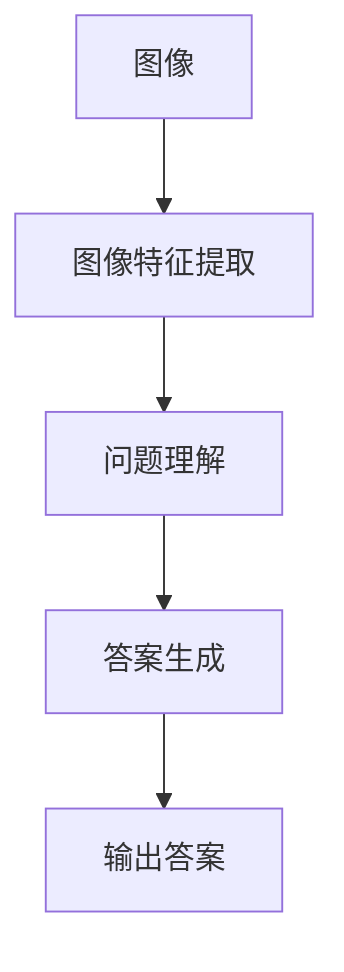
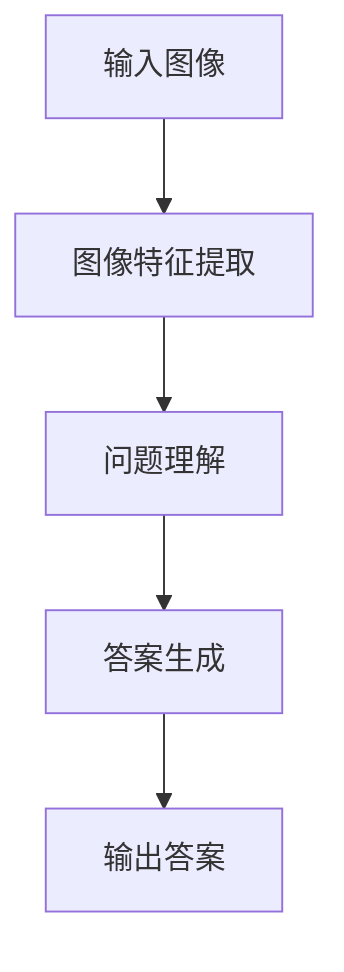
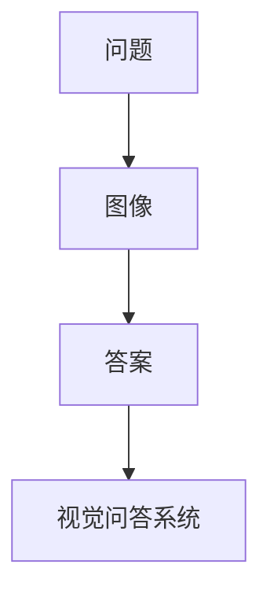
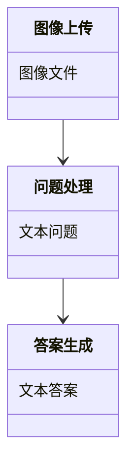
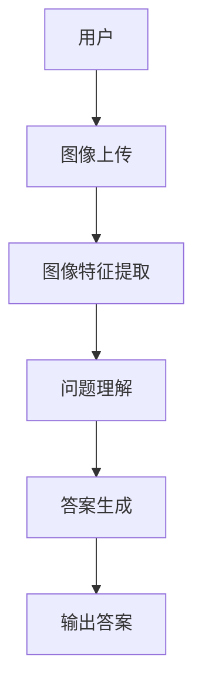
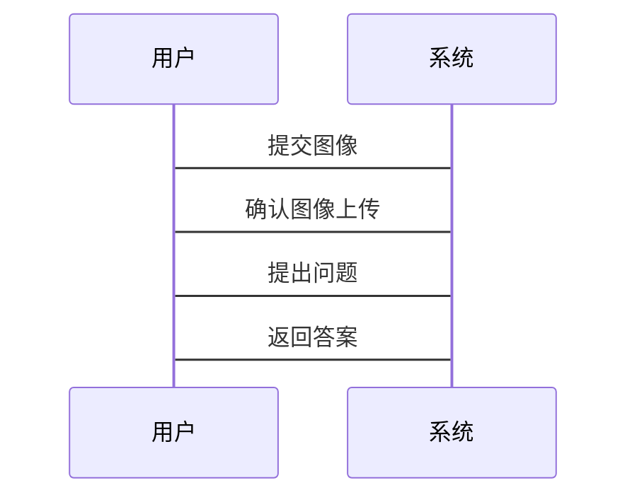
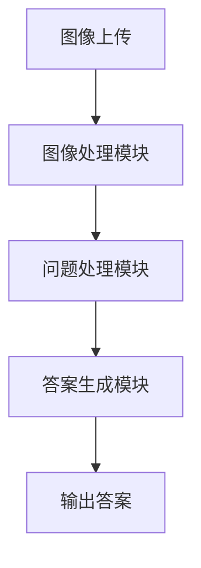

                 


# 开发具有视觉问答能力的AI Agent

> 关键词：视觉问答、AI Agent、图像理解、自然语言处理、深度学习

> 摘要：本文详细探讨了开发具有视觉问答能力的AI Agent的核心概念、算法原理、系统设计与实现。通过理论分析与实践结合，系统性地介绍了如何构建一个能够理解图像内容并回答相关问题的人工智能系统。文章从问题背景、核心概念、算法实现、系统架构、项目实战等多个维度展开，为读者提供了一套完整的开发指南。

---

# 第一部分: 背景介绍与核心概念

## 第1章: 视觉问答AI Agent的背景与概念

### 1.1 问题背景

#### 1.1.1 视觉问答的定义与特点
视觉问答（Visual Question Answering, VQA）是一种结合了计算机视觉和自然语言处理的AI技术，旨在让机器能够通过图像理解和回答相关问题。其特点包括：
- **多模态输入**：结合图像和文本两种信息源。
- **端到端学习**：从输入到输出的全自动化处理。
- **应用场景广泛**：适用于图像描述、医学诊断、自动驾驶等领域。

#### 1.1.2 视觉问答的核心问题与挑战
- **图像理解**：如何从图像中提取有效的语义信息？
- **问题理解**：如何准确解析用户的问题意图？
- **答案生成**：如何将图像信息与问题关联，生成准确且自然的回答？

#### 1.1.3 视觉问答的应用场景与价值
- **图像描述**：为盲人提供图像内容的描述。
- **医疗诊断**：辅助医生通过医学图像进行诊断。
- **智能助手**：为用户提供基于图像的问答服务。

### 1.2 问题描述

#### 1.2.1 视觉问答的核心问题分析
视觉问答的核心问题可以简化为：给定一张图像和一个问题，生成一个准确且自然的语言回答。

#### 1.2.2 视觉问答系统的输入与输出
- **输入**：图像 + 文本问题
- **输出**：文本答案

#### 1.2.3 视觉问答的边界与外延
- **边界**：仅限于图像和文本的交互，不涉及其他模态（如音频、视频）。
- **外延**：可扩展至多模态问答、实时交互等更复杂场景。

### 1.3 核心概念与联系

#### 1.3.1 视觉问答的关键概念
- **图像理解**：通过卷积神经网络（CNN）提取图像特征。
- **文本理解**：通过循环神经网络（RNN）或Transformer理解问题。
- **关联推理**：将图像特征与问题语义进行关联，生成答案。

#### 1.3.2 视觉问答的系统架构


#### 1.3.3 视觉问答的核心要素组成
- **图像处理模块**：负责提取图像特征。
- **文本处理模块**：负责理解用户问题。
- **关联推理模块**：负责生成最终答案。

---

# 第二部分: 视觉问答的核心概念与联系

## 第2章: 视觉问答的核心概念与联系

### 2.1 核心概念原理

#### 2.1.1 图像理解与文本生成的结合
- **图像理解**：通过CNN提取图像的语义特征。
- **文本生成**：通过Transformer生成自然语言回答。

#### 2.1.2 视觉问答的模型结构与流程


#### 2.1.3 视觉问答的训练与优化
- **联合训练**：同时优化图像特征提取和文本生成。
- **多任务学习**：结合图像分类、问答生成等任务。

### 2.2 概念属性特征对比

#### 2.2.1 基于规则的视觉问答模型
- **特点**：依赖人工制定的规则和模板。
- **优缺点**：
  - 优点：易于解释，开发成本低。
  - 缺点：灵活性差，难以处理复杂场景。

#### 2.2.2 基于学习的视觉问答模型
- **特点**：通过端到端的深度学习模型进行训练。
- **优缺点**：
  - 优点：适应性强，性能高。
  - 缺点：训练数据需求大，解释性差。

#### 2.2.3 基于检索的视觉问答模型
- **特点**：基于预定义的知识库进行检索和匹配。
- **优缺点**：
  - 优点：答案准确，依赖可靠的知识库。
  - 缺点：难以处理未见问题。

### 2.3 ER实体关系图



---

# 第三部分: 视觉问答的算法原理

## 第3章: 视觉问答的算法原理

### 3.1 算法原理讲解

#### 3.1.1 图像特征提取
- **方法**：使用CNN（如ResNet、VGG）提取图像的高层特征。
- **代码示例**：
```python
import tensorflow as tf
from tensorflow.keras import layers

def build_image_model():
    model = tf.keras.Sequential([
        layers.Conv2D(32, (3,3), activation='relu', padding='same'),
        layers.MaxPooling2D((2,2)),
        layers.Conv2D(64, (3,3), activation='relu', padding='same'),
        layers.MaxPooling2D((2,2)),
        layers.Flatten()
    ])
    return model
```

#### 3.1.2 文本理解与生成
- **方法**：使用Transformer或LSTM进行文本理解和生成。
- **代码示例**：
```python
def build_text_model(max_length=128):
    model = tf.keras.Sequential([
        layers.Embedding(10000, 128),
        layers.LSTM(64, return_sequences=False),
        layers.Dense(64, activation='relu'),
        layers.Dense(1, activation='sigmoid')
    ])
    return model
```

#### 3.1.3 关联推理
- **方法**：将图像特征与文本问题进行融合，生成答案。
- **数学模型**：
$$
p(a|q, i) = \text{softmax}(W_a [f(i) \cdot g(q)] + b_a)
$$
其中：
- \( f(i) \) 表示图像特征提取函数。
- \( g(q) \) 表示文本理解函数。
- \( W_a \) 和 \( b_a \) 是参数。

### 3.2 算法实现代码

#### 3.2.1 图像特征提取
```python
import tensorflow as tf
from tensorflow.keras import layers

def build_image_model(input_shape=(224, 224, 3)):
    base_model = tf.keras.applications.VGG16(weights='imagenet', include_top=False, input_shape=input_shape)
    model = tf.keras.Sequential([
        base_model,
        layers.Flatten(),
        layers.Dense(512, activation='relu'),
        layers.Dropout(0.5),
        layers.Dense(256, activation='relu')
    ])
    return model
```

#### 3.2.2 文本处理模块
```python
def build_text_model(max_length=128, vocab_size=10000):
    model = tf.keras.Sequential([
        layers.Embedding(vocab_size, 128),
        layers.LSTM(64, return_sequences=False),
        layers.Dense(64, activation='relu'),
        layers.Dropout(0.5),
        layers.Dense(1, activation='sigmoid')
    ])
    return model
```

#### 3.2.3 答案生成模块
```python
def build_answer_model(image_features_dim=256, text_features_dim=64):
    model = tf.keras.Sequential([
        layers.Input(shape=(image_features_dim + text_features_dim,)),
        layers.Dense(128, activation='relu'),
        layers.Dropout(0.5),
        layers.Dense(1, activation='sigmoid')
    ])
    return model
```

---

# 第四部分: 系统分析与架构设计

## 第4章: 视觉问答系统的分析与架构设计

### 4.1 系统分析

#### 4.1.1 问题场景介绍
- **场景**：用户上传一张图像并提出问题，系统返回相关答案。
- **目标**：构建一个高效、准确的视觉问答系统。

### 4.2 项目介绍

#### 4.2.1 系统功能设计
- **领域模型**：


- **系统架构**：


- **系统接口设计**：
  - 输入接口：图像上传接口、文本问题输入接口。
  - 输出接口：文本答案输出接口。

- **系统交互**：


### 4.3 系统架构设计

#### 4.3.1 系统架构图


---

# 第五部分: 项目实战

## 第5章: 视觉问答系统的实现与优化

### 5.1 项目实战

#### 5.1.1 环境安装
- **Python**：3.8+
- **TensorFlow**：2.0+
- **Keras**：2.3+
- **其他依赖**：numpy、pandas、scikit-learn

#### 5.1.2 系统核心实现

##### 5.1.2.1 图像处理模块
```python
import tensorflow as tf
from tensorflow.keras import layers

def build_image_model(input_shape=(224, 224, 3)):
    base_model = tf.keras.applications.VGG16(weights='imagenet', include_top=False, input_shape=input_shape)
    model = tf.keras.Sequential([
        base_model,
        layers.Flatten(),
        layers.Dense(512, activation='relu'),
        layers.Dropout(0.5),
        layers.Dense(256, activation='relu')
    ])
    return model
```

##### 5.1.2.2 文本处理模块
```python
def build_text_model(max_length=128, vocab_size=10000):
    model = tf.keras.Sequential([
        layers.Embedding(vocab_size, 128),
        layers.LSTM(64, return_sequences=False),
        layers.Dense(64, activation='relu'),
        layers.Dropout(0.5),
        layers.Dense(1, activation='sigmoid')
    ])
    return model
```

##### 5.1.2.3 答案生成模块
```python
def build_answer_model(image_features_dim=256, text_features_dim=64):
    model = tf.keras.Sequential([
        layers.Input(shape=(image_features_dim + text_features_dim,)),
        layers.Dense(128, activation='relu'),
        layers.Dropout(0.5),
        layers.Dense(1, activation='sigmoid')
    ])
    return model
```

#### 5.1.3 代码应用解读与分析
- **图像处理模块**：提取图像的高层特征。
- **文本处理模块**：理解用户的问题并生成相应的语义表示。
- **答案生成模块**：将图像特征与文本语义进行关联，生成最终答案。

---

# 第六部分: 最佳实践与总结

## 第6章: 最佳实践与总结

### 6.1 最佳实践 tips
- **数据预处理**：确保数据的多样性和平衡性。
- **模型优化**：使用早停、学习率衰减等技术优化模型。
- **结果评估**：采用准确率、F1分数等指标评估模型性能。

### 6.2 小结
- 本文系统性地介绍了视觉问答AI Agent的开发过程，从核心概念到算法实现，再到系统设计与实战，为读者提供了一套完整的开发指南。

### 6.3 注意事项
- 数据质量和多样性对模型性能至关重要。
- 模型的可解释性需要在开发过程中重点关注。
- 实际应用中需要考虑计算资源和实时性要求。

### 6.4 拓展阅读
- 阅读相关论文，如“Visual Question Answering with Attention”。
- 研究更先进的视觉问答模型，如基于Transformer的架构。

---

# 结语

开发具有视觉问答能力的AI Agent是一项具有挑战性的任务，但通过结合图像理解和自然语言处理技术，我们可以构建出能够与人类自然交互的智能系统。本文从理论到实践，详细探讨了视觉问答的核心概念、算法实现和系统设计，为读者提供了一个全面的开发指南。

作者：AI天才研究院/AI Genius Institute & 禅与计算机程序设计艺术 /Zen And The Art of Computer Programming

