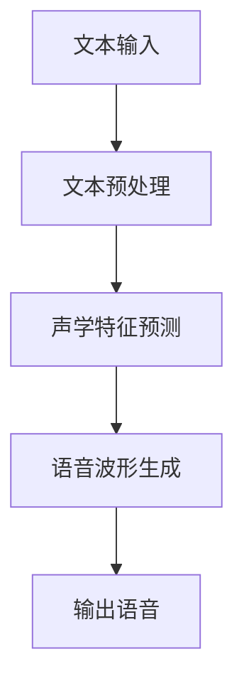
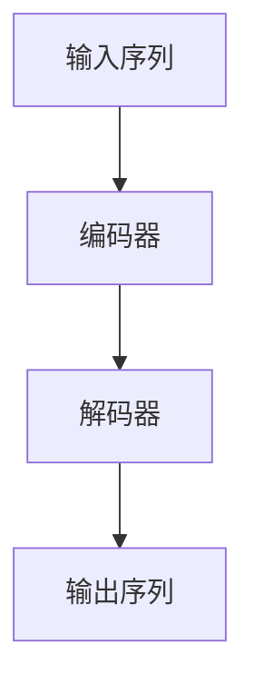
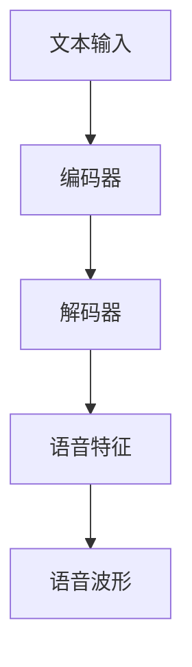
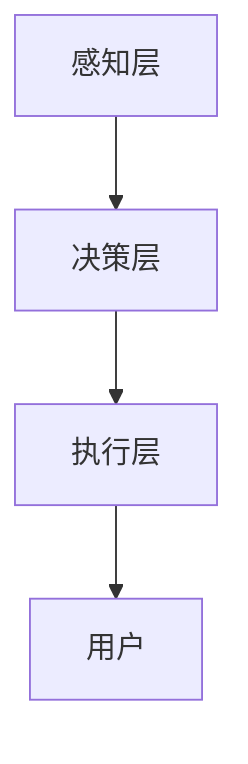
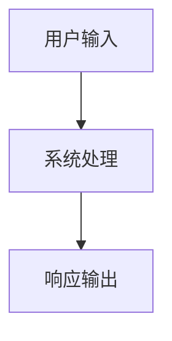
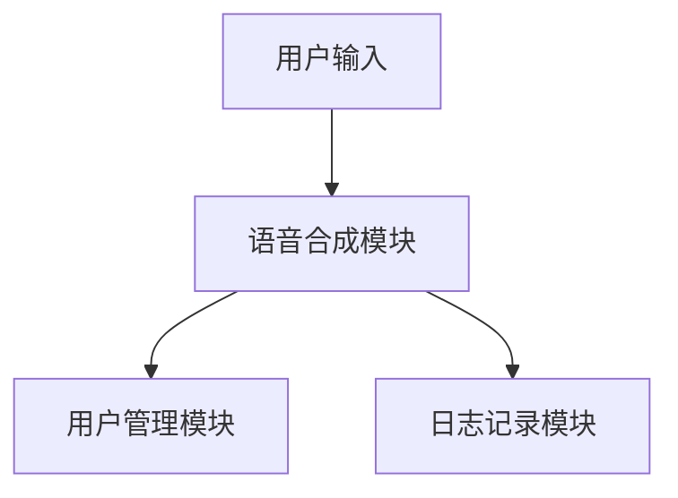
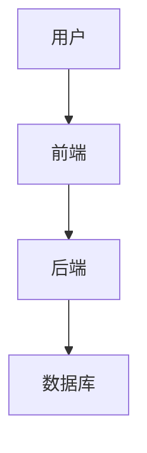

                 


# 开发具有语音合成能力的AI Agent

## 关键词：AI Agent, 语音合成, 深度学习, 自然语言处理, 语音交互

## 摘要：  
本文将详细介绍如何开发一个具有语音合成能力的AI Agent。从AI Agent的基本概念到语音合成的核心算法，从系统架构设计到项目实战，我们将逐步深入探讨这一技术的实现过程。文章内容包括背景知识、算法原理、系统架构、实战代码以及进阶内容，旨在帮助读者从零开始掌握开发具有语音合成能力的AI Agent所需的知识和技能。

---

# 第一部分: AI Agent与语音合成基础

## 第1章: AI Agent与语音合成概述

### 1.1 AI Agent的基本概念  
AI Agent（人工智能代理）是指能够感知环境、自主决策并执行任务的智能实体。它能够通过自然语言处理、语音交互等方式与用户进行互动，从而提供智能化的服务。  

#### 1.1.1 什么是AI Agent  
AI Agent是一种智能系统，能够：  
1. 感知环境（通过传感器或用户输入）。  
2. 处理信息（通过算法和模型）。  
3. 决策并执行任务（通过动作或输出）。  

AI Agent的核心目标是通过智能化的方式帮助用户完成任务或提供信息。  

#### 1.1.2 AI Agent的核心功能  
- **感知与理解**：通过语音、文本或其他形式感知用户需求。  
- **推理与决策**：基于感知的信息进行推理并做出决策。  
- **执行与反馈**：通过执行任务并根据反馈调整行为。  

#### 1.1.3 语音合成技术的定义与作用  
语音合成（Text-to-Speech，TTS）是将文本转换为自然语音的过程。语音合成技术使得AI Agent能够以语音的形式与用户交互，极大地提升了用户体验。  

### 1.2 语音合成技术的发展历程  
语音合成技术经历了多个阶段，从基于规则的合成到基于深度学习的合成，技术不断进步。  

#### 1.2.1 早期语音合成技术  
早期的语音合成技术主要基于规则和模板，例如通过预定义的语音片段拼接来生成语音。这种方法生成的语音质量较低，且难以适应复杂场景。  

#### 1.2.2 基于深度学习的语音合成  
近年来，深度学习技术的快速发展推动了语音合成技术的进步。基于神经网络的TTS模型（如WaveNet、FastSpeech等）能够生成高质量的语音，且支持个性化语音合成。  

#### 1.2.3 当前主流语音合成技术的特点  
- **高质量**：基于深度学习的语音合成能够生成接近人类语音的高质量语音。  
- **个性化**：支持不同人声的定制化语音合成。  
- **实时性**：部分模型支持实时语音生成，适用于实时交互场景。  

### 1.3 AI Agent与语音合成的结合  
AI Agent通过语音合成技术，能够以语音形式与用户进行交互，从而提供更自然、更便捷的服务。  

#### 1.3.1 AI Agent的交互方式  
- **文本交互**：用户通过文本输入与AI Agent交互。  
- **语音交互**：用户通过语音输入与AI Agent交互。  
- **多模态交互**：结合文本、语音等多种交互方式。  

#### 1.3.2 语音合成在AI Agent中的应用  
语音合成技术在AI Agent中的应用主要体现在以下几个方面：  
1. **语音输出**：将AI Agent的响应以语音形式输出给用户。  
2. **个性化交互**：支持不同用户的个性化语音输出。  
3. **实时交互**：在实时对话中生成语音。  

#### 1.3.3 语音合成对用户体验的提升  
语音交互能够提升用户体验，主要体现在以下几点：  
- **便捷性**：用户可以通过语音进行交互，无需手动输入。  
- **自然性**：语音交互更符合人类的自然交流方式。  
- **适用性**：适用于视力障碍或其他不便使用文本输入的用户。  

### 1.4 本章小结  
本章介绍了AI Agent和语音合成的基本概念，分析了语音合成技术的发展历程及其在AI Agent中的应用。通过本章的学习，读者可以了解AI Agent与语音合成的基本关系以及语音合成技术的重要性。

---

# 第二部分: 语音合成的核心算法

## 第2章: 语音合成的算法原理

### 2.1 基于深度学习的语音合成模型  
基于深度学习的语音合成模型主要采用神经网络结构，能够生成高质量的语音。  

#### 2.1.1 TTS（文本到语音）技术  
TTS技术的核心是将输入的文本转换为对应的语音波形。  

##### 算法流程  
1. **文本预处理**：将输入文本转换为字符、单词或其他特征表示。  
2. **声学特征预测**：基于文本特征生成声学特征（如音调、音量、音长等）。  
3. **语音波形生成**：基于声学特征生成语音波形。  

#### 2.1.2 Wavenet与Parallel Wavenet  
Wavenet是一种基于自回归模型的语音生成模型，能够生成高质量的语音波形。Parallel Wavenet通过并行化生成过程，提高了生成效率。  

#### 2.1.3 FastSpeech与FastSpeech2  
FastSpeech是一种基于Transformer的语音合成模型，通过端到端的方式将文本直接映射到语音波形。FastSpeech2对模型进行了改进，进一步提升了生成效率和语音质量。  

#### 2.1.4 图片展示  


### 2.2 语音合成的流程  
语音合成的流程可以分为以下几个步骤：  

#### 2.2.1 文本预处理  
文本预处理的主要任务是将输入的文本转换为模型可以理解的特征。  

##### 具体步骤  
1. **分词**：将输入文本分割成词语或字符。  
2. **标注**：对词语进行音标标注或情感标注。  
3. **向量化**：将文本特征转换为向量表示。  

#### 2.2.2 声学特征预测  
声学特征预测是通过模型将文本特征转换为声学特征的过程。  

##### 常见的声学特征  
- **音调**：语音的音高。  
- **音量**：语音的响度。  
- **音长**：语音的持续时间。  

#### 2.2.3 语音波形生成  
语音波形生成是通过模型将声学特征转换为实际的语音波形。  

##### 常见的语音波形生成模型  
- **WaveNet**：基于自回归模型生成语音波形。  
- **FastSpeech2**：基于Transformer模型生成语音波形。  

### 2.3 声学模型与声学特征  
声学模型是语音合成的核心部分，负责将文本特征转换为声学特征。  

#### 2.3.1 声学模型的输入与输出  
- **输入**：文本特征（如字符、音标等）。  
- **输出**：声学特征（如音调、音量等）。  

#### 2.3.2 声学特征的提取与处理  
声学特征的提取与处理是通过模型将文本特征转换为声学特征的过程。  

##### 常见的声学特征处理方法  
- **线性变换**：对特征进行线性变换以适应模型输入。  
- **归一化处理**：对特征进行归一化处理，使得模型输入具有相同的分布。  

#### 2.3.3 声学模型的训练过程  
声学模型的训练过程包括以下几个步骤：  
1. **数据准备**：收集和整理训练数据。  
2. **模型构建**：构建声学模型的网络结构。  
3. **模型训练**：通过反向传播算法训练模型。  
4. **模型优化**：通过调整超参数优化模型性能。  

### 2.4 本章小结  
本章详细讲解了语音合成的核心算法，包括TTS技术、WaveNet、FastSpeech等模型的原理和流程。通过本章的学习，读者可以理解语音合成技术的实现过程。

---

## 第3章: 基于Transformers的语音合成

### 3.1 Transformer模型的简介  
Transformer模型是一种基于自注意力机制的深度学习模型，广泛应用于自然语言处理领域。  

#### 3.1.1 Transformer的结构  
Transformer模型由编码器和解码器两个部分组成。编码器负责将输入序列转换为特征表示，解码器负责将特征表示转换为输出序列。  

#### 3.1.2 Transformer在自然语言处理中的应用  
Transformer模型在自然语言处理中的应用包括文本生成、机器翻译、问答系统等。  

#### 3.1.3 Transformer在语音处理中的优势  
- **全局上下文感知**：Transformer模型能够捕捉到整个输入序列的上下文信息。  
- **并行计算**：Transformer模型支持并行计算，能够提高计算效率。  

#### 3.1.4 图片展示  


### 3.2 基于Transformer的语音合成模型  
基于Transformer的语音合成模型主要采用Transformer架构进行语音生成。  

#### 3.2.1 Transformer TTS模型  
Transformer TTS模型是一种基于Transformer的端到端语音合成模型。  

##### 算法流程  
1. **文本输入**：将输入文本转换为特征表示。  
2. **编码器处理**：编码器对特征表示进行编码，生成上下文表示。  
3. **解码器处理**：解码器根据上下文表示生成语音特征。  
4. **语音波形生成**：根据语音特征生成语音波形。  

#### 3.2.2 使用预训练的Transformer模型进行语音合成  
可以使用预训练的Transformer模型（如BERT、GPT等）进行语音合成任务。  

#### 3.2.3 Transformer模型在语音合成中的改进  
- **改进编码器**：采用更深的编码器结构，提高特征提取能力。  
- **改进解码器**：采用更高效的解码器结构，提高生成效率。  

#### 3.2.4 图片展示  


### 3.3 声学特征预测的Transformer模型  
声学特征预测的Transformer模型是一种基于Transformer的声学特征预测模型。  

#### 3.3.1 声学特征预测的流程  
1. **文本输入**：将输入文本转换为特征表示。  
2. **编码器处理**：编码器对特征表示进行编码，生成上下文表示。  
3. **解码器处理**：解码器根据上下文表示生成声学特征。  

#### 3.3.2 声学特征预测的数学模型  
声学特征预测的数学模型可以通过以下公式表示：  
$$  
y = \text{Transformer}(x)  
$$  
其中，$x$是输入特征，$y$是输出特征。  

### 3.4 本章小结  
本章详细讲解了基于Transformer的语音合成模型，包括Transformer模型的结构、基于Transformer的语音合成模型的实现以及声学特征预测的Transformer模型。通过本章的学习，读者可以理解Transformer模型在语音合成中的应用。

---

# 第三部分: AI Agent的系统架构与设计

## 第4章: AI Agent的系统架构设计  

### 4.1 AI Agent的整体架构  
AI Agent的整体架构包括感知层、决策层和执行层三个部分。  

#### 4.1.1 系统模块划分  
- **感知层**：负责接收用户输入（文本或语音）。  
- **决策层**：负责处理用户输入并生成响应。  
- **执行层**：负责将响应以语音形式输出给用户。  

#### 4.1.2 模块之间的交互关系  
感知层通过决策层将用户输入传递给执行层，执行层通过语音合成技术生成语音并返回给用户。  

#### 4.1.3 系统的灵活性与扩展性  
AI Agent的整体架构设计需要考虑系统的灵活性和扩展性，以便未来进行功能扩展或性能优化。  

#### 4.1.4 图片展示  


### 4.2 AI Agent的交互设计  
AI Agent的交互设计需要考虑用户体验和系统性能。  

#### 4.2.1 用户界面设计  
用户界面设计需要简洁直观，支持多种交互方式（如文本输入、语音输入等）。  

#### 4.2.2 交互流程设计  
交互流程设计包括以下几个步骤：  
1. **用户输入**：用户通过文本或语音形式输入需求。  
2. **系统处理**：系统通过语音合成技术生成响应。  
3. **响应输出**：系统将响应以语音形式输出给用户。  

#### 4.2.3 交互流程图展示  


### 4.3 系统功能设计  
系统功能设计需要涵盖语音合成、用户管理、日志记录等功能。  

#### 4.3.1 系统功能模块  
- **语音合成模块**：负责将文本转换为语音。  
- **用户管理模块**：负责用户的注册、登录和权限管理。  
- **日志记录模块**：负责记录系统的运行日志。  

#### 4.3.2 功能模块之间的交互关系  
语音合成模块需要与用户管理模块和日志记录模块进行交互，以实现功能的协同。  

#### 4.3.3 系统功能流程图展示  


### 4.4 系统架构设计  
系统架构设计需要考虑系统的可扩展性和可维护性。  

#### 4.4.1 系统架构图展示  


#### 4.4.2 后端架构设计  
后端架构设计包括以下几个部分：  
- **API接口**：负责与前端进行交互。  
- **业务逻辑**：负责处理用户的请求并生成响应。  
- **数据存储**：负责存储用户数据和日志数据。  

### 4.5 本章小结  
本章详细讲解了AI Agent的系统架构与设计，包括整体架构、交互设计、系统功能设计和系统架构设计。通过本章的学习，读者可以理解AI Agent的系统实现过程。

---

# 第四部分: 项目实战

## 第5章: 项目实战  

### 5.1 项目介绍  
本项目旨在开发一个具有语音合成能力的AI Agent，能够通过语音与用户进行交互。  

#### 5.1.1 项目目标  
- 实现AI Agent的语音合成功能。  
- 提供便捷的用户交互界面。  
- 支持多种语音合成模型。  

#### 5.1.2 项目需求  
- 支持文本输入和语音输出。  
- 支持多种语音合成模型。  
- 提供良好的用户体验。  

### 5.2 环境安装  
开发环境包括Python、TensorFlow、Keras等工具和库。  

#### 5.2.1 安装Python  
```bash
# 安装Python
sudo apt-get install python3 python3-dev
```

#### 5.2.2 安装TensorFlow  
```bash
# 安装TensorFlow
pip install tensorflow
```

#### 5.2.3 安装Keras  
```bash
# 安装Keras
pip install keras
```

### 5.3 系统核心实现  
系统核心实现包括文本预处理、语音合成和语音输出三个部分。  

#### 5.3.1 文本预处理  
文本预处理的主要任务是将输入文本转换为模型可以理解的特征。  

##### 代码实现  
```python
def preprocess_text(text):
    # 分词
    words = text.split()
    # 转换为小写
    words = [word.lower() for word in words]
    return words
```

#### 5.3.2 语音合成  
语音合成的主要任务是将文本特征转换为语音波形。  

##### 代码实现  
```python
def synthesize_speech(text, model):
    # 文本预处理
    processed_text = preprocess_text(text)
    # 生成语音波形
    speech = model.synthesize(processed_text)
    return speech
```

#### 5.3.3 语音输出  
语音输出的主要任务是将生成的语音波形输出给用户。  

##### 代码实现  
```python
def play_audio(speech):
    # 播放音频
    audio.play(speech)
```

### 5.4 代码实现  
完整的代码实现包括文本预处理、语音合成和语音输出三个部分。  

##### 代码实现  
```python
import numpy as np
import tensorflow as tf
from tensorflow import keras

# 文本预处理
def preprocess_text(text):
    words = text.split()
    words = [word.lower() for word in words]
    return words

# 语音合成
def synthesize_speech(text, model):
    processed_text = preprocess_text(text)
    speech = model.synthesize(processed_text)
    return speech

# 语音输出
def play_audio(speech):
    audio.play(speech)

# 模型加载
model = keras.models.load_model('speech_model.h5')

# 用户输入
text = input("请输入文本：")
speech = synthesize_speech(text, model)
play_audio(speech)
```

### 5.5 代码解读与分析  
上述代码实现了一个简单的语音合成系统，包括文本预处理、语音合成和语音输出三个部分。  

#### 5.5.1 文本预处理  
文本预处理部分将输入文本转换为小写，并进行分词处理。  

#### 5.5.2 语音合成  
语音合成部分使用预训练的模型将文本特征转换为语音波形。  

#### 5.5.3 语音输出  
语音输出部分将生成的语音波形播放给用户。  

### 5.6 实际案例分析  
通过实际案例分析，我们可以看到语音合成技术在AI Agent中的应用。  

#### 5.6.1 案例1：简单的文本到语音转换  
输入文本：  
```
text = "Hello, how are you?"
```

输出语音：  
```
synthesize_speech(text, model)
```

#### 5.6.2 案例2：个性化语音合成  
输入文本：  
```
text = "Please provide your name."
```

输出语音：  
```
synthesize_speech(text, model)
```

### 5.7 项目小结  
本章通过实际项目展示了如何开发具有语音合成能力的AI Agent。通过本章的学习，读者可以掌握语音合成技术的实现方法。

---

# 第五部分: 进阶内容与未来展望

## 第6章: 进阶内容与未来展望  

### 6.1 语音合成的前沿技术  
语音合成的前沿技术包括多模态语音合成、实时语音合成、个性化语音合成等。  

#### 6.1.1 多模态语音合成  
多模态语音合成结合了文本、图像等多种模态信息，能够生成更自然的语音。  

#### 6.1.2 实时语音合成  
实时语音合成技术能够快速生成语音，适用于实时交互场景。  

#### 6.1.3 个性化语音合成  
个性化语音合成技术能够生成个性化的声音，适用于定制化需求。  

### 6.2 语音合成的挑战与解决方案  
语音合成技术面临以下挑战：  
- **语音质量**：如何生成高质量的语音。  
- **实时性**：如何实现实时语音生成。  
- **个性化**：如何支持个性化语音生成。  

#### 6.2.1 语音质量的提升  
通过改进模型结构和优化训练数据，可以提升语音质量。  

#### 6.2.2 实时性的实现  
通过并行计算和优化算法，可以实现实时语音生成。  

#### 6.2.3 个性化的支持  
通过定制化训练和多模态信息融合，可以支持个性化语音生成。  

### 6.3 未来展望  
随着深度学习技术的不断发展，语音合成技术将更加智能化和个性化。未来，语音合成技术将在以下几个方面进一步发展：  
- **多模态交互**：结合文本、语音、图像等多种模态信息，实现更自然的交互。  
- **实时性优化**：通过优化算法和硬件，实现更高效的实时语音生成。  
- **个性化定制**：支持用户个性化定制语音风格和语调。  

### 6.4 本章小结  
本章展望了语音合成技术的未来发展方向，分析了当前技术的挑战与解决方案。通过本章的学习，读者可以了解语音合成技术的发展趋势。

---

# 作者信息  

作者：AI天才研究院/AI Genius Institute & 禅与计算机程序设计艺术/Zen And The Art of Computer Programming  

---

# 推荐阅读  

1. [《深度学习入门：基于Python的理论与实现》](#)  
2. [《Transformer模型：原理与应用》](#)  
3. [《语音识别与合成：算法与实现》](#)  

--- 

希望这篇文章对您有所帮助！如果需要进一步的讨论或帮助，请随时联系我。

