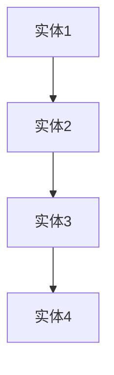
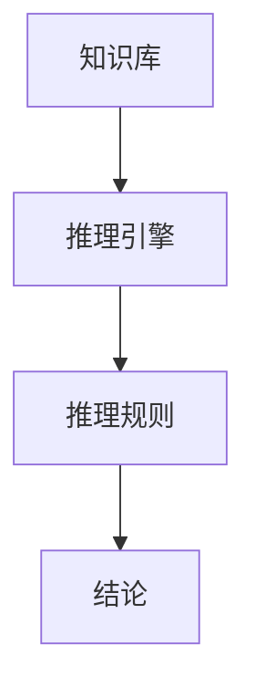
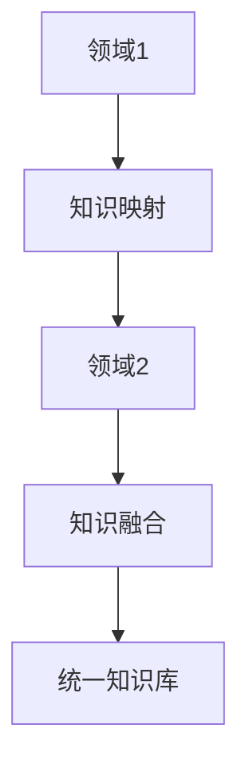

                 

<think>
好，我需要根据用户的请求和我提供的目录大纲，逐步完成关于《开发具有跨域知识推理能力的AI Agent》的技术博客文章。我先从背景介绍开始，逐步展开每个部分，确保内容完整且符合逻辑。如果有任何不确定的地方，我会停下来思考或查找资料。现在，我开始撰写文章。

---

# 开发具有跨域知识推理能力的AI Agent

> 关键词：AI Agent，跨域知识推理，知识表示，推理算法，系统架构

> 摘要：本文详细探讨了开发具有跨域知识推理能力的AI Agent的核心概念、算法原理、系统架构和实现方法。通过背景分析、概念对比、算法选择和系统设计，为读者提供了从理论到实践的全面指导，帮助开发出能够整合多个领域知识并进行高效推理的AI Agent。

---

## 第1章 背景介绍

### 1.1 问题背景介绍

#### 1.1.1 AI Agent的核心概念
AI Agent（人工智能代理）是一种能够感知环境、自主决策并执行任务的智能系统。它通过传感器获取信息，利用推理能力解决问题，并通过执行器与环境交互。AI Agent的应用范围广泛，包括自动驾驶、智能助手、机器人控制等领域。

#### 1.1.2 跨域知識推理的重要性
传统的AI Agent往往局限于单一领域，难以应对跨领域的问题。例如，一个医疗AI Agent可能需要结合医学知识和患者数据，但还可能需要考虑法律、伦理或患者偏好等其他领域的信息。跨域知识推理能力使AI Agent能够整合不同领域的知识，提升其解决问题的能力和灵活性。

#### 1.1.3 現有AI Agent的局限性
当前大多数AI Agent在处理跨域问题时存在以下问题：
- **知识孤岛**：各个领域知识独立，缺乏有效的整合机制。
- **推理限制**：推理算法通常针对特定领域设计，难以跨领域应用。
- **决策鲁莽**：缺乏跨领域知识可能导致决策不全面或错误。

### 1.2 问题描述

#### 1.2.1 跨域知識整合的挑戰
跨域知识整合需要解决以下问题：
- **知识表示多样性**：不同领域可能使用不同的知识表示方式，例如医学领域的知识图谱与法律领域的术语不同。
- **语义一致性**：跨领域知识的语义可能存在冲突，需要建立统一的语义框架。

#### 1.2.2 跨域推理的技術瓶頸
跨域推理面临的主要技术挑战包括：
- **推理算法的泛化能力**：现有推理算法多针对特定领域优化，难以直接应用于其他领域。
- **跨领域知识图谱构建**：需要构建能够覆盖多个领域的知识图谱，并确保各领域之间的语义一致性和关联性。

#### 1.2.3 跨域知識推理的應用場景
跨域知识推理的应用场景包括：
- **医疗领域**：结合医学知识和患者数据，提供个性化的诊断建议。
- **金融领域**：整合市场分析、财务数据和客户偏好，提供投资建议。
- **法律领域**：结合法律条文和案件背景，提供法律咨询。

### 1.3 问题解决方案

#### 1.3.1 跨域知識推理的技術路線
跨域知识推理的技术路线可以分为以下几个步骤：
1. **知识表示与整合**：将不同领域的知识转换为统一的表示形式，并建立关联。
2. **跨域推理算法设计**：开发能够处理跨领域知识的推理算法，支持多种推理模式。
3. **知识图谱构建**：构建覆盖多个领域的知识图谱，确保语义一致性和关联性。

#### 1.3.2 跨域知識整合的策略
跨域知识整合的策略包括：
- **领域知识映射**：将不同领域的知识进行映射，建立统一的语义框架。
- **知识融合**：通过知识融合技术，将多个领域的知识整合到一个统一的知识库中。

#### 1.3.3 跨域推理算法的選擇
选择适合的推理算法是跨域知识推理的关键。常见的推理算法包括：
- **符号逻辑推理**：适用于规则明确的领域。
- **概率推理**：适用于不确定性的推理场景。
- **图结构推理**：适用于复杂关联的领域。

### 1.4 背景與邊界的界定

#### 1.4.1 跨域知識的邊界定義
跨域知识的边界定义为：
- **领域范围**：明确每个领域的知识范围和边界。
- **知识类型**：定义每个领域中的知识类型，例如事实、规则、案例等。

#### 1.4.2 跨域推理的應用邊界
跨域推理的应用边界包括：
- **适用场景**：明确跨域推理适用于哪些场景，例如复杂决策、多领域问题等。
- **推理深度**：根据问题需求，确定推理的深度和广度。

#### 1.4.3 跨域知識推理的技術範疎
跨域知识推理的技术范围包括：
- **知识表示**：包括符号表示、语义网络等。
- **推理算法**：包括逻辑推理、概率推理等。
- **知识图谱**：包括构建、查询和更新知识图谱。

### 1.5 核心概念結構

#### 1.5.1 跨域知識推理的核心要素
跨域知识推理的核心要素包括：
- **知识表示**：将知识以某种形式表示，便于计算机理解和推理。
- **推理算法**：用于根据知识库中的信息进行推理。
- **知识图谱**：存储和组织跨领域知识的结构化数据。

#### 1.5.2 跨域知識的表達方式
跨域知识的表达方式包括：
- **符号表示**：使用符号和规则表示知识。
- **语义网络**：通过节点和边表示知识及其关联。
- **知识图谱**：通过实体和关系构建知识网络。

#### 1.5.3 跨域推理的邏輯結構
跨域推理的逻辑结构包括：
- **前提**：推理的基础知识或事实。
- **推理规则**：用于连接前提和结论的规则。
- **结论**：推理得到的结果。

---

## 第2章 跨域知識推理的核心概念與聯絡

### 2.1 跨域知識推理的原理

#### 2.1.1 知識表示的多樣性
知识表示的多样性体现在以下几个方面：
- **符号表示**：使用符号和规则表示知识。
- **语义网络**：通过节点和边表示知识及其关联。
- **知识图谱**：通过实体和关系构建知识网络。

#### 2.1.2 跨域知識的整合方式
跨域知识的整合方式包括：
- **知识映射**：将不同领域的知识进行映射，建立统一的语义框架。
- **知识融合**：通过知识融合技术，将多个领域的知识整合到一个统一的知识库中。

#### 2.1.3 跨域推理的邏輯框架
跨域推理的逻辑框架包括：
- **前提**：推理的基础知识或事实。
- **推理规则**：用于连接前提和结论的规则。
- **结论**：推理得到的结果。

### 2.2 跨域知識推理的核心概念對比表

#### 2.2.1 知識表示方式對比
以下是对几种知识表示方式的对比：

| 表示方式 | 描述 | 优缺点 |
|----------|------|--------|
| 符号表示 | 使用符号和规则表示知识 | 简洁明了，易于推理，但缺乏语义信息 |
| 语义网络 | 通过节点和边表示知识及其关联 | 能够表示复杂的语义关系，但构建复杂 |
| 知识图谱 | 通过实体和关系构建知识网络 | 能够表示大规模的知识，语义丰富 |

#### 2.2.2 推理算法對比
以下是对几种推理算法的对比：

| 算法类型 | 描述 | 优缺点 |
|----------|------|--------|
| 符号逻辑推理 | 基于符号逻辑进行推理 | 适合规则明确的领域，但难以处理不确定性 |
| 概率推理 | 基于概率论进行推理 | 能够处理不确定性，但计算复杂 |
| 图结构推理 | 基于图结构进行推理 | 能够处理复杂关联，但需要构建复杂的图结构 |

#### 2.2.3 跨域整合策略對比
以下是对几种跨域整合策略的对比：

| 整合策略 | 描述 | 优缺点 |
|----------|------|--------|
| 知识映射 | 将不同领域的知识进行映射，建立统一的语义框架 | 简洁明了，但可能失去部分领域特异性 |
| 知识融合 | 通过知识融合技术，将多个领域的知识整合到一个统一的知识库中 | 能够保持各领域的独特性，但构建复杂 |

### 2.3 跨域知識推理的ER實體關係圖

#### 2.3.1 知識庫實體結構
以下是一个简单的知识库实体结构：



#### 2.3.2 推理引擎的實體關係
以下是一个推理引擎的实体关系图：



#### 2.3.3 跨域整合的實體聯絡
以下是一个跨域整合的实体关系图：



---

## 第3章 跨域知識推理算法原理

### 3.1 跨域知識推理算法原理

#### 3.1.1 符号逻辑推理
符号逻辑推理是一种基于符号逻辑的推理方法，适用于规则明确的领域。其基本原理是通过符号表示知识，并根据逻辑规则进行推理。

**符号逻辑推理的数学模型：**
$$ \text{前提} \rightarrow \text{结论} $$

**示例：**
假设前提为“如果下雨，地就会湿”，结论为“今天下雨，所以地湿了”。

#### 3.1.2 概率推理
概率推理是一种基于概率论的推理方法，适用于不确定性较高的领域。其基本原理是通过概率分布进行推理，并计算出结论的概率。

**概率推理的数学模型：**
$$ P(A|B) = \frac{P(B|A) \cdot P(A)}{P(B)} $$

**示例：**
假设已知某疾病在某人群中的患病率为10%，且该疾病的检测准确率为90%，那么检测出阳性的人中，实际患病的概率可以通过贝叶斯公式计算得出。

#### 3.1.3 图结构推理
图结构推理是一种基于图结构的推理方法，适用于复杂关联的领域。其基本原理是通过图中的节点和边进行推理。

**图结构推理的数学模型：**
$$ \text{节点} \rightarrow \text{边} \rightarrow \text{节点} $$

**示例：**
在一个知识图谱中，节点代表实体，边代表关系。通过遍历图结构，可以推理出实体之间的关系。

---

## 第4章 系統分析與架構设计方案

### 4.1 系統功能設計

#### 4.1.1 知識庫構建
知识库构建是跨域知识推理的基础。需要将不同领域的知识进行整合，并建立统一的语义框架。

#### 4.1.2 推理引擎设计
推理引擎是跨域知识推理的核心。需要选择适合的推理算法，并实现推理逻辑。

#### 4.1.3 結果解釋
结果解释是跨域知识推理的重要环节。需要将推理结果转化为用户可理解的形式，并提供解释。

---

## 第5章 項目實戰

### 5.1 環境安裝

#### 5.1.1 安裝Python和相關庫
需要安装Python和以下库：
- `networkx`：用于图结构处理
- `scikit-learn`：用于机器学习相关操作
- `numpy`：用于数值计算

安装命令：
```bash
pip install networkx scikit-learn numpy
```

#### 5.1.2 安裝知識庫管理工具
可以选择`Neo4j`作为知识图谱的存储和管理工具。

---

### 5.2 系統核心實現源代碼

#### 5.2.1 知識庫構建
以下是一个简单的知识库构建代码示例：

```python
import networkx as nx

# 创建知识图谱
G = nx.Graph()

# 添加节点
G.add_nodes_from(['A', 'B', 'C'])

# 添加边
G.add_edges_from([('A', 'B'), ('B', 'C')])

# 可视化
nx.draw(G, nodeshape='o')
```

#### 5.2.2 推理引擎實現
以下是一个简单的符号逻辑推理算法实现：

```python
def symbol_inference(knowledge_base, rules):
    for rule in rules:
        premise, conclusion = rule
        if premise in knowledge_base:
            return conclusion
    return None
```

---

## 第6章 最佳實踐

### 6.1 小結

### 6.2 注意事項

### 6.3 未來趨勢

### 6.4 擴展閱讀

---

作者：AI天才研究院/AI Genius Institute & 禪與计算机程序设计艺术 /Zen And The Art of Computer Programming

---

以上是《开发具有跨域知识推理能力的AI Agent》的完整目录大纲和部分文章内容。希望对您有所帮助！

