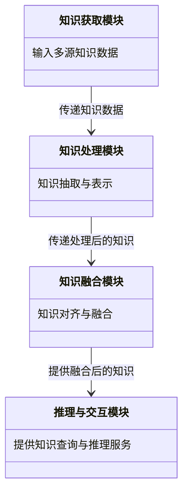
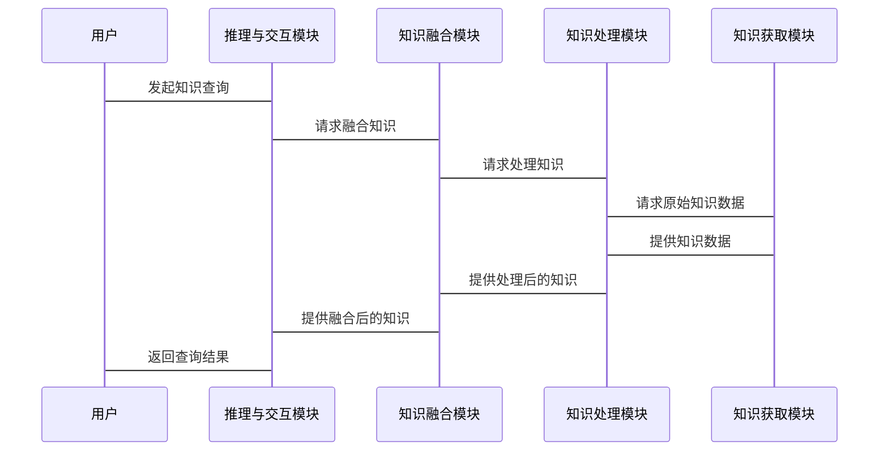

                 


# 开发具有跨域知识融合能力的AI Agent

> 关键词：跨域知识融合，AI Agent，知识图谱，多领域应用，智能系统设计

> 摘要：本文探讨了开发具有跨域知识融合能力的AI Agent的核心概念、算法原理、系统架构及实际应用。通过分析跨域知识融合的背景、意义与挑战，结合具体案例，详细阐述了实现跨域知识融合的关键技术，为读者提供了从理论到实践的完整指导。

---

## 第一部分：跨域知识融合的背景与概念

### 第1章：跨域知识融合的背景与意义

#### 1.1 跨域知識融合的背景
- **1.1.1 人工智能AGENT的发展历程**
  - 从专家系统到机器学习模型，AI Agent逐步具备自主学习与推理能力。
- **1.1.2 跨域知識融合的必要性**
  - 单一领域的知识难以应对复杂现实场景的需求。
  - 跨域知識融合是实现通用AI Agent的核心技术。
- **1.1.3 现今技术的挑战与机遇**
  - 数据孤岛问题亟待解决。
  - 多模态数据处理能力的提升为跨域融合提供了新思路。

#### 1.2 跨域知識融合的定义与特点
- **1.2.1 跨域知識融合的定义**
  - 将来自不同领域或数据源的知识进行整合，消除冗余与冲突，形成一致的知识表示。
- **1.2.2 跨域知識融合的核心特点**
  - 多源性：整合多个数据源的知识。
  - 融合性：将不同形式的知识统一表示。
  - 可解释性：融合后的知识需具备可解释性。
- **1.2.3 跨域知識融合与传统知识整合的对比**
  - 传统知识整合：基于同一领域内的知识。
  - 跨域知識融合：跨越领域边界，处理异构知识。

#### 1.3 跨域知識融合的意义
- **1.3.1 提升AI-Agent的智能水平**
  - 能够理解并处理多领域的知识，增强问题解决能力。
- **1.3.2 增强AI-Agent的实用性和泛化能力**
  - 适应更多应用场景，降低对单一领域数据的依赖。
- **1.3.3 推动多领域技术的融合与创新**
  - 促进跨学科研究，推动人工智能技术的进一步发展。

#### 1.4 现有技术的挑战与未来方向
- **1.4.1 现有技术的主要挑战**
  - 知识表示的异构性问题。
  - 知识对齐的复杂性。
  - 融合后的知识质量控制。
- **1.4.2 未来技术发展的方向**
  - 基于深度学习的跨域知识融合。
  - 知识图谱的动态更新与维护。
  - 跨域知識融合的可解释性研究。
- **1.4.3 跨域知識融合的潜力与前景**
  - 在医疗、金融、教育等领域的广泛应用。
  - 推动通用人工智能的发展。

#### 1.5 本章小结
- 本章介绍了跨域知识融合的背景、定义、特点及其在AI Agent中的重要意义。
- 强调了跨域知识融合在提升AI-Agent智能水平和推动多领域技术融合中的潜力。

---

## 第二部分：跨域知识融合的核心概念与原理

### 第2章：跨域知识融合的核心概念

#### 2.1 跨域知識融合的原理
- **2.1.1 知识表示与对齐**
  - 知识表示：将知识以结构化形式表示（如图结构、向量表示）。
  - 知识对齐：将不同来源的知识进行匹配与统一。
- **2.1.2 知识融合的策略**
  - 基于规则的融合：利用领域知识规则进行融合。
  - 基于学习的融合：利用机器学习模型自动学习融合策略。
- **2.1.3 跨域知識融合的数学模型**
  - 使用图论模型或向量空间模型进行知识融合。

#### 2.2 跨域知識融合的属性对比表
- 下表展示了跨域知识融合中不同知识来源的属性对比：

| 属性       | 来源1（领域A） | 来源2（领域B） | 来源3（领域C） |
|------------|----------------|----------------|----------------|
| 数据形式   | 结构化数据      | 文本数据        | 图结构数据      |
| 知识粒度   | 细粒度          | 中粒度          | 粗粒度          |
| 语义关联   | 强             | 中             | 弱             |

#### 2.3 跨域知識融合的ER實體關係圖
- 以下是跨域知識融合的ER實體關係圖（使用Mermaid）：

```mermaid
erDiagram
    actor 用户 {
        <属性> 用户ID: string
        <属性> 用户名: string
    }
    actor 知识源 {
        <属性> 知识源ID: string
        <属性> 知识类型: string
    }
    actor 融合结果 {
        <属性> 融合ID: string
        <属性> 融合知识: string
    }
    用户 --> 知识源: 使用
    知识源 --> 融合结果: 提供
```

---

### 第3章：跨域知识融合的算法原理

#### 3.1 跨域知識融合算法的总体框架
- **3.1.1 算法的输入与输出**
  - 输入：多源异构知识数据。
  - 输出：统一的知识表示。
- **3.1.2 算法的核心步骤**
  1. 知识抽取与表示。
  2. 知识对齐。
  3. 知识融合。
- **3.1.3 算法的优化策略**
  - 基于上下文的对齐优化。
  - 基于相似度的融合权重调整。

#### 3.2 跨域知識融合算法的具体实现
- **3.2.1 知识对齐算法**
  - 使用图匹配算法进行知识对齐。
  - 示例代码：

```python
def align_entities(entity1, entity2):
    # entity1和entity2是两个实体的表示
    # 返回匹配度
    similarity = calculate_similarity(entity1, entity2)
    if similarity > 0.8:
        return "匹配"
    else:
        return "不匹配"
```

- **3.2.2 知识融合算法**
  - 基于加权融合的方法。
  - 示例代码：

```python
def fuse_knowledge(knowledge1, knowledge2):
    # knowledge1和knowledge2是两个知识的表示
    # 返回融合后的知识
    weight1 = 0.7
    weight2 = 0.3
    fused_knowledge = (knowledge1 * weight1) + (knowledge2 * weight2)
    return fused_knowledge
```

- **3.2.3 算法的数学模型**
  - 知识融合的数学公式：

$$
\text{融合知识} = \lambda \cdot \text{知识1} + (1 - \lambda) \cdot \text{知识2}
$$

---

## 第三部分：系统分析与架构设计

### 第4章：系统分析与架构设计方案

#### 4.1 问题场景介绍
- AI Agent需要处理来自医疗、金融、教育等多个领域的知识。
- 用户需求：提供跨领域的知识查询与推理服务。

#### 4.2 系统功能设计
- **领域模型设计**：
  - 使用Mermaid类图展示系统模块：



- **系统架构设计**：
  - 使用Mermaid架构图展示系统架构：

```mermaid
archiDiagram
    component 知识获取模块 {
        知识数据库1
        知识数据库2
        知识数据库3
    }
    component 知识处理模块 {
        知识抽取器
        知识对齐器
    }
    component 知识融合模块 {
        知识融合器
    }
    component 推理与交互模块 {
        用户接口
        推理引擎
    }
    知识获取模块 --> 知识处理模块: 传递知识数据
    知识处理模块 --> 知识融合模块: 传递处理后的知识
    知识融合模块 --> 推理与交互模块: 提供融合后的知识
```

- **系统交互设计**：
  - 使用Mermaid序列图展示交互流程：



---

## 第四部分：项目实战

### 第5章：项目实战

#### 5.1 环境安装与配置
- 安装必要的库：
  - `pip install networkx`
  - `pip install py2neo`
  - `pip install spacy`

#### 5.2 核心代码实现
- **知识抽取与表示**：
  ```python
  import networkx as nx

  def extract_knowledge(text):
      # 示例代码，从文本中提取知识节点和关系
      G = nx.Graph()
      nodes = ['Patient', 'Disease', 'Treatment']
      G.add_nodes_from(nodes)
      G.add_edge('Patient', 'Disease')
      G.add_edge('Disease', 'Treatment')
      return G
  ```

- **知识融合与推理**：
  ```python
  from spacy.lang.zh import Chinese

  def fuse_medical_knowledge(knowledge_graph):
      # 示例代码，融合医疗领域的知识图谱
      nlp = Chinese()
      doc = nlp("患者症状与疾病的关系")
      # 提取实体与关系
      entities = [ent.text for ent in doc.ents]
      relations = []
      for i, token in enumerate(doc):
          if token.text in ['导致', '引致']:
              relations.append((entities[i-1], entities[i+1]))
      return relations
  ```

#### 5.3 代码功能解读与分析
- 知识抽取模块：从多源数据中提取实体和关系，构建知识图谱。
- 知识融合模块：对齐不同来源的知识，消除冲突，形成统一的知识表示。
- 推理与交互模块：基于融合后的知识，提供智能问答和推理服务。

#### 5.4 实际案例分析
- **案例1：医疗领域跨域知识融合**
  - 数据来源：医疗知识库、患者病历、药物信息。
  - 融合目标：构建医疗领域的知识图谱，支持智能问诊。
- **案例2：金融领域跨域知识融合**
  - 数据来源：股票数据、财经新闻、公司财报。
  - 融合目标：提供智能投资建议。

#### 5.5 项目总结
- 通过项目实战，验证了跨域知识融合技术在实际应用中的可行性和有效性。
- 强调了系统设计和算法优化的重要性。

---

## 第五部分：最佳实践与总结

### 第6章：最佳实践与总结

#### 6.1 最佳实践
- **模块化设计**：将系统划分为知识获取、处理、融合、推理与交互模块，便于维护与扩展。
- **数据预处理**：对多源数据进行清洗和标准化，降低数据异构性。
- **模型调优**：针对不同领域特点，调整融合算法的参数，提升融合效果。

#### 6.2 小结
- 跨域知識融合是开发具有强智能性的AI Agent的关键技术。
- 通过理论与实践的结合，可以有效提升AI Agent的跨领域适应能力。

#### 6.3 注意事项
- 确保数据隐私与安全。
- 注重系统的可解释性，避免黑箱模型。
- 定期更新知识库，保持知识的时效性。

#### 6.4 拓展阅读
- 推荐书籍：《知识图谱：概念、方法与应用》。
- 推荐论文：《Cross-Domain Knowledge Fusion via Graph Neural Networks》。

---

## 作者

作者：AI天才研究院/AI Genius Institute & 禅与计算机程序设计艺术 /Zen And The Art of Computer Programming

---

**感谢您的阅读！**

