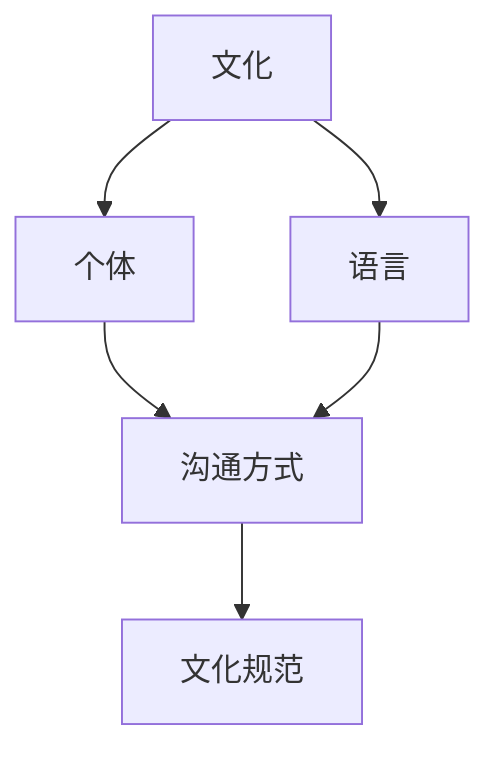
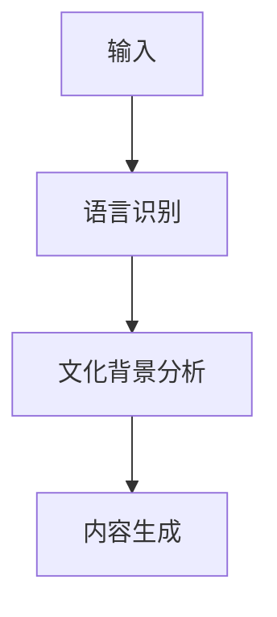
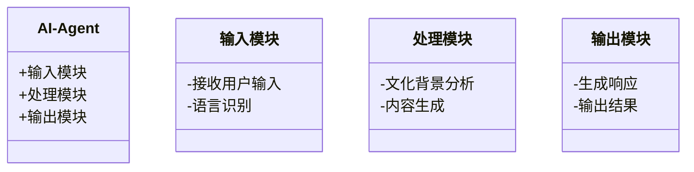
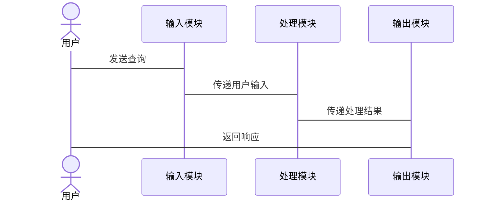

                 


# 开发具有跨文化理解与交流能力的AI Agent

> 关键词：跨文化理解、AI Agent、自然语言处理、机器学习、文化敏感性、多语言模型、迁移学习

> 摘要：本文探讨了开发具有跨文化理解与交流能力的AI Agent的关键技术与方法。通过分析跨文化理解的核心概念、算法实现、系统架构以及实际案例，本文旨在为开发者提供理论支持和实践指导，以构建能够适应不同文化背景的智能交互系统。

---

## 第1章：跨文化理解与AI Agent的背景

### 1.1 跨文化理解的定义与重要性

#### 1.1.1 跨文化理解的定义
跨文化理解是指个体或系统能够识别、解释并适应不同文化背景下的语言、行为和价值观的能力。这种能力使AI Agent能够在多元文化环境中与用户有效沟通。

#### 1.1.2 跨文化理解的重要性
在全球化背景下，跨文化理解变得至关重要。AI Agent需要能够处理多种语言和文化背景的用户需求，以提供个性化的服务。

#### 1.1.3 跨文化理解在AI Agent中的应用
AI Agent可以通过跨文化理解实现多语言支持、文化敏感的内容推荐和适应不同文化背景的交互方式。

### 1.2 AI Agent的基本概念

#### 1.2.1 AI Agent的定义
AI Agent是具有感知和行动能力的智能实体，能够通过传感器获取信息，并通过执行器与环境交互。

#### 1.2.2 AI Agent的核心功能
AI Agent的核心功能包括感知、推理、规划和执行。

#### 1.2.3 AI Agent与传统程序的区别
AI Agent具备自主性、反应性和目标导向性，能够适应动态环境。

### 1.3 跨文化理解与AI Agent的结合

#### 1.3.1 跨文化理解在AI Agent中的必要性
AI Agent需要理解不同文化背景下的用户需求，以提供个性化的服务。

#### 1.3.2 跨文化理解如何提升AI Agent的交互能力
通过跨文化理解，AI Agent能够识别并适应用户的语言和文化习惯，提高交互的自然性和满意度。

#### 1.3.3 跨文化AI Agent的应用场景
跨文化AI Agent可应用于多语言客服、文化适配的内容推荐和跨文化培训等领域。

---

## 第2章：跨文化理解的核心概念

### 2.1 跨文化理解的理论基础

#### 2.1.1 文化维度理论
文化维度理论（如霍夫斯泰德的五个维度模型）帮助我们理解不同文化之间的差异。

#### 2.1.2 跨文化沟通的挑战
跨文化沟通中的语言差异、非语言符号和文化习惯差异增加了沟通的复杂性。

#### 2.1.3 跨文化敏感性模型
跨文化敏感性模型帮助AI Agent识别并适应不同文化背景下的用户行为。

### 2.2 跨文化理解的特征对比

#### 2.2.1 不同文化间的语言差异
语言不仅承载信息，还反映文化背景。AI Agent需理解语言的深层含义。

#### 2.2.2 文化背景对沟通方式的影响
不同文化背景下，沟通方式（如直接与间接沟通）存在显著差异。

#### 2.2.3 不同文化中的非语言符号
非语言符号（如肢体语言）在不同文化中有不同含义，AI Agent需识别并理解这些差异。

### 2.3 跨文化理解的ER实体关系图



---

## 第3章：跨文化AI Agent的核心算法

### 3.1 跨文化理解的算法原理

#### 3.1.1 多语言模型的训练流程
多语言模型通过联合训练多种语言数据，实现跨语言理解。

#### 3.1.2 跨文化适应的迁移学习
迁移学习技术帮助AI Agent将一种文化的知识迁移到另一种文化中。

#### 3.1.3 对比学习在文化差异中的应用
对比学习通过对比不同文化的数据，识别文化差异并进行适应。

### 3.2 跨文化AI Agent的算法流程图



### 3.3 算法实现代码示例

```python
import torch
from torch import nn

# 定义对比学习损失函数
class ContrastiveLoss(nn.Module):
    def __init__(self, margin=0.5):
        super(ContrastiveLoss, self).__init__()
        self.margin = margin

    def forward(self, x1, x2, label):
        distance = torch.norm(x1 - x2, p=2)
        loss = 0.5 * (1 - label) * torch.pow(distance, 2) + self.margin * label * distance
        return torch.mean(loss)

# 训练过程
model = ContrastiveLoss()
optimizer = torch.optim.Adam(model.parameters(), lr=0.001)

for epoch in range(num_epochs):
    for batch in dataloader:
        inputs, labels = batch
        outputs = model(inputs)
        loss = contrastive_loss(outputs, labels)
        optimizer.zero_grad()
        loss.backward()
        optimizer.step()
```

---

## 第4章：跨文化AI Agent的系统架构设计

### 4.1 系统功能设计



### 4.2 系统架构设计



---

## 第5章：跨文化AI Agent的项目实战

### 5.1 环境安装

```bash
pip install torch transformers
```

### 5.2 核心代码实现

```python
class MultiLanguageAgent:
    def __init__(self, languages):
        self.languages = languages
        self.models = {lang: load_model(lang) for lang in languages}

    def process_request(self, text, language):
        model = self.models.get(language, 'en')
        response = model.generate(text)
        return response
```

### 5.3 系统功能设计与实现

设计一个多语言客服AI Agent，支持中英文交互，能够根据用户语言和文化背景生成相应的回复。

### 5.4 实际案例分析

分析一个用户咨询旅行信息的场景，AI Agent根据用户的文化背景提供个性化的建议。

---

## 第6章：跨文化AI Agent的未来展望

### 6.1 跨文化理解的未来发展方向

#### 6.1.1 多模态交互
结合视觉、听觉等多模态信息，提升跨文化理解能力。

#### 6.1.2 个性化适配
根据用户的个性化需求，动态调整交互方式。

#### 6.1.3 自适应学习
通过持续学习，优化跨文化理解能力。

### 6.2 跨文化AI Agent的应用前景

跨文化AI Agent将在教育、医疗、商业等领域发挥重要作用，提供更加个性化的服务。

---

## 作者信息

作者：AI天才研究院/AI Genius Institute & 禅与计算机程序设计艺术 /Zen And The Art of Computer Programming

---

通过以上结构，文章详细探讨了跨文化理解与AI Agent开发的关键技术与实践，为开发者提供了全面的指导。

