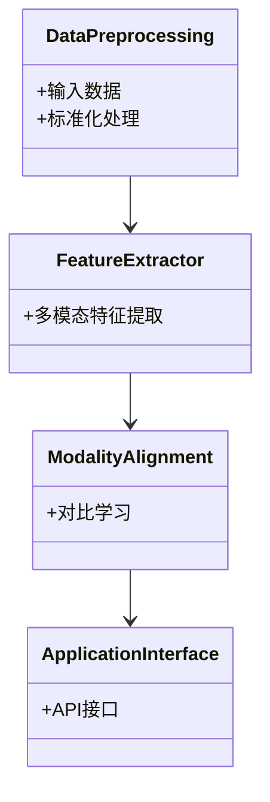

                 


# 开发具有跨模态学习能力的AI Agent

> 关键词：跨模态学习、AI Agent、多模态数据、对比学习、Transformer模型、系统架构

> 摘要：本文探讨了开发具有跨模态学习能力的AI Agent的关键技术与实现方法。通过详细分析跨模态学习的核心概念、算法原理和系统架构，结合实际项目案例，为读者提供全面的技术指导。

---

# 引言

随着人工智能技术的快速发展，AI Agent（智能代理）在多个领域的应用日益广泛。然而，现实世界中的数据往往是多模态的，包括文本、图像、语音、视频等。如何让AI Agent能够理解和处理这些多模态数据，成为当前研究的热点。本文将从跨模态学习的基本概念出发，深入探讨其在AI Agent中的应用，并结合实际案例，详细讲解实现方法。

---

# 第一部分：跨模态学习的背景与核心概念

## 第1章：跨模态学习的背景与问题描述

### 1.1 跨模态学习的定义与背景

跨模态学习（Multimodal Learning）是指让AI系统能够理解和处理多种数据模态的能力。传统的AI系统通常只能处理单一模态的数据，例如文本、图像或语音。然而，现实世界中的数据往往是多模态的，跨模态学习能够使AI Agent具备更强大的感知和理解能力。

**问题背景：**
- **数据多样性**：现实世界中的数据是多样的，单一模态的数据往往无法提供足够的信息。
- **任务复杂性**：许多实际任务需要结合多种模态的信息，例如图像问答、语音识别等。

**技术挑战：**
- **模态之间的异构性**：不同模态的数据具有不同的特征和结构，难以直接进行融合。
- **数据对齐问题**：如何将不同模态的数据对齐，使其能够协同工作。
- **模型的可解释性**：跨模态模型的复杂性使得其可解释性成为一个挑战。

---

## 第2章：跨模态学习的核心概念

### 2.1 跨模态学习的原理与模型

跨模态学习的核心在于如何有效地将多种模态的数据融合，并从中提取有用的特征。主流的方法包括：

1. **多模态Transformer模型**：将不同模态的数据通过自注意力机制进行融合。
2. **对比学习**：通过对比不同模态的数据，学习共享特征。
3. **模态对齐**：通过将不同模态的数据对齐，使其能够在同一个语义空间中进行交互。

**数学模型：**
跨模态学习的目标是通过模态对齐，使得不同模态的数据能够在同一个语义空间中进行交互。假设我们有两个模态的数据，分别是$X$（文本）和$Y$（图像），跨模态学习的目标是找到一种映射关系$f(X) \approx Y$或$f(Y) \approx X$。

---

# 第二部分：跨模态学习的算法原理

## 第3章：跨模态学习的算法原理

### 3.1 多模态Transformer模型

**模型结构：**
多模态Transformer模型通过将不同模态的数据输入到同一个编码器中，利用自注意力机制进行特征提取。

**数学公式：**
$$
\text{Attention}(Q, K, V) = \text{softmax}\left(\frac{QK^T}{\sqrt{d_k}}\right)V
$$

其中，$Q$、$K$、$V$分别是查询、键和值矩阵，$d_k$是键的维度。

### 3.2 对比学习

**对比学习的核心思想：**
通过最大化同一对象在不同模态下的相似性，同时最小化不同对象之间的相似性。

**损失函数：**
$$
\text{Loss} = -\log\left(\frac{\exp(s(X,Y))}{\exp(s(X,Y)) + \sum_{i \neq j} \exp(s(X,i))}\right)
$$

其中，$s(X,Y)$是相似性评分函数。

---

# 第三部分：跨模态学习的系统架构

## 第4章：系统分析与架构设计

### 4.1 系统功能设计

**功能模块：**
1. **数据预处理模块**：将多模态数据进行标准化处理。
2. **特征提取模块**：利用Transformer模型提取多模态特征。
3. **模态对齐模块**：通过对比学习实现模态对齐。
4. **应用接口模块**：提供API供其他系统调用。

**类图设计：**


### 4.2 系统架构设计

**架构图：**


---

# 第四部分：项目实战

## 第5章：项目实战——一个多模态问答系统

### 5.1 项目介绍

**项目目标：**
开发一个多模态问答系统，能够同时处理文本和图像数据，回答用户的问题。

### 5.2 环境配置

**依赖项：**
- Python 3.8+
- TensorFlow 2.5+
- scikit-learn

### 5.3 核心代码实现

**数据预处理：**
```python
import numpy as np
from tensorflow.keras.preprocessing.image import load_img, img_to_array

def preprocess_image(img_path, target_size=224):
    img = load_img(img_path)
    img = img_to_array(img)
    img = np.expand_dims(img, axis=0)
    return img
```

**多模态Transformer模型：**
```python
from tensorflow.keras.layers import Input, Dense, Concatenate
from tensorflow.keras.models import Model

input_text = Input(shape=(100,))
input_image = Input(shape=(224,224,3))

# 文本编码器
encoder_text = Dense(128, activation='relu')(input_text)
encoder_text = Dense(64, activation='relu')(encoder_text)

# 图像编码器
encoder_image = Dense(128, activation='relu')(input_image)
encoder_image = Dense(64, activation='relu')(encoder_image)

# 融合特征
features = Concatenate()([encoder_text, encoder_image])
output = Dense(1, activation='sigmoid')(features)

model = Model(inputs=[input_text, input_image], outputs=output)
model.compile(optimizer='adam', loss='binary_crossentropy', metrics=['accuracy'])
```

### 5.4 功能解读与案例分析

**功能解读：**
- 系统能够接收用户的文本问题和相关图像，通过多模态Transformer模型进行特征提取和对齐，最终生成回答。

**案例分析：**
假设用户上传一张猫的图片，并询问“这只猫是什么品种？”，系统通过图像和文本的特征提取，结合对比学习，生成相应的回答。

---

# 第五部分：总结与展望

## 6.1 总结

跨模态学习是实现AI Agent的重要技术，通过对多种模态数据的融合和对齐，能够显著提升系统的感知和理解能力。本文从背景、核心概念、算法原理到系统架构和项目实战，全面探讨了跨模态学习的实现方法。

## 6.2 注意事项

- 数据质量：多模态数据的预处理和对齐是实现跨模态学习的关键。
- 模型可解释性：复杂的跨模态模型需要考虑其可解释性。
- 性能优化：多模态数据的处理需要高效的算法和计算资源。

## 6.3 拓展阅读

- "Multimodal Transformer for Visual-Textual Reasoning"（ArXiv, 2021）
- "Contrastive Learning of Visual and Textual Modalities"（ICML, 2020）

---

# 作者：AI天才研究院 & 禅与计算机程序设计艺术

---

以上是《开发具有跨模态学习能力的AI Agent》的完整目录和文章内容。希望这篇文章能够为读者提供关于跨模态学习的全面技术指导，并激发更多的研究和实践兴趣。

