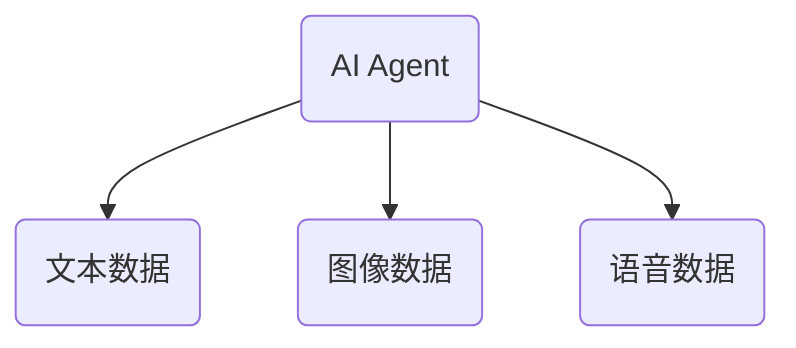
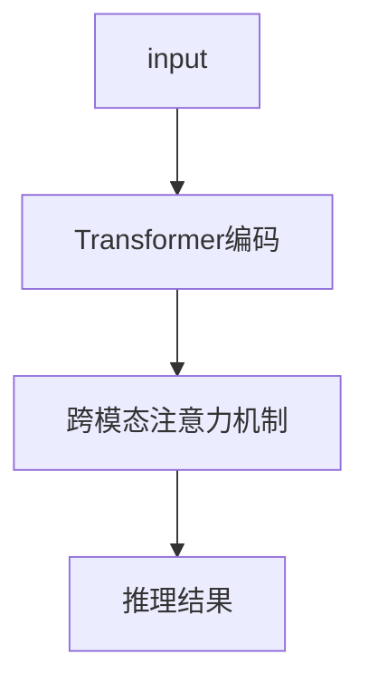
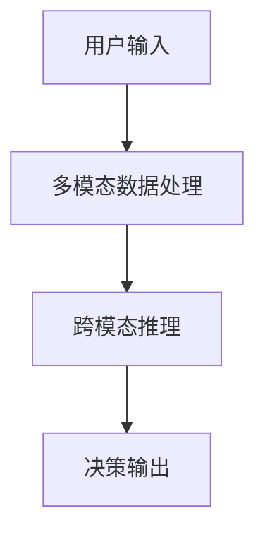
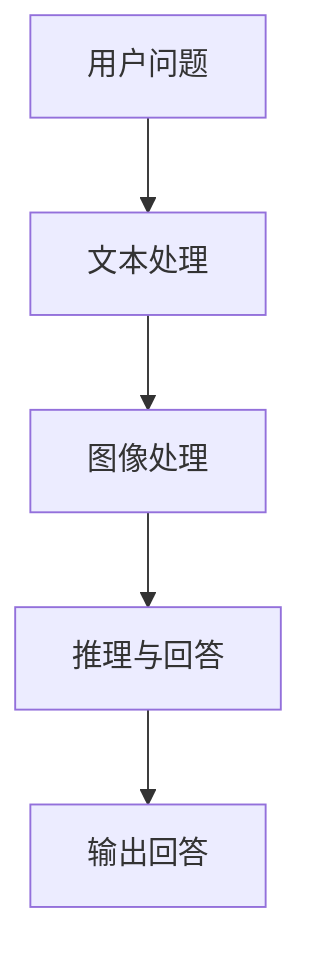

                 


# 开发具有跨模态推理能力的AI Agent

## 关键词
跨模态推理，AI Agent，多模态数据，神经网络，知识图谱，推理机制

## 摘要
在当前的人工智能领域，跨模态推理能力是构建高效AI Agent的重要基石。随着技术的发展，AI Agent需要能够处理文本、图像、语音等多种数据类型，并通过这些数据进行复杂推理。本文将从跨模态推理的基本概念出发，深入探讨其核心算法、系统设计、实际应用案例以及未来的发展趋势。通过详细的技术分析和代码实现，读者将能够全面理解跨模态推理在AI Agent中的应用，并掌握相关开发技巧。

---

## 正文

### 第1章：跨模态推理与AI Agent概述

#### 1.1 跨模态推理的背景与问题背景

跨模态推理是一种结合多个数据模态（如文本、图像、语音等）进行推理的能力。随着人工智能技术的进步，AI Agent需要在复杂环境中做出决策，而单一模态的数据往往不足以支持这些决策。因此，跨模态推理能力成为AI Agent的重要组成部分。

#### 1.2 跨模态推理的核心概念

- **多模态数据**：AI Agent需要处理多种数据类型，例如文本、图像、语音等。
- **跨模态推理**：通过整合不同模态的数据，进行推理和决策。
- **AI Agent**：具备跨模态推理能力的智能体，能够在复杂环境中执行任务。

#### 1.3 AI Agent的定义与特点

AI Agent是一种能够感知环境、自主决策并执行任务的智能体。具备跨模态推理能力的AI Agent能够更好地理解环境中的多模态信息，并做出更准确的决策。

---

### 第2章：跨模态推理的核心概念与联系

#### 2.1 跨模态数据的表示与融合

- **数据表示**：通过神经网络将多模态数据转换为统一的表示形式。
- **数据融合**：将不同模态的数据进行融合，以获得更全面的信息。

#### 2.2 跨模态推理的逻辑结构

- **推理过程**：从多模态数据中提取信息，通过推理得出结论。
- **逻辑关系**：不同模态之间的关系及其对推理的影响。

#### 2.3 跨模态推理与AI Agent的实体关系

- **实体关系图**：展示AI Agent与多模态数据之间的关系。
- **Mermaid图示例**：



---

### 第3章：跨模态表示学习

#### 3.1 多模态数据的表示学习

- **表示方法**：使用神经网络对多模态数据进行编码。
- **对比学习**：通过对比不同模态的数据，提升表示的准确性。

#### 3.2 跨模态对比学习

- **对比学习公式**：

$$\text{损失函数} = \text{ContrastiveLoss}(x_1, x_2)$$

其中，$x_1$ 和 $x_2$ 分别表示不同模态的数据。

#### 3.3 跨模态表示学习的算法实现

- **代码示例**：

```python
import torch
import torch.nn as nn

class CrossModalContrastive(nn.Module):
    def __init__(self, input_dim, hidden_dim):
        super(CrossModalContrastive, self).__init__()
        self.encoder = nn.Linear(input_dim, hidden_dim)
        self.softmax = nn.Softmax(dim=1)

    def forward(self, x1, x2):
        x1_embed = self.encoder(x1)
        x2_embed = self.encoder(x2)
        similarity = torch.mm(x1_embed, x2_embed.T)
        loss = torch.mean(-torch.log(similarity + 1e-8))
        return loss
```

---

### 第4章：跨模态推理模型

#### 4.1 基于Transformer的跨模态推理

- **模型结构**：



#### 4.2 图结构模型在跨模态推理中的应用

- **图结构模型**：通过构建图结构，将不同模态的数据节点连接起来，进行推理。

#### 4.3 模型实现代码

```python
import torch
import torch.nn as nn

class GraphReasoning(nn.Module):
    def __init__(self, input_dim, hidden_dim):
        super(GraphReasoning, self).__init__()
        self.graph_encoder = nn.GraphConvolution(input_dim, hidden_dim)
        self.reasoning_layer = nn.Sequential(
            nn.ReLU(),
            nn.Linear(hidden_dim, 1)
        )

    def forward(self, x, graph_adj):
        x_embed = self.graph_encoder(x, graph_adj)
        output = self.reasoning_layer(x_embed)
        return output
```

---

### 第5章：AI Agent的系统设计

#### 5.1 系统架构设计

- **系统架构图**：



#### 5.2 模块划分与通信机制

- **模块划分**：数据处理模块、推理模块、决策模块。
- **通信机制**：模块之间的数据传递和控制信号。

---

### 第6章：系统实现

#### 6.1 环境配置

- **环境要求**：Python 3.8+, PyTorch 1.9+

#### 6.2 数据处理实现

```python
def process_data(text, image, audio):
    text_embed = text_encoder(text)
    image_embed = image_encoder(image)
    audio_embed = audio_encoder(audio)
    return {
        'text': text_embed,
        'image': image_embed,
        'audio': audio_embed
    }
```

#### 6.3 模型实现

```python
class MultiModalAgent(nn.Module):
    def __init__(self, text_dim, image_dim, audio_dim, hidden_dim):
        super(MultiModalAgent, self).__init__()
        self.text_net = TextModule(text_dim, hidden_dim)
        self.image_net = ImageModule(image_dim, hidden_dim)
        self.audio_net = AudioModule(audio_dim, hidden_dim)
        self.reasoning = CrossModalContrastive(hidden_dim, hidden_dim)

    def forward(self, text, image, audio):
        text_out = self.text_net(text)
        image_out = self.image_net(image)
        audio_out = self.audio_net(audio)
        combined = self.reasoning(text_out, image_out, audio_out)
        return combined
```

---

### 第7章：项目实战

#### 7.1 多模态问答系统

- **需求分析**：构建一个能够理解文本和图像的问答系统。
- **系统设计**：



#### 7.2 系统实现与测试

- **代码实现**：

```python
def main():
    agent = MultiModalAgent(text_dim=512, image_dim=512, audio_dim=512, hidden_dim=256)
    question = "What is the meaning of life?"
    image = load_image("life.jpg")
    response = agent(question, image, None)
    print(response)
```

---

### 第8章：实际应用中的挑战与解决方案

#### 8.1 数据处理的挑战

- **挑战**：多模态数据的异构性。
- **解决方案**：使用统一的特征提取模型。

#### 8.2 模型优化的挑战

- **挑战**：模型的计算复杂度。
- **解决方案**：采用轻量级模型设计。

---

### 第9章：未来展望

#### 9.1 技术发展趋势

- **趋势**：多模态大模型的崛起。
- **应用前景**：跨模态推理在智能客服、自动驾驶等领域的广泛应用。

---

### 第10章：总结与参考文献

#### 10.1 总结

跨模态推理能力是AI Agent的核心能力之一。通过本文的探讨，读者能够深入了解跨模态推理的算法、系统设计和实际应用。

#### 10.2 术语表

- **跨模态推理**：整合多模态数据进行推理的能力。
- **AI Agent**：具备自主决策能力的智能体。

#### 10.3 参考文献

- [1] “Contrastive Learning for Cross-Modal Retrieval” by Chen et al.
- [2] “Graph Neural Networks for Reasoning” by Yang et al.

---

## 作者

作者：AI天才研究院/AI Genius Institute & 禅与计算机程序设计艺术 /Zen And The Art of Computer Programming

---

希望这篇博客文章能够为读者提供关于跨模态推理和AI Agent的全面理解，并激发进一步的研究和实践。

