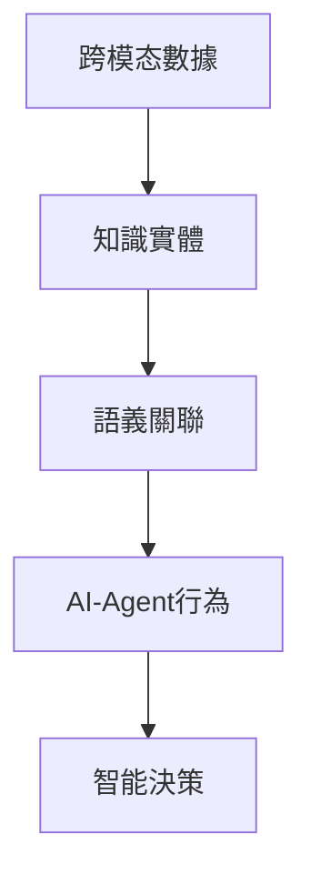
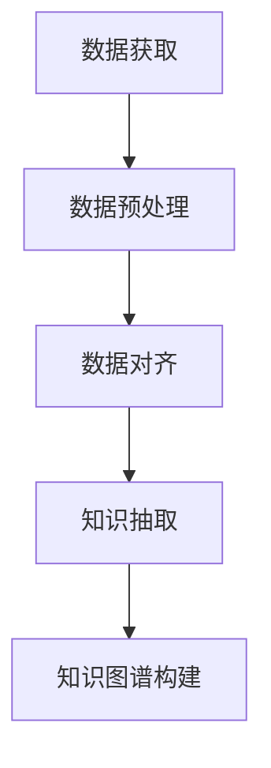
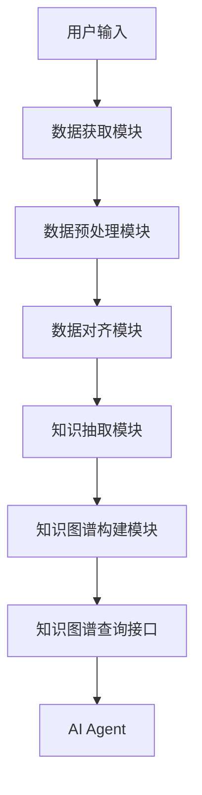

                 


# 开发具有跨模态知识图谱构建能力的AI Agent

## 关键词：跨模态知识图谱、AI Agent、多模态数据处理、知识图谱构建、智能行为模型

## 摘要：
本文系统地探讨了开发具有跨模态知识图谱构建能力的AI Agent的关键技术与实现方法。文章从跨模态知识图谱和AI Agent的基本概念出发，详细分析了两者的核心原理、算法实现、系统架构设计以及实际应用案例。通过对比分析、算法流程图、系统架构图等方法，深入剖析了跨模态知识图谱在AI Agent中的应用价值，为读者提供了一套完整的开发思路和实践指南。

---

## 第一部分: 背景介绍与核心概念

### 第1章: 跨模态知識圖譜與AI-Agent的背景介紹

#### 1.1 跨模态知識圖譜的基本概念
跨模态知识图谱是一种整合多种数据类型（如文本、图像、语音等）的知识表示形式，能够通过语义关联将不同模态的数据连接起来。与传统知识图谱相比，跨模态知识图谱具有更强的语义表达能力和更广泛的应用场景。

#### 1.1.1 跨模态數據的定義
跨模态数据指的是来自不同感知渠道（如视觉、听觉、文本等）的数据。例如，一张图片和一段描述图片的文字就是典型的跨模态数据。

#### 1.1.2 知識圖譧的核心概念
知识图谱是一种以图结构表示实体及其关系的数据库，能够帮助AI系统理解和推理知识。

#### 1.1.3 跨模态知識圖譧的重要性和應用場景
跨模态知识图谱在自然语言处理、计算机视觉、智能问答系统等领域具有重要应用，能够提升AI系统的多模态理解和决策能力。

#### 1.2 AI-Agent的基本概念
AI Agent是一种具有自主决策能力的智能体，能够通过感知环境并执行任务来实现目标。

#### 1.2.1 AI-Agent的定義
AI Agent是指具有智能性的软件或实体，能够感知环境、理解任务需求并执行操作。

#### 1.2.2 AI-Agent的核心功能與特性
AI Agent的核心功能包括感知、推理、规划、决策和执行。其特性包括自主性、反应性、社会性和学习能力。

#### 1.2.3 AI-Agent的分類與應用領域
AI Agent可以分为简单反射型、基于模型的反应型、目标驱动型和实用驱动型。其应用领域包括智能助手、自动驾驶、智能客服等。

---

### 第2章: 跨模态知識圖譧與AI-Agent的核心概念

#### 2.1 跨模态數據處理的核心原理
跨模态数据处理的核心是通过对齐不同模态的数据，实现语义上的统一表示。

#### 2.1.1 多模态數據的整合與對齊
跨模态数据对齐的目标是将不同模态的数据映射到同一语义空间。

#### 2.1.2 跨模态數據的語義分析
语义分析是理解不同模态数据之间关联的关键步骤。

#### 2.1.3 跨模态數據的表示學習
表示学习是将不同模态的数据映射到统一表示空间的技术。

#### 2.2 知識圖譧的構建與管理
知识图谱的构建包括数据抽取、实体识别、关系抽取和知识融合等步骤。

#### 2.2.1 知識圖譧的定義與結構
知识图谱由实体和关系组成，通常以图的形式表示。

#### 2.2.2 知識圖譧的構建流程
知识图谱的构建流程包括数据获取、预处理、实体识别、关系抽取和知识融合。

#### 2.2.3 知識圖譧的存儲與管理
知识图谱可以通过图数据库或关系型数据库进行存储和管理。

#### 2.3 AI-Agent的智能行為與知識圖譧的結合
AI Agent通过知识图谱实现智能行为，例如通过知识图谱推理来回答复杂问题。

#### 2.3.1 AI-Agent的智能行為模型
智能行为模型包括感知、推理、决策和执行四个阶段。

#### 2.3.2 知識圖譧在AI-Agent中的作用
知识图谱为AI Agent提供了语义理解、知识推理和决策支持能力。

#### 2.3.3 跨模态知識圖譧如何增強AI-Agent的能力
跨模态知识图谱能够增强AI Agent的多模态感知和理解能力。

#### 2.3.4 跨模态知識圖譧與AI-Agent的ER實體關係圖


---

## 第三部分: 跨模态知識圖譧構建的算法原理

### 第3章: 跨模態數據對齊算法原理

#### 3.1 跨模態數據對齊的基本原理
跨模态数据对齐的目标是将不同模态的数据映射到同一语义空间。

#### 3.1.1 跨模态數據對齊的定義
跨模态数据对齐是指将不同模态的数据通过某种方式对齐，使其具有相同的语义表示。

#### 3.1.2 跨模态數據對齊的核心算法
跨模态数据对齐的核心算法包括对比学习、聚类和网络流模型。

#### 3.1.3 跨模态數據對齊的應用場景
跨模态数据对齐在多模态检索、图像-文本匹配等领域具有广泛应用。

#### 3.2 跨模態數據對齊的主流算法

##### 3.2.1 对比學習算法
对比学习是一种通过最大化相似数据对的相似性来学习数据表示的方法。

##### 3.2.2 聚類算法
聚类算法是一种通过将数据分成簇来实现数据对齐的方法。

##### 3.2.3 網絡流模型
网络流模型是一种通过流网络结构来优化数据对齐的方法。

#### 3.3 跨模态數據對齊算法的實現步驟

##### 3.3.1 数据预处理
数据预处理包括数据清洗、标准化和归一化。

##### 3.3.2 数据表示学习
数据表示学习是将数据映射到低维表示空间的过程。

##### 3.3.3 数据对齐
通过对齐算法将不同模态的数据对齐到同一语义空间。

#### 3.4 跨模態數據對齊算法的優點與缺點
跨模态数据对齐算法的优点是能够提升多模态数据的语义一致性，缺点是计算复杂度较高。

---

## 第四部分: 系統分析與架構設計

### 第4章: 跨模態知識圖譧構建的系統分析

#### 4.1 系統功能設計
跨模态知识图谱构建系统需要实现数据获取、预处理、对齐、知识抽取和知识图谱构建等功能。

#### 4.2 系統架構設計

##### 4.2.1 系統模塊劃分
跨模态知识图谱构建系统包括数据获取模块、数据预处理模块、数据对齐模块、知识抽取模块和知识图谱构建模块。

##### 4.2.2 系統架構圖


#### 4.3 系統接口設計
跨模态知识图谱构建系统的接口包括数据输入接口、知识图谱查询接口和AI Agent接口。

#### 4.4 系統交互流程設計

##### 4.4.1 系統交互流程圖


---

## 第五部分: 項目實戰

### 第5章: 跨模態知識圖譧構建的項目實戰

#### 5.1 環境安裝與配置
需要安装Python、TensorFlow、Keras、NLTK等工具库。

#### 5.2 系統核心實現源代碼

##### 5.2.1 数据预處理代碼
```python
import pandas as pd
import numpy as np

def preprocess_data(data):
    # 数据清洗
    data = data.dropna()
    # 数据归一化
    data = (data - data.min()) / (data.max() - data.min())
    return data
```

##### 5.2.2 数据對齊算法實現
```python
def contrastive_learning(x1, x2, label):
    # 对比学习模型
    with tf.GradientTape() as tape:
        # 前向传播
        y1 = model(x1)
        y2 = model(x2)
        # 计算损失
        loss = contrastive_loss(y1, y2, label)
    # 反向传播
    gradients = tape.gradient(loss, model.trainable_weights)
    optimizer.apply_gradients(zip(gradients, model.trainable_weights))
    return loss
```

##### 5.2.3 知識圖譧構建代碼
```python
def build_knowledge_graph(entities, relations):
    # 构建知识图谱
    graph = {}
    for entity in entities:
        graph[entity] = []
    for relation in relations:
        graph[relation[0]].append((relation[1], relation[2]))
    return graph
```

#### 5.3 無人戰斗機案例分析
通过构建跨模态知识图谱，AI Agent可以实现多模态感知和智能决策，例如在无人战斗机中实现目标识别和路径规划。

#### 5.4 系統性能分析
分析系统的处理效率、准确率和扩展性，提出优化建议。

---

## 第六部分: 最佳實踐與小結

### 第6章: 最佳實踐與小結

#### 6.1 開發建議
在开发具有跨模态知识图谱构建能力的AI Agent时，建议注重数据质量、算法优化和系统架构设计。

#### 6.2 注意事项
需要注意数据隐私、计算资源消耗和系统稳定性等问题。

#### 6.3 拓展閱讀
推荐阅读相关领域的经典论文和书籍，例如《深度学习》、《图灵完备的人工智能》等。

---

## 作者：AI天才研究院/AI Genius Institute & 禪與计算机程序設計藝術 /Zen And The Art of Computer Programming

---

这篇文章系统地介绍了开发具有跨模态知识图谱构建能力的AI Agent的核心技术与实现方法，从背景介绍、算法原理到系统设计和项目实战，为读者提供了完整的开发思路和实践指南。

