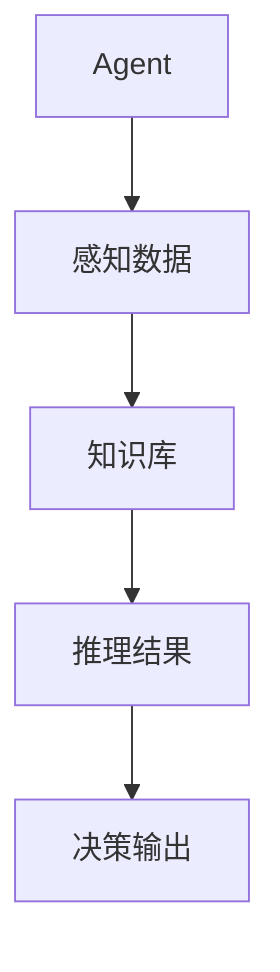
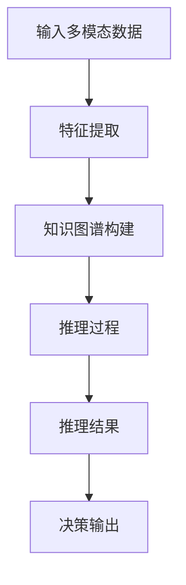
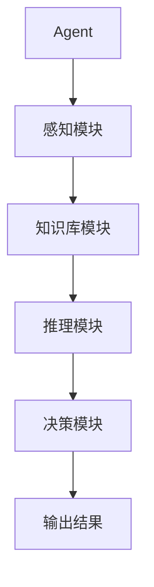

                 


# 开发具有跨模态知识推理与决策能力的AI Agent

## 关键词：AI Agent, 跨模态知识推理, 决策算法, 多模态数据融合, 知识图谱, 图神经网络

## 摘要：  
本文详细探讨了开发具有跨模态知识推理与决策能力的AI Agent的核心原理与实现方法。首先介绍了跨模态知识推理的背景与问题，分析了其核心概念与关键要素。接着从算法原理的角度，详细讲解了跨模态数据融合、知识推理与决策算法的实现方法。然后通过系统架构设计，展示了AI Agent的整体结构与各模块的协同工作方式。最后，通过实际项目案例，深入分析了跨模态知识推理与决策能力在AI Agent中的应用，并总结了开发过程中需要注意的关键点与未来的发展方向。

---

## 第一部分: 背景介绍

### 第1章: 跨模态知识推理与决策的背景

#### 1.1 问题背景  
跨模态知识推理与决策是人工智能领域的重要研究方向。随着传感器技术、大数据技术的发展，AI Agent需要处理来自不同模态（如文本、图像、语音、视频等）的数据，并基于这些数据进行知识推理与决策。传统的单模态处理方法难以满足实际场景的需求，跨模态知识推理与决策技术应运而生。  

#### 1.2 问题描述  
跨模态知识推理与决策的核心问题是：如何将多模态数据进行有效融合，构建知识图谱，并在此基础上实现推理与决策。具体挑战包括：  
1. **数据异构性**：不同模态的数据具有不同的特征和表示方式。  
2. **语义关联性**：如何建立不同模态数据之间的语义关联。  
3. **推理复杂性**：跨模态推理需要处理复杂的语义关系和不确定性。  

---

## 第二部分: 核心概念与联系

### 第2章: 核心概念与联系  

#### 2.1 跨模态知识推理的核心概念  
1. **跨模态数据**：指来自不同感知模态的数据，如文本、图像、语音等。  
2. **知识图谱**：用于表示知识的结构化数据，包含实体、属性和关系。  
3. **推理与决策**：基于知识图谱进行逻辑推理，生成决策输出。  

#### 2.2 核心概念的对比与联系  
| 概念 | 定义 | 特点 | 联系 |  
|------|------|------|------|  
| 跨模态数据 | 不同模态的数据 | 异构性、多样性 | 为知识图谱构建提供输入 |  
| 知识图谱 | 结构化知识表示 | 语义丰富、可推理 | 基于跨模态数据构建 |  
| 推理与决策 | 基于知识图谱的逻辑推理 | 生成决策输出 | 依赖知识图谱的质量 |  

#### 2.3 ER实体关系图  


---

## 第三部分: 算法原理讲解

### 第3章: 跨模态知识推理算法  

#### 3.1 多模态融合算法  
1. **多模态数据的表示方法**：  
   - 文本：词嵌入（如Word2Vec）、句嵌入（如BERT）。  
   - 图像：图像特征提取（如CNN、ViT）。  
2. **多模态融合的主流算法**：  
   - **早期融合**：在特征提取阶段融合不同模态的数据。  
   - **晚期融合**：在高层进行融合。  
3. **基于图神经网络的融合方式**：  
   - 使用图神经网络（GNN）将不同模态的特征融合到图结构中。  

#### 3.2 知识推理算法  
1. **基于符号逻辑的推理**：  
   - 使用逻辑规则（如SQL、规则引擎）进行推理。  
2. **基于概率的推理**：  
   - 贝叶斯网络：$P(h|e) = \frac{P(e| h)P(h)}{P(e)}$。  
3. **基于深度学习的推理**：  
   - 使用Transformer进行跨模态注意力机制。  

#### 3.3 Mermaid流程图  


---

### 第4章: 跨模态决策算法  

#### 4.1 决策模型的构建  
1. **基于知识图谱的决策树**：  
   - 通过知识图谱构建决策树，进行分类或回归。  
2. **基于强化学习的决策**：  
   - 使用强化学习（如DQN）进行动态决策。  
3. **基于生成模型的决策**：  
   - 使用生成对抗网络（GAN）生成决策方案。  

---

## 第四部分: 系统分析与架构设计

### 第5章: 系统分析与架构设计  

#### 5.1 问题场景介绍  
AI Agent需要处理多模态数据，并基于知识图谱进行推理与决策。典型场景包括智能客服、智能推荐系统等。  

#### 5.2 系统功能设计  
1. **感知模块**：获取多模态数据。  
2. **知识库模块**：存储知识图谱。  
3. **推理模块**：基于知识图谱进行推理。  
4. **决策模块**：生成决策输出。  

#### 5.3 系统架构设计  


---

## 第五部分: 项目实战

### 第6章: 项目实战  

#### 6.1 环境安装  
- 安装Python、TensorFlow、Keras、NetworkX、Mermaid。  

#### 6.2 系统核心实现源代码  
```python
import networkx as nx
from tensorflow.keras.layers import Input, Dense, concatenate
from tensorflow.keras.models import Model

# 定义输入层
input_text = Input(shape=(vocab_size,))
input_image = Input(shape=(image_feature_size,))

# 文本特征提取
text_features = Dense(128, activation='relu')(input_text)
image_features = Dense(128, activation='relu')(input_image)

# 融合特征
merged = concatenate([text_features, image_features])

# 推理层
output = Dense(1, activation='sigmoid')(merged)

# 定义模型
model = Model(inputs=[input_text, input_image], outputs=output)
model.compile(optimizer='adam', loss='binary_crossentropy')
```

#### 6.3 代码应用解读与分析  
1. **输入层**：定义文本和图像输入。  
2. **特征提取**：使用Dense层提取文本和图像特征。  
3. **融合特征**：将文本和图像特征进行拼接。  
4. **推理层**：基于融合特征进行推理。  

---

## 第六部分: 总结与展望

### 第7章: 总结与展望  

#### 7.1 最佳实践 tips  
1. 数据预处理是关键。  
2. 选择合适的融合算法。  
3. 知识图谱的质量直接影响推理效果。  

#### 7.2 小结  
本文详细讲解了跨模态知识推理与决策的核心原理与实现方法，展示了其在AI Agent中的应用。  

#### 7.3 注意事项  
1. 数据异构性问题需要特别注意。  
2. 推理算法的选择应根据具体场景。  

#### 7.4 拓展阅读  
1. 图神经网络相关文献。  
2. 多模态数据融合的经典论文。  

---

## 作者：AI天才研究院/AI Genius Institute & 禅与计算机程序设计艺术 /Zen And The Art of Computer Programming

---

这篇文章围绕跨模态知识推理与决策能力的AI Agent开发，从背景、核心概念、算法原理、系统架构到项目实战进行了全面的讲解，适合对人工智能、知识图谱、多模态数据处理感兴趣的读者阅读。

