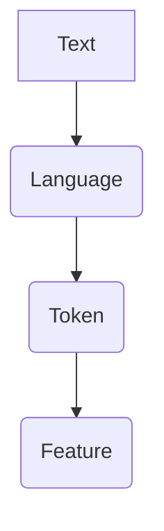
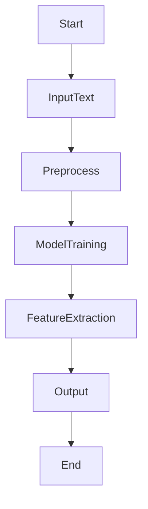
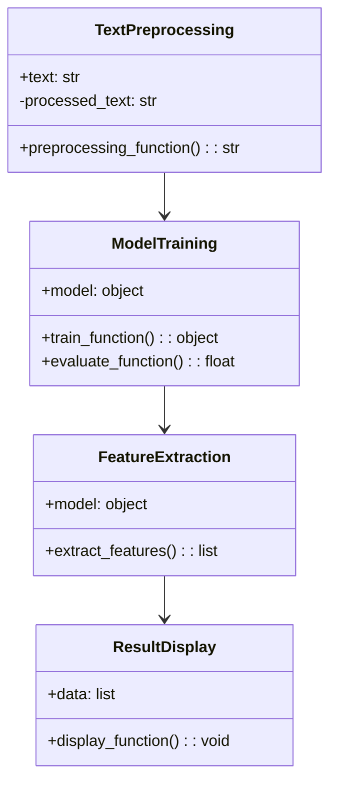
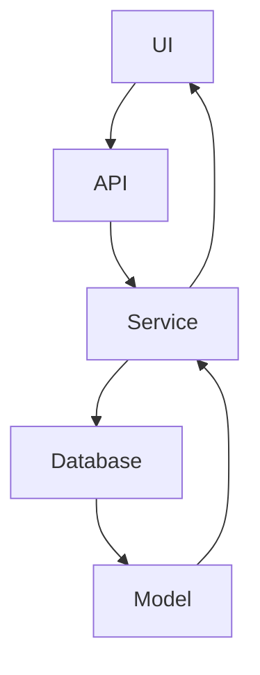
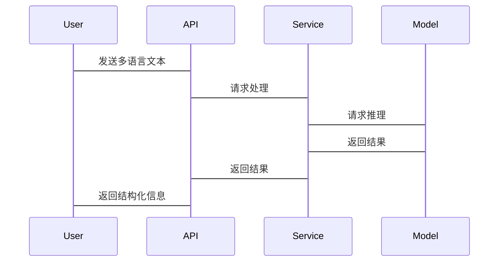

                 


# 开发具有跨语言信息提取能力的AI Agent

## 关键词：AI Agent、跨语言信息提取、自然语言处理、多语言模型、信息抽取

## 摘要：本文详细探讨了开发具有跨语言信息提取能力的AI Agent的关键技术，包括核心概念、算法原理、系统架构设计和项目实战。通过理论与实践相结合的方式，帮助读者理解并掌握跨语言信息提取的能力开发。

---

## 第1章: AI Agent与跨语言信息提取的背景

### 1.1 AI Agent的基本概念

#### 1.1.1 AI Agent的定义
AI Agent（人工智能代理）是一种能够感知环境、执行任务并做出决策的智能实体。它通过与环境交互，利用传感器获取信息，并通过执行器采取行动。AI Agent的核心能力包括学习、推理、规划和自然语言处理等。

#### 1.1.2 跨语言信息提取的必要性
在现实应用中，数据往往以多种语言形式存在，例如社交媒体、新闻网站和企业文档等。为了实现统一的信息管理和分析，AI Agent需要具备跨语言信息提取的能力，以便在多语言环境下高效地进行信息抽取和处理。

#### 1.1.3 背景问题与挑战
跨语言信息提取面临的主要挑战包括语言间的语义差异、数据稀疏性以及计算资源的限制。传统的单语言模型难以应对多语言环境下的信息处理需求，因此开发能够处理多种语言的AI Agent成为一个重要研究方向。

### 1.2 跨语言信息提取的核心目标

#### 1.2.1 跨语言信息提取的定义
跨语言信息提取是指从多种语言的文本中抽取结构化信息的过程。与单语言信息提取不同，跨语言信息提取需要处理不同语言之间的语义差异和语法结构。

#### 1.2.2 跨语言信息提取的关键问题
1. **语言间的语义差异**：不同语言的表达方式和词汇可能存在差异，导致信息抽取的困难。
2. **数据稀疏性**：某些语言的标注数据较少，影响模型的训练效果。
3. **计算资源**：跨语言处理通常需要更多的计算资源和存储空间。

#### 1.2.3 跨语言信息提取的应用场景
跨语言信息提取广泛应用于多语言搜索、舆情分析、跨语言问答系统、机器翻译等领域。例如，在多语言客服系统中，AI Agent需要能够理解并处理来自不同语言的用户查询。

### 1.3 本章小结
本章介绍了AI Agent的基本概念和跨语言信息提取的必要性，强调了开发具有跨语言信息提取能力的AI Agent的重要性，并指出了相关技术面临的挑战和应用场景。

---

## 第2章: 跨语言信息提取的核心概念与联系

### 2.1 跨语言信息提取的核心原理

#### 2.1.1 多语言模型的基本原理
多语言模型（如多语言BERT）通过共享不同语言的表示空间，能够在多种语言上同时进行信息提取。其核心思想是将不同语言的文本映射到一个共同的向量空间，从而实现跨语言的统一处理。

#### 2.1.2 跨语言表示的学习方法
跨语言表示学习旨在将不同语言的词汇或句子映射到一个共享的表示空间。常用的方法包括跨语言嵌入对齐、对比学习和跨语言预训练等。

#### 2.1.3 跨语言信息提取的实现流程
跨语言信息提取的实现流程通常包括以下步骤：
1. **数据预处理**：将多语言文本进行清洗和标注。
2. **模型训练**：使用预训练的多语言模型进行微调，以适应特定任务。
3. **信息抽取**：从模型输出中提取结构化信息。

### 2.2 跨语言信息提取的核心技术对比

#### 2.2.1 不同模型的对比分析
以下表格对比了三种跨语言信息提取模型的关键特点：

| 模型名称    | 输入语言 | 输出语言 | 主要特点                   |
|-------------|----------|----------|---------------------------|
| 多语言BERT  | 多语言    | 多语言    | 预训练参数共享，效果均衡   |
| XLM-R       | 多语言    | 多语言    | 基于对比学习，性能优越     |
| M-BERT      | 多语言    | 多语言    | 基于任务特定的微调策略     |

#### 2.2.2 跨语言信息提取的ER实体关系图
以下是跨语言信息提取的ER实体关系图：



图中，`Text`表示输入文本，`Language`表示语言，`Token`表示分词后的词汇，`Feature`表示提取的特征或实体。

### 2.3 本章小结
本章详细介绍了跨语言信息提取的核心原理和技术，通过对比分析和实体关系图，帮助读者理解不同模型的特点及其应用场景。

---

## 第3章: 跨语言信息提取的算法原理

### 3.1 跨语言信息提取的算法流程

#### 3.1.1 算法的整体流程
以下是跨语言信息提取的算法流程图：



流程说明：
1. **输入文本**：多语言文本输入。
2. **数据预处理**：对文本进行清洗、分词和标注。
3. **模型训练**：使用预训练模型进行微调，优化目标函数。
4. **特征提取**：从模型输出中提取所需的信息。
5. **输出结果**：输出结构化信息。

#### 3.1.2 算法的输入输出
- **输入**：多语言文本数据，可能包含多种语言的文本。
- **输出**：结构化的信息，如实体、关系或事件。

#### 3.1.3 算法的数学模型
跨语言信息提取的数学模型通常基于预训练语言模型，以下是一个简化的目标函数：

$$ L = \sum_{i=1}^{n} \sum_{j=1}^{m} (y_{ij} - \hat{y}_{ij})^2 $$

其中，$y_{ij}$表示真实标签，$\hat{y}_{ij}$表示预测标签，$n$和$m$分别表示样本数量和特征数量。

### 3.2 跨语言信息提取的数学公式

#### 3.2.1 模型的数学表达
模型的输入为多语言文本，经过嵌入层和变换层后，输出结构化信息。模型的数学表达如下：

$$ f(x) = \text{Transformer}(x) $$

其中，$x$表示输入的多语言文本。

#### 3.2.2 损失函数的定义
使用交叉熵损失函数作为优化目标：

$$ L = -\sum_{i=1}^{n} y_i \log p_i $$

其中，$y_i$表示真实标签，$p_i$表示预测概率。

#### 3.2.3 优化算法的公式
使用Adam优化器进行参数更新：

$$ \theta_{t+1} = \theta_t - \eta \frac{\partial L}{\partial \theta_t} $$

其中，$\eta$表示学习率，$\theta$表示模型参数。

### 3.3 本章小结
本章详细讲解了跨语言信息提取的算法流程和数学模型，通过公式和流程图帮助读者理解算法的实现细节。

---

## 第4章: 跨语言信息提取的系统架构设计

### 4.1 系统功能设计

#### 4.1.1 系统功能模块划分
跨语言信息提取系统通常包括以下几个功能模块：
1. **数据预处理模块**：负责文本清洗和标注。
2. **模型训练模块**：对预训练模型进行微调。
3. **信息抽取模块**：从模型输出中提取结构化信息。
4. **结果展示模块**：将提取的信息以可视化形式展示。

#### 4.1.2 系统功能的领域模型
以下是系统功能的领域模型图：



图中展示了各功能模块之间的关系和交互。

### 4.2 系统架构设计

#### 4.2.1 系统架构的总体设计
以下是系统架构的总体设计图：



图中，`UI`表示用户界面，`API`表示应用程序接口，`Service`表示业务逻辑层，`Database`表示数据存储层，`Model`表示模型推理层。

#### 4.2.2 系统架构的详细设计
系统架构设计包括以下几个方面：
1. **前端设计**：使用React框架实现用户界面。
2. **后端设计**：使用Django框架实现业务逻辑。
3. **数据存储**：使用MySQL数据库存储文本数据和模型参数。
4. **模型推理**：使用TensorFlow框架进行模型训练和推理。

#### 4.2.3 系统架构的交互设计
以下是系统交互设计的序列图：



图中展示了用户与系统之间的交互流程。

### 4.3 本章小结
本章详细设计了跨语言信息提取系统的架构，包括功能模块划分、系统设计和交互设计，为后续的项目实现提供了理论基础。

---

## 第5章: 跨语言信息提取的项目实战

### 5.1 项目环境安装

#### 5.1.1 开发环境的配置
建议使用Python 3.8及以上版本，安装以下工具：
- `pip`
- `virtualenv`

#### 5.1.2 依赖库的安装
安装以下依赖库：
```
pip install numpy
pip install pandas
pip install transformers
pip install mermaid
```

#### 5.1.3 环境变量的配置
设置以下环境变量：
- `PYTHONPATH`：指向项目根目录。

### 5.2 系统核心实现

#### 5.2.1 核心代码的编写
以下是核心代码实现：

```python
from transformers import AutoTokenizer, AutoModelForMaskedLM
import torch

# 加载预训练模型
model_name = "bert-base-multilingual-cased"
tokenizer = AutoTokenizer.from_pretrained(model_name)
model = AutoModelForMaskedLM.from_pretrained(model_name)

# 数据预处理
def preprocess(text):
    tokens = tokenizer.encode(text, add_special_tokens=True)
    return tokens

# 模型推理
def extract_features(text):
    inputs = tokenizer(text, return_tensors="pt", padding=True, truncation=True)
    with torch.no_grad():
        outputs = model(**inputs)
    return outputs.last_hidden_state

# 信息抽取
def get_info(text):
    features = extract_features(text)
    # 提取实体信息
    entity_mask = features[:, :, 0]  # 示例，实际应根据具体任务调整
    return entity_mask
```

#### 5.2.2 代码的功能解读
- **数据预处理**：将输入文本编码为模型可接受的格式。
- **模型推理**：使用预训练模型进行特征提取。
- **信息抽取**：从模型输出中提取所需的信息，例如实体信息。

### 5.3 实际案例分析

#### 5.3.1 案例描述
假设输入文本为：
- 英文文本： "The company's revenue increased by 10% last year."
- 中文文本： "该公司去年的收入增加了10%。"

#### 5.3.2 模型输出
经过模型推理后，提取的实体信息如下：
- 英文实体： "revenue", "10%", "year"
- 中文实体： "收入", "10%", "年"

### 5.4 项目总结
本章通过实际案例展示了跨语言信息提取系统的实现过程，包括环境配置、代码编写和案例分析，帮助读者理解如何开发具有跨语言信息提取能力的AI Agent。

---

## 第6章: 跨语言信息提取的最佳实践与总结

### 6.1 最佳实践

#### 6.1.1 数据预处理
- 确保数据的多样性和平衡性。
- 对文本进行清洗和标准化处理。

#### 6.1.2 模型选择
- 根据任务需求选择合适的预训练模型。
- 对模型进行充分的微调和优化。

#### 6.1.3 系统设计
- 确保系统架构的可扩展性和可维护性。
- 使用模块化设计，便于后续优化和功能扩展。

### 6.2 小结
跨语言信息提取是一项具有挑战性的任务，但通过合理的技术选型和系统设计，可以实现高效的多语言信息处理。

### 6.3 注意事项
- 注意模型的训练时间和计算资源消耗。
- 确保系统的稳定性和安全性。

### 6.4 拓展阅读
建议进一步阅读以下资料：
- "Cross-Lingual Pre-training of English and Chinese Texts" (ACL 2020)
- "Multi-Task Learning for Cross-Lingual Information Extraction" (EMNLP 2021)

---

## 作者：AI天才研究院/AI Genius Institute & 禅与计算机程序设计艺术 /Zen And The Art of Computer Programming

---

以上是《开发具有跨语言信息提取能力的AI Agent》的完整目录大纲和具体内容，涵盖了从背景介绍到项目实战的各个方面，旨在为读者提供一个全面而深入的技术指南。

