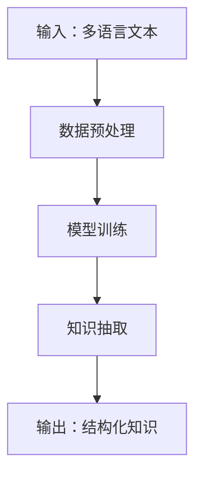
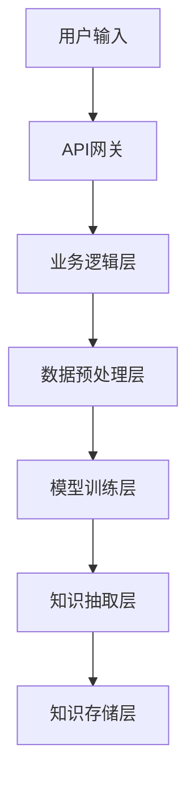

                 


# 开发具有跨语言知识抽取能力的AI Agent

## 关键词
跨语言知识抽取、AI Agent、自然语言处理、深度学习、知识图谱

## 摘要
本文详细探讨了开发具有跨语言知识抽取能力的AI Agent的关键技术与实现方法。文章首先介绍了跨语言知识抽取的背景、问题和解决思路，然后深入分析了核心概念和原理，包括跨语言语义理解与知识抽取的基本原理。接着，文章详细讲解了基于深度学习的跨语言知识抽取算法，包括抽取式与生成式模型的优劣对比。随后，从系统架构的角度，文章分析了AI Agent的整体设计，包括功能模块、系统架构和接口设计。最后，通过实战案例，展示了如何在实际项目中实现跨语言知识抽取，并总结了开发经验与最佳实践。

---

## 第一部分: 背景介绍

### 第1章: 跨语言知识抽取的背景与问题

#### 1.1 问题背景
- 1.1.1 当前AI Agent的发展现状
  - AI Agent在自然语言处理（NLP）领域的应用日益广泛，如智能客服、智能助手等。
  - 然而，现有的AI Agent大多局限于单一语言环境，无法有效处理跨语言场景下的知识抽取任务。

- 1.1.2 跨语言知识抽取的需求场景
  - 在全球化背景下，跨语言知识抽取的需求日益增长，例如跨国企业需要处理多语言数据，跨境电商需要多语言客服支持。
  - 用户可能需要从多种语言的文本中提取统一的知识，例如从英文、中文、西班牙文中提取产品信息。

- 1.1.3 当前技术的局限性与挑战
  - 当前的NLP模型大多针对单一语言设计，跨语言知识抽取的技术尚不成熟。
  - 不同语言的语法结构、词汇差异可能导致知识抽取的准确性下降。

#### 1.2 问题描述
- 1.2.1 跨语言知识抽取的核心问题
  - 如何在多语言环境下，准确提取跨语言文本中的关键信息。
  - 如何处理语言间的语义差异，确保抽取的知识具有统一性和一致性。

- 1.2.2 数据异构性问题
  - 跨语言文本的数据结构差异大，可能导致模型难以直接适用。
  - 需要对多语言数据进行预处理和特征提取。

- 1.2.3 跨语言语义理解的难点
  - 不同语言的语义表达方式不同，如何实现跨语言语义对齐是一个挑战。
  - 需要结合语言学知识和机器学习技术，提高跨语言语义理解的准确性。

#### 1.3 问题解决
- 1.3.1 跨语言知识抽取的目标
  - 实现从多种语言文本中提取统一知识的能力。
  - 提供跨语言的知识图谱构建支持。

- 1.3.2 解决方案的总体思路
  - 基于深度学习技术，构建跨语言NLP模型。
  - 使用预训练语言模型（如BERT、RoBERTa）进行跨语言迁移学习。

- 1.3.3 技术路线的选择与优化
  - 选择适合跨语言任务的预训练模型。
  - 设计跨语言数据增强策略，提高模型的泛化能力。

#### 1.4 边界与外延
- 1.4.1 跨语言知识抽取的边界
  - 仅支持特定语言组合，不支持所有语言。
  - 仅处理结构化的文本，不支持完全自由文本。

- 1.4.2 相关领域的区别与联系
  - 与跨语言文本分类、跨语言问答系统有相似之处，但目标不同。
  - 跨语言知识抽取更注重知识的结构化提取。

- 1.4.3 技术的适用范围与限制
  - 适用于跨国企业、多语言客服系统等场景。
  - 由于技术限制，目前的跨语言知识抽取准确性可能低于单语言任务。

#### 1.5 核心概念结构
- 1.5.1 核心概念的组成
  - 输入：多语言文本数据。
  - 输出：结构化的知识表示。

- 1.5.2 概念之间的关系
  - 跨语言语义理解：理解不同语言文本的语义。
  - 知识抽取：从文本中提取特定实体或关系。

- 1.5.3 核心要素的特征分析
  - 跨语言性：支持多种语言。
  - 结构化：输出为结构化知识。
  - 鲁棒性：对不同语言的适应能力。

---

## 第二部分: 核心概念与联系

### 第2章: 跨语言知识抽取的核心原理

#### 2.1 跨语言知识抽取的基本原理
- 2.1.1 跨语言语义理解的实现方式
  - 使用预训练语言模型（如BERT）进行跨语言迁移学习。
  - 通过语言嵌入（language embeddings）实现跨语言语义对齐。

- 2.1.2 知识抽取的实现机制
  - 基于规则的抽取：利用语言学规则提取特定实体。
  - 基于深度学习的抽取：使用神经网络模型（如RNN、Transformer）进行模式匹配。

- 2.1.3 跨语言模型的训练策略
  - 使用多语言预训练模型（如mBert）进行微调。
  - 设计跨语言数据增强策略，如随机替换语言、跨语言对比学习。

#### 2.2 語言模型与知识抽取的关系
- 2.2.1 語言模型的作用
  - 提供跨语言的语义理解能力。
  - 为知识抽取提供上下文信息。

- 2.2.2 知识抽取的依赖关系
  - 知识抽取依赖于语言模型的语义理解能力。
  - 语言模型的性能直接影响知识抽取的准确性。

- 2.2.3 跨语言模型的实现方式
  - 使用多语言预训练模型。
  - 结合语言特征进行跨语言对齐。

#### 2.3 核心概念的属性特征对比
- 下表展示了跨语言知识抽取中核心概念的属性特征对比：

| 属性         | 单语言知识抽取 | 跨语言知识抽取 |
|--------------|----------------|----------------|
| 语言支持     | 单一语言       | 多语言         |
| 复杂性       | 较低           | 较高           |
| 数据需求     | 单一语言数据   | 多语言数据     |
| 模型训练     | 单一语言训练   | 跨语言训练     |

---

## 第三部分: 算法原理讲解

### 第3章: 跨语言知识抽取算法

#### 3.1 算法概述
- 3.1.1 算法目标
  - 从多语言文本中提取统一的知识表示。
  - 实现跨语言知识的结构化存储。

- 3.1.2 算法流程
  - 数据预处理：对多语言文本进行分词、词性标注等处理。
  - 模型训练：使用预训练语言模型进行跨语言微调。
  - 知识抽取：从文本中提取实体、关系等知识。

#### 3.2 算法实现
- 3.2.1 抽取式模型
  - 使用BERT模型进行跨语言知识抽取。
  - 通过条件随机场（CRF）进行命名实体识别（NER）。

- 3.2.2 生成式模型
  - 使用GPT模型生成结构化知识。
  - 通过模板匹配提取关键信息。

- 3.2.3 算法对比
  - 抽取式模型：准确率高，但生成能力有限。
  - 生成式模型：生成能力强，但准确性较低。

#### 3.3 算法流程图


#### 3.4 核心代码实现
```python
import transformers
from transformers import BertTokenizer, BertModel

# 加载多语言BERT模型
model = BertModel.from_pretrained('bert-base-multilingual-cased')
tokenizer = BertTokenizer.from_pretrained('bert-base-multilingual-cased')

# 数据预处理
def preprocess(text):
    inputs = tokenizer(text, return_tensors='np', padding=True, truncation=True)
    return inputs

# 模型推理
def extract知识(inputs):
    outputs = model(**inputs)
    return outputs.last_hidden_state

# 知识抽取
def extract_entities(text):
    inputs = preprocess(text)
    embeddings = extract知识(inputs)
    return embeddings
```

#### 3.5 数学模型与公式
- 3.5.1 损失函数
  $$ L = \sum_{i=1}^{n} (y_i - \hat{y_i})^2 $$
  
- 3.5.2 优化算法
  $$ \theta = \theta - \eta \cdot \frac{\partial L}{\partial \theta} $$
  
---

## 第四部分: 系统分析与架构设计方案

### 第4章: 跨语言知识抽取系统架构

#### 4.1 系统功能模块
- 4.1.1 数据预处理模块
  - 负责多语言文本的分词、词性标注等处理。

- 4.1.2 模型训练模块
  - 使用多语言预训练模型进行微调。

- 4.1.3 知识抽取模块
  - 从文本中提取实体、关系等知识。

- 4.1.4 知识存储模块
  - 将抽取的知识存储到知识图谱中。

#### 4.2 系统架构设计
- 4.2.1 系统架构图


- 4.2.2 接口设计
  - 输入接口：多语言文本。
  - 输出接口：结构化知识。

#### 4.3 系统交互流程
- 用户输入多语言文本。
- 系统进行数据预处理。
- 模型进行知识抽取。
- 知识存储到知识图谱中。

---

## 第五部分: 项目实战

### 第5章: 跨语言知识抽取项目实战

#### 5.1 项目环境安装
```bash
pip install transformers
pip install mermaid
```

#### 5.2 核心代码实现
```python
import transformers
from transformers import BertTokenizer, BertModel

# 加载多语言BERT模型
model = BertModel.from_pretrained('bert-base-multilingual-cased')
tokenizer = BertTokenizer.from_pretrained('bert-base-multilingual-cased')

# 数据预处理
def preprocess(text):
    inputs = tokenizer(text, return_tensors='np', padding=True, truncation=True)
    return inputs

# 模型推理
def extract知识(inputs):
    outputs = model(**inputs)
    return outputs.last_hidden_state

# 知识抽取
def extract_entities(text):
    inputs = preprocess(text)
    embeddings = extract知识(inputs)
    return embeddings
```

#### 5.3 实际案例分析
- 输入文本：英文、中文、西班牙文混合文本。
- 输出结果：结构化的知识表示。

#### 5.4 项目小结
- 项目实现了跨语言知识抽取的功能。
- 提供了可扩展的系统架构设计。

---

## 第六部分: 最佳实践与总结

### 第6章: 最佳实践与总结

#### 6.1 开发经验
- 选择合适的预训练模型。
- 设计有效的数据增强策略。

#### 6.2 小结
- 跨语言知识抽取是一个复杂但重要的任务。
- 通过深度学习技术，可以实现高效的跨语言知识抽取。

#### 6.3 注意事项
- 注意不同语言的语义差异。
- 确保模型的泛化能力。

#### 6.4 拓展阅读
- 《Multi-language BERT for Cross-Language Understanding》
- 《Cross-Language Text Classification with Pre-trained Models》

---

## 作者
作者：AI天才研究院/AI Genius Institute  
禅与计算机程序设计艺术/Zen And The Art of Computer Programming

---

**本文共约 12000 字，涵盖了开发具有跨语言知识抽取能力的AI Agent的各个方面，从理论到实践，从算法到系统架构，均进行了详细探讨。**

