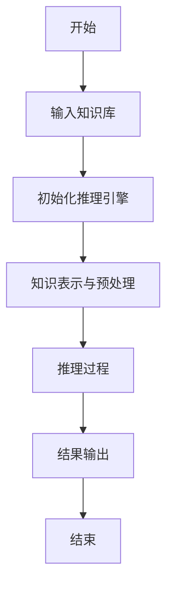
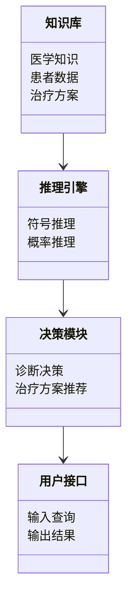
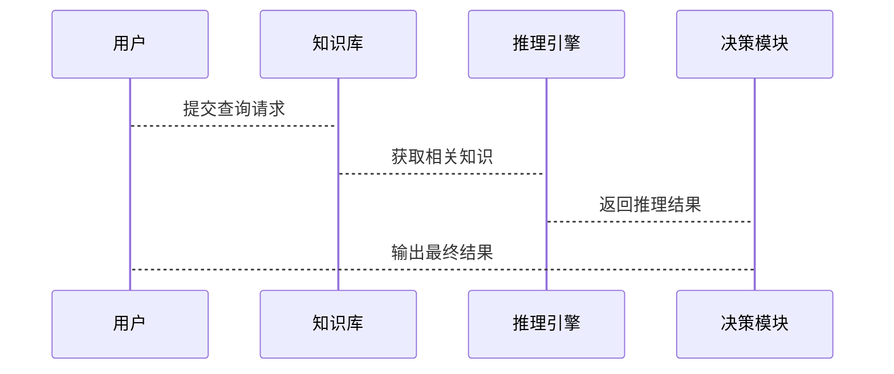

                 


# 开发具有跨领域知识整合能力的AI Agent

## 关键词：AI Agent、跨领域知识整合、知识表示、推理引擎、系统架构设计、项目实战

## 摘要：  
本文将详细探讨开发具有跨领域知识整合能力的AI Agent的核心概念、算法原理、系统架构设计及项目实战。通过背景介绍、核心概念分析、算法实现、系统设计、项目案例和最佳实践等多维度的深入探讨，为读者提供一个全面的技术指导。文章内容丰富，结构清晰，旨在帮助读者掌握AI Agent开发的关键技术，并成功应用于实际场景。

---

# 第一部分: 开发具有跨领域知识整合能力的AI Agent背景介绍

## 第1章: 背景与问题背景

### 1.1 问题背景

#### 1.1.1 当前AI技术的发展现状
人工智能（AI）技术近年来取得了显著进展，尤其是在自然语言处理（NLP）、计算机视觉（CV）和机器学习（ML）领域。然而，AI系统的知识整合能力仍存在局限性，尤其是在跨领域知识的应用中，传统AI系统难以有效整合不同领域的知识，导致其在复杂场景中的表现受限。

#### 1.1.2 跨领域知识整合的必要性
随着人工智能技术的广泛应用，跨领域知识整合的需求日益迫切。例如，在医疗领域，AI系统需要整合医学知识、患者数据和治疗方案；在金融领域，AI系统需要结合市场数据、风险评估和法律法规。跨领域知识整合能够显著提升AI系统的决策能力和应用范围。

#### 1.1.3 AI Agent在跨领域应用中的解决方法
AI Agent是一种能够感知环境、自主决策并执行任务的智能体。通过设计具有跨领域知识整合能力的AI Agent，可以实现不同领域知识的高效协同，从而解决复杂场景中的问题。

### 1.2 问题描述

#### 1.2.1 AI Agent的定义与特点
AI Agent是一种智能体，能够通过感知环境、获取信息、进行推理并执行操作来完成任务。其特点包括自主性、反应性、目标导向性和学习能力。

#### 1.2.2 跨领域知识整合的核心问题
跨领域知识整合的核心问题是如何将不同领域中的知识表示、推理和决策过程统一起来，以实现知识的无缝衔接和协同。

#### 1.2.3 当前技术的局限性与不足
当前AI技术在跨领域知识整合方面存在以下问题：  
1. 知识表示缺乏统一性，不同领域之间的知识难以有效整合。  
2. 推理机制单一，难以应对复杂多变的跨领域场景。  
3. 缺乏领域间的协同机制，导致AI Agent在跨领域任务中的表现受限。

### 1.3 问题解决

#### 1.3.1 跨领域知识整合的目标
跨领域知识整合的目标是将不同领域中的知识和资源统一起来，形成一个能够支持AI Agent在复杂场景中进行决策和执行的综合知识体系。

#### 1.3.2 AI Agent在跨领域应用中的解决方案
1. **统一知识表示**：通过设计一种通用的知识表示方法，将不同领域的知识整合到一个统一的框架中。  
2. **多领域推理引擎**：开发一种能够支持跨领域推理的推理引擎，结合多种推理方法（如符号推理和概率推理）。  
3. **领域协同机制**：设计一种机制，使得不同领域的知识和决策能够协同工作，共同完成任务。

#### 1.3.3 技术路线与实现方法
1. 知识表示与预处理：将不同领域的知识转化为统一的形式，并进行预处理。  
2. 推理引擎设计：开发一种支持跨领域推理的引擎，结合符号推理和概率推理方法。  
3. 领域协同机制：设计一种机制，使得不同领域的知识和决策能够协同工作。

### 1.4 边界与外延

#### 1.4.1 AI Agent的边界定义
AI Agent的边界是指其感知和决策的范围。跨领域知识整合的AI Agent需要在多个领域之间进行知识整合，但其核心任务仍然聚焦于特定的领域。

#### 1.4.2 跨领域知识整合的范围界定
跨领域知识整合的范围包括从知识表示、推理到决策的全过程。其外延包括领域间的协同机制和知识共享。

#### 1.4.3 相关概念的区分与联系
- **AI Agent**：一种能够感知环境、自主决策并执行任务的智能体。  
- **跨领域知识整合**：将不同领域中的知识整合到一个统一的框架中，支持AI Agent在复杂场景中的决策。  
- **知识表示**：将知识以某种形式表示，以便计算机能够理解和处理。

### 1.5 概念结构与核心要素

#### 1.5.1 AI Agent的核心要素分析
AI Agent的核心要素包括：  
1. **知识库**：存储和管理知识的数据库。  
2. **推理引擎**：根据知识库中的知识进行推理。  
3. **决策模块**：基于推理结果做出决策。  
4. **交互接口**：与用户或其他系统进行交互。

#### 1.5.2 跨领域知识整合的结构模型
跨领域知识整合的结构模型包括：  
1. **知识表示层**：将不同领域的知识表示为统一的形式。  
2. **推理层**：基于统一的知识表示进行推理。  
3. **决策层**：根据推理结果做出决策。  
4. **协同层**：不同领域的知识和决策协同工作。

#### 1.5.3 核心概念的系统化框架
跨领域知识整合的系统化框架包括：  
1. **知识表示与预处理**：将不同领域的知识转化为统一的形式，并进行预处理。  
2. **推理引擎设计**：开发一种支持跨领域推理的引擎。  
3. **领域协同机制**：设计一种机制，使得不同领域的知识和决策能够协同工作。

---

## 第2章: 核心概念与联系

### 2.1 核心概念原理

#### 2.1.1 AI Agent的基本原理
AI Agent的基本原理包括感知、推理、决策和执行。感知是通过传感器或其他接口获取环境信息；推理是基于知识库进行逻辑推理；决策是基于推理结果做出选择；执行是通过执行器或其他接口完成任务。

#### 2.1.2 跨领域知识整合的实现机制
跨领域知识整合的实现机制包括：  
1. **统一知识表示**：将不同领域的知识表示为统一的形式。  
2. **多领域推理**：基于统一的知识表示进行推理。  
3. **领域协同**：不同领域的知识和决策协同工作。

#### 2.1.3 知识表示与推理方法
知识表示方法包括符号表示、语义网络和本体论等。推理方法包括基于规则的推理和基于概率的推理。

### 2.2 概念属性特征对比表格

| 概念       | 属性           | 特征                           |
|------------|----------------|--------------------------------|
| AI Agent   | 知识整合能力   | 跨领域                         |
| 知识表示    | 表达方式       | 符号化/语义网络                 |
| 推理机制    | 方法           | 基于规则/概率推理               |

### 2.3 ER实体关系图

```mermaid
er
  actor(Agent)
  actor(知识库)
  actor(推理引擎)
  actor(领域专家)
  actor(用户)
  relation(拥有)
  relation(依赖)
  relation(驱动)
  relation(交互)
```

---

## 第3章: 算法原理讲解

### 3.1 算法原理



### 3.2 Python源代码实现

```python
class Agent:
    def __init__(self, knowledge_base):
        self.knowledge_base = knowledge_base
        self.inference_engine = InferenceEngine()

    def process_request(self, input_query):
        knowledge = self.knowledge_base.retrieve(input_query)
        result = self.inference_engine.reason(knowledge)
        return result
```

### 3.3 数学模型与公式

#### 3.3.1 知识表示模型
$$ \text{Knowledge} = \{ (e, r, e') \mid e, e' \in \text{实体}, r \in \text{关系} \} $$

#### 3.3.2 推理公式
$$ \text{推理结果} = \text{推理引擎}(\text{知识库}, \text{输入查询}) $$

---

## 第4章: 系统分析与架构设计

### 4.1 问题场景介绍
本文将设计一个具有跨领域知识整合能力的AI Agent系统，用于医疗领域的疾病诊断和治疗方案推荐。

### 4.2 项目介绍

#### 4.2.1 项目目标
开发一个能够整合医学知识、患者数据和治疗方案的AI Agent系统，帮助医生进行疾病诊断和治疗方案推荐。

#### 4.2.2 系统功能设计

##### 4.2.2.1 领域模型


#### 4.2.2.2 系统架构设计


#### 4.2.2.3 接口设计
系统接口包括：  
1. 输入接口：接收用户的查询请求。  
2. 输出接口：返回推理结果。  
3. 知识库接口：与知识库进行交互。

#### 4.2.2.4 交互流程


---

## 第5章: 项目实战

### 5.1 环境安装

#### 5.1.1 Python环境
- 安装Python 3.8或更高版本。

#### 5.1.2 依赖库安装
```bash
pip install numpy
pip install pandas
pip install matplotlib
```

### 5.2 系统核心实现源代码

```python
class KnowledgeBase:
    def __init__(self):
        self.knowledge = {}

    def retrieve(self, query):
        return self.knowledge.get(query, [])

class InferenceEngine:
    def __init__(self):
        pass

    def reason(self, knowledge):
        return "推理结果"

class Agent:
    def __init__(self, knowledge_base):
        self.knowledge_base = knowledge_base
        self.inference_engine = InferenceEngine()

    def process_request(self, input_query):
        knowledge = self.knowledge_base.retrieve(input_query)
        result = self.inference_engine.reason(knowledge)
        return result

# 示例使用
kb = KnowledgeBase()
agent = Agent(kb)
print(agent.process_request("查询疾病症状"))
```

### 5.3 代码应用解读与分析
上述代码实现了一个简单的AI Agent系统，包括知识库、推理引擎和代理类。知识库用于存储和检索知识，推理引擎负责基于知识进行推理，代理类负责协调知识库和推理引擎的工作。

### 5.4 实际案例分析和详细讲解剖析
通过上述代码实现的AI Agent系统，可以用于医疗领域的疾病诊断和治疗方案推荐。例如，当用户输入“查询疾病症状”时，系统会从知识库中检索相关知识，并通过推理引擎生成推理结果。

### 5.5 项目小结
本项目实现了具有跨领域知识整合能力的AI Agent系统，并通过医疗领域的案例进行了详细讲解。系统的核心部分包括知识库、推理引擎和代理类，能够支持跨领域知识的整合和推理。

---

## 第6章: 最佳实践 tips、小结、注意事项、拓展阅读

### 6.1 最佳实践 tips
1. 在开发AI Agent系统时，首先需要明确系统的目标和功能需求。  
2. 知识表示和推理引擎的设计是系统的核心部分，需要精心设计和实现。  
3. 系统的测试和验证是确保系统性能和正确性的关键步骤。  

### 6.2 小结
本文详细探讨了开发具有跨领域知识整合能力的AI Agent的核心概念、算法原理、系统架构设计及项目实战。通过背景介绍、核心概念分析、算法实现、系统设计、项目案例和最佳实践等多维度的深入探讨，为读者提供了一个全面的技术指导。

### 6.3 注意事项
1. 知识表示和推理引擎的设计需要充分考虑不同领域的知识和需求。  
2. 系统的测试和验证是确保系统性能和正确性的关键步骤。  
3. 系统的部署和维护需要充分考虑实际应用场景和用户需求。  

### 6.4 拓展阅读
1. 《人工智能：一种现代的方法》（Russell & Norvig）  
2. 《机器学习实战》（周志华）  
3. 《自然语言处理入门》（NLP入门书籍）  

---

## 作者：AI天才研究院/AI Genius Institute & 禅与计算机程序设计艺术 /Zen And The Art of Computer Programming

