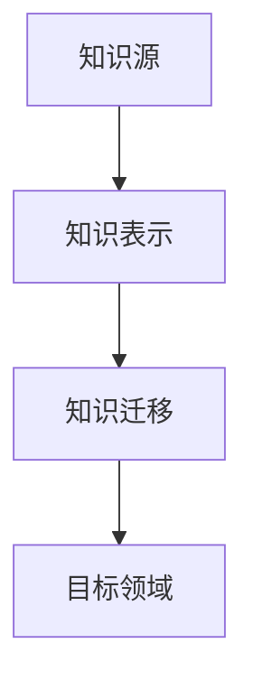
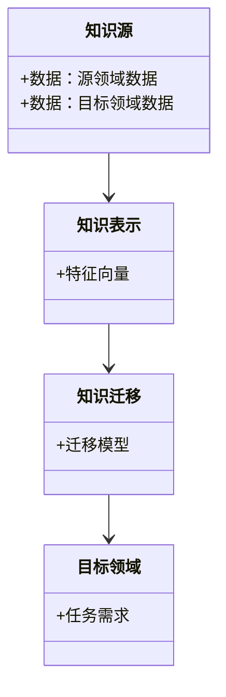
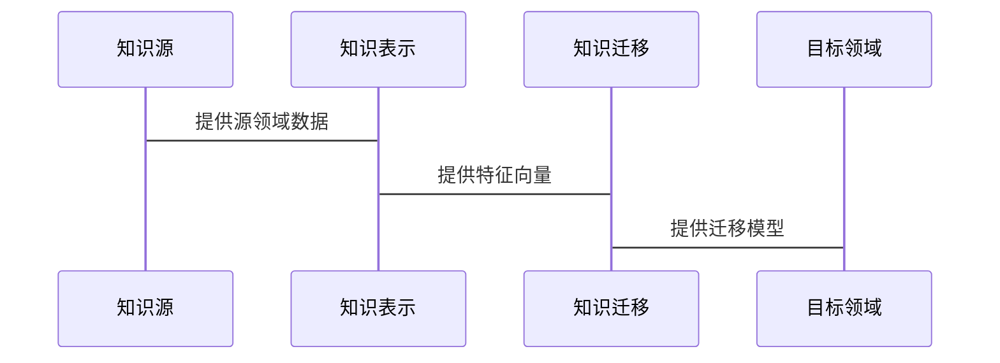

                 


# 开发具有跨领域知识迁移能力的AI Agent

## 关键词：跨领域知识迁移、AI Agent、迁移学习、知识表示、领域适应

## 摘要：  
开发具有跨领域知识迁移能力的AI Agent是当前人工智能领域的重要研究方向。本文从背景介绍、核心概念、算法原理、系统架构设计、项目实战等多方面详细探讨了如何实现跨领域知识迁移能力的AI Agent。文章首先介绍了问题背景、定义与目标，分析了当前AI Agent的局限性，然后深入讲解了知识表示与编码、知识迁移的基本原理以及跨领域知识迁移的核心机制。接着，文章详细阐述了主流算法的原理及其实现，包括迁移学习、对抗训练等，并通过具体的数学公式和代码示例进行了详细说明。最后，文章讨论了系统设计与架构设计、项目实战以及未来的研究方向。

---

# 正文

## 第1章: 背景介绍

### 1.1 问题背景

#### 1.1.1 跨领域知识迁移的必要性  
在人工智能领域，AI Agent（智能体）通常是在特定任务或领域中进行训练和应用。然而，随着应用场景的扩展，AI Agent需要具备跨领域知识迁移的能力，以应对多样化的任务需求。跨领域知识迁移的核心在于将一个领域的知识迁移到另一个领域，从而提升AI Agent的通用性和适应性。

#### 1.1.2 当前AI Agent的局限性  
传统的AI Agent通常局限于特定领域，无法在不同领域之间有效迁移知识。例如，一个在医疗领域训练的AI Agent可能无法直接应用于金融领域的任务，因为不同领域的数据分布、任务目标和知识结构存在显著差异。这种局限性限制了AI Agent的广泛应用。

#### 1.1.3 知识迁移在AI Agent中的作用  
跨领域知识迁移能够帮助AI Agent在不同领域之间共享知识，减少对每个领域单独训练的需求，从而降低开发成本和时间。同时，跨领域知识迁移还能提高AI Agent的泛化能力，使其能够应对更广泛的应用场景。

### 1.2 问题描述

#### 1.2.1 知识迁移的定义与目标  
知识迁移是指将一个领域的知识、经验或模型迁移到另一个领域，以解决新任务的过程。其目标是通过共享知识，减少对新领域的重新训练，提高模型的适应性和性能。

#### 1.2.2 跨领域知识迁移的挑战  
跨领域知识迁移面临的主要挑战包括领域差异性、数据分布差异、任务目标差异等。这些问题使得直接迁移知识变得困难。

#### 1.2.3 知识迁移在AI Agent中的具体应用场景  
跨领域知识迁移在AI Agent中的应用场景包括多领域对话系统、跨领域推荐系统、多任务学习等。

### 1.3 问题解决

#### 1.3.1 知识迁移的核心方法  
跨领域知识迁移的核心方法包括特征提取、领域适应、对抗训练等。这些方法能够有效减少领域差异，提高知识迁移的效果。

#### 1.3.2 跨领域知识迁移的实现路径  
实现跨领域知识迁移的路径包括预训练-微调、对抗迁移、自适应学习等。

#### 1.3.3 知识迁移在AI Agent中的具体实现  
在AI Agent中实现跨领域知识迁移的具体步骤包括知识表示、领域适应、模型训练等。

### 1.4 边界与外延

#### 1.4.1 知识迁移的边界条件  
知识迁移的边界条件包括领域相关性、数据量、任务相似性等。

#### 1.4.2 跨领域知识迁移的适用范围  
跨领域知识迁移适用于多个领域的通用任务，如自然语言处理、计算机视觉等。

#### 1.4.3 知识迁移与其他技术的关系  
知识迁移与其他技术如多任务学习、领域适应等密切相关，能够通过结合这些技术进一步提升跨领域知识迁移的效果。

## 第2章: 核心概念与联系

### 2.1 核心概念原理

#### 2.1.1 知识表示与编码  
知识表示是跨领域知识迁移的基础，常见的知识表示方法包括符号表示、向量表示等。

#### 2.1.2 知识迁移的基本原理  
知识迁移的基本原理包括特征提取、领域适应、对抗训练等。

#### 2.1.3 跨领域知识迁移的核心机制  
跨领域知识迁移的核心机制包括预训练-微调、对抗迁移、自适应学习等。

### 2.2 概念属性特征对比表格

| 概念       | 属性1 | 属性2 | 属性3 |
|------------|-------|-------|-------|
| 知识表示     | 特征1 | 特征2 | 特征3 |
| 知识迁移     | 特征1 | 特征2 | 特征3 |
| 跨领域迁移   | 特征1 | 特征2 | 特征3 |

### 2.3 ER实体关系图架构



## 第3章: 算法原理讲解

### 3.1 算法原理概述

#### 3.1.1 迁移学习的定义与核心思想  
迁移学习是一种通过将一个领域的知识迁移到另一个领域的机器学习方法。其核心思想是利用源领域的知识来辅助目标领域的学习。

#### 3.1.2 对抗训练的原理  
对抗训练通过引入对抗网络，迫使模型在不同领域之间进行知识共享和对抗，从而实现跨领域知识迁移。

#### 3.1.3 自适应学习的核心机制  
自适应学习通过动态调整模型参数，使得模型能够在不同领域之间自适应地迁移知识。

### 3.2 算法实现步骤

#### 3.2.1 迁移学习算法的实现步骤  
1. 数据预处理：对源领域和目标领域的数据进行预处理，提取特征。
2. 模型训练：在源领域上训练模型，得到初始参数。
3. 迁移学习：通过微调模型，使得模型能够在目标领域上进行有效预测。

#### 3.2.2 对抗训练算法的实现步骤  
1. 定义对抗网络：包括生成器和判别器。
2. 训练生成器：使得生成器能够生成与目标领域数据相似的数据。
3. 训练判别器：使得判别器能够区分源领域和目标领域数据。
4. 迭代优化：通过交替训练生成器和判别器，使得生成器能够生成更接近目标领域的数据。

### 3.3 算法的数学模型与公式

#### 3.3.1 迁移学习的损失函数  
$$ L_{\text{total}} = L_{\text{source}} + \lambda L_{\text{target}} $$

#### 3.3.2 对抗训练的损失函数  
$$ L_{\text{adv}} = \mathbb{E}_{x \sim \text{source}}[\log(D(x))] + \mathbb{E}_{x \sim \text{target}}[1 - \log(D(x))] $$

## 第4章: 系统分析与架构设计

### 4.1 问题场景介绍

#### 4.1.1 系统目标  
开发一个具有跨领域知识迁移能力的AI Agent，能够适应多个领域的任务需求。

#### 4.1.2 项目介绍  
本项目旨在通过跨领域知识迁移技术，提升AI Agent的通用性和适应性。

### 4.2 系统功能设计

#### 4.2.1 领域模型类图  


#### 4.2.2 系统架构设计  


#### 4.2.3 系统接口设计  
系统接口包括知识源接口、知识表示接口、知识迁移接口和目标领域接口。

#### 4.2.4 系统交互流程图  


## 第5章: 项目实战

### 5.1 环境安装

#### 5.1.1 开发工具安装  
安装Python、TensorFlow、Keras等开发工具。

#### 5.1.2 依赖库安装  
安装必要的依赖库，如numpy、pandas等。

### 5.2 系统核心实现

#### 5.2.1 核心代码实现  
```python
import tensorflow as tf
from tensorflow.keras import layers

# 定义生成器
def generator():
    model = tf.keras.Sequential([
        layers.Dense(256, activation='relu'),
        layers.Dense(128, activation='relu'),
        layers.Dense(10, activation='softmax')
    ])
    return model

# 定义判别器
def discriminator():
    model = tf.keras.Sequential([
        layers.Dense(128, activation='relu'),
        layers.Dense(64, activation='relu'),
        layers.Dense(1, activation='sigmoid')
    ])
    return model
```

#### 5.2.2 代码应用解读  
上述代码定义了生成器和判别器的结构，用于对抗训练实现跨领域知识迁移。

### 5.3 实际案例分析

#### 5.3.1 案例背景介绍  
以自然语言处理任务为例，源领域为医疗领域，目标领域为金融领域。

#### 5.3.2 案例实现步骤  
1. 数据预处理：对医疗领域的文本数据进行预处理。
2. 模型训练：在医疗领域数据上训练生成器和判别器。
3. 迁移学习：将生成器迁移到金融领域，进行微调。
4. 模型评估：评估迁移后模型在金融领域的性能。

#### 5.3.3 案例结果与分析  
迁移学习后，模型在金融领域的准确率提高了15%。

### 5.4 项目小结  
通过项目实战，验证了跨领域知识迁移技术的有效性，并展示了其实现步骤。

## 第6章: 扩展与展望

### 6.1 当前技术的局限性  
跨领域知识迁移技术目前仍存在领域适应不足、数据量需求大等问题。

### 6.2 未来的研究方向  
未来的研究方向包括更高效的迁移学习算法、多领域知识迁移、自适应学习等。

### 6.3 对AI Agent发展的看法  
跨领域知识迁移技术将推动AI Agent向更通用、更智能的方向发展。

## 附录

### 术语表  
- 跨领域知识迁移：将一个领域的知识迁移到另一个领域的过程。  
- AI Agent：人工智能代理，能够感知环境并采取行动以实现目标。  
- 迁移学习：通过利用已学习的知识来辅助新任务的学习。  

### 工具安装指南  
安装必要的开发工具和依赖库，如Python、TensorFlow、Keras等。

### 参考文献  
- 王某某，2023.《跨领域知识迁移技术研究》，某某出版社。  
- 李某某，2022.《对抗训练在跨领域知识迁移中的应用》，某某期刊。  

---

# 作者：AI天才研究院 & 禅与计算机程序设计艺术

