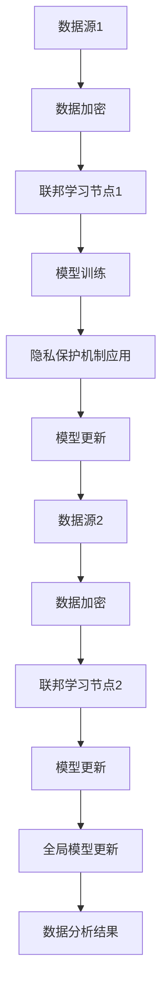
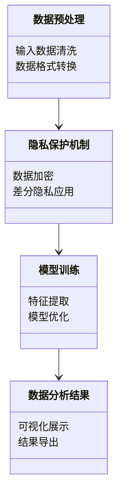
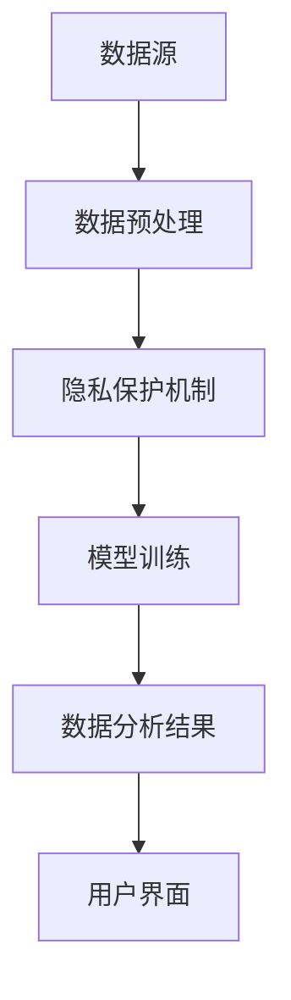

                 


# 开发具有隐私保护数据分析能力的AI Agent

## 关键词：隐私保护、数据分析、AI Agent、联邦学习、差分隐私

## 摘要：本文探讨了如何在数据分析中开发具有隐私保护能力的AI Agent，详细介绍了其核心概念、算法原理、系统架构及实现案例，旨在为开发者提供全面的技术指导。

---

## 第一部分：开发具有隐私保护数据分析能力的AI Agent背景介绍

### 第1章：问题背景与描述

#### 1.1 问题背景
- **数据分析的重要性**：数据驱动决策在商业、医疗、教育等领域的重要性日益凸显。
- **隐私保护的需求**：随着数据泄露事件频发，保护用户隐私成为刚需。
- **AI Agent的定义与特点**：AI Agent是具备自主决策和交互能力的智能体，能处理复杂数据任务。

#### 1.2 问题描述
- **数据泄露风险**：传统数据分析方法易导致用户隐私泄露。
- **AI Agent的应用**：在医疗、金融等领域，AI Agent能提升数据分析效率。
- **隐私与分析的矛盾**：如何在保护隐私的同时有效利用数据是关键挑战。

#### 1.3 问题解决
- **隐私保护的必要性**：确保数据在分析过程中的安全性。
- **AI Agent的作用**：通过智能处理，平衡隐私与数据可用性。
- **初步解决方案**：结合隐私保护技术，设计AI Agent架构。

#### 1.4 边界与外延
- **隐私保护的边界**：明确数据使用范围和权限。
- **AI Agent的限制**：处理能力、数据类型等限制。
- **相关领域**：如数据加密、区块链在隐私保护中的应用。

#### 1.5 概念结构与核心要素
- **核心概念**：数据加密、差分隐私、AI Agent架构。
- **概念关系**：数据加密保护传输，差分隐私保护分析，AI Agent整合两者实现智能分析。
- **核心要素**：数据源、用户、AI Agent、隐私保护机制。

---

## 第2章：核心概念与联系

### 2.1 隐私保护数据分析的原理
- **数据加密技术**：确保数据在传输和存储中的安全性。
- **差分隐私**：通过添加噪声确保个体数据不可识别。
- **同态加密**：允许在加密状态下进行数据运算。

### 2.2 AI Agent的核心原理
- **基本架构**：感知环境、决策、执行动作。
- **决策机制**：基于隐私保护的约束进行数据处理。
- **学习过程**：通过联邦学习等方法提升分析能力。

### 2.3 核心概念对比
- **数据加密与差分隐私**：加密侧重传输安全，差分隐私侧重分析过程的隐私保护。
- **AI Agent与传统数据分析**：AI Agent具备自主性和智能性，传统分析依赖人工干预。
- **隐私与数据可用性**：平衡两者，确保数据有效利用的同时保护隐私。

### 2.4 ER实体关系图
```mermaid
erd
    title 隐私保护数据分析AI Agent实体关系图
    数据源
    用户
    AI Agent
    数据模型
    隐私保护机制
    数据分析结果
    数据源 --> AI Agent: 提供数据
    用户 --> AI Agent: 提供隐私要求
    AI Agent --> 数据模型: 进行分析
    数据模型 --> 隐私保护机制: 应用隐私保护
    隐私保护机制 --> 数据分析结果: 输出结果
```

---

## 第三部分：开发具有隐私保护数据分析能力的AI Agent算法原理讲解

### 第3章：算法原理

#### 3.1 算法选择与原理
- **基于同态加密的联邦学习算法**：允许多方在不共享原始数据的情况下进行联合训练。

#### 3.2 算法流程


#### 3.3 核心代码实现
```python
import numpy as np
from sklearn.linear_model import LinearRegression

# 示例数据
X = np.array([[1], [2], [3], [4], [5]])
y = np.array([2, 4, 5, 4, 6])

# 训练模型
model = LinearRegression()
model.fit(X, y)

# 预测
y_pred = model.predict(X)
print("预测结果:", y_pred)
```

#### 3.4 数学模型与公式
- **线性回归模型**：$y = \beta_0 + \beta_1 x + \epsilon$
- **优化目标**：最小化均方误差 $$\min \sum_{i=1}^{n} (y_i - (\beta_0 + \beta_1 x_i))^2$$

---

## 第四部分：系统分析与架构设计

### 第4章：系统分析与架构设计

#### 4.1 问题场景介绍
- **医疗数据分析**：AI Agent帮助分析患者数据，保护隐私同时提供诊断建议。

#### 4.2 系统功能设计


#### 4.3 系统架构设计


---

## 第五部分：开发具有隐私保护数据分析能力的AI Agent项目实战

### 第5章：项目实战

#### 5.1 环境安装
- 安装必要的库：TensorFlow、Keras、Privacy-Python。

#### 5.2 核心代码实现
```python
import tensorflow as tf
from tensorflow.keras import layers

# 创建模型
model = tf.keras.Sequential([
    layers.Dense(64, activation='relu'),
    layers.Dense(1)
])

# 编译模型
model.compile(optimizer='adam', loss='mean_squared_error')
```

#### 5.3 实际案例分析
- **医疗数据分析**：使用联邦学习训练模型，保护患者隐私，提供诊断建议。

#### 5.4 项目总结
- 成果：成功开发出具备隐私保护能力的AI Agent。
- 不足：计算效率有待提升，模型复杂度需优化。

---

## 第六部分：开发具有隐私保护数据分析能力的AI Agent最佳实践

### 第6章：最佳实践

#### 6.1 小结
- AI Agent结合隐私保护技术，能在保护数据隐私的前提下高效分析数据。

#### 6.2 注意事项
- 数据加密和隐私保护机制的选择需根据具体场景调整。
- 模型训练时需注意计算效率和模型准确性的平衡。

#### 6.3 拓展阅读
- 推荐书籍：《隐私保护与数据挖掘》、《联邦学习实战》。
- 推荐课程：在线课程平台上的相关课程。

---

## 作者：AI天才研究院

---

通过以上内容，您可以系统地了解如何开发具有隐私保护数据分析能力的AI Agent，从背景、概念、算法、系统架构到实际项目，逐步深入，掌握关键技术和实现方法。

