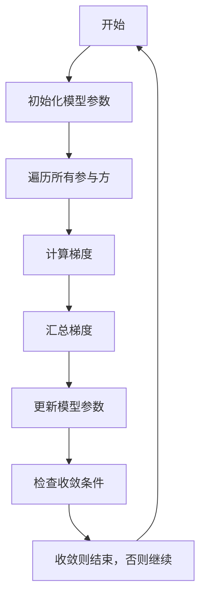
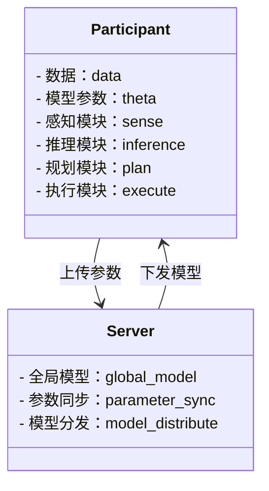
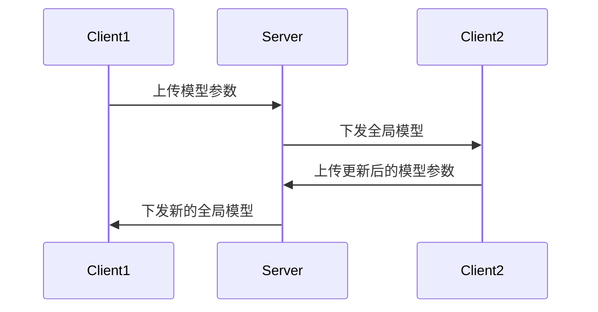

                 


# 开发具有隐私保护联邦学习能力的AI Agent

> 关键词：联邦学习，AI Agent，隐私保护，机器学习，分布式系统

> 摘要：本文详细探讨了开发具有隐私保护能力的联邦学习AI Agent的各个方面。从基本概念到算法原理，从系统架构到项目实战，文章全面解析了如何在保证数据隐私的前提下，实现高效且安全的联邦学习。通过详细的技术分析和实际案例，读者可以深入了解如何构建一个支持隐私保护的联邦学习AI Agent系统。

---

## 第1章: 联邦学习与AI Agent概述

### 1.1 联邦学习的基本概念
联邦学习是一种分布式的机器学习方法，允许多个参与方在不共享原始数据的情况下，共同训练一个统一的模型。其核心思想是通过数据不出域的方式，进行模型参数的同步与更新。

#### 1.1.1 联邦学习的定义
联邦学习（Federated Learning）是一种新兴的人工智能技术，旨在通过在分布式设备或服务器之间共享模型参数，而不是数据本身，来实现模型的训练。这种技术特别适用于数据隐私要求高的场景，如医疗、金融等领域。

#### 1.1.2 联邦学习的核心特点
- **数据本地化**：数据不出域，仅交换模型参数。
- **隐私保护**：通过加密和差分隐私等技术保护数据隐私。
- **分布式计算**：计算资源分布在不同的节点上，通过通信协议协同训练。

#### 1.1.3 联邦学习与传统机器学习的区别
| 特性                | 联邦学习                     | 传统机器学习                 |
|---------------------|-----------------------------|-----------------------------|
| 数据共享方式        | 数据不共享，参数共享         | 数据集中共享                 |
| 隐私保护            | 强调隐私保护                 | 隐私保护较弱                 |
| 计算资源分布        | 分布式计算                   | 集中式计算                   |

### 1.2 AI Agent的基本概念
AI Agent（智能代理）是一种能够感知环境、自主决策并执行任务的智能实体。它可以在不同的场景中代替人类完成复杂任务。

#### 1.2.1 AI Agent的定义
AI Agent是指具备感知、推理、规划和执行能力的智能系统，能够根据环境信息做出决策并执行操作。

#### 1.2.2 AI Agent的核心功能
- **感知**：通过传感器或接口获取环境信息。
- **推理**：基于获取的信息进行逻辑推理。
- **规划**：制定行动方案。
- **执行**：根据规划执行具体操作。

#### 1.2.3 AI Agent与传统AI的区别
| 特性                | AI Agent                     | 传统AI                       |
|---------------------|-----------------------------|-----------------------------|
| 自主性              | 高度自主                     | 较低自主                     |
| 适应性              | 能够自适应环境变化             | 适应性较低                   |
| 应用场景            | 广泛应用于自动化系统、机器人等 | 主要应用于数据分析、模式识别等 |

### 1.3 隐私保护的重要性
在联邦学习中，隐私保护是核心问题之一，尤其是在处理敏感数据时。

#### 1.3.1 数据隐私的挑战
- 数据泄露风险：如果数据被未经授权的第三方获取，可能导致隐私泄露。
- 法律合规要求：许多国家和地区都有严格的隐私保护法律，如GDPR。

#### 1.3.2 隐私保护的法律与伦理要求
- **法律要求**：如欧盟的GDPR要求数据处理者必须保护个人数据的隐私。
- **伦理要求**：数据的使用必须尊重个人隐私权。

#### 1.3.3 隐私保护在联邦学习中的必要性
联邦学习的核心目标之一就是保护参与方的数据隐私，确保在不共享数据的情况下完成模型训练。

### 1.4 本章小结
本章介绍了联邦学习和AI Agent的基本概念，分析了隐私保护的重要性，并为后续章节奠定了基础。

---

## 第2章: 联邦学习与AI Agent的核心概念

### 2.1 联邦学习的原理
联邦学习通过分布式系统架构，将模型参数同步到各个参与方，实现联合训练。

#### 2.1.1 联邦学习的原理
- 每个参与方本地训练模型，并将更新后的模型参数上传到中央服务器。
- 中央服务器将所有参与方的模型参数进行聚合，生成全局模型。
- 全局模型分发给各参与方，进行下一轮训练。

#### 2.1.2 联邦学习的通信机制
通信机制是联邦学习的核心，主要包括数据传输和模型同步。

#### 2.1.3 联邦学习的同步策略
- **同步联邦学习**：所有参与方同时更新模型。
- **异步联邦学习**：参与方按需更新模型，延迟较低。

### 2.2 AI Agent的结构与功能
AI Agent的结构决定了其在联邦学习中的角色和功能。

#### 2.2.1 AI Agent的组成结构
- **感知模块**：获取环境信息。
- **推理模块**：进行逻辑推理。
- **规划模块**：制定行动方案。
- **执行模块**：执行具体操作。

#### 2.2.2 AI Agent的功能模块
- 数据采集：从环境中获取数据。
- 数据处理：对数据进行清洗和预处理。
- 模型训练：在本地训练模型，并更新参数。
- 模型同步：将模型参数上传到中央服务器。

#### 2.2.3 AI Agent与联邦学习的结合
AI Agent作为联邦学习的参与方，负责本地数据的处理和模型训练，同时与其他参与方协同完成模型更新。

### 2.3 隐私保护技术的核心概念
隐私保护技术在联邦学习中起到关键作用。

#### 2.3.1 隐私保护的基本原理
- **加密技术**：通过对数据进行加密，防止未经授权的访问。
- **差分隐私**：在数据中添加噪声，确保个体数据无法被推断。

#### 2.3.2 隐私保护的关键技术
- **同态加密**：允许在加密数据上进行计算，结果仍保持加密状态。
- **安全多方计算**：在不泄露任何单方面数据的情况下，协同完成计算。

#### 2.3.3 隐私保护与联邦学习的结合
通过隐私保护技术，确保联邦学习过程中数据的安全性和隐私性。

### 2.4 核心概念对比分析
通过对比分析，明确联邦学习、AI Agent和隐私保护技术之间的关系。

#### 2.4.1 联邦学习与分布式学习的对比
| 特性                | 联邦学习                     | 分布式学习                   |
|---------------------|-----------------------------|-----------------------------|
| 数据共享方式        | 参数共享                    | 数据共享                    |
| 计算模式            | 分布式计算                   | 集中式计算                   |
| 隐私保护            | 强调隐私保护                 | 隐私保护较弱                 |

#### 2.4.2 AI Agent与传统机器学习模型的对比
| 特性                | AI Agent                     | 传统机器学习模型             |
|---------------------|-----------------------------|-----------------------------|
| 自主性              | 高度自主                     | 较低自主                     |
| 适应性              | 能够自适应环境变化             | 适应性较低                   |
| 应用场景            | 广泛应用于自动化系统、机器人等 | 主要应用于数据分析、模式识别等 |

#### 2.4.3 隐私保护技术的优缺点分析
- **优点**：能够有效保护数据隐私。
- **缺点**：可能会增加计算复杂度和通信开销。

### 2.5 本章小结
本章深入分析了联邦学习、AI Agent和隐私保护技术的核心概念，并通过对比分析明确了它们之间的关系。

---

## 第3章: 联邦学习的算法原理

### 3.1 联邦学习的数学模型
联邦学习的数学模型是其算法的基础。

#### 3.1.1 联邦学习的优化目标
目标是通过所有参与方的本地模型参数，联合优化一个全局模型。

$$ \text{目标函数} = \sum_{i=1}^{n} f_i(\theta) + \lambda R(\theta) $$

其中，$f_i(\theta)$ 是第i个参与方的损失函数，$R(\theta)$ 是正则化项，$\lambda$ 是正则化系数。

#### 3.1.2 联邦学习的损失函数
通常使用交叉熵损失函数。

$$ L(\theta) = -\frac{1}{m}\sum_{j=1}^{m} [y_j \log p(y_j|\theta) + (1-y_j)\log(1-p(y_j|\theta))] $$

其中，$y_j$ 是标签，$p(y_j|\theta)$ 是模型预测的概率。

#### 3.1.3 联邦学习的更新规则
使用梯度下降法更新模型参数。

$$ \theta_{t+1} = \theta_t - \eta \nabla_\theta L(\theta_t) $$

其中，$\eta$ 是学习率。

### 3.2 联邦学习的算法流程
通过mermaid流程图展示算法流程。



### 3.3 联邦学习的实现细节
#### 3.3.1 通信协议的选择
常用的通信协议有HTTP和gRPC。

#### 3.3.2 模型压缩技术
使用模型剪枝和量化技术减少通信开销。

#### 3.3.3 数据安全保护措施
通过加密和差分隐私技术保护数据安全。

### 3.4 联邦学习的代码实现
以下是一个简单的Python代码示例。

```python
import numpy as np

# 初始化模型参数
theta = np.random.randn(2,1)

# 定义损失函数
def loss_function(theta, X, y):
    m = len(y)
    h = X.dot(theta)
    loss = (1/(2*m)) * np.sum((h - y)**2)
    return loss

# 定义梯度计算
def compute_gradient(theta, X, y):
    m = len(y)
    h = X.dot(theta)
    gradient = (1/m) * X.T.dot(h - y)
    return gradient

# 联邦学习算法
def federated_learning(theta, X, y, iterations=100, learning_rate=0.01):
    for _ in range(iterations):
        gradient = compute_gradient(theta, X, y)
        theta = theta - learning_rate * gradient
    return theta

# 执行联邦学习
theta_final = federated_learning(theta, X, y)
print(theta_final)
```

### 3.5 本章小结
本章详细讲解了联邦学习的数学模型和算法流程，并通过代码示例展示了其实现细节。

---

## 第4章: 系统架构设计

### 4.1 问题场景介绍
本章将介绍如何设计一个支持隐私保护的联邦学习系统。

### 4.2 项目介绍
项目目标是开发一个支持隐私保护的AI Agent，能够在不共享数据的情况下进行模型训练。

### 4.3 系统功能设计
通过mermaid类图展示系统功能模块。



### 4.4 系统架构设计
通过mermaid架构图展示系统架构。

```mermaid
graph TD
    Client1 --> Server: 上传模型参数
    Client2 --> Server: 上传模型参数
    Server --> Client1: 下发全局模型
    Server --> Client2: 下发全局模型
```

### 4.5 系统接口设计
定义系统接口，如：

- `upload_parameters(theta)`：上传模型参数。
- `download_parameters()`：下载全局模型。

### 4.6 系统交互设计
通过mermaid序列图展示系统交互流程。



### 4.7 本章小结
本章通过系统架构设计和交互设计，展示了如何实现一个支持隐私保护的联邦学习系统。

---

## 第5章: 项目实战

### 5.1 环境安装与配置
安装必要的库，如TensorFlow、Keras等。

### 5.2 系统核心实现源代码
以下是一个简单的Python实现。

```python
import tensorflow as tf

# 初始化模型
model = tf.keras.models.Sequential([
    tf.keras.layers.Dense(64, activation='relu'),
    tf.keras.layers.Dense(1, activation='sigmoid')
])

# 定义损失函数和优化器
model.compile(loss='binary_crossentropy', optimizer='adam')

# 模型训练
model.fit(X, y, epochs=10, batch_size=32)
```

### 5.3 代码应用解读与分析
解释代码的功能和实现细节。

### 5.4 实际案例分析
通过具体案例分析，展示系统的实际应用。

### 5.5 项目小结
总结项目实现的关键点和注意事项。

---

## 第6章: 最佳实践与小结

### 6.1 最佳实践
- 定期进行安全审计。
- 使用多种隐私保护技术结合使用。
- 确保通信过程中的数据安全。

### 6.2 小结
本文详细讲解了开发具有隐私保护联邦学习能力的AI Agent的各个方面，从理论到实践，为读者提供了全面的指导。

### 6.3 注意事项
- 确保数据的合法性和合规性。
- 定期更新隐私保护技术，应对新的安全威胁。

### 6.4 拓展阅读
推荐相关书籍和论文，供读者深入学习。

---

## 作者：AI天才研究院/AI Genius Institute & 禅与计算机程序设计艺术/Zen And The Art of Computer Programming

---

**本文由AI天才研究院与禅与计算机程序设计艺术联合撰写，转载请注明出处。**

