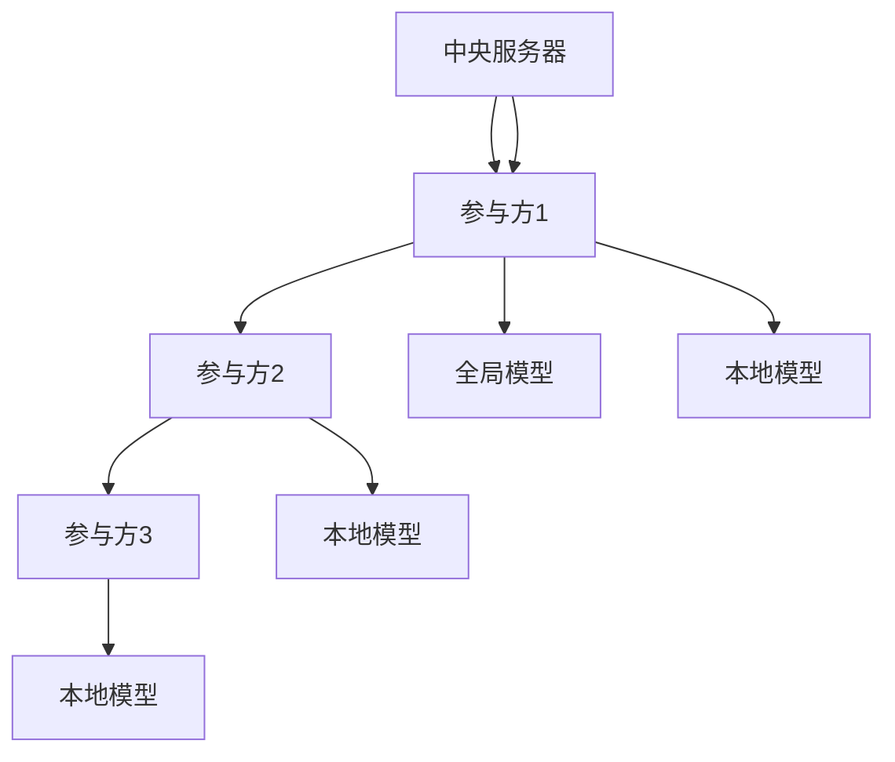

                 


# 开发具有隐私保护联邦学习能力的AI Agent

> 关键词：联邦学习，AI Agent，隐私保护，分布式系统，机器学习，数据安全

> 摘要：本文详细探讨了开发具有隐私保护联邦学习能力的AI Agent的技术挑战和解决方案。通过分析联邦学习和AI Agent的核心原理、算法实现、系统架构及实际案例，本文为读者提供了从理论到实践的全面指导。结合图表和代码示例，本文深入浅出地阐述了如何在保护数据隐私的前提下，构建高效、智能的AI Agent。

---

# 第一部分: 开发具有隐私保护联邦学习能力的AI Agent背景介绍

## 第1章: 联邦学习与AI Agent概述

### 1.1 联邦学习的背景与问题背景
#### 1.1.1 数据隐私保护的重要性
随着人工智能技术的快速发展，数据成为推动AI模型优化的核心资源。然而，数据的集中存储和共享带来了严重的隐私泄露风险。联邦学习（Federated Learning）作为一种分布式机器学习技术，能够在不共享原始数据的前提下，协作训练出高性能的模型，从而在保护隐私的同时实现数据的充分利用。

#### 1.1.2 联邦学习的定义与核心问题
联邦学习是一种分布式机器学习范式，允许多个参与方在不共享本地数据的情况下，共同训练一个全局模型。其核心问题包括数据异构性、通信开销、模型收敛性以及隐私保护等。联邦学习的主要目标是在保护数据隐私的前提下，实现模型的高效训练和优化。

#### 1.1.3 联邦学习的边界与外延
联邦学习的边界主要在于其分布式协作机制和数据隐私保护技术。外延则包括与分布式系统、边缘计算、区块链等技术的结合，进一步提升数据安全性和系统可扩展性。

### 1.2 AI Agent的基本概念与问题描述
#### 1.2.1 AI Agent的定义与分类
AI Agent（人工智能代理）是指能够感知环境、自主决策并执行任务的智能体。根据智能水平，AI Agent可以分为反应式代理、基于模型的代理、效用驱动的代理等。AI Agent的核心功能包括感知、决策、执行和学习。

#### 1.2.2 AI Agent的核心功能与应用场景
AI Agent的核心功能包括：
- **感知**：通过传感器或数据接口获取环境信息。
- **决策**：基于感知信息进行推理和决策。
- **执行**：通过执行器或接口执行决策动作。
- **学习**：通过与环境交互不断优化自身的知识和能力。

AI Agent的应用场景包括智能助手、自动驾驶、智能安防、机器人控制等。

#### 1.2.3 联邦学习与AI Agent的结合问题
AI Agent的自主学习能力需要依赖数据，而数据的隐私保护问题限制了传统数据共享的方式。通过联邦学习，AI Agent可以在不共享本地数据的前提下，与其他代理协作训练模型，从而实现更加智能化的决策和执行能力。

---

## 第2章: 联邦学习与AI Agent的核心概念与联系

### 2.1 联邦学习的核心原理
#### 2.1.1 联邦学习的通信机制
联邦学习的通信机制主要包括模型同步和参数更新。模型同步是指各个参与方将本地模型参数上传到中央服务器或通过点对点网络进行同步；参数更新则是基于各方上传的模型参数，进行全局模型的优化和更新。

#### 2.1.2 联邦学习的隐私保护机制
联邦学习的隐私保护机制主要依赖于差分隐私（Differential Privacy）和同态加密（Homomorphic Encryption）等技术。这些技术可以在模型训练过程中保护数据的隐私性，防止敏感信息被泄露。

#### 2.1.3 联邦学习的算法框架
联邦学习的算法框架主要包括横向联邦学习和纵向联邦学习。横向联邦学习适用于数据样本不重叠的情况，而纵向联邦学习适用于数据特征重叠的情况。

### 2.2 AI Agent的核心功能与实现
#### 2.2.1 AI Agent的感知与决策能力
AI Agent的感知能力依赖于传感器或数据接口，决策能力则基于感知信息和预设的决策规则或机器学习模型。

#### 2.2.2 AI Agent的自主学习能力
AI Agent的自主学习能力依赖于联邦学习技术，通过与其他代理协作训练模型，实现知识的更新和优化。

#### 2.2.3 AI Agent的协作与通信能力
AI Agent的协作能力依赖于分布式系统和通信协议，通过与其他代理协作训练模型，实现任务的协同完成。

### 2.3 联邦学习与AI Agent的联系与对比
#### 2.3.1 联邦学习与AI Agent的核心联系
联邦学习为AI Agent提供了分布式协作和隐私保护的技术支持，AI Agent则为联邦学习提供了智能化的应用场景。

#### 2.3.2 联邦学习与AI Agent的属性特征对比
下表对比了联邦学习和AI Agent的核心属性特征：

| 属性 | 联邦学习 | AI Agent |
|------|----------|----------|
| 核心目标 | 分布式模型训练 | 自主决策与执行 |
| 数据需求 | 多方数据协作 | 本地数据驱动 |
| 通信机制 | 模型同步与参数更新 | 传感器数据与执行指令 |
| 隐私保护 | 差分隐私、同态加密 | 数据加密、访问控制 |

#### 2.3.3 联邦学习与AI Agent的ER实体关系图

```mermaid
er
    entity 联邦学习系统 {
        key 联邦ID
        联邦节点
        数据隐私规则
    }
    entity AI Agent {
        key Agent ID
        感知模块
        决策模块
        执行模块
    }
    relationship 联邦学习系统与AI Agent之间的协作关系 {
        联邦学习系统与AI Agent通过模型同步进行协作训练
    }
```

---

## 第3章: 联邦学习与AI Agent的算法原理

### 3.1 联邦学习的核心算法
#### 3.1.1 横向联邦学习算法
横向联邦学习适用于数据样本不重叠的场景，主要算法包括：

- **基于梯度的联邦学习**：每个参与方计算本地梯度，并将梯度上传到中央服务器，进行全局模型的更新。
- **基于模型参数的联邦学习**：每个参与方上传本地模型参数，中央服务器进行参数平均，生成全局模型。

#### 3.1.2 纵向联邦学习算法
纵向联邦学习适用于数据特征重叠的场景，主要算法包括：

- **基于特征对齐的联邦学习**：通过特征哈希或对齐技术，实现不同数据集之间的特征对齐，进行联合训练。
- **基于安全多方计算的联邦学习**：通过安全多方计算技术，实现模型训练过程中数据的隐私保护。

#### 3.1.3 联邦学习的算法流程



#### 3.1.4 联邦学习的Python代码实现
以下是一个简单的横向联邦学习实现示例：

```python
import numpy as np

# 模拟联邦学习中的参与方
class Participant:
    def __init__(self, data):
        self.data = data
        self.model = np.random.randn(2, 1)

    def compute_gradient(self):
        # 模拟计算梯度
        gradient = np.mean(self.data, axis=0) * np.random.randn(2, 1)
        return gradient

    def update_model(self, global_model):
        self.model = global_model

# 中央服务器
class CentralServer:
    def __init__(self):
        self.global_model = np.random.randn(2, 1)

    def aggregate_gradients(self, gradients):
        # 简单的平均梯度聚合
        self.global_model += np.mean(gradients, axis=0)

# 示例运行
data1 = np.random.randn(100, 2)
data2 = np.random.randn(100, 2)

participant1 = Participant(data1)
participant2 = Participant(data2)

server = CentralServer()

# 联邦学习过程
for _ in range(10):
    gradients = []
    for p in [participant1, participant2]:
        gradients.append(p.compute_gradient())
    server.aggregate_gradients(gradients)
    for p in [participant1, participant2]:
        p.update_model(server.global_model)
```

### 3.2 AI Agent的算法实现
#### 3.2.1 AI Agent的感知算法
AI Agent的感知算法主要包括数据采集、特征提取和状态识别。例如，基于深度学习的图像识别算法可以用于AI Agent的视觉感知。

#### 3.2.2 AI Agent的决策算法
AI Agent的决策算法主要包括规则推理、基于模型的决策和强化学习。例如，基于强化学习的决策算法可以用于自动驾驶中的路径规划。

#### 3.2.3 AI Agent的学习算法
AI Agent的学习算法主要包括监督学习、无监督学习和强化学习。例如，基于联邦学习的监督学习算法可以用于AI Agent的联合模型训练。

### 3.3 联邦学习与AI Agent的算法融合
通过将联邦学习与AI Agent的学习算法相结合，可以在保护数据隐私的前提下，实现AI Agent的自主学习和协作训练。例如，多个AI Agent可以通过联邦学习协作训练一个全局模型，从而提升每个代理的决策和执行能力。

---

## 第4章: 联邦学习与AI Agent的数学模型与公式

### 4.1 联邦学习的数学模型
#### 4.1.1 横向联邦学习的数学模型
横向联邦学习的数学模型可以表示为：

$$
\text{Global Model} = \frac{1}{N}\sum_{i=1}^{N} \text{Local Model}_i
$$

其中，$N$是参与方的数量，$\text{Local Model}_i$是第$i$个参与方的本地模型。

#### 4.1.2 纵向联邦学习的数学模型
纵向联邦学习的数学模型可以表示为：

$$
\text{Global Model} = \arg\min_{\theta} \sum_{i=1}^{N} \mathcal{L}_i(\theta)
$$

其中，$\mathcal{L}_i(\theta)$是第$i$个参与方的损失函数，$\theta$是全局模型的参数。

### 4.2 AI Agent的数学模型
#### 4.2.1 AI Agent的感知模型
AI Agent的感知模型可以表示为：

$$
\text{感知结果} = f(\text{输入数据})
$$

其中，$f$是感知函数。

#### 4.2.2 AI Agent的决策模型
AI Agent的决策模型可以表示为：

$$
\text{决策动作} = \arg\max_{a} Q(s, a)
$$

其中，$Q(s, a)$是状态-动作值函数，$s$是当前状态，$a$是动作。

#### 4.2.3 AI Agent的学习模型
AI Agent的学习模型可以表示为：

$$
Q(s, a) = Q(s, a) + \alpha (r + \gamma \max_a Q(s', a) - Q(s, a))
$$

其中，$\alpha$是学习率，$r$是奖励，$\gamma$是折扣因子，$s'$是下一个状态。

### 4.3 联邦学习与AI Agent的数学模型融合
通过将联邦学习的数学模型与AI Agent的学习模型相结合，可以在保护数据隐私的前提下，实现AI Agent的自主学习和协作训练。例如，多个AI Agent可以通过联邦学习协作训练一个全局模型，从而提升每个代理的决策和执行能力。

---

## 第5章: 联邦学习与AI Agent的系统分析与架构设计

### 5.1 项目背景与问题场景
本项目旨在开发一种具有隐私保护联邦学习能力的AI Agent，能够在不共享本地数据的前提下，与其他代理协作训练模型，实现智能化的决策和执行能力。主要问题包括数据隐私保护、分布式协作通信和模型优化等。

### 5.2 系统功能设计
系统功能设计包括：

- 数据采集与预处理
- 模型训练与优化
- 模型部署与应用
- 模型监控与维护

### 5.3 系统架构设计
系统架构设计包括：

- 中央服务器：负责全局模型的管理和分发。
- 参与方：负责本地数据的采集和模型训练。
- AI Agent：负责感知、决策和执行。

### 5.4 系统接口设计
系统接口设计包括：

- 数据接口：负责数据的采集和预处理。
- 模型接口：负责模型的训练和优化。
- 通信接口：负责模型参数的同步和更新。

### 5.5 系统交互流程
系统交互流程包括：

1. 数据采集：AI Agent通过传感器或数据接口采集环境数据。
2. 模型训练：参与方基于本地数据进行模型训练，并将模型参数上传到中央服务器。
3. 模型优化：中央服务器基于上传的模型参数，进行全局模型的优化和更新。
4. 模型分发：中央服务器将优化后的全局模型分发给参与方。
5. 决策执行：AI Agent基于全局模型进行决策，并通过执行器或接口执行决策动作。

---

## 第6章: 联邦学习与AI Agent的项目实战

### 6.1 项目环境安装
项目环境安装包括：

- 安装Python和必要的Python库（如numpy、pandas、scikit-learn等）。
- 安装深度学习框架（如TensorFlow、PyTorch等）。

### 6.2 系统核心实现
系统核心实现包括：

- 数据采集与预处理：使用传感器或数据接口采集数据，并进行清洗和特征提取。
- 模型训练与优化：基于本地数据进行模型训练，并将模型参数上传到中央服务器。
- 模型部署与应用：将优化后的全局模型部署到AI Agent中，进行智能化的决策和执行。

### 6.3 代码实现与解读
以下是一个简单的联邦学习实现示例：

```python
import numpy as np

# 模拟联邦学习中的参与方
class Participant:
    def __init__(self, data):
        self.data = data
        self.model = np.random.randn(2, 1)

    def compute_gradient(self):
        # 模拟计算梯度
        gradient = np.mean(self.data, axis=0) * np.random.randn(2, 1)
        return gradient

    def update_model(self, global_model):
        self.model = global_model

# 中央服务器
class CentralServer:
    def __init__(self):
        self.global_model = np.random.randn(2, 1)

    def aggregate_gradients(self, gradients):
        # 简单的平均梯度聚合
        self.global_model += np.mean(gradients, axis=0)

# 示例运行
data1 = np.random.randn(100, 2)
data2 = np.random.randn(100, 2)

participant1 = Participant(data1)
participant2 = Participant(data2)

server = CentralServer()

# 联邦学习过程
for _ in range(10):
    gradients = []
    for p in [participant1, participant2]:
        gradients.append(p.compute_gradient())
    server.aggregate_gradients(gradients)
    for p in [participant1, participant2]:
        p.update_model(server.global_model)
```

### 6.4 实际案例分析
以下是一个实际案例分析：

假设我们有多个智能设备（如智能手机、智能家居等），每个设备都收集了本地数据（如用户行为数据、环境数据等）。通过联邦学习，这些设备可以在不共享本地数据的前提下，协作训练一个全局模型，从而提升设备的智能化水平。AI Agent则可以根据全局模型进行更准确的决策和执行。

---

## 第7章: 联邦学习与AI Agent的最佳实践

### 7.1 小结
通过本文的详细讲解，我们了解了开发具有隐私保护联邦学习能力的AI Agent的核心概念、算法原理、系统架构及实际应用。联邦学习为AI Agent提供了分布式协作和隐私保护的技术支持，AI Agent则为联邦学习提供了智能化的应用场景。

### 7.2 注意事项
在实际开发中，需要注意以下几点：

- 数据隐私保护：确保数据的隐私性和安全性，防止数据泄露。
- 系统性能优化：优化系统的通信效率和计算效率，降低系统的资源消耗。
- 系统可扩展性：设计具有可扩展性的系统架构，支持更多的参与方和AI Agent。

### 7.3 拓展阅读
建议读者进一步阅读以下内容：

- 联邦学习的最新研究成果。
- AI Agent的前沿技术。
- 数据隐私保护的法律法规和标准。

---

# 作者：AI天才研究院/AI Genius Institute & 禅与计算机程序设计艺术 /Zen And The Art of Computer Programming

