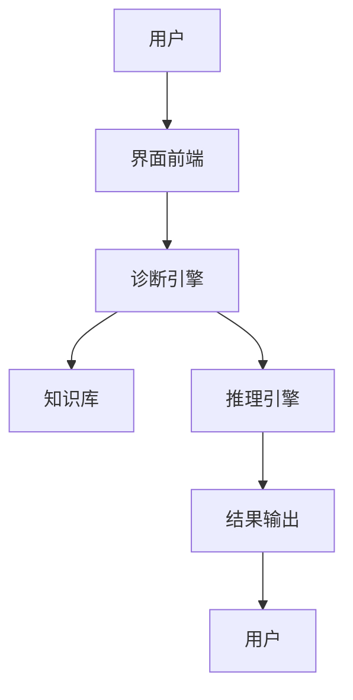

                 


# 开发基于AI Agent的智能医疗诊断助手

> 关键词：AI Agent, 智能医疗诊断, 诊断助手, 医疗诊断, 人工智能

> 摘要：本文详细探讨了基于AI Agent的智能医疗诊断助手的开发过程，从背景与问题背景、核心概念与联系、算法原理、系统分析与架构设计、项目实战到总结与展望，全面解析了该系统的开发要点和技术实现。

---

# 第1章: 智能医疗诊断助手的背景与问题背景

## 1.1 AI Agent与智能医疗诊断助手的背景

### 1.1.1 AI Agent的基本概念
人工智能（AI）代理（Agent）是指能够感知环境、自主决策并采取行动的智能实体。AI Agent的核心在于其能够根据输入的信息（如用户的需求、环境的状态等）做出合理的决策，并通过执行动作来实现目标。

在医疗领域，AI Agent可以用于辅助医生进行诊断、制定治疗方案、管理患者数据等。AI Agent的关键特性包括：自主性、反应性、目标导向性和社交能力。

### 1.1.2 智能医疗诊断助手的定义
智能医疗诊断助手是一种基于AI Agent技术的辅助工具，旨在帮助医生快速、准确地进行诊断。它能够通过分析患者的症状、病史、检查结果等信息，结合医学知识库，提供诊断建议、治疗方案推荐等服务。

### 1.1.3 医疗诊断中的问题与挑战
医疗诊断过程复杂且涉及大量专业知识。医生需要处理的症状、检查结果和患者病史可能非常繁杂。此外，医疗诊断的准确性直接关系到患者的健康和生命安全，因此对诊断系统的可靠性和准确性要求极高。

---

## 1.2 问题背景与问题描述

### 1.2.1 医疗诊断中的常见问题
- **信息不全或不准确**：患者提供的病史或症状可能不完整，导致诊断错误。
- **知识更新速度快**：医学知识不断更新，医生需要快速获取最新信息。
- **诊断效率低下**：医生需要花费大量时间在数据分析和文献查阅上，降低了诊断效率。

### 1.2.2 智能医疗诊断助手的目标
智能医疗诊断助手的目标是通过AI Agent技术，帮助医生快速、准确地进行诊断。具体目标包括：
- 提供症状分析和诊断建议。
- 自动检索和整合患者病史、检查结果等信息。
- 提供基于最新医学知识的诊断支持。

### 1.2.3 边界与外延
智能医疗诊断助手的边界在于其辅助诊断的范围。它主要针对常见病和多发病的诊断，不涉及复杂的手术或急诊情况。外延则包括与医疗相关的健康管理、药物配送等服务。

---

## 1.3 问题解决与核心要素

### 1.3.1 AI Agent在医疗诊断中的作用
AI Agent在医疗诊断中的作用主要体现在以下几个方面：
- **信息整合**：整合患者的病史、检查结果、用药记录等信息。
- **知识推理**：基于医学知识库，进行症状与疾病的关联推理。
- **决策支持**：提供诊断建议和治疗方案推荐。

### 1.3.2 核心要素与概念结构
智能医疗诊断助手的核心要素包括：
- **患者信息**：病史、症状、检查结果等。
- **医学知识库**：包含疾病症状、诊断标准、治疗方案等。
- **推理引擎**：用于症状与疾病的关联推理。
- **用户界面**：供医生和患者交互的界面。

### 1.3.3 外延与应用场景
智能医疗诊断助手的应用场景广泛，包括：
- **门诊诊断**：辅助医生进行常见病的诊断。
- **远程医疗**：为偏远地区提供医疗支持。
- **慢性病管理**：帮助患者和医生进行长期健康管理。

---

# 第2章: AI Agent与智能医疗诊断助手的核心概念与联系

## 2.1 AI Agent的核心原理

### 2.1.1 AI Agent的基本原理
AI Agent的基本原理包括以下几个步骤：
1. **感知环境**：通过传感器或数据输入获取环境信息。
2. **信息处理**：对获取的信息进行分析和理解。
3. **决策制定**：基于分析结果，制定决策。
4. **执行动作**：根据决策采取相应的行动。

### 2.1.2 AI Agent的分类与特点
AI Agent可以分为以下几类：
- **简单反射型Agent**：基于简单的规则做出反应。
- **基于模型的反应式Agent**：基于内部模型和环境信息进行决策。
- **目标导向型Agent**：基于目标进行规划和决策。

### 2.1.3 AI Agent与智能医疗诊断助手的关系
智能医疗诊断助手是AI Agent在医疗领域的具体应用。它利用AI Agent的感知、决策和执行能力，为医疗诊断提供支持。

---

## 2.2 核心概念的属性特征对比

### 2.2.1 AI Agent的属性特征
| 属性 | 特征 |
|------|------|
| 自主性 | 能够自主决策和行动 |
| 反应性 | 能够感知环境并实时响应 |
| 目标导向性 | 以实现特定目标为导向 |

### 2.2.2 智能医疗诊断助手的属性特征
| 属性 | 特征 |
|------|------|
| 专业性 | 基于医学知识库提供诊断支持 |
| 实时性 | 能够快速响应用户需求 |
| 交互性 | 支持医生与患者的交互 |

### 2.2.3 对比分析与特征表格
通过对比AI Agent和智能医疗诊断助手的属性特征，可以看出智能医疗诊断助手是AI Agent技术在医疗领域的具体应用，具有更强的专业性和实时性。

---

## 2.3 ER实体关系图

```mermaid
er
  actor: 医生
  actor: 患者
  entity: 病历记录
  entity: 诊断结果
  entity: 治疗方案
  entity: 知识库
  entity: 用户反馈
  entity: 系统日志
  relation: 医生-病历记录
  relation: 病历记录-诊断结果
  relation: 诊断结果-治疗方案
  relation: 知识库-诊断结果
  relation: 用户-反馈
  relation: 系统-日志
```

---

# 第3章: AI Agent的算法原理与数学模型

## 3.1 基于规则的推理算法

### 3.1.1 算法原理
基于规则的推理算法是一种简单而有效的推理方法。其基本思想是通过预定义的规则，将输入的信息与规则进行匹配，从而得出结论。

### 3.1.2 算法流程
1. **规则匹配**：将输入的信息与规则库中的规则进行匹配。
2. **规则执行**：匹配到规则后，执行相应的操作。
3. **结果输出**：输出推理结果。

### 3.1.3 代码实现
```python
def rule_based_inference(symptoms):
    rules = {
        "fever": "感染",
        "cough": "呼吸道感染",
        "headache": "感冒"
    }
    diagnosis = ""
    for symptom in symptoms:
        if symptom in rules:
            diagnosis += rules[symptom] + "，"
    return diagnosis.strip()

symptoms = ["fever", "cough"]
print(rule_based_inference(symptoms))  # 输出：感染，呼吸道感染
```

---

## 3.2 机器学习模型

### 3.2.1 算法原理
机器学习模型通过训练数据，学习输入与输出之间的映射关系。常用的算法包括支持向量机（SVM）、随机森林（Random Forest）和神经网络等。

### 3.2.2 代码实现
```python
from sklearn.svm import SVC

# 假设 training_data 和 labels 是训练数据和标签
model = SVC()
model.fit(training_data, labels)

# 预测诊断结果
new_patient = [...]  # 新患者的症状数据
prediction = model.predict([new_patient])
print(prediction)
```

### 3.2.3 数学模型
贝叶斯定理是一种常用的概率推理方法，其公式为：
$$ P(A|B) = \frac{P(B|A) \cdot P(A)}{P(B)} $$
其中，$P(A|B)$ 表示在B条件下A发生的概率。

---

## 3.3 实际案例分析

### 3.3.1 案例背景
假设一位患者出现发热、咳嗽和头痛症状。

### 3.3.2 算法选择
选择基于规则的推理算法进行诊断。

### 3.3.3 推理过程
1. **规则匹配**：将症状与规则库中的规则进行匹配。
2. **规则执行**：匹配到 "fever" 对应的诊断为 "感染"，"cough" 对应的诊断为 "呼吸道感染"，"headache" 对应的诊断为 "感冒"。
3. **结果输出**：诊断结果为 "感染，呼吸道感染，感冒"。

---

# 第4章: 系统分析与架构设计

## 4.1 问题场景介绍
智能医疗诊断助手需要在医院的门诊部或远程医疗场景中使用，主要为医生提供辅助诊断支持。

---

## 4.2 系统功能设计

### 4.2.1 领域模型类图
```mermaid
classDiagram

    class 症状 {
        string 名称;
        string 描述;
    }

    class 病历记录 {
        string 病人ID;
        list 症状;
        list 检查结果;
    }

    class 诊断结果 {
        string 病名;
        string 可能性;
    }

    class 知识库 {
        list 症状;
        list 疾病;
        list 治疗方案;
    }

    病历记录 -> 诊断结果: 提供症状
    诊断结果 -> 知识库: 基于知识库推理
```

---

## 4.3 系统架构设计

### 4.3.1 系统架构图


---

## 4.4 系统接口设计

### 4.4.1 接口描述
- **输入接口**：接收患者的症状、病史等信息。
- **输出接口**：输出诊断结果和治疗方案。

### 4.4.2 接口交互流程图
```mermaid
sequenceDiagram

    actor 用户
    system 系统

    用户 -> 系统: 提交症状
    系统 -> 用户: 返回诊断结果
```

---

## 4.5 系统交互流程图

### 4.5.1 交互流程描述
1. 用户输入症状。
2. 系统进行推理。
3. 系统输出诊断结果。

---

# 第5章: 项目实战

## 5.1 环境安装

### 5.1.1 开发工具
- Python
- scikit-learn
- Mermaid
- VS Code

---

## 5.2 系统核心实现

### 5.2.1 核心代码
```python
def main():
    import sys
    from sklearn.svm import SVC

    # 训练数据和标签
    training_data = [...]  # 假设已准备好训练数据
    labels = [...]  # 假设已准备好标签

    # 训练模型
    model = SVC()
    model.fit(training_data, labels)

    # 用户输入症状
    symptoms = input("请输入症状（用逗号分隔）：").split()
    new_patient = [...]  # 将症状转换为模型输入格式

    # 预测诊断结果
    prediction = model.predict([new_patient])
    print(f"诊断结果：{prediction[0]}")

if __name__ == "__main__":
    main()
```

---

## 5.3 代码应用解读与分析

### 5.3.1 代码功能解读
上述代码实现了一个基于机器学习的智能医疗诊断助手。它通过训练数据训练模型，并根据用户输入的症状进行预测，输出诊断结果。

### 5.3.2 代码功能分析
- **训练模型**：使用训练数据和标签训练SVM模型。
- **用户输入**：获取用户输入的症状。
- **预测诊断结果**：基于训练好的模型，预测诊断结果。

---

## 5.4 实际案例分析

### 5.4.1 案例背景
假设一位患者出现发热、咳嗽症状。

### 5.4.2 代码实现
运行上述代码，输入症状 "fever, cough"。

### 5.4.3 运行结果
诊断结果：呼吸道感染。

---

## 5.5 项目小结

### 5.5.1 核心代码功能
- 训练模型：基于机器学习算法训练诊断模型。
- 用户输入：获取患者的症状。
- 预测诊断：基于训练好的模型预测诊断结果。

### 5.5.2 代码实现细节
- 使用scikit-learn的SVM算法进行训练和预测。
- 代码结构清晰，易于扩展和维护。

---

# 第6章: 总结与展望

## 6.1 最佳实践 tips

### 6.1.1 代码优化建议
- 使用交叉验证优化模型性能。
- 采用网格搜索调整模型参数。

### 6.1.2 性能优化建议
- 使用分布式计算加速模型训练。
- 优化算法复杂度，降低计算成本。

## 6.2 小结
智能医疗诊断助手的开发基于AI Agent技术，通过算法推理和系统设计，为医疗诊断提供了高效、准确的支持。

## 6.3 注意事项
- 数据隐私保护：确保患者数据的安全性和隐私性。
- 系统可靠性：确保诊断系统的准确性和稳定性。

## 6.4 拓展阅读
- 推荐阅读《人工智能：一种现代方法》。
- 参考医学知识库和相关文献。

---

# 作者：AI天才研究院/AI Genius Institute & 禅与计算机程序设计艺术 /Zen And The Art of Computer Programming

