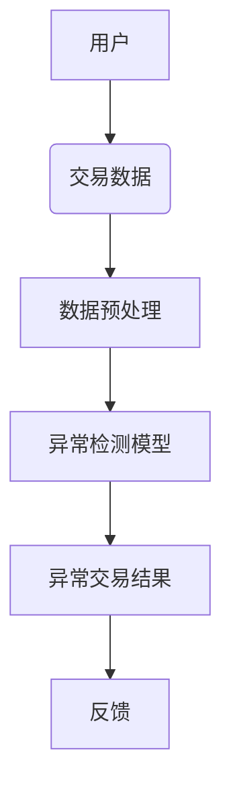

                 


# 异常检测算法在金融欺诈识别中的应用

## 关键词
- 异常检测, 金融欺诈, 机器学习, 深度学习, 算法实现

## 摘要
本文深入探讨了异常检测算法在金融欺诈识别中的应用，系统地介绍了异常检测的基本概念、核心算法及其在金融领域的实际应用。通过详细分析传统统计方法、机器学习方法和深度学习方法，本文为读者提供了从理论到实践的全面指导，展示了如何利用这些技术有效识别金融欺诈行为。此外，本文还结合实际案例，探讨了模型的评估与优化、系统架构设计以及项目实战，为读者提供了丰富的实用信息。

---

## 第1章 异常检测的基本概念

### 1.1 异常检测的定义与重要性

#### 1.1.1 异常检测的定义
异常检测（Outlier Detection）是指识别数据集中与大多数数据点不符合的异常值。这些异常值可能代表潜在的威胁或机会，如金融欺诈、系统故障等。

#### 1.1.2 异常检测在金融领域的应用
在金融领域，异常检测主要用于识别欺诈交易、检测市场操纵和监控账户异常行为。例如，银行可以通过分析交易数据，发现异常的大额交易，从而防范洗钱活动。

#### 1.1.3 异常检测的重要性
异常检测能够帮助金融机构及时发现潜在风险，减少财务损失，提高客户信任度，并确保合规性。

---

### 1.2 金融欺诈的现状

#### 1.2.1 金融欺诈的主要类型
- **信用卡欺诈**：未经授权的交易或高额消费。
- **网络欺诈**：通过钓鱼、伪造网站等手段骗取用户信息。
- **洗钱**：通过复杂交易掩盖资金来源。

#### 1.2.2 金融欺诈带来的损失
金融欺诈不仅造成直接经济损失，还可能损害机构声誉，影响客户关系。

#### 1.2.3 传统欺诈检测方法的局限性
传统方法基于规则或简单的统计分析，难以应对复杂多变的欺诈手段。

---

### 1.3 异常检测与金融欺诈的关系

#### 1.3.1 异常检测如何帮助识别欺诈
通过分析交易数据的异常模式，异常检测能够识别潜在的欺诈行为，帮助金融机构采取预防措施。

#### 1.3.2 异常检测与传统欺诈检测的区别
- 异常检测无需预先定义欺诈模式，能够发现未知的欺诈手段。
- 传统方法依赖于已知的欺诈特征，难以应对新型欺诈行为。

#### 1.3.3 异常检测的优势
- 高效性：能够快速处理大规模数据。
- 灵活性：适用于不同类型的欺诈检测。

---

## 第2章 异常检测的核心概念

### 2.1 异常检测的分类

#### 2.1.1 基于统计的方法
- **Z-score方法**：通过计算数据点与均值的距离来判断异常值。
  $$ Z = \frac{x - \mu}{\sigma} $$
  其中，$\mu$ 是均值，$\sigma$ 是标准差。

- **四分位数法**：通过计算数据的四分位数范围来判断异常值。
  $$ IQR = Q3 - Q1 $$
  异常值为 $Q1 - 1.5IQR$ 或 $Q3 + 1.5IQR$。

#### 2.1.2 基于机器学习的方法
- **无监督学习**：如聚类算法（K-Means、DBSCAN）和密度估计（Kernel Density Estimation）。
- **有监督学习**：如随机森林和SVM，适用于有标签的数据。

#### 2.1.3 基于深度学习的方法
- **自编码器（Autoencoder）**：通过重建数据来检测异常点。
  $$ \text{重建损失} = ||x - \hat{x}|| $$
  其中，$\hat{x}$ 是模型重建的输出。

---

### 2.2 异常检测的特征

#### 2.2.1 数据分布的差异
异常值通常位于数据分布的尾部区域。

#### 2.2.2 数据点的孤立性
孤立点（Outliers）是指在数据集中显著不同于其他数据点的点。

#### 2.2.3 时间序列的异常性
在时间序列数据中，异常值可能表现为突变或趋势变化。

---

### 2.3 异常检测与其他技术的关系

#### 2.3.1 异常检测与聚类分析
- 聚类分析用于将数据分为簇，异常值通常位于远离簇中心的区域。

#### 2.3.2 异常检测与分类算法
- 分类算法适用于有标签的异常检测任务。

#### 2.3.3 异常检测与数据挖掘
- 数据挖掘技术如关联规则挖掘可以帮助发现异常交易模式。

---

## 第3章 金融欺诈识别中的异常检测方法

### 3.1 传统统计方法

#### 3.1.1 Z-score方法
假设交易金额的均值和标准差已知，可以通过Z-score判断交易是否异常。

#### 3.1.2 LOF算法
局部 outlier factor (LOF) 通过比较数据点的局部密度来判断其是否为异常值。

---

### 3.2 基于机器学习的方法

#### 3.2.1 支持向量机（SVM）
- SVM 适用于有标签的异常检测任务，能够处理高维数据。

#### 3.2.2 随机森林
- 随机森林可以通过投票机制识别异常值。

#### 3.2.3 神经网络
- 神经网络能够学习复杂的非线性模式，适用于金融数据的异常检测。

---

### 3.3 基于深度学习的方法

#### 3.3.1 循环神经网络（RNN）
- RNN 适用于时间序列数据，能够捕捉交易时间中的异常模式。

#### 3.3.2 自编码器（Autoencoder）
- 通过重建交易数据来检测异常点，适用于无监督学习场景。

#### 3.3.3 图神经网络（Graph Neural Network）
- 图神经网络适用于分析复杂的金融网络关系，识别异常交易行为。

---

## 第4章 异常检测算法的数学模型

### 4.1 LOF算法

#### 4.1.1 LOF算法的数学模型
- 计算每个数据点的局部密度和到达率。
- 异常分数为该点的局部密度与周围点的密度比值。

---

## 第5章 系统架构设计

### 5.1 问题场景介绍
金融欺诈检测系统需要实时处理大量交易数据，识别异常交易。

### 5.2 系统功能设计
- 数据采集与预处理：清洗和归一化数据。
- 模型训练与部署：训练异常检测模型并实时监控交易。
- 结果分析与反馈：对异常交易进行分析并反馈给相关部门。

### 5.3 系统架构设计



---

## 第6章 项目实战

### 6.1 环境安装
- 安装必要的库：Python、scikit-learn、TensorFlow、Keras。

### 6.2 核心代码实现

```python
import numpy as np
from sklearn.neighbors import LocalOutlierFactor

# 示例数据
X = np.random.randn(100, 2) * 0.5 + [0, 0]

# LOF 模型
clf = LocalOutlierFactor(n_neighbors=20, contamination=0.1)
outliers = clf.fit_predict(X)

# 找出异常点
abnormal = X[outliers == -1]
print("异常点数量：", len(abnormal))
```

---

## 第7章 最佳实践与小结

### 7.1 最佳实践 tips
- 数据预处理是关键，确保数据质量和一致性。
- 结合业务场景选择合适的算法，避免过度依赖单一方法。
- 定期更新模型，适应新的欺诈模式。

### 7.2 小结
异常检测在金融欺诈识别中具有重要意义，通过结合传统统计方法、机器学习和深度学习，可以有效提高检测准确性。

---

## 作者
作者：AI天才研究院 & 禅与计算机程序设计艺术

