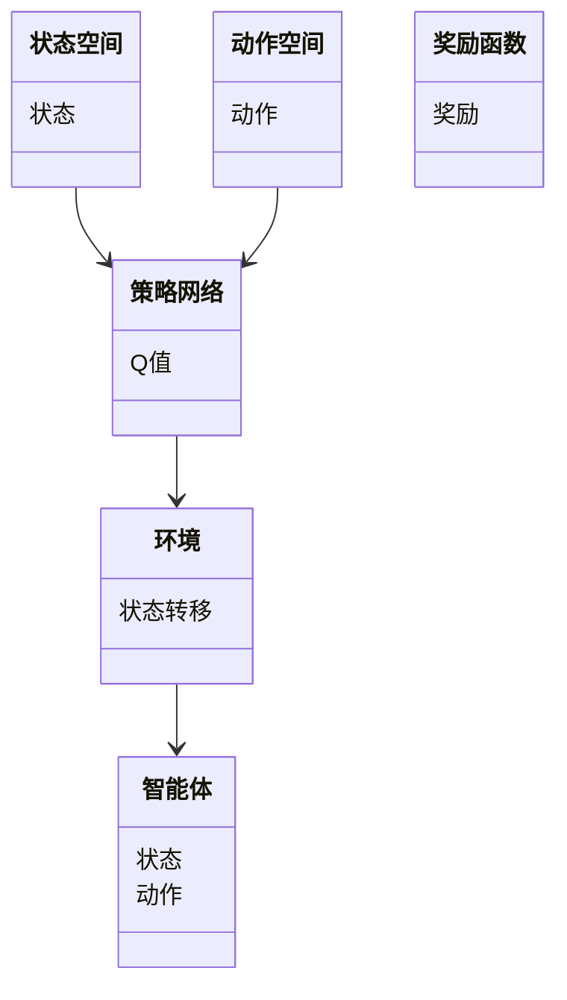
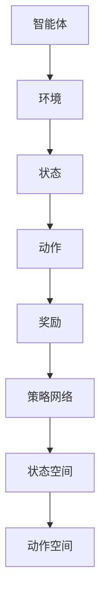
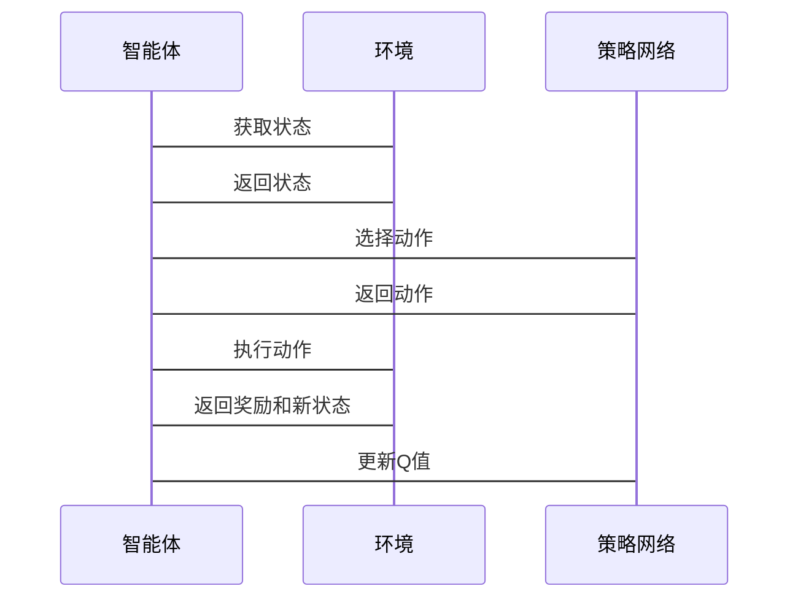

                 


# 《强化学习在AI Agent交互策略中的应用》

> 关键词：强化学习、AI Agent、交互策略、马尔可夫决策过程、深度强化学习、系统架构设计

> 摘要：本文详细探讨了强化学习在AI Agent交互策略中的应用，从基础理论到实际案例，系统性地分析了强化学习的核心算法、AI Agent的交互策略设计、系统架构设计以及项目实战。通过本文，读者可以全面理解强化学习在AI Agent中的重要作用，并掌握实际应用中的关键技术和方法。

---

# 第一部分：强化学习与AI Agent交互策略基础

---

## 第1章：强化学习与AI Agent概述

### 1.1 强化学习的基本概念

#### 1.1.1 什么是强化学习
强化学习（Reinforcement Learning，简称RL）是一种机器学习范式，通过智能体与环境的交互，智能体通过试错（trial and error）的方式学习如何采取适当的行动以最大化累积的奖励。与监督学习和无监督学习不同，强化学习依赖于环境的反馈，通过不断优化策略来实现目标。

#### 1.1.2 强化学习的核心要素
- **状态（State）**：智能体所处的环境信息，表示当前的情况。
- **动作（Action）**：智能体在特定状态下做出的选择。
- **奖励（Reward）**：智能体执行动作后，环境给予的反馈，表示该动作的好坏程度。
- **策略（Policy）**：智能体选择动作的概率分布，决定如何根据状态选择动作。
- **价值函数（Value Function）**：评估某个状态下或某个状态下采取某个动作后的期望累积奖励。

#### 1.1.3 AI Agent的基本概念
AI Agent（人工智能代理）是指能够感知环境并采取行动以实现目标的智能实体。AI Agent可以是软件程序、机器人或其他智能系统，其核心目标是通过与环境的交互来实现预定目标。

### 1.2 强化学习与AI Agent的关系
- **强化学习在AI Agent中的作用**：强化学习为AI Agent提供了一种通过试错和经验积累来优化交互策略的方法。
- **AI Agent的交互策略类型**：
  - **反应式策略（Reactive Strategy）**：基于当前状态做出即时反应。
  - **规划式策略（Planning Strategy）**：通过预规划或预测未来状态来选择动作。
  - **学习式策略（Learning Strategy）**：通过强化学习等方法不断优化策略。
- **强化学习与监督学习的区别**：
  - 监督学习：数据标签已知，通过样本学习映射关系。
  - 强化学习：通过与环境交互，基于奖励信号优化策略。

### 1.3 强化学习的应用场景
- **游戏AI**：如AlphaGo、游戏机器人等。
- **机器人控制**：如工业机器人、服务机器人。
- **自动驾驶**：如自动驾驶汽车的路径规划和决策控制。

### 1.4 本章小结
本章介绍了强化学习的基本概念、核心要素以及AI Agent的基本概念，重点分析了强化学习与AI Agent的关系，并列举了强化学习在AI Agent中的应用场景。

---

## 第2章：强化学习的核心算法

### 2.1 马尔可夫决策过程（MDP）

#### 2.1.1 MDP的定义与组成部分
MDP是一种数学模型，描述了智能体在环境中做出决策的过程。MDP由以下五部分组成：
- **状态空间（State Space）**：所有可能的状态集合。
- **动作空间（Action Space）**：智能体在每个状态下可以执行的动作集合。
- **转移概率（Transition Probability）**：从当前状态执行某个动作后转移到下一个状态的概率。
- **奖励函数（Reward Function）**：智能体执行某个动作后获得的奖励。
- **终止条件（Termination Condition）**：判断当前是否处于终止状态。

#### 2.1.2 状态、动作、奖励的定义
- **状态（State）**：智能体所处的环境信息，例如在迷宫中，状态可以表示为当前位置。
- **动作（Action）**：智能体在特定状态下做出的选择，例如在迷宫中选择“左转”或“右转”。
- **奖励（Reward）**：智能体执行动作后获得的反馈，通常是一个标量值，表示该动作的好坏。

#### 2.1.3 策略与价值函数
- **策略（Policy）**：智能体选择动作的概率分布，可以用概率函数或策略网络表示。
- **价值函数（Value Function）**：评估某个状态下或某个状态下采取某个动作后的期望累积奖励。

### 2.2 Q-learning算法

#### 2.2.1 Q-learning的基本原理
Q-learning是一种基于值函数的强化学习算法，通过不断更新Q值表（Q-Table）来学习最优策略。Q值表示在某个状态下执行某个动作后的期望累积奖励。

#### 2.2.2 Q值更新公式
$$ Q(s,a) = Q(s,a) + \alpha (r + \gamma \max Q(s',a') - Q(s,a)) $$
其中：
- $\alpha$：学习率，控制更新步长。
- $\gamma$：折扣因子，表示未来奖励的当前价值。

#### 2.2.3 探索与利用的平衡
- **探索（Exploration）**：尝试新的动作，避免陷入局部最优。
- **利用（Exploitation）**：利用已知的高价值动作，最大化累积奖励。

### 2.3 策略梯度方法

#### 2.3.1 策略梯度的基本思想
策略梯度方法直接优化策略，通过梯度上升或下降找到最优策略。核心思想是通过概率梯度估计优化策略参数。

#### 2.3.2 REINFORCE算法
REINFORCE是一种基于策略梯度的强化学习算法，通过样本轨迹的平均奖励梯度来更新策略参数。

$$ \nabla \theta \leftarrow \nabla \log \pi_\theta(a|s) \cdot R $$

其中：
- $\theta$：策略参数。
- $\pi_\theta(a|s)$：策略在状态$s$下选择动作$a$的概率。
- $R$：轨迹的总奖励。

#### 2.3.3 策略梯度的优势与挑战
- 优势：直接优化策略，无需值函数。
- 挑战：梯度估计的方差较大，训练不稳定。

### 2.4 深度强化学习

#### 2.4.1 DQN算法
DQN（Deep Q-Network）是Q-learning与深度学习的结合，通过神经网络近似Q值函数。

#### 2.4.2 深度网络在强化学习中的应用
- 使用卷积神经网络（CNN）处理图像类输入。
- 使用循环神经网络（RNN）处理序列类输入。

#### 2.4.3 图灵测试与强化学习的关系
图灵测试衡量机器的智能水平，强化学习通过与环境的交互优化智能体的行为，使得智能体更接近人类智能。

### 2.5 本章小结
本章详细介绍了强化学习的核心算法，包括马尔可夫决策过程、Q-learning算法、策略梯度方法和深度强化学习，重点分析了这些算法的原理和特点。

---

## 第3章：AI Agent的交互策略设计

### 3.1 基于强化学习的策略优化

#### 3.1.1 策略评估与改进
- **策略评估**：评估当前策略的优劣。
- **策略改进**：通过优化策略参数或动作选择来提高累积奖励。

#### 3.1.2 奖励函数的设计原则
- **明确性**：奖励应清晰地指导智能体的行为。
- **一致性**：相同动作在相同状态下的奖励应一致。
- **可调整性**：奖励函数应可调，以适应不同的任务需求。

#### 3.1.3 动态环境中的策略调整
- 动态环境：环境状态和奖励函数可能随时间变化。
- 策略调整：通过在线学习或离线学习适应环境变化。

### 3.2 多智能体系统中的交互策略

#### 3.2.1 多智能体系统的基本概念
多智能体系统由多个智能体组成，智能体之间需要协作或竞争以实现共同目标。

#### 3.2.2 多智能体强化学习的挑战
- **状态空间的复杂性**：多个智能体的状态组合可能非常复杂。
- **动作空间的复杂性**：智能体之间需要协调动作。
- **奖励分配**：如何分配奖励以激励智能体协作。

#### 3.2.3 协作与竞争策略
- **协作策略**：智能体之间相互协作，共同完成任务。
- **竞争策略**：智能体之间相互竞争，争取资源。

### 3.3 人机协作中的交互策略

#### 3.3.1 人机协作的基本概念
人机协作是指人类与AI Agent共同完成任务，智能体需要理解人类的意图并做出相应的动作。

#### 3.3.2 基于强化学习的协作策略
- **协作奖励**：设计奖励函数鼓励智能体与人类协作。
- **意图理解**：通过强化学习优化智能体对人类意图的理解。

#### 3.3.3 协作中的信任建立与反馈机制
- **信任建立**：通过智能体的行为表现建立信任。
- **反馈机制**：人类对智能体动作的反馈用于优化策略。

### 3.4 本章小结
本章探讨了AI Agent的交互策略设计，重点分析了基于强化学习的策略优化、多智能体系统中的交互策略以及人机协作中的交互策略。

---

## 第4章：系统分析与架构设计

### 4.1 系统分析

#### 4.1.1 问题场景介绍
以一个简单的迷宫导航问题为例，设计一个基于强化学习的AI Agent，使其能够通过与环境的交互找到最优路径。

#### 4.1.2 项目介绍与目标
- **项目目标**：实现一个基于强化学习的迷宫导航AI Agent。
- **项目需求**：
  - 环境建模：迷宫的结构、状态转移规则和奖励函数。
  - 算法实现：选择合适的强化学习算法（如DQN）实现迷宫导航。
  - 系统测试：验证算法的有效性和稳定性。

#### 4.1.3 系统功能设计（领域模型Mermaid类图）


### 4.2 系统架构设计

#### 4.2.1 系统架构设计Mermaid架构图


#### 4.2.2 系统接口设计
- **输入接口**：接收环境状态和动作。
- **输出接口**：输出智能体的动作和累积奖励。

#### 4.2.3 系统交互流程Mermaid序列图


### 4.3 系统实现细节

#### 4.3.1 算法选择与实现
选择DQN算法实现迷宫导航，使用神经网络近似Q值函数。

#### 4.3.2 系统性能优化
- **经验回放**：通过经验回放减少样本偏差。
- **网络结构优化**：选择合适的神经网络结构（如CNN）处理环境状态。

#### 4.3.3 系统测试与验证
- **测试环境**：迷宫的结构和参数。
- **测试指标**：路径长度、累积奖励、收敛速度。

### 4.4 本章小结
本章通过迷宫导航问题，详细分析了基于强化学习的AI Agent系统的系统分析与架构设计。

---

## 第5章：项目实战

### 5.1 环境安装与配置

#### 5.1.1 安装Python
```bash
# 安装Python和pip
sudo apt-get update
sudo apt-get install python3 python3-pip
```

#### 5.1.2 安装深度学习库
```bash
pip install numpy tensorflow gym
```

### 5.2 系统核心实现源代码

#### 5.2.1 DQN算法实现
```python
import numpy as np
import gym
import tensorflow as tf

# 定义DQN网络
class DQN:
    def __init__(self, state_space, action_space, hidden_units=64):
        self.state_space = state_space
        self.action_space = action_space
        self.hidden_units = hidden_units
        
        # 网络结构
        self.model = tf.keras.Sequential([
            tf.keras.layers.Dense(hidden_units, activation='relu', input_shape=(state_space,)),
            tf.keras.layers.Dense(action_space, activation='linear')
        ])
        
        # 编译模型
        self.model.compile(optimizer=tf.keras.optimizers.Adam(learning_rate=0.001), 
                           loss='mean_squared_error')
    
    # 预测动作
    def predict(self, state):
        return self.model.predict(np.array([state]))[0]
    
    # 更新Q值
    def update(self, states, targets):
        self.model.fit(np.array(states), np.array(targets), epochs=1, verbose=0)
```

#### 5.2.2 迷宫导航实现
```python
# 创建环境
env = gym.make('迷宫导航环境')

# 初始化DQN
state_space = env.observation_space.shape[0]
action_space = env.action_space.n
dqn = DQN(state_space, action_space)

# 训练过程
for episode in range(1000):
    state = env.reset()
    total_reward = 0
    done = False
    while not done:
        # 预测动作
        action = np.argmax(dqn.predict(state))
        # 执行动作
        next_state, reward, done, info = env.step(action)
        # 更新Q值
        target = dqn.predict(state)
        target[0][action] = reward + gamma * np.max(dqn.predict(next_state))
        dqn.update([state], [target])
        total_reward += reward
    print(f"Episode {episode}, Total Reward: {total_reward}")
```

### 5.3 代码应用解读与分析
- **DQN网络实现**：使用Keras构建DQN网络，包括输入层、隐藏层和输出层。
- **迷宫导航实现**：通过不断与环境交互，更新Q值函数，最终找到最优路径。

### 5.4 实际案例分析
以迷宫导航为例，展示如何通过强化学习优化AI Agent的交互策略，实现从起点到终点的最优路径。

### 5.5 本章小结
本章通过一个具体的案例，详细展示了基于强化学习的AI Agent系统的实现过程，包括环境搭建、算法实现和系统测试。

---

## 第6章：总结与展望

### 6.1 本章总结
本文详细探讨了强化学习在AI Agent交互策略中的应用，从基础理论到实际案例，系统性地分析了强化学习的核心算法、AI Agent的交互策略设计、系统架构设计以及项目实战。

### 6.2 未来研究方向
- **多智能体协作**：研究多智能体协作中的交互策略优化。
- **实时交互策略优化**：探索实时环境下的策略优化方法。
- **复杂环境中的应用**：将强化学习应用于更复杂的环境和任务。

### 6.3 展望
随着人工智能技术的不断发展，强化学习在AI Agent交互策略中的应用将更加广泛和深入，未来的研究将更加关注多智能体协作、实时优化和复杂环境下的应用。

---

## 附录：数学公式与工具安装指南

### 附录A：强化学习相关数学公式

#### 1. MDP的贝尔曼方程
$$ V(s) = \max_a \left( r(s,a) + \gamma \sum_{s'} P(s'|s,a) V(s') \right) $$

#### 2. Q-learning的更新公式
$$ Q(s,a) = Q(s,a) + \alpha (r + \gamma \max Q(s',a') - Q(s,a)) $$

### 附录B：工具安装指南

#### 1. 安装Python和TensorFlow
```bash
pip install numpy tensorflow gym
```

#### 2. 安装Keras
```bash
pip install keras
```

---

# 作者：AI天才研究院/AI Genius Institute & 禅与计算机程序设计艺术 /Zen And The Art of Computer Programming

---

希望这篇文章能满足您的需求！如果需要进一步调整或补充，请随时告诉我。

