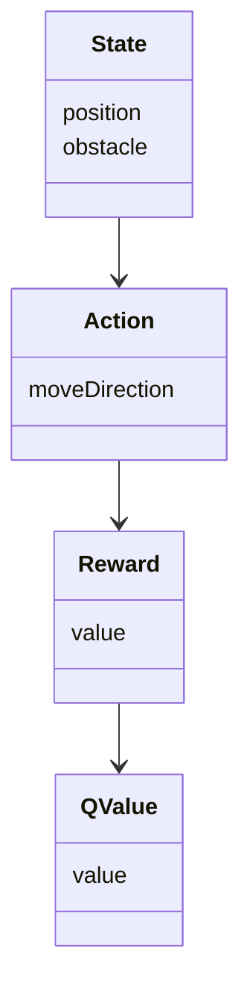
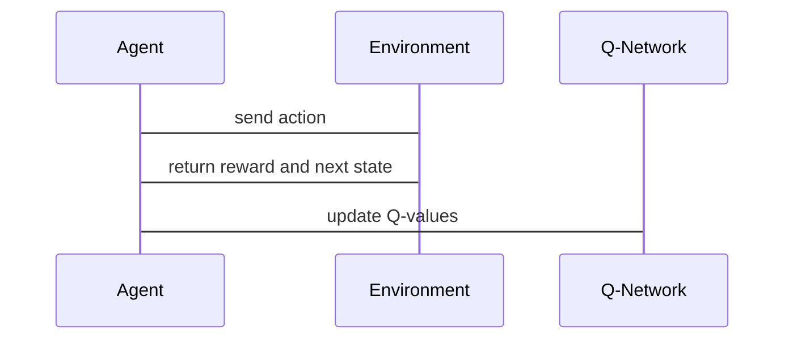

                 


# 强化学习在AI Agent决策中的应用

> 关键词：强化学习，AI Agent，决策系统，马尔可夫决策过程，Q-learning，深度强化学习

> 摘要：本文详细探讨了强化学习在AI Agent决策中的应用，从基础概念到高级算法，结合实际案例，深入分析了强化学习的核心原理、系统架构设计和项目实现细节，帮助读者全面掌握强化学习在AI Agent中的应用。

---

# 第1章 强化学习与AI Agent概述

## 1.1 强化学习的基本概念

### 1.1.1 强化学习的定义

强化学习（Reinforcement Learning，RL）是一种机器学习范式，通过智能体与环境的交互，学习如何采取行动以最大化累计奖励。智能体会在环境中执行动作，获得奖励或惩罚，并根据这些反馈调整策略，以优化长期目标的实现。

### 1.1.2 AI Agent的定义与特点

AI Agent（人工智能代理）是指能够感知环境、自主决策并采取行动的智能实体。AI Agent的核心特点包括自主性、反应性、目标导向和学习能力。强化学习为AI Agent提供了决策的框架和方法。

### 1.1.3 强化学习在AI Agent中的作用

强化学习通过与环境的交互，帮助AI Agent学习最优策略，从而在动态和不确定的环境中做出高效决策。强化学习为AI Agent提供了自适应和自优化的能力，使其能够应对复杂问题。

---

## 1.2 强化学习的核心概念

### 1.2.1 状态、动作与奖励的定义

- **状态（State）**：环境在某一时刻的信息表示，例如在迷宫中，智能体的位置和周围的墙分布。
- **动作（Action）**：智能体在给定状态下采取的行动，例如“向上移动”或“向右移动”。
- **奖励（Reward）**：智能体执行动作后获得的反馈，用于指导学习策略，例如到达目标位置后获得奖励+1。

### 1.2.2 策略与价值函数的对比

- **策略（Policy）**：定义智能体在给定状态下选择动作的概率分布，分为确定性策略和概率性策略。
- **价值函数（Value Function）**：衡量一个状态或动作的好坏，帮助智能体评估当前状态的价值。

### 1.2.3 马尔可夫决策过程（MDP）的介绍

马尔可夫决策过程描述了强化学习问题的基本结构，包括状态空间、动作空间、转移概率和奖励函数。MDP假设环境具有马尔可夫性质，即当前状态足以决定未来的决策。

---

## 1.3 强化学习的应用场景

### 1.3.1 游戏AI的实现

强化学习广泛应用于游戏AI，例如AlphaGo和OpenAI Gym中的AI代理，通过与环境的交互学习最优策略。

### 1.3.2 机器人控制

强化学习用于机器人导航和路径规划，帮助机器人在动态环境中做出最优决策。

### 1.3.3 自动驾驶中的决策问题

强化学习在自动驾驶中用于决策路径选择和避障策略，提升车辆的自主决策能力。

---

## 1.4 本章小结

本章介绍了强化学习的基本概念和AI Agent的特点，探讨了强化学习在AI Agent中的作用，并通过具体案例说明了强化学习的应用场景。

---

# 第2章 强化学习的核心原理

## 2.1 马尔可夫决策过程（MDP）详解

### 2.1.1 状态空间的定义

状态空间是智能体所有可能状态的集合，例如在迷宫中，智能体的每个位置都是一个状态。

### 2.1.2 动作空间的定义

动作空间是智能体在给定状态下所有可能动作的集合，例如在二维空间中，智能体可以向上、向下、向左或向右移动。

### 2.1.3 奖励函数的设计

奖励函数定义了智能体在执行动作后的反馈，例如到达目标位置后获得奖励+1，碰撞障碍物后获得奖励-1。

---

## 2.2 策略与价值函数的数学模型

### 2.2.1 策略的定义与分类

- **确定性策略（Deterministic Policy）**：给定状态，策略唯一确定一个动作。
- **概率性策略（Stochastic Policy）**：给定状态，策略给出动作的概率分布。

### 2.2.2 价值函数的定义与计算

价值函数衡量一个状态或动作的好坏，常用Q值函数（Q-learning）和V值函数（Value Iteration）来表示。

---

## 2.3 强化学习的算法分类

### 2.3.1 基于值函数的方法

- Q-learning：通过更新Q值函数，学习状态-动作对的最优值。

### 2.3.2 基于策略梯度的方法

- 政策梯度法：直接优化策略参数，通过梯度上升方法最大化奖励。

### 2.3.3 基于Actor-Critic架构的方法

- Actor-Critic：同时维护策略（Actor）和价值函数（Critic），通过策略调整和价值评估相互配合。

---

## 2.4 本章小结

本章详细介绍了强化学习的核心原理，包括马尔可夫决策过程、策略与价值函数的数学模型，以及常见的强化学习算法分类。

---

# 第3章 强化学习算法的数学模型与公式

## 3.1 Q-learning算法的数学推导

### 3.1.1 Q值的更新公式

$$ Q(s, a) \leftarrow Q(s, a) + \alpha \left( r + \gamma \max_{a'} Q(s', a') - Q(s, a) \right) $$

其中，$\alpha$是学习率，$\gamma$是折扣因子，$s$是当前状态，$a$是当前动作，$s'$是下一个状态。

---

## 3.2 Deep Q-Networks（DQN）的实现

### 3.2.1 神经网络的输入输出结构

神经网络输入为状态$s$，输出为动作$a$的概率分布。

### 3.2.2 经验回放机制的数学模型

经验回放机制通过存储$(s, a, r, s')$的元组，随机采样来训练网络，减少相关样本的依赖。

---

## 3.3 Actor-Critic算法的数学模型

### 3.3.1 Actor网络的策略更新

通过梯度上升方法，优化策略参数，最大化奖励函数。

### 3.3.2 Critic网络的价值评估

通过评估当前策略的价值，指导Actor网络的优化。

---

## 3.4 本章小结

本章通过数学公式详细推导了Q-learning算法和DQN算法的实现过程，并介绍了Actor-Critic算法的基本原理。

---

# 第4章 强化学习的系统分析与架构设计

## 4.1 系统分析与需求定义

### 4.1.1 问题场景的描述

以迷宫导航为例，描述智能体在迷宫中导航的过程。

### 4.1.2 系统功能的定义

包括状态感知、动作选择、奖励计算和策略更新等功能。

### 4.1.3 系统性能指标的设定

包括学习效率、决策准确率和响应时间等指标。

---

## 4.2 系统架构设计

### 4.2.1 领域模型的构建（Mermaid类图）



### 4.2.2 系统架构的分层设计（Mermaid架构图）

```mermaid
    participant Environment
    participant Agent
    participant Q-Network
    Agent -> Environment: send action
    Environment -> Agent: return reward and next state
    Agent -> Q-Network: update Q-values
```

---

## 4.3 系统交互

### 4.3.1 系统交互流程（Mermaid序列图）



---

## 4.4 本章小结

本章通过系统分析与架构设计，详细描述了AI Agent的实现过程，包括领域模型和系统架构的设计。

---

# 第5章 强化学习的项目实战

## 5.1 项目背景与目标

以OpenAI Gym环境中的迷宫导航为例，目标是训练一个智能体在迷宫中找到出口。

---

## 5.2 项目核心实现

### 5.2.1 环境配置

```python
import gym
env = gym.make('迷宫导航-v0')
env.reset()
```

### 5.2.2 神经网络实现

```python
import torch
import torch.nn as nn

class QNetwork(nn.Module):
    def __init__(self, state_size, action_size):
        super(QNetwork, self).__init__()
        self.fc1 = nn.Linear(state_size, 64)
        self.fc2 = nn.Linear(64, action_size)
    
    def forward(self, x):
        x = torch.relu(self.fc1(x))
        x = torch.relu(self.fc2(x))
        return x
```

### 5.2.3 算法实现

```python
import torch.optim as optim

def train(q_network, optimizer, memory, batch_size, gamma):
    if len(memory) < batch_size:
        return
    minibatch = random.sample(memory, batch_size)
    states = torch.stack([minibatch[i][0] for i in range(batch_size)])
    actions = torch.tensor([minibatch[i][1] for i in range(batch_size)])
    rewards = torch.tensor([minibatch[i][2] for i in range(batch_size)])
    next_states = torch.stack([minibatch[i][3] for i in range(batch_size)])
    
    current_q_values = q_network(states).gather(1, actions)
    next_q_values = q_network(next_states).max(1)[0].detach()
    target_q_values = rewards + gamma * next_q_values
    
    loss = F.mse_loss(current_q_values, target_q_values)
    optimizer.zero_grad()
    loss.backward()
    optimizer.step()
```

---

## 5.3 项目小结

本章通过OpenAI Gym环境的实战，详细展示了强化学习在AI Agent中的具体实现，包括环境配置、神经网络实现和算法实现。

---

# 第6章 强化学习的未来发展趋势

## 6.1 强化学习的未来研究方向

### 6.1.1 分布式强化学习

通过分布式计算，提升强化学习的训练效率和扩展性。

### 6.1.2 多智能体协作

研究多个智能体之间的协作与竞争，提升整体决策能力。

### 6.1.3 强化学习与深度学习的结合

通过深度学习的强大表征能力，提升强化学习的性能和泛化能力。

---

## 6.2 本章小结

本章探讨了强化学习的未来发展趋势，包括分布式强化学习、多智能体协作和强化学习与深度学习的结合。

---

# 附录

## 附录A 强化学习算法代码示例

```python
import gym
import torch
import torch.nn as nn
import torch.optim as optim
import random
import numpy as np

class QNetwork(nn.Module):
    def __init__(self, state_size, action_size):
        super(QNetwork, self).__init__()
        self.fc1 = nn.Linear(state_size, 64)
        self.fc2 = nn.Linear(64, action_size)
    
    def forward(self, x):
        x = torch.relu(self.fc1(x))
        x = torch.relu(self.fc2(x))
        return x

def train(q_network, optimizer, memory, batch_size, gamma):
    if len(memory) < batch_size:
        return
    minibatch = random.sample(memory, batch_size)
    states = torch.stack([minibatch[i][0] for i in range(batch_size)])
    actions = torch.tensor([minibatch[i][1] for i in range(batch_size)])
    rewards = torch.tensor([minibatch[i][2] for i in range(batch_size)])
    next_states = torch.stack([minibatch[i][3] for i in range(batch_size)])
    
    current_q_values = q_network(states).gather(1, actions)
    next_q_values = q_network(next_states).max(1)[0].detach()
    target_q_values = rewards + gamma * next_q_values
    
    loss = F.mse_loss(current_q_values, target_q_values)
    optimizer.zero_grad()
    loss.backward()
    optimizer.step()

def main():
    env = gym.make('迷宫导航-v0')
    state_size = env.observation_space.shape[0]
    action_size = env.action_space.n
    q_network = QNetwork(state_size, action_size)
    optimizer = optim.Adam(q_network.parameters())
    memory = []
    gamma = 0.99
    batch_size = 32
    
    for episode in range(1000):
        state = env.reset()
        while True:
            # 策略选择动作
            if random.random() < 0.9:  # 探索策略
                action = env.action_space.sample()
            else:  # 利用策略
                with torch.no_grad():
                    q_values = q_network(torch.FloatTensor(state))
                    action = torch.argmax(q_values).item()
            
            # 执行动作并获取反馈
            next_state, reward, done, _ = env.step(action)
            
            # 存储经验
            memory.append((state, action, reward, next_state))
            
            # 训练网络
            train(q_network, optimizer, memory, batch_size, gamma)
            
            # 更新状态
            state = next_state
            
            if done:
                break

if __name__ == "__main__":
    main()
```

---

## 附录B 强化学习相关数学公式汇总

- Q值更新公式：
$$ Q(s, a) \leftarrow Q(s, a) + \alpha \left( r + \gamma \max_{a'} Q(s', a') - Q(s, a) \right) $$

- 梯度上升公式：
$$ \theta \leftarrow \theta + \alpha \nabla_\theta J(\theta) $$

---

# 参考文献

[1] Sutton, R. S., & Barto, A. G. (2018). Reinforcement learning: An introduction. MIT Press.

[2] Mnih, V., et al. (2015). Human-level control through deep reinforcement learning. Nature, 518(7537), 529-533.

---

# 作者

作者：AI天才研究院/AI Genius Institute & 禅与计算机程序设计艺术/Zen And The Art of Computer Programming

---

本文详细探讨了强化学习在AI Agent决策中的应用，从基础概念到高级算法，结合实际案例，深入分析了强化学习的核心原理、系统架构设计和项目实现细节，帮助读者全面掌握强化学习在AI Agent中的应用。

