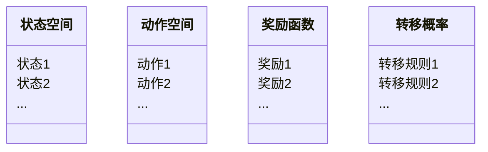
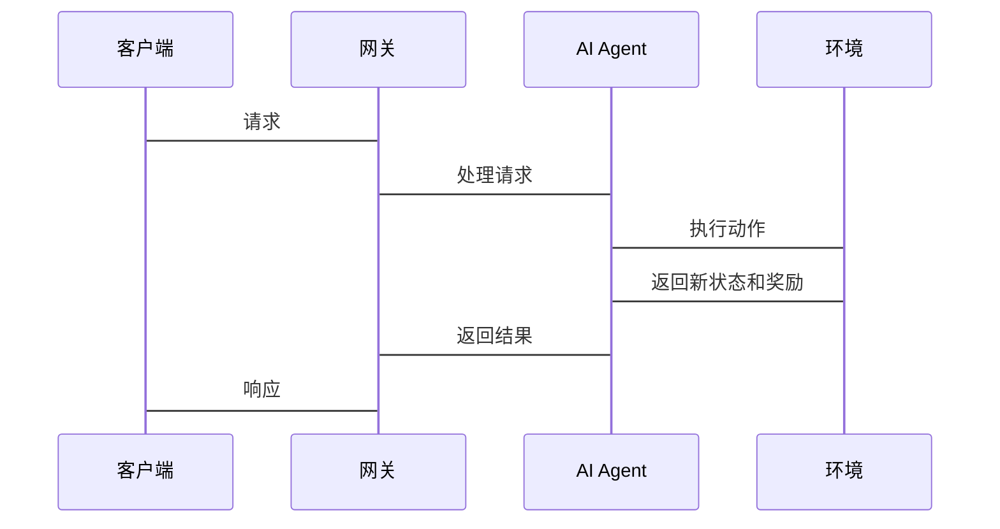

                 


# 强化学习在AI Agent决策中的应用

## 关键词
强化学习, AI Agent, 决策过程, 状态-动作-奖励-转移（SART）、马尔可夫决策过程（MDP）、Q-learning算法、Deep Q-Networks、策略梯度方法

## 摘要
本文系统地探讨了强化学习在AI Agent决策中的应用，从基础概念到核心算法，再到实际应用，层层深入。首先，介绍了强化学习的基本概念和其在AI Agent中的作用。接着，详细讲解了强化学习的数学模型，如马尔可夫决策过程（MDP）、贝尔曼方程以及Q-learning算法。然后，通过实际案例分析了强化学习在系统中的应用，并给出了系统架构设计。最后，通过项目实战展示了如何实现强化学习算法，并总结了最佳实践和未来发展方向。

---

# 第1章 强化学习的基本概念

## 1.1 强化学习的定义与特点

### 1.1.1 什么是强化学习
强化学习（Reinforcement Learning, RL）是一种机器学习范式，通过智能体与环境的交互，以最大化累积奖励为目标，学习最优策略。与监督学习不同，强化学习没有明确的标签数据，而是通过奖励信号来指导学习过程。

### 1.1.2 强化学习的核心特点
- **试错学习**：智能体通过不断尝试动作，从经验中学习。
- **延迟奖励**：奖励可能在多个动作之后才给出。
- **策略优化**：目标是找到最优策略，使累积奖励最大化。

### 1.1.3 强化学习与监督学习的区别
| 特性 | 监督学习 | 强化学习 |
|------|----------|----------|
| 数据 | 标签数据 | 奖励信号 |
| 目标 | 预测目标 | 最大化奖励 |
| 交互 | 无 | 有 |

## 1.2 AI Agent与强化学习的关系

### 1.2.1 AI Agent的定义
AI Agent是一个能够感知环境并采取行动以实现目标的实体。它可以是一个软件程序、机器人或其他智能系统。

### 1.2.2 强化学习在AI Agent中的作用
强化学习为AI Agent提供了一种通过试错学习最优决策的方法，使其能够在动态环境中做出高效决策。

### 1.2.3 强化学习与AI Agent的结合
- 强化学习帮助AI Agent在没有明确规则的情况下，通过经验学习最优策略。
- AI Agent通过与环境交互，不断更新策略以适应环境变化。

## 1.3 强化学习在决策中的应用

### 1.3.1 决策问题的定义
决策问题是指智能体在给定状态下选择一个动作，以实现目标的过程。

### 1.3.2 强化学习在决策中的优势
- 适用于动态和不确定环境。
- 能够处理高维状态空间和动作空间。

### 1.3.3 典型应用案例分析
- 游戏AI：如AlphaGo。
- 自动驾驶：路径规划和决策。
- 机器人控制：动作选择和优化。

## 1.4 本章小结
本章介绍了强化学习的基本概念、特点及其在AI Agent中的作用。强化学习通过试错学习，帮助AI Agent在动态环境中做出最优决策。

---

# 第2章 强化学习的数学模型

## 2.1 马尔可夫决策过程（MDP）

### 2.1.1 状态空间
状态空间是所有可能状态的集合，表示环境的状况。

### 2.1.2 动作空间
动作空间是所有可能动作的集合，表示智能体可以采取的行动。

### 2.1.3 奖励函数
奖励函数定义了智能体在特定状态下采取某个动作后的奖励值。

### 2.1.4 转移概率
转移概率描述了智能体在某个状态下采取某个动作后转移到下一个状态的概率。

### 2.1.5 例子
在迷宫导航问题中，智能体在每个状态（位置）选择一个动作（移动方向），并根据是否到达终点获得奖励。

## 2.2 策略与价值函数

### 2.2.1 策略的定义
策略是智能体在每个状态下选择动作的概率分布。

### 2.2.2 价值函数的定义
价值函数表示智能体在某个状态下采取某个动作后的期望累积奖励。

### 2.2.3 Bellman方程
贝尔曼方程描述了价值函数的递归性质：

$$ V(s) = \max_a [r(s,a) + \gamma \sum_{s'} P(s'|s,a) V(s') ] $$

其中，$r(s,a)$是奖励函数，$\gamma$是折扣因子，$P(s'|s,a)$是转移概率。

## 2.3 强化学习的核心公式

### 2.3.1 Q-learning公式
Q-learning算法通过更新Q值函数来逼近最优策略：

$$ Q(s,a) = Q(s,a) + \alpha (r + \gamma \max Q(s',a') - Q(s,a)) $$

其中，$\alpha$是学习率。

---

# 第3章 强化学习的核心算法

## 3.1 Q-learning算法

### 3.1.1 算法原理
Q-learning通过维护Q表，记录每个状态-动作对的值，并通过经验更新Q表。

### 3.1.2 算法步骤
1. 初始化Q表为零。
2. 在每个步骤中，智能体选择一个动作。
3. 计算奖励并更新Q表。

### 3.1.3 代码实现
```python
import numpy as np

# 初始化Q表
Q = np.zeros((状态空间大小, 动作空间大小))

# 算法步骤
for episode in range(训练次数):
    状态 = 初始化状态
    while not 终止条件:
        动作 = 选择动作（探索与利用）
        新状态, 奖励 = 与环境交互
        Q[当前状态][动作] += 学习率 * (奖励 + γ * np.max(Q[新状态]) - Q[当前状态][动作])
        当前状态 = 新状态
```

## 3.2 Deep Q-Networks（DQN）算法

### 3.2.1 算法原理
DQN使用神经网络近似Q值函数，通过经验回放和目标网络来稳定训练。

### 3.2.2 算法步骤
1. 经验回放：存储交互经验。
2. 更新目标网络：定期更新目标网络权重。

### 3.2.3 代码实现
```python
import torch

# 定义神经网络结构
class DQN(torch.nn.Module):
    def __init__(self, 输入维度, 输出维度):
        super(DQN, self).__init__()
        self.fc1 = torch.nn.Linear(输入维度, 32)
        self.fc2 = torch.nn.Linear(32, 输出维度)
    
    def forward(self, x):
        x = torch.relu(self.fc1(x))
        x = self.fc2(x)
        return x

# 初始化
主网络 = DQN(输入维度, 输出维度)
目标网络 = DQN(输入维度, 输出维度)
目标网络.load_state_dict(主网络.state_dict())
```

## 3.3 策略梯度方法

### 3.3.1 算法原理
策略梯度方法直接优化策略，通过梯度上升最大化累积奖励。

### 3.3.2 算法步骤
1. 采样动作：根据当前策略选择动作。
2. 计算梯度：更新策略参数以最大化奖励。

### 3.3.3 代码实现
```python
import torch

# 定义策略网络
class PolicyNetwork(torch.nn.Module):
    def __init__(self, 输入维度, 输出维度):
        super(PolicyNetwork, self).__init__()
        self.fc1 = torch.nn.Linear(输入维度, 32)
        self.fc2 = torch.nn.Linear(32, 输出维度)
    
    def forward(self, x):
        x = torch.relu(self.fc1(x))
        x = torch.softmax(self.fc2(x), dim=-1)
        return x

# 策略梯度算法
策略网络 = PolicyNetwork(输入维度, 输出维度)
优化器 = torch.optim.Adam(策略网络.parameters(), lr=学习率)

for episode in range(训练次数):
    状态 = 初始化状态
    while not 终止条件:
        动作概率 = 策略网络(当前状态)
        动作 = 采样动作（动作概率）
        新状态, 奖励 = 与环境交互
        # 计算梯度并更新
        loss = -torch.mean(torch.log(动作概率) * 奖励)
        loss.backward()
        优化器.step()
```

---

# 第4章 强化学习在系统中的应用

## 4.1 系统功能设计

### 4.1.1 领域模型
使用Mermaid类图描述领域模型：



## 4.2 系统架构设计

### 4.2.1 系统架构图
使用Mermaid架构图展示系统架构：


## 4.3 接口设计

### 4.3.1 接口定义
- 输入接口：接收状态和动作。
- 输出接口：返回新状态和奖励。

### 4.3.2 交互序列图
使用Mermaid序列图展示交互流程：



## 4.4 交互设计

### 4.4.1 交互流程
- 智能体接收当前状态。
- 选择动作并执行。
- 更新Q表或策略参数。
- 返回新状态和奖励。

---

# 第5章 项目实战

## 5.1 环境安装

### 5.1.1 安装依赖
```bash
pip install numpy torch gym
```

## 5.2 系统核心实现

### 5.2.1 环境定义
使用OpenAI Gym定义环境：

```python
import gym

env = gym.make('CartPole-v0')
env.seed(42)
```

### 5.2.2 策略实现
实现Q-learning算法：

```python
class QLearner:
    def __init__(self, 状态空间大小, 动作空间大小):
        self.Q = np.zeros((状态空间大小, 动作空间大小))
    
    def choose_action(self, 状态, ε=0.1):
        if np.random.random() < ε:
            return np.random.randint(动作空间大小)
        else:
            return np.argmax(self.Q[状态])
    
    def update_Q(self, 当前状态, 动作, 奖励, 新状态, γ=0.99):
        self.Q[当前状态][动作] += 0.1 * (奖励 + γ * np.max(self.Q[新状态]) - self.Q[当前状态][动作])
```

## 5.3 代码实现

### 5.3.1 训练过程
```python
learner = QLearner(env.observation_space.shape[0], env.action_space.n)
for episode in range(1000):
    状态 = env.reset()
    总奖励 = 0
    while True:
        动作 = learner.choose_action(状态)
        新状态, 奖励, 终止标志, _ = env.step(动作)
        learner.update_Q(状态, 动作, 奖励, 新状态)
        总奖励 += 奖励
        状态 = 新状态
        if 终止标志:
            break
```

## 5.4 案例分析

### 5.4.1 训练结果
随着训练的进行，智能体能够稳定地控制杆保持平衡。

### 5.4.2 比较分析
与随机策略相比，Q-learning算法能够更快地找到最优策略。

## 5.5 项目总结
通过实现Q-learning算法，验证了强化学习在简单任务中的有效性，为后续复杂任务提供了参考。

---

# 第6章 最佳实践与总结

## 6.1 最佳实践

### 6.1.1 参数调优
合理设置学习率和折扣因子，避免训练不稳定。

### 6.1.2 探索与利用平衡
通过ε-greedy策略平衡探索新动作和利用已知最优动作。

### 6.1.3 复杂环境处理
对于高维状态空间，优先考虑使用深度强化学习方法。

## 6.2 小结

### 6.2.1 强化学习的核心概念
- 状态、动作、奖励、转移。
- Q值函数、贝尔曼方程。

### 6.2.2 算法选择
- Q-learning：适合简单任务。
- DQN：适合高维状态。
- 策略梯度：适合复杂任务。

### 6.2.3 系统设计
- 明确系统架构和接口设计。
- 使用流程图和类图辅助设计。

## 6.3 注意事项

### 6.3.1 训练时间
强化学习训练时间较长，需耐心优化。

### 6.3.2 环境建模
准确建模环境，确保智能体能够正确交互。

### 6.3.3 算法收敛性
关注算法收敛性，避免陷入局部最优。

## 6.4 拓展阅读

### 6.4.1 推荐书籍
- 《强化学习》（李航）
- 《深度强化学习》（唐宇迪）

### 6.4.2 推荐论文
- 策略梯度方法论文。
- DQN论文。

---

# 作者

**作者：AI天才研究院/AI Genius Institute & 禅与计算机程序设计艺术 /Zen And The Art of Computer Programming**

---

通过以上内容，我们系统地探讨了强化学习在AI Agent决策中的应用，从基本概念到核心算法，再到实际应用，层层深入。希望读者能够通过本文，掌握强化学习的核心思想，并将其应用到实际项目中。

