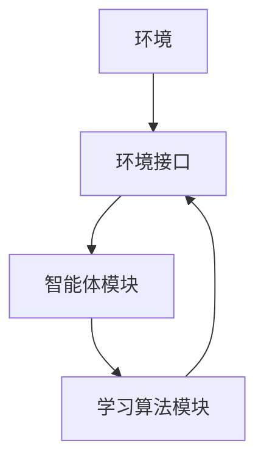

                 

# 强化学习在AI Agent决策中的运用

---

## 关键词：
强化学习，AI Agent，决策过程，Q-learning，策略梯度，马尔可夫决策过程

---

## 摘要：
本文系统地探讨了强化学习在AI Agent决策中的应用，从基本概念、核心算法到实际应用，层层深入。文章首先介绍了强化学习和AI Agent的基本概念，随后详细分析了强化学习的核心算法，如Q-learning和策略梯度方法，并结合马尔可夫决策过程（MDP）进行了数学建模。接着，文章探讨了AI Agent的体系结构及其与强化学习的结合，最后通过实际案例展示了强化学习在游戏AI、机器人控制和自动驾驶等领域的应用。文章还讨论了系统设计与实现的关键步骤，并展望了强化学习的未来发展趋势。

---

# 第一部分: 强化学习在AI Agent决策中的运用概述

---

# 第1章: 强化学习与AI Agent概述

## 1.1 强化学习的基本概念

### 1.1.1 什么是强化学习
强化学习（Reinforcement Learning, RL）是一种机器学习范式，通过智能体与环境的交互来学习最优策略。智能体通过执行动作并观察环境的反馈（奖励或惩罚）来优化其行为，以最大化累计奖励。

**关键概念：**
- **智能体（Agent）**：决策的主体，负责感知环境并采取行动。
- **环境（Environment）**：智能体所处的外部世界，提供反馈。
- **状态（State）**：环境在某一时间点的描述。
- **动作（Action）**：智能体对环境的响应。
- **奖励（Reward）**：智能体执行动作后，环境对其行为的反馈，用于指导学习。

### 1.1.2 强化学习的核心要素
- **目标函数**：通过最大化累计奖励来优化策略。
- **探索与利用**：智能体在未知环境中需要平衡探索新策略和利用已知策略。
- **策略（Policy）**：描述智能体在给定状态下选择动作的概率分布。

### 1.1.3 AI Agent的定义与特点
AI Agent是一种智能实体，能够感知环境、自主决策并采取行动。其特点包括：
- **自主性**：无需外部干预，自主决策。
- **反应性**：实时感知环境并做出反应。
- **目标导向**：基于目标优化行为。

---

## 1.2 强化学习的发展历程

### 1.2.1 强化学习的起源
强化学习的起源可以追溯到20世纪50年代的“试错学习”理论。早期的研究主要集中在简单的环境模型上，如棋类游戏和迷宫导航。

### 1.2.2 强化学习的演进与应用
20世纪90年代，Q-learning等算法的提出推动了强化学习的发展。近年来，深度强化学习（Deep RL）的出现使得强化学习在复杂任务中的应用成为可能，如AlphaGo和自动驾驶。

### 1.2.3 当前强化学习的研究热点
- **多智能体强化学习**：多个智能体协同决策。
- **连续控制问题**：处理连续动作空间的问题。
- **人机协作**：强化学习与人类决策的结合。

---

## 1.3 AI Agent与强化学习的关系

### 1.3.1 AI Agent的决策需求
AI Agent需要在复杂环境中做出高效决策，强化学习为其提供了一种基于经验的学习方法。

### 1.3.2 强化学习在AI Agent中的作用
强化学习通过与环境的交互，帮助AI Agent学习最优策略，提升决策能力。

### 1.3.3 强化学习与其它AI技术的结合
强化学习可以与监督学习、无监督学习等技术结合，形成更强大的AI系统。

---

## 1.4 本章小结
本章介绍了强化学习的基本概念、发展历程及其在AI Agent中的作用，为后续章节奠定了基础。

---

# 第2章: 强化学习的核心概念

## 2.1 马尔可夫决策过程（MDP）

### 2.1.1 MDP的定义与组成部分
马尔可夫决策过程（Markov Decision Process）是一种数学模型，描述了智能体与环境之间的交互。其组成部分包括：
- **状态空间（State Space）**：所有可能的状态集合。
- **动作空间（Action Space）**：智能体可执行的动作集合。
- **转移概率（Transition Probability）**：从当前状态到下一个状态的概率。
- **奖励函数（Reward Function）**：智能体执行动作后获得的奖励。

### 2.1.2 状态、动作、奖励的关系
状态定义了环境的当前情况，动作是智能体的行为，奖励是对动作的反馈。智能体的目标是通过选择动作来最大化累计奖励。

### 2.1.3 MDP的分类与特点
- **有限动作空间**：动作空间是有限的。
- **无限动作空间**：动作空间是连续的。

---

## 2.2 Q-learning算法

### 2.2.1 Q-learning的基本原理
Q-learning是一种经典的强化学习算法，通过学习状态-动作对的Q值来优化决策。Q值表示在给定状态下执行某个动作后的预期累计奖励。

### 2.2.2 Q-learning的更新公式
$$ Q(s, a) = Q(s, a) + \alpha \left( r + \gamma \max_{a'} Q(s', a') - Q(s, a) \right) $$
其中：
- $\alpha$ 是学习率。
- $\gamma$ 是折扣因子。
- $r$ 是奖励。
- $s'$ 是下一个状态。

### 2.2.3 Q-learning的收敛性分析
Q-learning在离散状态下具有全局收敛性，即在无限步数下，Q值会收敛到最优值。

---

## 2.3 策略梯度方法

### 2.3.1 策略梯度的基本概念
策略梯度方法直接优化策略，通过计算梯度来更新策略参数，以最大化累计奖励。

### 2.3.2 策略梯度的优化目标
$$ \nabla \theta J(\theta) = \mathbb{E}_{\tau} \left[ \nabla_\theta \log \pi_\theta(s_t) Q_\pi(s_t, a_t) \right] $$
其中：
- $\theta$ 是策略参数。
- $\tau$ 是轨迹。
- $Q_\pi$ 是Q值函数。

### 2.3.3 策略梯度的实现方式
策略梯度方法通常采用梯度上升算法，如自然策略梯度或TRPO（Trust Region Policy Optimization）。

---

## 2.4 状态空间与动作空间

### 2.4.1 状态空间的定义与分类
- **离散状态空间**：状态是有限的。
- **连续状态空间**：状态是无限的。

### 2.4.2 动作空间的定义与分类
- **离散动作空间**：动作是有限的。
- **连续动作空间**：动作是无限的。

### 2.4.3 状态与动作空间的相互关系
状态空间和动作空间共同定义了智能体的决策空间。智能体通过选择动作来改变状态，从而影响累计奖励。

---

## 2.5 本章小结
本章详细介绍了强化学习的核心概念，包括马尔可夫决策过程、Q-learning算法和策略梯度方法，并分析了状态空间与动作空间的关系。

---

# 第3章: 强化学习的核心算法

## 3.1 价值函数方法

### 3.1.1 价值函数的定义与作用
价值函数（Value Function）表示在给定状态下采取最优策略后的预期累计奖励。

### 3.1.2 动态规划方法
动态规划（Dynamic Programming）通过迭代更新价值函数来逼近最优策略。

### 3.1.3 蒙特卡洛方法
蒙特卡洛方法通过采样轨迹来估计价值函数。

### 3.1.4 剩余价值方法
剩余价值方法通过折扣因子来调整未来奖励的价值。

---

## 3.2 策略搜索方法

### 3.2.1 策略搜索的基本原理
策略搜索方法通过直接优化策略参数来最大化累计奖励。

### 3.2.2 上界估计方法
上界估计方法通过估计上界来指导策略搜索。

### 3.2.3 策略梯度方法
策略梯度方法通过计算梯度来更新策略参数。

---

## 3.3 策略梯度方法的详细分析

### 3.3.1 策略梯度的基本原理
策略梯度方法通过计算梯度来更新策略参数，以最大化累计奖励。

### 3.3.2 策略梯度的数学模型
$$ \nabla_\theta J(\theta) = \mathbb{E}_{\tau} \left[ \nabla_\theta \log \pi_\theta(a|s) Q_\pi(s, a) \right] $$

---

## 3.4 本章小结
本章详细介绍了强化学习的核心算法，包括价值函数方法和策略搜索方法，并分析了策略梯度方法的数学模型。

---

# 第4章: AI Agent的体系结构

## 4.1 基于模型和无模型的策略

### 4.1.1 基于模型的策略
基于模型的策略通过构建环境模型来优化决策。

### 4.1.2 无模型的策略
无模型的策略直接与环境交互，无需构建环境模型。

---

## 4.2 层次化强化学习

### 4.2.1 层次化强化学习的定义
层次化强化学习将复杂任务分解为多个子任务，分别优化每个子任务。

### 4.2.2 层次化强化学习的优势
- **简化问题**：将复杂任务分解为简单子任务。
- **快速学习**：子任务的优化可以加速整体任务的学习。

---

## 4.3 多智能体强化学习

### 4.3.1 多智能体强化学习的定义
多智能体强化学习涉及多个智能体协同决策。

### 4.3.2 多智能体强化学习的挑战
- **协调问题**：多个智能体需要协调动作。
- **通信问题**：智能体之间需要有效通信。

---

## 4.4 人机协作

### 4.4.1 人机协作的定义
人机协作是指人类与智能体共同完成任务。

### 4.4.2 人机协作的优势
- **结合人类智慧**：利用人类的判断力。
- **提升效率**：通过人机协作提高决策效率。

---

## 4.5 本章小结
本章分析了AI Agent的体系结构，包括基于模型和无模型的策略、层次化强化学习、多智能体强化学习和人机协作。

---

# 第5章: 强化学习在具体领域的应用

## 5.1 游戏AI

### 5.1.1 游戏AI的定义
游戏AI是指在游戏环境中应用强化学习的智能体。

### 5.1.2 游戏AI的实现
通过强化学习算法，如Q-learning和策略梯度方法，训练智能体在游戏中做出最优决策。

---

## 5.2 机器人控制

### 5.2.1 机器人控制的定义
机器人控制是指通过强化学习优化机器人的动作。

### 5.2.2 机器人控制的实现
通过强化学习算法，训练机器人在复杂环境中执行任务。

---

## 5.3 推荐系统

### 5.3.1 推荐系统的定义
推荐系统是指根据用户行为推荐相关内容。

### 5.3.2 推荐系统的实现
通过强化学习算法，训练推荐系统根据用户行为优化推荐策略。

---

## 5.4 自动驾驶

### 5.4.1 自动驾驶的定义
自动驾驶是指车辆在没有人类干预的情况下自主行驶。

### 5.4.2 自动驾驶的实现
通过强化学习算法，训练自动驾驶系统在复杂交通环境中做出决策。

---

## 5.5 本章小结
本章分析了强化学习在具体领域的应用，包括游戏AI、机器人控制、推荐系统和自动驾驶。

---

# 第6章: 系统设计与实现

## 6.1 问题场景分析

### 6.1.1 问题描述
通过强化学习训练一个AI Agent在复杂环境中做出决策。

### 6.1.2 问题解决
设计一个强化学习系统，训练AI Agent在环境中做出最优决策。

---

## 6.2 系统功能设计

### 6.2.1 系统功能模块
- **环境接口**：与环境交互。
- **智能体模块**：执行动作并观察环境。
- **奖励函数模块**：计算奖励。
- **学习算法模块**：更新策略。

### 6.2.2 系统功能流程
1. 智能体感知环境，获取当前状态。
2. 智能体根据策略选择动作。
3. 智能体执行动作，观察环境反馈。
4. 学习算法更新策略参数。

---

## 6.3 系统架构设计

### 6.3.1 系统架构图
使用Mermaid绘制系统架构图，展示各模块之间的关系。

---

## 6.4 系统接口设计

### 6.4.1 接口定义
- **输入接口**：接收环境状态。
- **输出接口**：输出智能体动作。
- **奖励接口**：接收环境反馈的奖励。

---

## 6.5 系统交互设计

### 6.5.1 交互流程
1. 智能体通过输入接口接收环境状态。
2. 智能体通过输出接口发送动作。
3. 环境通过奖励接口反馈奖励。
4. 学习算法模块更新策略参数。

---

## 6.6 本章小结
本章详细描述了强化学习系统的设计与实现，包括问题场景分析、系统功能设计、系统架构设计和系统交互设计。

---

# 第7章: 强化学习的未来发展趋势

## 7.1 强化学习的发展趋势

### 7.1.1 多智能体强化学习
未来的研究将集中在多智能体强化学习，以解决复杂环境中的协作问题。

### 7.1.2 连续控制问题
强化学习在连续动作空间中的应用将成为研究重点。

---

## 7.2 强化学习的挑战与机遇

### 7.2.1 挑战
- **计算资源**：强化学习需要大量计算资源。
- **环境复杂性**：复杂环境中的决策问题更具挑战性。

### 7.2.2 机遇
- **深度强化学习**：通过深度学习增强强化学习的能力。
- **人机协作**：结合人类智慧提升决策效率。

---

## 7.3 强化学习对AI Agent的影响

### 7.3.1 提升决策能力
强化学习将提升AI Agent在复杂环境中的决策能力。

### 7.3.2 拓展应用领域
强化学习将在更多领域中得到应用，如教育、医疗和金融。

---

## 7.4 本章小结
本章展望了强化学习的未来发展趋势，分析了其挑战与机遇，并探讨了强化学习对AI Agent的影响。

---

# 附录

## 附录A: 强化学习相关工具与框架

### 1. TensorFlow
- **简介**：Google的深度学习框架。
- **特点**：支持强化学习和深度学习。

### 2. PyTorch
- **简介**：Facebook的深度学习框架。
- **特点**：动态计算图，支持强化学习。

---

## 附录B: 参考文献

### 1. 经典论文
- Mnih, V., et al. "Playing atari with deep reinforcement learning." *Nature*, 2015.
- Silver, D., et al. "Mastering chess and shogi by self-play with deep neural networks and tree search." *Nature*, 2017.

### 2. 经典书籍
- Sutton, R. S., & Barto, A. G. *Reinforcement learning: An introduction.* MIT Press, 2018.

---

# 作者：AI天才研究院/AI Genius Institute & 禅与计算机程序设计艺术/Zen And The Art of Computer Programming

---

**注：** 由于篇幅限制，本文档仅展示了部分内容。完整文章将包含详细的技术细节、数学推导和实际代码实现。

