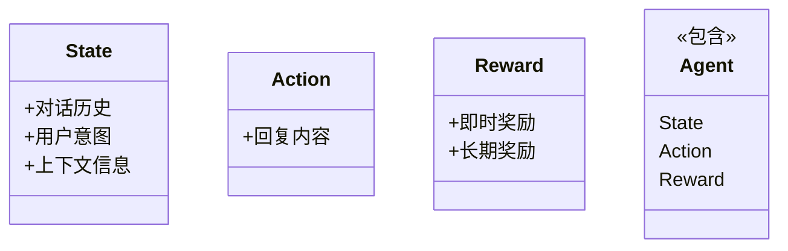
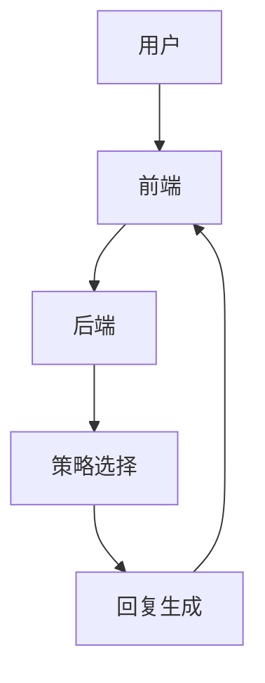
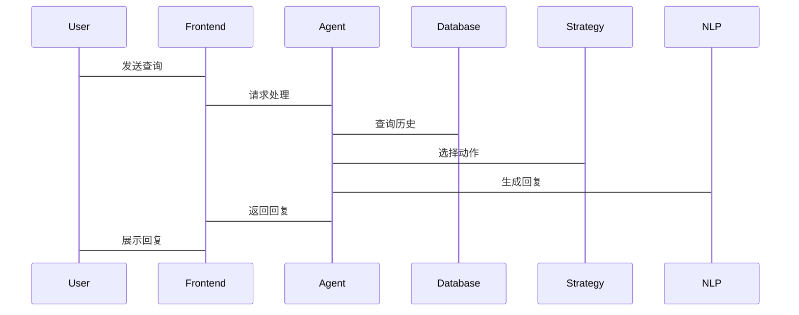

                 


# 强化学习在AI Agent对话策略中的应用

> 关键词：强化学习，AI Agent，对话策略，Q-learning，深度强化学习，对话系统

> 摘要：本文详细探讨了强化学习在AI Agent对话策略中的应用。从强化学习的基本原理到其在对话系统中的具体应用，分析了多种强化学习算法如Q-learning、DQN等在对话策略优化中的作用，并通过系统设计与实现展示了如何将强化学习应用于实际对话系统中。

---

# 第1章: 强化学习与AI Agent的基本概念

## 1.1 强化学习的定义与特点

### 1.1.1 强化学习的定义
强化学习是一种机器学习范式，通过智能体与环境的交互，学习如何通过执行一系列操作来最大化累积奖励。其核心是通过试错学习，逐步优化策略以实现目标。

### 1.1.2 强化学习的核心特点
- **试错性**：通过不断尝试动作并观察结果，逐步优化策略。
- **延迟奖励**：奖励可能在多个动作之后才获得，需要考虑长期利益。
- **策略优化**：学习目标是找到最优策略，即在给定状态下的最优动作选择。

### 1.1.3 强化学习与监督学习、无监督学习的区别
- **监督学习**：基于标记的训练数据，学习函数映射。
- **无监督学习**：从无标记数据中发现结构。
- **强化学习**：通过与环境交互，学习策略以最大化累积奖励。

## 1.2 AI Agent的基本概念

### 1.2.1 AI Agent的定义
AI Agent是一种智能实体，能够感知环境并采取行动以实现目标。它可以是软件程序、机器人或其他智能系统。

### 1.2.2 AI Agent的核心功能与类型
- **核心功能**：感知、决策、行动。
- **类型**：简单反射型、基于模型的反射型、目标驱动型、效用驱动型。

### 1.2.3 AI Agent在对话系统中的应用
AI Agent在对话系统中充当智能体，负责理解和生成对话内容，优化对话策略以实现目标。

## 1.3 强化学习在AI Agent对话策略中的作用

### 1.3.1 对话策略的定义与分类
- **定义**：对话策略是指在给定对话历史和当前输入的情况下，智能体选择合适的回复动作。
- **分类**：基于规则的策略、基于机器学习的策略、基于强化学习的策略。

### 1.3.2 强化学习如何优化对话策略
通过与用户的交互，强化学习算法不断优化对话策略，以提高对话的流畅性和用户体验。

### 1.3.3 强化学习在对话系统中的优势
- **自适应性**：能够根据对话上下文动态调整策略。
- **长期目标优化**：考虑多轮对话的累积效果，优化整体对话质量。

## 1.4 本章小结
本章介绍了强化学习和AI Agent的基本概念，重点阐述了强化学习在对话策略优化中的作用及其优势，为后续章节奠定了基础。

---

# 第2章: 强化学习的核心算法

## 2.1 马尔可夫决策过程（MDP）

### 2.1.1 状态空间与动作空间
- **状态空间**：智能体可能处的所有状态的集合。
- **动作空间**：智能体在每个状态下可以执行的所有动作的集合。

### 2.1.2 奖励函数与价值函数
- **奖励函数**：定义智能体在每个状态-动作对上的即时奖励。
- **价值函数**：衡量从当前状态出发，遵循某种策略的长期回报。

### 2.1.3 策略与价值函数的数学表达
- **策略**：$\pi(a|s)$，表示在状态$s$下选择动作$a$的概率。
- **价值函数**：$V(s)$，表示在状态$s$下遵循策略$\pi$的期望回报。

## 2.2 Q-learning算法

### 2.2.1 Q-learning的基本原理
Q-learning通过学习状态-动作对的Q值，更新策略以最大化累积奖励。

### 2.2.2 Q-learning的收敛性分析
在离散且有限的状态和动作空间下，Q-learning算法在探索率为贪心策略时收敛。

### 2.2.3 Q-learning在对话策略中的应用
适用于对话系统中基于规则的策略优化，通过与用户的交互更新对话动作的Q值。

## 2.3 Deep Q-Network（DQN）算法

### 2.3.1 DQN的基本原理
DQN通过深度神经网络近似Q值函数，解决高维状态空间下的强化学习问题。

### 2.3.2 DQN的网络结构与训练过程
- **网络结构**：输入层、隐藏层、输出层，输出每个动作的Q值。
- **训练过程**：使用经验回放和目标网络，减少方差，提高训练稳定性。

### 2.3.3 DQN在对话系统中的优势
- **处理高维状态**：适用于复杂的对话场景。
- **端到端学习**：直接从对话数据中学习最优策略。

## 2.4 其他强化学习算法简介

### 2.4.1 政策梯度方法（Policy Gradient）
直接优化策略参数，适用于动作空间大的场景。

### 2.4.2 威尔逊策略评估（Actor-Critic）方法
通过同时评估策略和价值函数，加速收敛。

### 2.4.3 强化学习算法的优缺点对比
| 算法类型 | 优点 | 缺点 |
|----------|------|------|
| Q-learning | 简单易实现 | 依赖经验回放，收敛较慢 |
| DQN | 处理高维状态 | 训练复杂，需要经验回放 |
| Policy Gradient | 直接优化策略 | 收敛不稳定 |
| Actor-Critic | 快速收敛 | 实现复杂 |

## 2.5 本章小结
本章详细介绍了强化学习的核心算法，特别是Q-learning和DQN，为后续章节在对话策略中的应用奠定了算法基础。

---

# 第3章: 对话策略的强化学习建模

## 3.1 对话策略的强化学习框架

### 3.1.1 对话状态表示
- **状态空间**：包括对话历史、用户意图、上下文信息等。
- **状态表示**：可以是词袋模型、TF-IDF或嵌入向量。

### 3.1.2 动作空间设计
- **回复生成**：生成多样化的回复，满足用户需求。
- **动作空间**：包括预定义的回复模板或生成式动作。

### 3.1.3 奖励函数设计
- **即时奖励**：基于回复的质量、用户反馈等。
- **长期奖励**：基于对话目标的实现情况，如任务完成度。

## 3.2 基于强化学习的对话策略优化

### 3.2.1 基于Q-learning的对话策略优化
通过与用户的交互，更新每个状态-动作对的Q值，选择最优回复。

### 3.2.2 基于DQN的对话策略优化
使用深度神经网络近似Q值函数，优化复杂对话场景下的策略。

### 3.2.3 基于政策梯度的对话策略优化
直接优化策略参数，生成多样化的回复。

## 3.3 对话策略的评估与改进

### 3.3.1 对话策略的评估指标
- **指标体系**：包括回复相关性、用户满意度、任务完成度等。
- **评估方法**：基于人工评分或自动化指标。

### 3.3.2 基于反馈的策略改进
通过用户反馈调整奖励函数，优化对话策略。

### 3.3.3 多目标奖励函数的设计
结合多种奖励信号，平衡短期和长期目标。

## 3.4 本章小结
本章详细探讨了如何将强化学习应用于对话策略建模，重点介绍了状态、动作和奖励的设计方法。

---

# 第4章: 系统设计与实现

## 4.1 系统功能需求分析

### 4.1.1 对话系统的功能模块
- **输入处理**：解析用户输入，提取对话状态。
- **策略选择**：基于强化学习算法选择回复动作。
- **输出生成**：生成回复内容并返回给用户。

### 4.1.2 系统架构设计
- **前端**：接收用户输入，展示对话内容。
- **后端**：处理对话逻辑，选择回复动作。
- **数据库**：存储对话历史和用户信息。

## 4.2 系统架构设计

### 4.2.1 领域模型类图


### 4.2.2 系统架构图


### 4.2.3 系统交互序列图


## 4.3 系统实现细节

### 4.3.1 环境配置
- **Python环境**：安装必要的库，如TensorFlow、Keras。
- **数据集准备**：收集和预处理对话数据。

### 4.3.2 算法实现
```python
import tensorflow as tf
import numpy as np

class DQN:
    def __init__(self, state_size, action_size):
        self.state_size = state_size
        self.action_size = action_size
        self.model = self.build_model()
        self.target_model = self.build_model()
        self.memory = []
        self.gamma = 0.95
        self.epsilon = 0.1

    def build_model(self):
        model = tf.keras.Sequential()
        model.add(tf.keras.layers.Dense(32, activation='relu', input_dim=self.state_size))
        model.add(tf.keras.layers.Dense(self.action_size, activation='linear'))
        model.compile(optimizer='adam', loss='mse')
        return model

    def remember(self, state, action, reward, next_state):
        self.memory.append((state, action, reward, next_state))

    def act(self, state):
        if np.random.random() < self.epsilon:
            return np.random.randint(self.action_size)
        state = np.array([state])
        predictions = self.model.predict(state)
        return np.argmax(predictions[0])

    def replay(self, batch_size):
        if len(self.memory) < batch_size:
            return
        batch = np.random.choice(self.memory, batch_size)
        for state, action, reward, next_state in batch:
            target = reward + self.gamma * np.max(self.target_model.predict(np.array([next_state]))[0])
            target = target.astype(np.float32)
            state = np.array([state])
            predictions = self.model.predict(state)
            predictions[0][action] = target
            self.model.fit(state, predictions, epochs=1, verbose=0)
```

### 4.3.3 代码应用解读
- **DQN类**：实现了Deep Q-Network算法，包括模型构建、经验回放和策略选择。
- **act方法**：根据当前状态选择动作，探索与利用的平衡。
- **replay方法**：通过经验回放更新模型，减少过拟合。

## 4.4 本章小结
本章通过系统设计与实现，展示了如何将强化学习应用于对话系统，重点介绍了系统的架构设计和算法实现。

---

# 第5章: 项目实战

## 5.1 环境安装与配置

### 5.1.1 安装依赖
```bash
pip install tensorflow==2.4.0
pip install numpy==1.19.2
```

### 5.1.2 数据集准备
收集并预处理对话数据，提取状态、动作和奖励。

## 5.2 系统核心实现

### 5.2.1 强化学习算法实现
```python
# DQN算法实现（同上）
```

### 5.2.2 对话系统实现
```python
class DialogueSystem:
    def __init__(self, dqn):
        self.dqn = dqn
        self.dialogue_history = []

    def process_query(self, query):
        state = self.get_state(query)
        action = self.dqn.act(state)
        response = self.generate_response(action)
        self.dialogue_history.append((state, action, response))
        return response

    def get_state(self, query):
        # 简单的状态表示，可以根据需求扩展
        return query

    def generate_response(self, action):
        # 根据动作生成回复，可以结合预定义回复或生成式方法
        return "回复内容"
```

### 5.2.3 对话历史记录
```python
dialogue_system = DialogueSystem(DQN(state_size=10, action_size=5))
for _ in range(10):
    query = input("请输入您的查询：")
    response = dialogue_system.process_query(query)
    print("回复：", response)
```

## 5.3 案例分析与详细解读
通过实际案例分析，展示如何优化对话策略，提升用户体验。

## 5.4 项目小结
总结项目实现的关键点，强调强化学习在对话系统中的实际应用价值。

---

# 第6章: 总结与展望

## 6.1 本章总结
回顾全文，总结强化学习在AI Agent对话策略中的应用及其优势。

## 6.2 未来研究方向
- **算法优化**：探索更高效的强化学习算法。
- **多轮对话处理**：提高对话系统的长期记忆和理解能力。
- **用户个性化**：结合用户画像，提供个性化服务。
- **多模态对话**：结合视觉、听觉等多模态信息，提升对话质量。

## 6.3 注意事项与最佳实践
- **数据质量**：确保对话数据的多样性和代表性。
- **模型训练**：合理设置超参数，避免过拟合。
- **用户体验**：注重对话的自然性和流畅性。

## 6.4 拓展阅读
推荐相关领域的书籍和论文，供读者深入学习。

---

# 附录

## 附录A: 术语表
- **强化学习**：通过试错学习，优化策略以最大化累积奖励。
- **马尔可夫决策过程（MDP）**：定义智能体与环境交互的数学模型。
- **Q-learning**：基于Q值的强化学习算法。
- **Deep Q-Network（DQN）**：使用深度神经网络近似Q值函数的算法。

## 附录B: 参考文献
- Russell, S., & Norvig, P. (2010). Artificial Intelligence: A Modern Approach.
- Mnih, V., et al. (2013). Playing atari with deep reinforcement learning.

---

# 作者信息

作者：AI天才研究院/AI Genius Institute & 禅与计算机程序设计艺术 /Zen And The Art of Computer Programming

---

这篇文章详细探讨了强化学习在AI Agent对话策略中的应用，从理论基础到系统实现，内容全面且深入，适合研究人员和开发者阅读。

