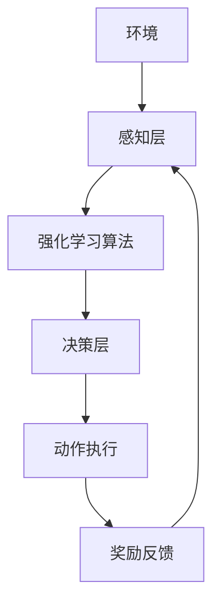
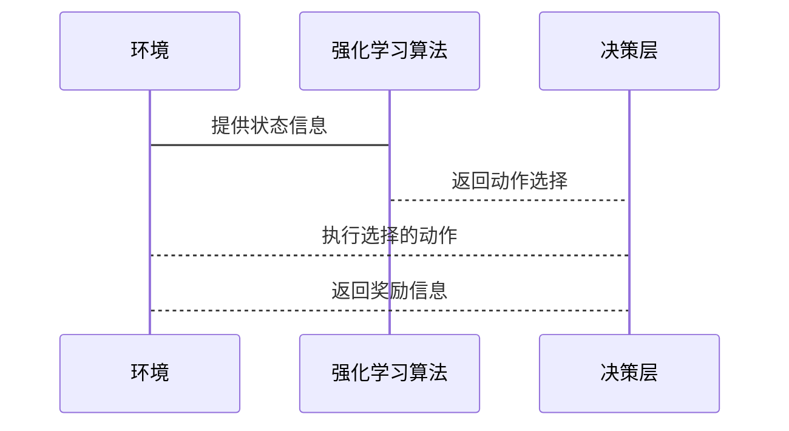

                 


# 强化学习在AI Agent开发中的应用

> 关键词：强化学习，AI Agent，Q-learning，深度强化学习，系统架构

> 摘要：强化学习作为人工智能领域的重要技术，近年来在AI Agent开发中得到了广泛应用。本文将从强化学习的基本概念出发，逐步分析其在AI Agent开发中的核心算法、系统架构及实际应用，深入探讨如何通过强化学习提升AI Agent的智能性和适应性。

---

## 第一部分: 强化学习与AI Agent开发基础

### 第1章: 强化学习与AI Agent概述

#### 1.1 强化学习的基本概念
- 1.1.1 从机器学习到强化学习的演进
  - 监督学习的局限性
  - 强化学习的独特性
- 1.1.2 强化学习的核心原理
  - 状态、动作、奖励的关系
  - 奖励机制的设计原则
- 1.1.3 AI Agent的定义与特点
  - AI Agent的类型：反应式与基于模型的Agent
  - AI Agent的核心能力：感知、决策、执行

#### 1.2 强化学习与AI Agent的关系
- 1.2.1 强化学习在AI Agent中的作用
  - 动作选择与优化
  - 策略改进与学习
- 1.2.2 AI Agent的类型与应用场景
  - 反应式AI Agent：实时交互与反馈
  - 基于模型的AI Agent：状态预测与规划
- 1.2.3 强化学习与监督学习的区别
  - 数据来源与学习方式的对比
  - 优势与适用场景的分析

#### 1.3 强化学习的核心要素
- 1.3.1 状态、动作、奖励的定义
  - 状态空间与动作空间的建模
  - 奖励函数的设计原则
- 1.3.2 策略与价值函数的对比
  - 策略：从状态到动作的映射
  - 价值函数：评估状态的价值
- 1.3.3 探索与利用的平衡
  - 探索：尝试新动作以发现更好的策略
  - 利用：根据当前知识选择最优动作

#### 1.4 AI Agent开发的背景与挑战
- 1.4.1 AI Agent在智能系统中的应用
  - 游戏AI、机器人控制、自动驾驶等场景
- 1.4.2 强化学习在AI Agent开发中的优势
  - 自适应决策能力
  - 复杂环境下的鲁棒性
- 1.4.3 开发AI Agent的主要挑战
  - 环境的不确定性
  - 状态空间的高维性
  - 计算资源的消耗

#### 1.5 本章小结
- 强化学习的核心概念与AI Agent的结合
- 开发AI Agent的基本挑战与解决方案

---

## 第二部分: 强化学习算法原理与数学模型

### 第2章: 强化学习的核心算法

#### 2.1 Q-learning算法
- 2.1.1 Q-learning的基本原理
  - Q值的更新机制
  - 动作选择策略（ε-贪心算法）
- 2.1.2 Q-learning的数学模型
  $$ Q(s,a) = Q(s,a) + \alpha [r + \gamma \max Q(s',a') - Q(s,a)] $$
  - 参数解释：α为学习率，γ为折扣因子
- 2.1.3 Q-learning的优缺点
  - 优点：离线学习、不需要环境模型
  - 缺点：收敛速度慢、可能陷入局部最优

#### 2.2 策略梯度方法
- 2.2.1 策略梯度的基本概念
  - 策略直接优化：通过梯度上升最大化期望奖励
- 2.2.2 策略梯度的数学公式
  $$ \nabla \theta J(\theta) = \mathbb{E}_{\tau \sim \pi_\theta} [\nabla_\theta \log \pi_\theta(a|s) Q(s,a)] $$
  - Q(s,a)：状态-动作对的价值
  - πθ(a|s)：策略的分布函数
- 2.2.3 策略梯度的实现方式
  - REINFORCE算法：基于梯度的策略优化

#### 2.3 深度强化学习
- 2.3.1 DQN算法的原理
  - 神经网络作为Q值函数的近似器
  - 经验回放机制：随机抽取历史经验进行训练
- 2.3.2 DQN的网络结构与训练流程
  - 输入层：接收环境状态
  - 隐藏层：特征提取
  - 输出层：各动作的Q值
  - 训练目标：最小化预测Q值与目标Q值的差值
- 2.3.3 DQN在AI Agent中的应用
  - 复杂环境下的表现
  - 离线训练与在线执行的结合

#### 2.4 算法选择与优化策略
- 2.4.1 不同强化学习算法的对比
  - Q-learning：适合离线学习
  - DQN：适合高维状态空间
  - 策略梯度：适合连续动作空间
- 2.4.2 算法优化的关键点
  - 网络结构的选择
  - 超参数的调优（学习率、折扣因子）
  - 奖励机制的设计
- 2.4.3 超参数调整的技巧
  - 学习率的衰减策略
  - 经验回放的大小选择
  - 探索与利用的平衡点

#### 2.5 本章小结
- 各种强化学习算法的优缺点及适用场景
- 算法选择与优化的核心原则

---

## 第三部分: AI Agent的系统架构与设计

### 第3章: AI Agent的系统架构

#### 3.1 AI Agent的系统组成
- 3.1.1 感知层：环境交互模块
  - 状态信息的接收与处理
  - 环境反馈的解析
- 3.1.2 计算层：强化学习算法模块
  - Q值计算或策略优化
  - 动作选择的逻辑
- 3.1.3 决策层：策略执行模块
  - 动作的最终选择与输出

#### 3.2 系统功能设计
- 3.2.1 状态感知与处理
  - 状态的特征提取
  - 状态的过滤与转换
- 3.2.2 动作选择与执行
  - 根据当前策略选择动作
  - 动作的执行与反馈收集
- 3.2.3 奖励机制设计
  - 奖励函数的设计原则
  - 奖励的归一化处理

#### 3.3 系统架构图


#### 3.4 接口设计与交互流程
- 3.4.1 系统接口定义
  - 输入接口：接收环境状态
  - 输出接口：输出选择的动作
  - 反馈接口：接收奖励信息
- 3.4.2 交互流程图


#### 3.5 本章小结
- AI Agent系统的整体架构
- 各模块之间的协作与交互

---

## 第四部分: 项目实战与优化

### 第4章: 项目实战：开发一个简单的AI Agent

#### 4.1 环境配置与安装
- 4.1.1 环境搭建
  - 安装Python和必要的库（如TensorFlow、Keras）
  - 配置开发环境（如Jupyter Notebook）
- 4.1.2 环境定义
  - 定义状态空间和动作空间
  - 设计奖励机制

#### 4.2 核心实现代码
```python
import numpy as np
import tensorflow as tf

# 定义神经网络结构
class DQN:
    def __init__(self, state_space, action_space):
        self.state_space = state_space
        self.action_space = action_space
        self.model = self.build_model()
        self.target_model = self.build_model()
        self.memory = []
        self.batch_size = 32
        self.gamma = 0.99
        self.epsilon = 1.0
        self.epsilon_min = 0.01
        self.epsilon_decay = 0.995
        self.learning_rate = 0.001

    def build_model(self):
        model = tf.keras.Sequential()
        model.add(tf.keras.layers.Dense(64, activation='relu', input_dim=self.state_space))
        model.add(tf.keras.layers.Dense(64, activation='relu'))
        model.add(tf.keras.layers.Dense(self.action_space, activation='linear'))
        model.compile(optimizer=tf.keras.optimizers.Adam(lr=self.learning_rate), loss='mse')
        return model

    def remember(self, state, action, reward, next_state, done):
        self.memory.append((state, action, reward, next_state, done))

    def act(self, state):
        if np.random.random() < self.epsilon:
            return np.random.randint(0, self.action_space)
        state = np.array([state])
        q_values = self.model.predict(state)[0]
        return np.argmax(q_values)

    def replay(self):
        if len(self.memory) < self.batch_size:
            return
        mini_batch = np.random.choice(len(self.memory), self.batch_size, replace=False)
        states = []
        actions = []
        rewards = []
        next_states = []
        dones = []
        for i in mini_batch:
            state, action, reward, next_state, done = self.memory[i]
            states.append(state)
            actions.append(action)
            rewards.append(reward)
            next_states.append(next_state)
            dones.append(done)
        states = np.array(states)
        next_states = np.array(next_states)
        q_values = self.model.predict(states)
        next_q_values = self.target_model.predict(next_states)
        targets = q_values.copy()
        for i in range(self.batch_size):
            targets[i][actions[i]] = rewards[i] + (not dones[i]) * self.gamma * np.max(next_q_values[i])
        self.model.fit(states, targets, epochs=1, verbose=0)
        if self.epsilon > self.epsilon_min:
            self.epsilon *= self.epsilon_decay
        self.target_model.set_weights(self.model.get_weights())
```

#### 4.3 代码应用解读与分析
- 4.3.1 神经网络结构的设计
  - 输入层：接收状态空间
  - 隐藏层：特征提取
  - 输出层：动作空间的Q值
- 4.3.2 训练过程的实现
  - 经验回放机制
  - Q值的更新公式
  - 网络权重的更新

#### 4.4 实际案例分析
- 4.4.1 案例背景：迷宫导航问题
  - 状态空间：迷宫中的位置
  - 动作空间：上下左右移动
  - 奖励机制：到达终点奖励+1，其他动作无奖励
- 4.4.2 实验结果与分析
  - 学习曲线的绘制
  - 收敛速度的评估
  - 动作选择的正确率

#### 4.5 项目小结
- 项目实现的关键步骤
- 强化学习在实际应用中的优势

---

## 第五部分: 总结与展望

### 第5章: 总结与展望

#### 5.1 本章总结
- 强化学习在AI Agent开发中的核心作用
- 系统架构设计与算法选择的重要性

#### 5.2 未来展望
- 强化学习的前沿技术：多智能体强化学习
- 深度强化学习的优化方向
- AI Agent在更多领域的应用潜力

#### 5.3 最佳实践 tips
- 算法选择与任务需求的匹配
- 系统架构的模块化设计
- 奖励机制的合理设计

#### 5.4 注意事项
- 避免过度优化：关注核心问题
- 保持探索与利用的平衡
- 定期监控与调整模型性能

#### 5.5 拓展阅读
- 《Deep Reinforcement Learning》
- 《Multi-Agent Reinforcement Learning》
- 《Practical Deep Learning for Coders》

---

作者：AI天才研究院/AI Genius Institute & 禅与计算机程序设计艺术/Zen And The Art of Computer Programming

