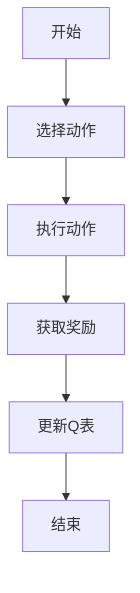

                 


# 强化学习在AI Agent自动化测试中的应用

> 关键词：强化学习，AI Agent，自动化测试，Q-learning，Deep Q-Network，系统架构

> 摘要：本文深入探讨了强化学习在AI Agent自动化测试中的应用，从基本概念到核心算法，再到系统设计和项目实战，全面分析了强化学习如何提升自动化测试的效率和智能化水平。

---

# 第一部分: 强化学习与AI Agent基础

## 第1章: 强化学习与AI Agent概述

### 1.1 强化学习的基本概念
#### 1.1.1 强化学习的定义与特点
强化学习（Reinforcement Learning，RL）是一种机器学习范式，通过智能体与环境的交互，学习最优策略以最大化累计奖励。其特点包括：
- **延迟反馈**：智能体通过与环境交互获得奖励信号。
- **探索与利用**：在未知环境中平衡探索新状态和利用已知策略。
- **在线学习**：实时更新策略以适应动态环境。

#### 1.1.2 AI Agent的基本概念
AI Agent是一种智能实体，能够感知环境并采取行动以实现目标。AI Agent的分类包括：
- **反应式Agent**：基于当前感知做出反应。
- **认知式Agent**：具备复杂推理和规划能力。

#### 1.1.3 强化学习与AI Agent的关系
强化学习为AI Agent提供了学习策略的方法，使其能够通过与环境的交互优化行为，从而实现自主决策和问题解决。

### 1.2 强化学习的核心概念与数学模型
#### 1.2.1 状态、动作与奖励的定义
- **状态（State）**：环境的当前情况，表示为$s$。
- **动作（Action）**：智能体采取的行动，表示为$a$。
- **奖励（Reward）**：环境对智能体行为的反馈，表示为$r$。

#### 1.2.2 Q-learning算法的基本原理
Q-learning是一种经典的强化学习算法，通过维护一个Q表（$Q(s,a)$）来记录状态-动作对的期望奖励。其更新公式为：
$$Q(s,a) = Q(s,a) + \alpha [r + \max Q(s',a') - Q(s,a)]$$
其中，$\alpha$为学习率，$\max Q(s',a')$为下一状态的最大Q值。

#### 1.2.3 数学公式与模型分析
Q-learning算法通过迭代更新Q表，逐步逼近最优策略。其收敛性依赖于探索率和学习率的合理设置。

### 1.3 AI Agent在自动化测试中的应用背景
#### 1.3.1 自动化测试的现状与挑战
传统自动化测试依赖预定义脚本，难以应对复杂动态的测试环境。强化学习的引入为动态测试场景提供了新的解决方案。

#### 1.3.2 AI Agent在测试中的优势
AI Agent能够根据环境反馈动态调整测试策略，具备更强的适应性和智能化。

#### 1.3.3 强化学习在测试自动化中的潜力
通过强化学习，AI Agent可以实现自适应测试用例生成、故障定位和修复，显著提升测试效率和覆盖率。

### 1.4 本章小结
本章介绍了强化学习和AI Agent的基本概念，分析了强化学习在自动化测试中的应用背景和潜力。

---

# 第二部分: 强化学习算法与实现

## 第2章: 强化学习的核心算法

### 2.1 Q-learning算法
#### 2.1.1 Q-learning算法的流程图


#### 2.1.2 Q-learning算法的实现代码
```python
import numpy as np

class QLearning:
    def __init__(self, state_space, action_space, learning_rate=0.1, gamma=0.9):
        self.state_space = state_space
        self.action_space = action_space
        self.learning_rate = learning_rate
        self.gamma = gamma
        self.q_table = np.zeros((state_space, action_space))
    
    def choose_action(self, state, epsilon=0.1):
        if np.random.random() < epsilon:
            return np.random.randint(self.action_space)
        else:
            return np.argmax(self.q_table[state])
    
    def update_q_table(self, current_state, action, reward, next_state):
        self.q_table[current_state][action] += self.learning_rate * (reward + self.gamma * np.max(self.q_table[next_state]) - self.q_table[current_state][action])
```

### 2.2 Deep Q-Network算法
#### 2.2.1 DQN算法的原理
Deep Q-Network（DQN）通过神经网络近似Q值函数，避免了Q表的维度爆炸问题。

#### 2.2.2 DQN算法的网络结构
DQN通常采用卷积神经网络（CNN）提取状态特征，全连接层输出Q值。

#### 2.2.3 DQN算法的数学公式
$$Q(s,a) = \theta \cdot \phi(s,a)$$
其中，$\theta$为网络参数，$\phi(s,a)$为状态-动作对的特征向量。

### 2.3 算法的优缺点对比
#### 2.3.1 Q-learning与DQN的对比分析
| 特性       | Q-learning             | DQN               |
|------------|-------------------------|--------------------|
| 状态空间   | 离散或小规模             | 大规模或连续        |
| 记忆机制   | Q表                     | 神经网络            |
| 计算复杂度 | 较低                    | 较高               |

#### 2.3.2 算法选择的注意事项
- Q-learning适合小规模问题。
- DQN适合处理大规模和连续状态空间的问题。

---

# 第三部分: AI Agent的系统设计与实现

## 第3章: AI Agent的设计与实现

### 3.1 多智能体系统
#### 3.1.1 多智能体系统的定义与分类
多智能体系统由多个协作或竞争的智能体组成，共同完成复杂任务。

#### 3.1.2 多智能体系统的协调与通信
智能体之间通过共享状态或直接通信实现协作。

### 3.2 状态表示与动作选择
#### 3.2.1 状态表示的定义与实现
状态表示需简洁且包含关键信息。

#### 3.2.2 动作选择的策略
基于当前状态和Q表或DQN网络输出选择最优动作。

### 3.3 系统架构与设计
#### 3.3.1 系统功能设计
- 状态感知模块
- 动作选择模块
- 奖励机制模块

#### 3.3.2 系统架构图
```mermaid
graph TD
    Agent --> State Perception
    State Perception --> Q/DQN Network
    Q/DQN Network --> Action Selection
    Action Selection --> Reward Calculation
    Reward Calculation --> Agent
```

---

# 第四部分: 项目实战与系统实现

## 第4章: 项目实战

### 4.1 环境搭建与安装
#### 4.1.1 环境需求
- Python 3.8+
- TensorFlow/PyTorch
- OpenAI Gym

### 4.2 系统核心实现
#### 4.2.1 Q-learning实现
```python
# 初始化Q表
q_table = np.zeros((4, 2))

# 状态空间：4个状态，动作空间：2个动作
for episode in range(1000):
    state = env.reset()
    for _ in range(1000):
        action = choose_action(state)
        next_state, reward, done, _ = env.step(action)
        update_q_table(state, action, reward, next_state)
        state = next_state
        if done:
            break
```

#### 4.2.2 DQN实现
```python
# 定义神经网络
class DQN(nn.Module):
    def __init__(self, input_dim, output_dim):
        super(DQN, self).__init__()
        self.fc1 = nn.Linear(input_dim, 64)
        self.fc2 = nn.Linear(64, output_dim)
    
    def forward(self, x):
        x = F.relu(self.fc1(x))
        return self.fc2(x)
```

### 4.3 案例分析与实际应用
通过OpenAI Gym环境验证算法效果，记录并分析训练过程中的奖励曲线。

### 4.4 项目小结
总结项目实现的经验和教训，分析算法的优缺点。

---

# 第五章: 总结与展望

## 5.1 本章小结
强化学习为AI Agent自动化测试提供了强大的工具，通过算法优化和系统设计，显著提升了测试效率和智能化水平。

## 5.2 未来展望
- 更复杂的多智能体协作
- 深度强化学习的进一步探索
- 测试场景的动态适应

---

作者：AI天才研究院/AI Genius Institute & 禅与计算机程序设计艺术 /Zen And The Art of Computer Programming

