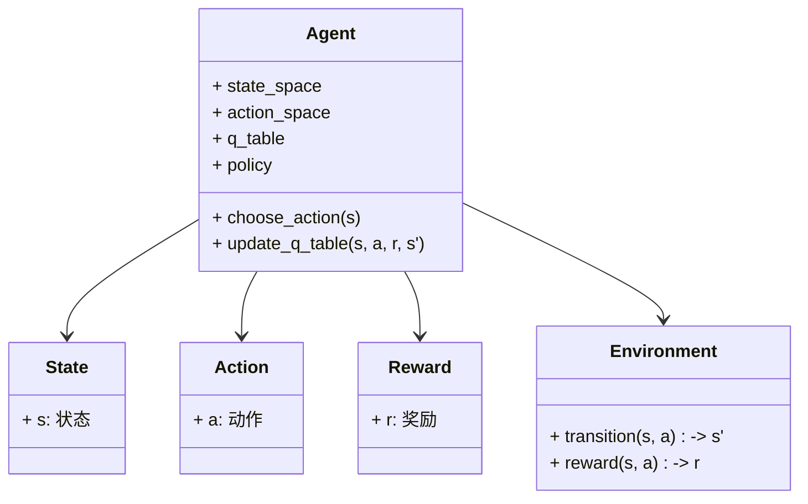
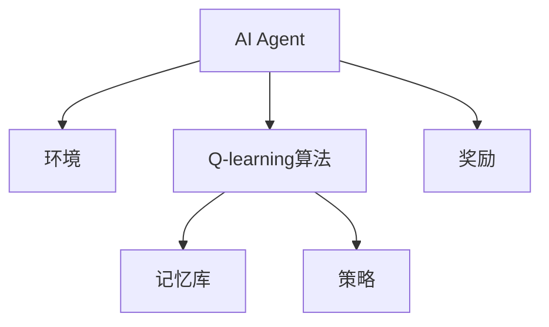
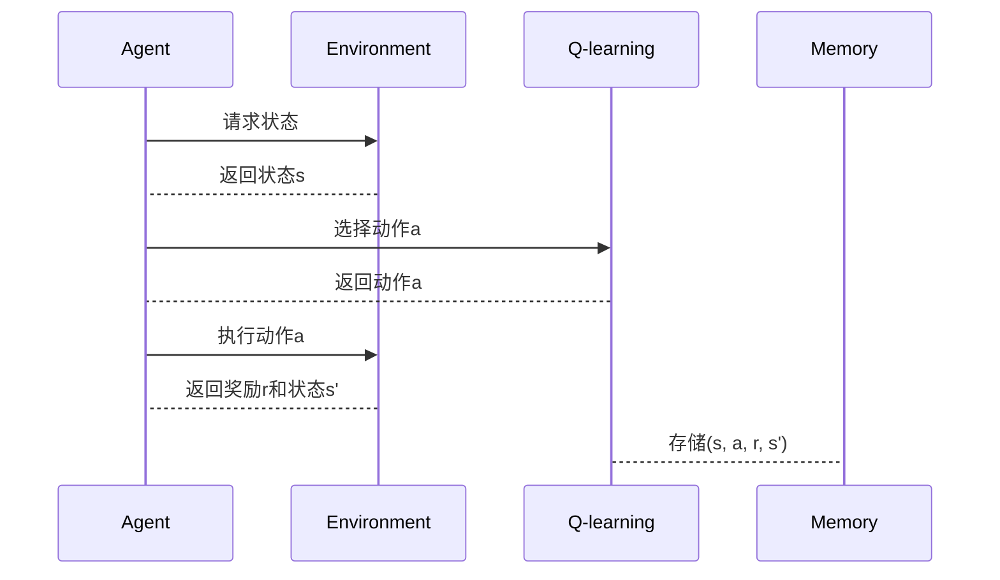

                 


# 强化学习在AI Agent行为优化中的应用

## 关键词：
- 强化学习
- AI Agent
- 行为优化
- 算法原理
- 数学模型
- 项目实战

## 摘要：
本文详细探讨了强化学习在AI Agent行为优化中的应用。首先介绍了强化学习的基本概念和AI Agent的定义，然后分析了强化学习在行为优化中的核心原理和算法。接着通过数学模型和公式详细讲解了强化学习的实现过程，并通过实际案例展示了如何将强化学习应用于AI Agent的行为优化中。最后总结了强化学习的优势与挑战，并展望了未来的研究方向。

---

# 第1章: 强化学习与AI Agent概述

## 1.1 强化学习的基本概念
### 1.1.1 强化学习的定义
强化学习（Reinforcement Learning, RL）是一种机器学习范式，其中智能体通过与环境交互来学习如何采取最优动作以最大化累积奖励。与监督学习不同，强化学习不需要明确的标注数据，而是通过试错和奖励信号来优化策略。

### 1.1.2 AI Agent的定义与特点
AI Agent（人工智能代理）是指能够感知环境、做出决策并采取行动的智能实体。AI Agent的特点包括自主性、反应性、目标导向性和社会性。

### 1.1.3 强化学习在AI Agent行为优化中的应用背景
在复杂动态环境中，AI Agent需要通过不断试错来优化其行为，以实现目标。强化学习提供了有效的工具和方法，使得AI Agent能够在未知或动态变化的环境中自适应地优化其行为。

## 1.2 强化学习的核心概念
### 1.2.1 状态、动作、奖励的定义
- **状态（State）**：环境在某一时刻的观测，表示AI Agent所处的环境状况。
- **动作（Action）**：AI Agent在给定状态下采取的行动。
- **奖励（Reward）**：环境对AI Agent采取动作的反馈，用于指导AI Agent的学习。

### 1.2.2 马尔可夫决策过程（MDP）
马尔可夫决策过程是一个用于描述强化学习问题的数学模型，包括状态空间、动作空间、转移概率和奖励函数等组成部分。

### 1.2.3 策略与价值函数的定义
- **策略（Policy）**：AI Agent在给定状态下选择动作的概率分布。
- **价值函数（Value Function）**：衡量一个状态或动作在长期累积奖励中的价值。

## 1.3 强化学习的基本原理
### 1.3.1 奖励机制的作用
奖励机制是强化学习的核心，通过奖励信号指导AI Agent的学习方向，帮助其在环境中找到最优策略。

### 1.3.2 动作选择与策略优化
AI Agent通过策略优化选择最优动作，以最大化累积奖励。策略优化可以通过值函数的梯度下降或直接优化策略参数来实现。

### 1.3.3 状态转移与环境交互
AI Agent通过与环境交互，观察状态的变化，逐步学习状态转移的概率，从而更好地预测未来状态。

## 1.4 AI Agent行为优化的挑战
### 1.4.1 复杂环境下的决策难度
复杂环境可能导致状态空间和动作空间非常庞大，增加了强化学习算法的计算复杂度。

### 1.4.2 动态环境的适应性问题
环境的动态变化要求AI Agent能够实时调整其策略，以适应新的环境条件。

### 1.4.3 多目标优化的权衡问题
在多目标优化问题中，AI Agent需要在多个目标之间进行权衡，找到最优的平衡点。

## 1.5 本章小结
本章介绍了强化学习的基本概念、AI Agent的定义与特点，以及强化学习在行为优化中的应用背景。同时，详细讲解了强化学习的核心概念和基本原理，为后续章节奠定了基础。

---

# 第2章: 基础强化学习算法

## 2.1 Q-learning算法
### 2.1.1 Q-learning的基本原理
Q-learning是一种经典的强化学习算法，通过更新Q表（Q-value table）来学习最优策略。Q表记录了每个状态下每个动作的Q值，表示从该状态采取该动作后的预期累积奖励。

### 2.1.2 Q-learning的数学模型
Q-learning的更新公式如下：

$$ Q(s, a) = Q(s, a) + \alpha \left(r + \gamma \max_{a'} Q(s', a') - Q(s, a) \right) $$

其中，$\alpha$是学习率，$\gamma$是折扣因子，$s$是当前状态，$a$是当前动作，$s'$是下一个状态，$r$是奖励。

### 2.1.3 Q-learning的收敛性分析
Q-learning在离散状态和动作空间下具有收敛性，最终会收敛到最优Q值。

### 2.1.4 Q-learning的优缺点
- **优点**：简单易实现，适用于离散状态和动作空间。
- **缺点**：在连续状态和动作空间下表现较差，需要较大的计算资源。

### 2.1.5 Q-learning的实战应用
以下是一个简单的Q-learning实现代码示例：

```python
import numpy as np

class QLearning:
    def __init__(self, state_space, action_space, alpha=0.1, gamma=0.9):
        self.q_table = np.zeros((state_space, action_space))
        self.alpha = alpha
        self.gamma = gamma

    def choose_action(self, state, epsilon=0.1):
        if np.random.random() < epsilon:
            return np.random.randint(0, self.action_space)
        else:
            return np.argmax(self.q_table[state])

    def update_q_table(self, state, action, reward, next_state):
        self.q_table[state, action] += self.alpha * (reward + self.gamma * np.max(self.q_table[next_state]) - self.q_table[state, action])
```

---

## 2.2 策略梯度方法
### 2.2.1 策略梯度的基本思想
策略梯度方法通过优化策略参数来最大化累积奖励。与Q-learning不同，策略梯度直接优化策略，而不是值函数。

### 2.2.2 策略梯度的优化算法
策略梯度的优化公式如下：

$$ \theta \leftarrow \theta + \alpha \nabla_\theta \mathbb{E}_{\tau \sim \pi_\theta} \left[ \log \pi_\theta(a|s) Q_\pi(s) \right] $$

其中，$\theta$是策略参数，$\alpha$是学习率，$\nabla_\theta$表示梯度，$\tau$是轨迹，$\pi_\theta$是策略分布，$Q_\pi(s)$是值函数。

### 2.2.3 策略梯度的收敛性分析
策略梯度在连续动作空间下具有较好的收敛性，但需要较高的计算资源。

### 2.2.4 策略梯度的优缺点
- **优点**：适用于连续动作空间，可以直接优化策略。
- **缺点**：计算复杂度较高，实现较为复杂。

### 2.2.5 策略梯度的实战应用
以下是一个简单的策略梯度方法实现代码示例：

```python
import torch
import torch.nn as nn

class PolicyGradient:
    def __init__(self, input_dim, output_dim, learning_rate=0.01):
        self.net = nn.Linear(input_dim, output_dim)
        self.optimizer = torch.optim.Adam(self.net.parameters(), lr=learning_rate)

    def forward(self, x):
        return self.net(x)

    def compute_loss(self, predicted_actions, rewards):
        loss = -torch.mean(torch.log(predicted_actions) * rewards)
        return loss

    def update_policy(self, states, actions, rewards):
        predicted_actions = torch.exp(self.net(torch.tensor(states)))
        loss = self.compute_loss(predicted_actions, rewards)
        self.optimizer.zero_grad()
        loss.backward()
        self.optimizer.step()
```

---

## 2.3 深度强化学习
### 2.3.1 深度Q网络（DQN）
深度Q网络通过使用深度神经网络来逼近Q值函数，适用于高维状态空间和动作空间。

### 2.3.2 策略网络与值函数网络
策略网络直接输出动作的概率分布，值函数网络用于估计状态的值函数。

### 2.3.3 深度强化学习的优势
- **优点**：能够处理高维和复杂的状态空间，适用于实际应用中的复杂环境。

### 2.3.4 DQN的实战应用
以下是一个简单的DQN实现代码示例：

```python
import torch
import torch.nn as nn
import torch.optim as optim

class DQN:
    def __init__(self, input_dim, output_dim, learning_rate=0.001, gamma=0.99):
        self.model = nn.Linear(input_dim, output_dim)
        self.optimizer = optim.Adam(self.model.parameters(), lr=learning_rate)
        self.gamma = gamma
        self.memory = []

    def remember(self, state, action, reward, next_state):
        self.memory.append((state, action, reward, next_state))

    def replay(self, batch_size):
        if len(self.memory) < batch_size:
            return
        mini_batch = self.memory[-batch_size:]
        states = torch.FloatTensor([s for s, a, r, ns in mini_batch])
        actions = torch.LongTensor([a for s, a, r, ns in mini_batch])
        rewards = torch.FloatTensor([r for s, a, r, ns in mini_batch])
        next_states = torch.FloatTensor([ns for s, a, r, ns in mini_batch])
        current_q = self.model(states).gather(1, actions)
        next_q = self.model(next_states).max(1)[0].detach()
        target = rewards + self.gamma * next_q
        loss = nn.MSELoss()(current_q, target)
        self.optimizer.zero_grad()
        loss.backward()
        self.optimizer.step()

    def act(self, state, epsilon=0.1):
        if np.random.random() < epsilon:
            return np.random.randint(0, self.model.out_features)
        else:
            q_values = self.model(torch.FloatTensor([state]))
            return torch.argmax(q_values).item()
```

---

## 2.4 其他强化学习算法简介
### 2.4.1 威尔逊算法
### 2.4.2 贪婪算法
### 2.4.3 近端策略优化（PPO）
近端策略优化是一种基于策略梯度的方法，通过优化策略的参数空间来实现稳定的策略更新。

---

## 2.5 强化学习算法的比较与选择
### 2.5.1 不同算法的优缺点分析
- **Q-learning**：适用于离散状态和动作空间，简单易实现。
- **策略梯度**：适用于连续动作空间，但计算复杂。
- **DQN**：适用于高维状态空间，表现稳定。
- **PPO**：稳定性强，适用于复杂环境。

### 2.5.2 算法选择的依据
选择算法时需要考虑环境的特性、状态和动作空间的维度、计算资源以及实际应用场景的需求。

### 2.5.3 算法调优的注意事项
- **学习率**：需要根据具体问题调整。
- **折扣因子**：影响长期奖励的权重。
- **探索与利用**：平衡探索新动作和利用已知好的动作。

---

## 2.6 本章小结
本章详细介绍了几种经典的强化学习算法，包括Q-learning、策略梯度方法和深度强化学习。通过对比分析，帮助读者选择适合具体应用场景的算法，并提供了实际的代码实现示例。

---

# 第3章: 强化学习数学模型与公式

## 3.1 状态空间与动作空间
### 3.1.1 状态空间的定义
状态空间是所有可能状态的集合，可以用向量或标量表示。

### 3.1.2 动作空间的定义
动作空间是所有可能动作的集合，可以是离散或连续的。

### 3.1.3 状态转移概率矩阵
状态转移概率矩阵描述了从当前状态采取某个动作后转移到下一个状态的概率。

---

## 3.2 奖励函数与值函数
### 3.2.1 奖励函数的定义
奖励函数定义了AI Agent在采取某个动作后获得的奖励，用于指导学习过程。

### 3.2.2 值函数的定义
值函数衡量了从当前状态开始的长期累积奖励的期望值。

### 3.2.3 值函数的数学表达式
值函数的数学表达式为：

$$ V(s) = \mathbb{E} \left[ G_t | s_t = s \right] $$

其中，$G_t$是$t$时刻之后的累积奖励。

---

## 3.3 策略与动作选择
### 3.3.1 策略的定义
策略定义了AI Agent在给定状态下选择动作的概率分布。

### 3.3.2 动作选择的数学模型
动作选择可以通过策略函数表示：

$$ \pi(a|s) = P(\text{选择动作 } a | \text{状态 } s) $$

---

## 3.4 强化学习的数学公式
### 3.4.1 Q-learning的数学公式
Q-learning的更新公式为：

$$ Q(s, a) = Q(s, a) + \alpha \left(r + \gamma \max_{a'} Q(s', a') - Q(s, a) \right) $$

### 3.4.2 策略梯度的数学公式
策略梯度的优化公式为：

$$ \theta \leftarrow \theta + \alpha \nabla_\theta \mathbb{E}_{\tau \sim \pi_\theta} \left[ \log \pi_\theta(a|s) Q_\pi(s) \right] $$

### 3.4.3 DQN的数学公式
DQN的目标是最小化预测Q值与目标Q值之间的误差：

$$ \min \mathbb{E}_{(s, a, r, s')} \left[ (r + \gamma \max_{a'} Q(s', a') - Q(s, a))^2 \right] $$

---

## 3.5 强化学习的收敛性分析
### 3.5.1 Q-learning的收敛性
Q-learning在离散状态和动作空间下具有收敛性，最终会收敛到最优Q值。

### 3.5.2 策略梯度的收敛性
策略梯度在连续动作空间下具有较好的收敛性，但需要较高的计算资源。

### 3.5.3 DQN的收敛性
DQN通过经验回放和目标网络设计，能够稳定地收敛到最优策略。

---

## 3.6 本章小结
本章通过数学公式详细讲解了强化学习的核心概念和算法原理，为读者理解强化学习的数学基础提供了坚实的支持。

---

# 第4章: 强化学习在AI Agent行为优化中的应用

## 4.1 强化学习在游戏AI中的应用
### 4.1.1 游戏AI的定义与特点
### 4.1.2 强化学习在游戏AI中的应用案例
- **DQN在 Atari 游戏中的应用**
- **策略梯度在复杂游戏中的应用**

## 4.2 强化学习在机器人控制中的应用
### 4.2.1 机器人控制的定义与特点
### 4.2.2 强化学习在机器人控制中的应用案例
- **DQN在机器人导航中的应用**
- **策略梯度在机器人抓取中的应用**

## 4.3 强化学习在自然语言处理中的应用
### 4.3.1 自然语言处理的定义与特点
### 4.3.2 强化学习在自然语言处理中的应用案例
- **基于强化学习的对话系统**
- **基于强化学习的文本摘要**

## 4.4 强化学习在金融投资中的应用
### 4.4.1 金融投资的定义与特点
### 4.4.2 强化学习在金融投资中的应用案例
- **基于强化学习的股票交易策略**
- **基于强化学习的组合投资**

## 4.5 强化学习在自动驾驶中的应用
### 4.5.1 自动驾驶的定义与特点
### 4.5.2 强化学习在自动驾驶中的应用案例
- **DQN在自动驾驶决策中的应用**
- **策略梯度在自动驾驶路径规划中的应用**

## 4.6 本章小结
本章通过多个实际应用场景展示了强化学习在AI Agent行为优化中的广泛应用，帮助读者理解强化学习的实际价值和潜力。

---

# 第5章: 强化学习的系统分析与架构设计

## 5.1 系统分析
### 5.1.1 问题场景介绍
强化学习系统需要解决的问题包括状态识别、动作选择、奖励设计等。

### 5.1.2 项目介绍
通过一个具体的强化学习项目，展示系统分析的全过程。

### 5.1.3 系统功能设计
- **状态识别模块**
- **动作选择模块**
- **奖励设计模块**
- **学习优化模块**

### 5.1.4 领域模型设计
使用Mermaid绘制领域模型类图：



---

## 5.2 系统架构设计
### 5.2.1 系统架构图
使用Mermaid绘制系统架构图：



---

## 5.3 系统接口设计
### 5.3.1 系统接口
- **输入接口**：接收状态和动作。
- **输出接口**：输出动作和奖励。

### 5.3.2 接口交互流程
使用Mermaid绘制交互序列图：



---

## 5.4 本章小结
本章通过系统分析和架构设计，展示了强化学习在实际应用中的具体实现方式，帮助读者理解如何将强化学习理论应用于实际系统中。

---

# 第6章: 强化学习的项目实战

## 6.1 环境安装与配置
### 6.1.1 安装Python
### 6.1.2 安装必要的库
- **NumPy**
- **Matplotlib**
- **Seaborn**
- **OpenAI Gym**
- **TensorFlow/PyTorch**

### 6.1.3 安装步骤
```bash
pip install numpy matplotlib seaborn gym tensorflow
```

---

## 6.2 系统核心实现
### 6.2.1 Q-learning实现
```python
import numpy as np

class QLearning:
    def __init__(self, state_space, action_space, alpha=0.1, gamma=0.9):
        self.q_table = np.zeros((state_space, action_space))
        self.alpha = alpha
        self.gamma = gamma

    def choose_action(self, state, epsilon=0.1):
        if np.random.random() < epsilon:
            return np.random.randint(0, self.action_space)
        else:
            return np.argmax(self.q_table[state])

    def update_q_table(self, state, action, reward, next_state):
        self.q_table[state, action] += self.alpha * (reward + self.gamma * np.max(self.q_table[next_state]) - self.q_table[state, action])
```

### 6.2.2 策略梯度实现
```python
import torch
import torch.nn as nn
import torch.optim as optim

class PolicyGradient:
    def __init__(self, input_dim, output_dim, learning_rate=0.01):
        self.net = nn.Linear(input_dim, output_dim)
        self.optimizer = optim.Adam(self.net.parameters(), lr=learning_rate)

    def forward(self, x):
        return self.net(x)

    def compute_loss(self, predicted_actions, rewards):
        loss = -torch.mean(torch.log(predicted_actions) * rewards)
        return loss

    def update_policy(self, states, actions, rewards):
        predicted_actions = torch.exp(self.net(torch.tensor(states)))
        loss = self.compute_loss(predicted_actions, rewards)
        self.optimizer.zero_grad()
        loss.backward()
        self.optimizer.step()
```

### 6.2.3 DQN实现
```python
import torch
import torch.nn as nn
import torch.optim as optim

class DQN:
    def __init__(self, input_dim, output_dim, learning_rate=0.001, gamma=0.99):
        self.model = nn.Linear(input_dim, output_dim)
        self.optimizer = optim.Adam(self.model.parameters(), lr=learning_rate)
        self.gamma = gamma
        self.memory = []

    def remember(self, state, action, reward, next_state):
        self.memory.append((state, action, reward, next_state))

    def replay(self, batch_size):
        if len(self.memory) < batch_size:
            return
        mini_batch = self.memory[-batch_size:]
        states = torch.FloatTensor([s for s, a, r, ns in mini_batch])
        actions = torch.LongTensor([a for s, a, r, ns in mini_batch])
        rewards = torch.FloatTensor([r for s, a, r, ns in mini_batch])
        next_states = torch.FloatTensor([ns for s, a, r, ns in mini_batch])
        current_q = self.model(states).gather(1, actions)
        next_q = self.model(next_states).max(1)[0].detach()
        target = rewards + self.gamma * next_q
        loss = nn.MSELoss()(current_q, target)
        self.optimizer.zero_grad()
        loss.backward()
        self.optimizer.step()

    def act(self, state, epsilon=0.1):
        if np.random.random() < epsilon:
            return np.random.randint(0, self.model.out_features)
        else:
            q_values = self.model(torch.FloatTensor([state]))
            return torch.argmax(q_values).item()
```

---

## 6.3 代码实现与解读
### 6.3.1 Q-learning实现
- **初始化**：创建Q表，初始化学习率和折扣因子。
- **选择动作**：根据epsilon-greedy策略选择动作。
- **更新Q表**：根据当前状态、动作、奖励和下一个状态更新Q值。

### 6.3.2 策略梯度实现
- **初始化**：定义策略网络和优化器。
- **前向传播**：计算动作的概率分布。
- **计算损失**：通过梯度下降优化策略参数。

### 6.3.3 DQN实现
- **初始化**：定义DQN网络和优化器，初始化记忆库。
- **存储经验**：将状态、动作、奖励和下一个状态存储在记忆库中。
- **经验回放**：从记忆库中随机抽取经验，更新DQN网络。
- **选择动作**：根据epsilon-greedy策略选择动作。

---

## 6.4 实际案例分析
### 6.4.1 使用Q-learning实现Atari游戏
```python
import gym

env = gym.make('CartPole-v0')
agent = QLearning(env.observation_space.shape[0], env.action_space.n)

for episode in range(1000):
    state = env.reset()
    total_reward = 0
    while True:
        action = agent.choose_action(state)
        next_state, reward, done, _ = env.step(action)
        agent.update_q_table(state, action, reward, next_state)
        total_reward += reward
        state = next_state
        if done:
            break
    print(f'Episode {episode}: Total Reward = {total_reward}')
```

### 6.4.2 使用DQN实现OpenAI Gym环境
```python
import gym

env = gym.make('CartPole-v0')
agent = DQN(env.observation_space.shape[0], env.action_space.n)

for episode in range(1000):
    state = env.reset()
    total_reward = 0
    while True:
        action = agent.act(state)
        next_state, reward, done, _ = env.step(action)
        agent.remember(state, action, reward, next_state)
        agent.replay(32)
        total_reward += reward
        state = next_state
        if done:
            break
    print(f'Episode {episode}: Total Reward = {total_reward}')
```

---

## 6.5 项目小结
本章通过具体的代码实现和案例分析，展示了如何将强化学习算法应用于实际项目中。通过这些实战，读者可以更好地理解强化学习的核心思想和实现细节。

---

# 第7章: 强化学习的总结与展望

## 7.1 强化学习的核心思想
强化学习的核心思想是通过与环境的交互，不断优化策略以最大化累积奖励。

## 7.2 强化学习的研究热点
- **多智能体强化学习**
- **连续控制**
- **稀疏奖励学习**
- **强化学习的理论分析**

## 7.3 强化学习的未来趋势
- **更高效的学习算法**
- **更强大的应用领域**
- **强化学习与其它技术的结合**
- **强化学习的可解释性**

## 7.4 强化学习的注意事项
- **算法选择**：根据具体问题选择合适的算法。
- **环境设计**：合理设计奖励函数和状态空间。
- **计算资源**：强化学习需要较大的计算资源。
- **数据处理**：需要处理大量数据，保证数据质量。

## 7.5 本章小结
本章总结了强化学习的核心思想，展望了未来的研究方向，并提出了实际应用中的注意事项，帮助读者更好地理解和应用强化学习。

---

# 作者：AI天才研究院/AI Genius Institute & 禅与计算机程序设计艺术 /Zen And The Art of Computer Programming

---

通过本文，读者可以系统地学习强化学习在AI Agent行为优化中的应用，从基础理论到实际应用，全面掌握强化学习的核心思想和实现细节。

