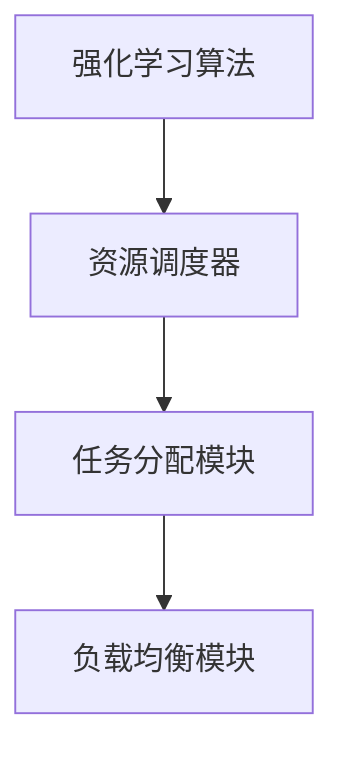
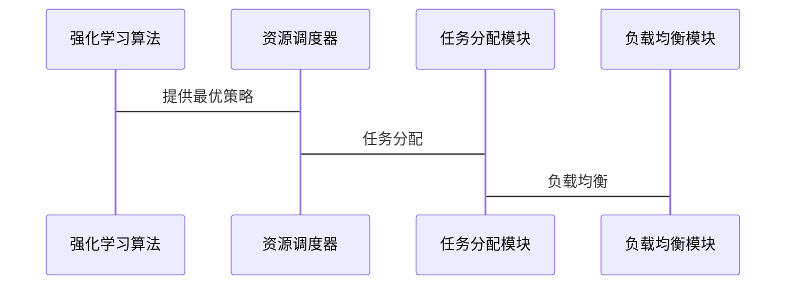

                 


# 强化学习在AI Agent资源调度中的应用

> **关键词**：强化学习，AI Agent，资源调度，Q-learning，Deep Q-Network，马尔可夫决策过程

> **摘要**：本文探讨了强化学习在AI Agent资源调度中的应用，详细介绍了强化学习的基本原理、资源调度的核心问题、强化学习在资源调度中的具体应用，以及系统架构设计与项目实战案例。通过理论分析与实际案例相结合，本文深入剖析了强化学习如何解决资源调度中的复杂问题，并提供了详细的数学模型和系统设计方法，为读者提供全面的指导。

---

## 第1章: 强化学习与AI Agent概述

### 1.1 强化学习的基本概念

#### 1.1.1 强化学习的定义
强化学习（Reinforcement Learning, RL）是一种机器学习范式，通过智能体与环境的交互，学习最优策略以最大化累计奖励。与监督学习不同，强化学习不需要标注数据，而是通过试错机制学习。

#### 1.1.2 强化学习的核心要素
- **状态（State）**：智能体所处环境的特征。
- **动作（Action）**：智能体采取的行为。
- **奖励（Reward）**：环境对智能体行为的反馈。
- **策略（Policy）**：智能体选择动作的规则。
- **价值函数（Value Function）**：评估状态或动作的价值。

#### 1.1.3 强化学习与监督学习的区别
- 监督学习：基于标注数据学习函数。
- 强化学习：通过试错学习策略。

### 1.2 AI Agent的基本概念

#### 1.2.1 AI Agent的定义
AI Agent是能够感知环境并采取行动以实现目标的智能实体。

#### 1.2.2 AI Agent的类型
- **简单反射Agent**：基于当前状态采取行动。
- **基于模型的Agent**：维护环境模型，用于决策。
- **目标驱动的Agent**：根据目标选择行动。

#### 1.2.3 AI Agent的核心功能
- 感知环境。
- 决策与行动。
- 学习与优化。

### 1.3 资源调度的基本概念

#### 1.3.1 资源调度的定义
资源调度是将任务分配到最优资源的过程，以最大化性能或效率。

#### 1.3.2 资源调度的常见场景
- **云计算**：任务分配到服务器。
- **分布式系统**：任务分配到节点。
- **边缘计算**：任务分配到边缘设备。

#### 1.3.3 资源调度的目标与挑战
目标：最大化资源利用率、性能、公平性。挑战：动态性、不确定性、多目标优化。

### 1.4 强化学习在资源调度中的应用

#### 1.4.1 强化学习与资源调度的结合
强化学习适合动态、复杂的调度问题。

#### 1.4.2 强化学习在资源调度中的优势
- 自适应性：适应动态环境。
- 全局优化：优化整体性能。

#### 1.4.3 当前研究与应用现状
广泛应用于云计算、边缘计算等领域。

---

## 第2章: 强化学习的理论基础

### 2.1 马尔可夫决策过程（MDP）

#### 2.1.1 MDP的定义
- 状态空间：S。
- 动作空间：A。
- 转移概率：P(a, s', s)。
- 奖励函数：R(s, a)。

#### 2.1.2 MDP的核心要素
- 状态：当前环境信息。
- 动作：智能体的选择。
- 奖励：反馈机制。

#### 2.1.3 MDP的解决方案
- 策略评估：计算策略的价值。
- 策略优化：改进策略。

### 2.2 Q-learning算法

#### 2.2.1 Q-learning的基本原理
通过Q表记录状态-动作对的价值，更新公式：

$$ Q(s, a) = (1-\alpha)Q(s, a) + \alpha (r + \gamma \max Q(s', a')) $$

#### 2.2.2 Q-learning的更新公式
- 学习率：α。
- 折扣因子：γ。

#### 2.2.3 Q-learning的收敛性分析
在离散、有限状态空间中，Q-learning收敛到最优策略。

### 2.3 Deep Q-Network（DQN）

#### 2.3.1 DQN的基本原理
使用深度神经网络近似Q值函数，经验回放和目标网络加速收敛。

#### 2.3.2 DQN的网络结构
输入层 → 隐藏层 → 输出层。

#### 2.3.3 经验回放机制
存储过去经验，随机抽取 mini-batch 更新网络。

#### 2.3.4 模拟器与环境交互
智能体与环境互动，收集经验。

### 2.4 算法复杂度分析

#### 2.4.1 时间复杂度
- Q-learning：O(1) per update。
- DQN：O(n) per update。

---

## 第3章: 资源调度的核心问题

### 3.1 资源调度的核心问题

#### 3.1.1 任务分配问题
将任务分配到最优资源。

#### 3.1.2 负载均衡问题
平衡资源负载，避免过载。

#### 3.1.3 动态资源分配问题
动态调整资源分配，适应负载变化。

### 3.2 调度问题的特点与挑战

#### 3.2.1 动态性
任务和资源动态变化。

#### 3.2.2 不确定性
环境和负载不确定。

#### 3.2.3 多目标优化
需在多个目标间权衡。

---

## 第4章: 强化学习在资源调度中的应用

### 4.1 强化学习的应用场景

#### 4.1.1 任务调度
智能调度任务到资源。

#### 4.1.2 动态资源分配
动态调整资源使用。

#### 4.1.3 多目标优化
同时优化多个目标。

### 4.2 实际案例分析

#### 4.2.1 云计算资源调度
任务分配到最优服务器。

#### 4.2.2 边缘计算资源调度
优化边缘设备资源分配。

---

## 第5章: 数学模型与公式

### 5.1 强化学习的数学模型

#### 5.1.1 状态空间
$$ S = \{ s_1, s_2, ..., s_n \} $$

#### 5.1.2 动作空间
$$ A = \{ a_1, a_2, ..., a_m \} $$

#### 5.1.3 奖励函数
$$ R: S \times A \rightarrow \mathbb{R} $$

#### 5.1.4 Q值函数
$$ Q: S \times A \rightarrow \mathbb{R} $$

### 5.2 Q-learning的数学模型

#### 5.2.1 Q-learning更新公式
$$ Q(s, a) = Q(s, a) + \alpha [r + \gamma \max Q(s', a') - Q(s, a)] $$

---

## 第6章: 系统架构设计

### 6.1 系统功能设计

#### 6.1.1 系统架构图


#### 6.1.2 系统交互流程


---

## 第7章: 项目实战

### 7.1 环境安装

#### 7.1.1 安装Python
安装Python 3.8及以上版本。

#### 7.1.2 安装深度学习库
安装TensorFlow或Keras。

### 7.2 核心代码实现

#### 7.2.1 DQN算法实现
```python
class DQNetwork:
    def __init__(self, input_dim, output_dim, hidden_dim=64):
        self.model = nn.Sequential(
            nn.Linear(input_dim, hidden_dim),
            nn.ReLU(),
            nn.Linear(hidden_dim, output_dim)
        )
```

#### 7.2.2 环境模拟器实现
```python
class Environment:
    def __init__(self, tasks, resources):
        self.tasks = tasks
        self.resources = resources
```

### 7.3 代码解读与分析

#### 7.3.1 DQNetwork类
定义神经网络结构，用于近似Q值函数。

#### 7.3.2 Environment类
模拟资源调度环境，管理任务和资源。

### 7.4 案例分析

#### 7.4.1 云计算资源调度
实现任务分配到服务器的最优策略。

#### 7.4.2 边缘计算资源调度
优化边缘设备资源分配。

### 7.5 项目总结

---

## 第8章: 最佳实践与总结

### 8.1 最佳实践

#### 8.1.1 环境设计
合理设计环境，简化复杂性。

#### 8.1.2 网络结构
选择合适的网络结构，提高性能。

### 8.2 小结

#### 8.2.1 强化学习的优势
适用于动态、复杂环境。

#### 8.2.2 系统设计的重要性
良好的系统设计是成功的关键。

### 8.3 注意事项

#### 8.3.1 算法选择
根据问题选择合适算法。

#### 8.3.2 网络调优
优化网络结构和超参数。

### 8.4 拓展阅读

#### 8.4.1 推荐书籍
《强化学习（A.EXTERNESI）》。

#### 8.4.2 推荐论文
Nature的DQN论文。

---

## 作者：AI天才研究院/AI Genius Institute & 禅与计算机程序设计艺术 /Zen And The Art of Computer Programming

