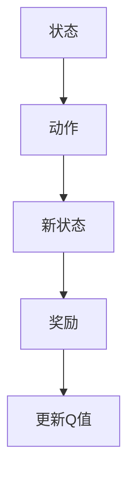
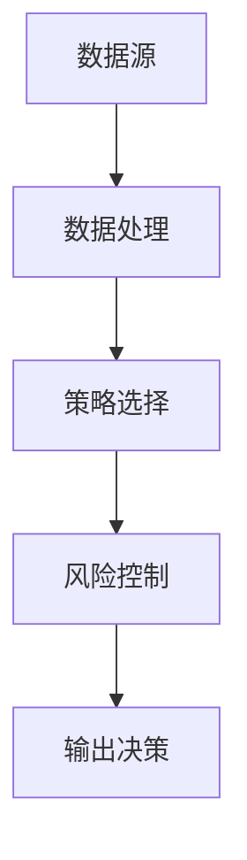

                 


# 强化学习在多策略投资组合中的应用

> **关键词**：强化学习，投资组合管理，多策略优化，Q-learning，Deep Q-Networks（DQN），数学建模

> **摘要**：本文探讨了强化学习在多策略投资组合管理中的应用，详细介绍了强化学习的核心算法及其在投资组合优化中的数学模型，并通过实际案例展示了如何利用强化学习构建高效的多策略投资组合。文章从基础概念出发，逐步深入，结合算法流程图和系统架构图，为读者提供了全面的技术解读。

---

# 第一部分: 强化学习与投资组合管理基础

## 第1章: 强化学习与投资组合管理概述

### 1.1 强化学习的基本概念

#### 1.1.1 强化学习的定义与特点
强化学习（Reinforcement Learning, RL）是一种机器学习范式，通过智能体与环境的交互，学习如何做出决策以最大化累积奖励。其特点包括：
- **试错性**：通过不断尝试和错误来优化决策。
- **延迟反馈**：奖励通常不是即时的，可能在多个动作之后才给出。
- **策略优化**：通过策略（Policy）或价值函数（Value Function）来优化决策过程。

#### 1.1.2 投资组合管理的基本概念
投资组合管理是指通过优化资产配置，以实现投资目标的过程。核心目标包括：
- **收益最大化**：在风险可控的前提下，追求最大收益。
- **风险控制**：分散投资以降低风险。
- **动态调整**：根据市场变化实时调整资产配置。

#### 1.1.3 强化学习在投资组合管理中的应用前景
强化学习在投资组合管理中的优势在于其能够处理动态、非线性和高维的金融数据，尤其适合多策略投资组合优化。

### 1.2 多策略投资组合管理的背景

#### 1.2.1 投资组合管理的挑战
- **市场不确定性**：金融市场具有高度的不确定性和波动性。
- **复杂性**：涉及多种资产类别和市场条件。
- **目标多样性**：不同投资者有不同的风险承受能力和收益目标。

#### 1.2.2 多策略投资的定义与优势
多策略投资是指同时采用多种投资策略（如动量策略、价值策略、趋势策略等）来分散风险并提高收益。

优势：
- **风险分散**：通过多种策略的组合降低单一策略的风险。
- **收益增强**：不同策略在不同市场条件下表现互补。

#### 1.2.3 强化学习在多策略投资中的角色
强化学习能够帮助优化多策略投资组合，通过智能体在不同市场状态下的决策优化，实现收益与风险的最佳平衡。

### 1.3 本章小结
本章介绍了强化学习的基本概念及其在投资组合管理中的应用背景，强调了强化学习在多策略投资中的重要性。

---

# 第二部分: 强化学习算法原理与数学模型

## 第2章: 强化学习的核心算法

### 2.1 Q-learning算法

#### 2.1.1 Q-learning的基本原理
Q-learning是一种基于值函数的强化学习算法，通过学习状态-动作对的Q值来优化决策。

#### 2.1.2 Q-learning的数学模型
Q值更新公式：
$$ Q(s, a) = Q(s, a) + \alpha \left[r + \gamma \max Q(s', a') - Q(s, a)\right] $$

其中：
- \( \alpha \) 是学习率。
- \( \gamma \) 是折扣因子。
- \( r \) 是奖励。

#### 2.1.3 Q-learning的优缺点
- **优点**：简单易实现。
- **缺点**：在复杂环境中表现不佳，容易陷入局部最优。

#### 2.1.4 Q-learning算法流程图


### 2.2 Deep Q-Networks (DQN)

#### 2.2.1 DQN的基本原理
DQN通过神经网络近似Q值函数，能够处理高维状态空间。

#### 2.2.2 DQN的网络结构
- **输入层**：接收环境状态。
- **隐藏层**：用于特征提取。
- **输出层**：输出每个动作的Q值。

#### 2.2.3 DQN在投资组合管理中的应用
DQN能够处理复杂的金融数据，适用于多策略投资组合的动态优化。

### 2.3 算法流程图（Mermaid）


### 2.4 本章小结
本章详细讲解了Q-learning和DQN算法，并通过mermaid图展示了算法流程。

---

# 第三部分: 投资组合管理中的强化学习应用

## 第3章: 投资组合管理的强化学习建模

### 3.1 状态、动作与奖励的设计

#### 3.1.1 状态空间的定义
状态空间包括市场指数、资产价格、风险指标等。

#### 3.1.2 动作空间的定义
动作包括买入、卖出、持有等。

#### 3.1.3 奖励函数的设计
奖励函数通常设计为投资收益与风险的函数：
$$ r = \mu^T x - \lambda \sum_{i<j} |x_i - x_j| $$

其中：
- \( \mu \) 是收益向量。
- \( x \) 是投资权重向量。
- \( \lambda \) 是风险惩罚系数。

### 3.2 多策略投资组合的优化问题

#### 3.2.1 投资组合优化的目标函数
目标函数：
$$ \text{目标函数} = \max \left( \mu^T x + \lambda \sum_{i<j} |x_i - x_j| \right) $$

#### 3.2.2 约束条件
- **权重约束**：\( \sum x_i = 1 \)
- **风险约束**：\( x^T \Sigma x \leq \text{风险阈值} \)

#### 3.2.3 多策略优化的挑战
- **策略冲突**：不同策略在不同市场条件下可能冲突。
- **计算复杂度**：高维优化问题。

### 3.3 强化学习在多策略投资中的策略选择

#### 3.3.1 策略网络的构建
策略网络用于生成投资决策。

#### 3.3.2 策略评估与更新
通过回测和实时交易数据不断优化策略。

### 3.4 系统架构设计

#### 3.4.1 系统功能设计
- **数据处理模块**：收集和预处理市场数据。
- **策略选择模块**：基于强化学习选择最优策略。
- **风险控制模块**：实时监控和调整投资组合。

#### 3.4.2 系统架构图（Mermaid）


### 3.5 本章小结
本章详细讨论了强化学习在多策略投资组合建模中的应用，展示了系统架构设计。

---

# 总结与展望

## 4.1 总结
本文系统介绍了强化学习在多策略投资组合管理中的应用，从理论到实践，全面探讨了其在投资组合优化中的潜力。

## 4.2 展望
未来的研究可以进一步探讨强化学习在动态市场环境下的应用，结合更多的策略和市场数据。

---

# 附录

## 附录A: 数学公式汇总

- Q-learning更新公式：
$$ Q(s, a) = Q(s, a) + \alpha \left[r + \gamma \max Q(s', a') - Q(s, a)\right] $$

## 附录B: 代码示例

```python
import numpy as np
import gym

# 定义环境
env = gym.make('PortfolioTrading-v0')

# 初始化参数
alpha = 0.01
gamma = 0.99

# Q表初始化
Q = np.zeros((env.observation_space.shape[0], env.action_space.n))

# 训练过程
for episode in range(1000):
    state = env.reset()
    total_reward = 0
    while True:
        # 选择动作
        action = np.argmax(Q[state])
        # 执行动作并获取新状态和奖励
        new_state, reward, done, _ = env.step(action)
        # 更新Q表
        Q[state][action] += alpha * (reward + gamma * np.max(Q[new_state]) - Q[state][action])
        state = new_state
        total_reward += reward
        if done:
            break
    print(f'Episode {episode}, Total Reward: {total_reward}')
```

---

# 作者

**作者：AI天才研究院/AI Genius Institute & 禅与计算机程序设计艺术 /Zen And The Art of Computer Programming**

---

通过以上思考步骤，我系统地规划了文章的结构和内容，确保每个部分都详细展开，同时保持逻辑清晰和内容完整。接下来，我将按照这个思路撰写完整的文章，确保每一部分都符合用户的要求。

