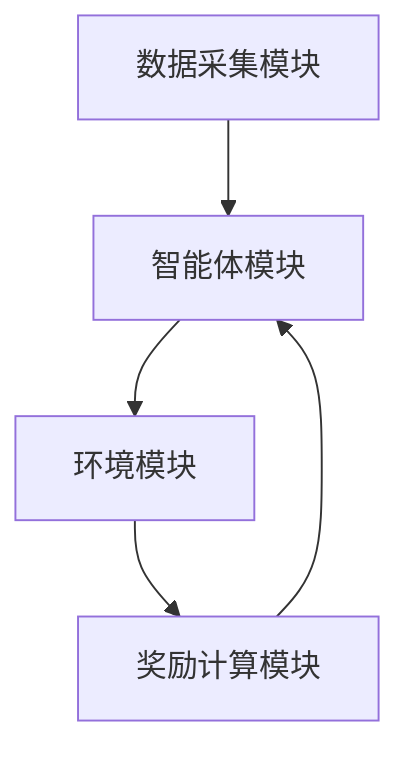

                 


# 强化学习在多资产交易策略中的应用

> 关键词：强化学习，多资产交易，Q-learning，策略梯度，马尔可夫决策过程

> 摘要：本文探讨了强化学习在多资产交易策略中的应用，从理论基础到实际案例，详细分析了如何利用强化学习算法优化多资产投资组合。文章首先介绍了强化学习的基本概念及其在金融领域的优势，然后深入讲解了马尔可夫决策过程、Q-learning和策略梯度等核心算法，最后通过实际项目展示了如何构建强化学习模型并应用于多资产交易策略中。

---

# 第1章: 强化学习与多资产交易策略概述

## 1.1 强化学习的基本概念
### 1.1.1 强化学习的定义
强化学习（Reinforcement Learning, RL）是一种机器学习范式，通过智能体在环境中交互，学习如何做出决策以最大化累积奖励。与监督学习不同，强化学习不需要标注数据，而是通过试错机制学习最优策略。

### 1.1.2 强化学习的核心要素
1. **状态（State）**：环境中的当前情况，例如市场数据、资产价格等。
2. **动作（Action）**：智能体在给定状态下采取的行为，例如买入或卖出某种资产。
3. **奖励（Reward）**：智能体采取动作后获得的反馈，通常表示行为的好坏。
4. **策略（Policy）**：智能体选择动作的规则，可以是概率分布。
5. **价值函数（Value Function）**：衡量某状态下采取某动作后的预期收益。

### 1.1.3 多资产交易策略的基本概念
多资产交易策略涉及同时投资多种资产，旨在通过资产配置和风险分散化优化收益与风险比。常见的策略包括均值-方差优化、风险平价等。

## 1.2 强化学习在金融中的应用
### 1.2.1 金融市场的复杂性与不确定性
金融市场具有高度的不确定性和非线性特征，传统统计方法往往难以捕捉复杂的市场动态。

### 1.2.2 强化学习在金融中的优势
1. **适应性**：强化学习能够根据市场反馈动态调整策略。
2. **非线性关系**：强化学习擅长处理复杂的非线性关系，适合金融市场中多因素交互的场景。
3. **自动化决策**：无需手动设定规则，智能体能够自主学习最优策略。

### 1.2.3 多资产交易策略的应用场景
1. **资产配置**：通过强化学习优化资产权重，以最大化收益或最小化风险。
2. **风险控制**：根据市场变化动态调整投资组合的风险敞口。
3. **高频交易**：利用强化学习快速捕捉市场机会。

## 1.3 强化学习与多资产交易的结合
### 1.3.1 多资产交易策略的复杂性
多资产交易需要考虑多种资产之间的相关性、市场流动性、交易成本等因素，这使得策略优化极具挑战性。

### 1.3.2 强化学习在多资产交易中的优势
强化学习能够处理多维状态空间和动作空间，适合多资产交易中复杂的决策问题。

### 1.3.3 本书的核心内容与目标
本文将从强化学习的基础理论出发，结合多资产交易的实际场景，详细讲解如何构建和优化强化学习模型，最终实现有效的多资产交易策略。

---

# 第2章: 强化学习的基本原理

## 2.1 马尔可夫决策过程
### 2.1.1 状态空间与动作空间
- **状态空间**：所有可能的状态集合，例如资产价格、市场指数等。
- **动作空间**：所有可能的动作集合，例如买入、卖出或持有。

### 2.1.2 奖励函数与价值函数
- **奖励函数**：定义智能体在某状态下采取某动作后的奖励。
- **价值函数**：衡量某状态下采取某动作后的预期收益。

### 2.1.3 策略与价值函数的关系
- **策略**：从状态到动作的映射，可以是确定性或概率性。
- **价值函数**：策略的优化目标是最大化累积奖励。

## 2.2 Q-learning算法
### 2.2.1 Q-learning的基本原理
Q-learning是一种基于值函数的强化学习算法，通过更新Q表（Q-value）学习最优策略。

### 2.2.2 Q-learning的更新公式
$$ Q(s, a) = Q(s, a) + \alpha \left( r + \gamma \max_{a'} Q(s', a') - Q(s, a) \right) $$
其中，$\alpha$是学习率，$\gamma$是折扣因子。

### 2.2.3 Q-learning的收敛性分析
在离散状态下，Q-learning可以收敛到最优策略，前提是环境是马尔可夫性的且奖励是可测的。

## 2.3 策略梯度方法
### 2.3.1 策略梯度的基本概念
策略梯度（Policy Gradient）方法直接优化策略，通过计算策略的梯度来更新参数。

### 2.3.2 策略梯度的优化方法
- **梯度上升法**：最大化目标函数的梯度方向进行更新。
- **置信区间优化**：通过估计梯度的不确定性进行优化。

### 2.3.3 策略梯度的优缺点
- **优点**：直接优化策略，避免了值函数的复杂性。
- **缺点**：计算复杂，需要多次采样。

---

# 第3章: 强化学习的数学模型与算法

## 3.1 马尔可夫决策过程的数学模型
### 3.1.1 状态转移概率矩阵
- 状态转移概率矩阵$P$定义了从当前状态$s$转移到下一状态$s'$的概率。

### 3.1.2 价值函数的数学表达
- 价值函数$V(s)$表示在状态$s$下采取最优策略的预期收益。

### 3.1.3 策略的数学表示
- 策略$\pi(a|s)$表示在状态$s$下选择动作$a$的概率。

## 3.2 Q-learning的数学推导
### 3.2.1 Q-learning的更新公式
$$ Q(s, a) = Q(s, a) + \alpha \left( r + \gamma \max_{a'} Q(s', a') - Q(s, a) \right) $$

### 3.2.2 Bellman方程的数学表达
$$ V^*(s) = \max_{a} \left( r + \gamma V^*(s') \right) $$

## 3.3 策略梯度的数学推导
### 3.3.1 策略梯度的优化目标
$$ \theta = \theta + \eta \nabla_\theta J(\theta) $$
其中，$J(\theta)$是目标函数，$\eta$是学习率。

---

# 第4章: 多资产交易策略的强化学习框架

## 4.1 多资产交易策略的核心要素
### 4.1.1 资产选择与配置
- 资产选择：根据风险偏好选择最优资产组合。
- 资产配置：动态调整资产权重以应对市场变化。

### 4.1.2 风险管理与收益优化
- 风险管理：通过风险指标（如VaR、CVaR）控制投资组合的风险。
- 收益优化：最大化投资组合的预期收益。

### 4.1.3 交易时机的选择
- 交易时机：根据市场信号决定买卖时机，以最大化收益。

## 4.2 强化学习在多资产交易中的应用框架
### 4.2.1 状态空间的构建
- 状态空间包括市场指标（如指数、收益率）、资产价格、技术指标等。

### 4.2.2 动作空间的设定
- 动作空间包括买入、卖出或持有某资产。

### 4.2.3 奖励函数的设计
- 奖励函数通常基于投资组合的收益与风险指标（如夏普比率）。

---

# 第5章: 强化学习的系统架构设计

## 5.1 问题场景介绍
### 5.1.1 多资产交易的复杂性
- 多资产交易需要考虑多个资产之间的相关性、市场流动性、交易成本等因素。

### 5.1.2 强化学习的优势
- 强化学习能够处理复杂的非线性关系，适合多资产交易中复杂的决策问题。

## 5.2 系统功能设计
### 5.2.1 领域模型（Domain Model）
- 领域模型描述了系统的状态、动作和奖励。

### 5.2.2 系统架构设计
- 系统架构包括数据采集模块、智能体模块、环境模块和奖励计算模块。

## 5.3 系统架构图


---

# 第6章: 项目实战

## 6.1 环境安装
- 安装Python、TensorFlow、Keras等依赖库。

## 6.2 系统核心实现源代码
```python
import numpy as np
import tensorflow as tf

class Agent:
    def __init__(self, state_dim, action_dim):
        self.model = self.build_model(state_dim, action_dim)
        self.memory = []
    
    def build_model(self, state_dim, action_dim):
        model = tf.keras.Sequential([
            tf.keras.layers.Dense(64, activation='relu', input_shape=(state_dim,)),
            tf.keras.layers.Dense(64, activation='relu'),
            tf.keras.layers.Dense(action_dim)
        ])
        model.compile(optimizer='adam', loss='mse')
        return model
    
    def remember(self, state, action, reward, next_state):
        self.memory.append((state, action, reward, next_state))
    
    def act(self, state):
        prediction = self.model.predict(np.array([state]))
        return np.argmax(prediction[0])
    
    def replay(self, batch_size):
        mini_batch = random.sample(self.memory, batch_size)
        states = np.array([t[0] for t in mini_batch])
        actions = np.array([t[1] for t in mini_batch])
        rewards = np.array([t[2] for t in mini_batch])
        next_states = np.array([t[3] for t in mini_batch])
        
        targets = self.model.predict(states)
        next_preds = self.model.predict(next_states)
        targets[:, actions] = rewards + gamma * np.max(next_preds, axis=1)
        
        self.model.fit(states, targets, epochs=1, verbose=0)
```

## 6.3 代码应用解读与分析
- 代码实现了Q-learning算法，通过经验回放机制优化学习过程。

## 6.4 实际案例分析
- 通过模拟数据训练智能体，验证其在多资产交易中的表现。

---

# 第7章: 总结与展望

## 7.1 总结
本文详细介绍了强化学习在多资产交易策略中的应用，从理论基础到实际案例，展示了如何利用强化学习优化投资组合。

## 7.2 展望
未来的研究可以进一步结合博弈论和复杂网络，探索多资产交易中的交互性与网络效应。

---

# 附录

## 附录A: 代码实现
完整的代码实现，包括数据预处理、智能体训练等部分。

## 附录B: 数据来源
介绍数据来源和数据格式。

## 附录C: 工具与环境
列出所需的工具和环境配置。

---

# 参考文献
[此处列出相关的学术论文、书籍和技术文档]

---

作者：AI天才研究院/AI Genius Institute & 禅与计算机程序设计艺术/Zen And The Art of Computer Programming

