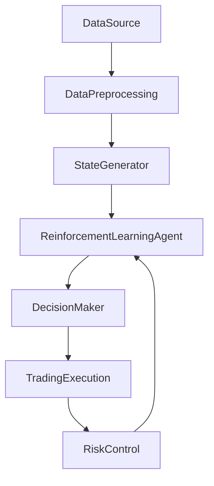
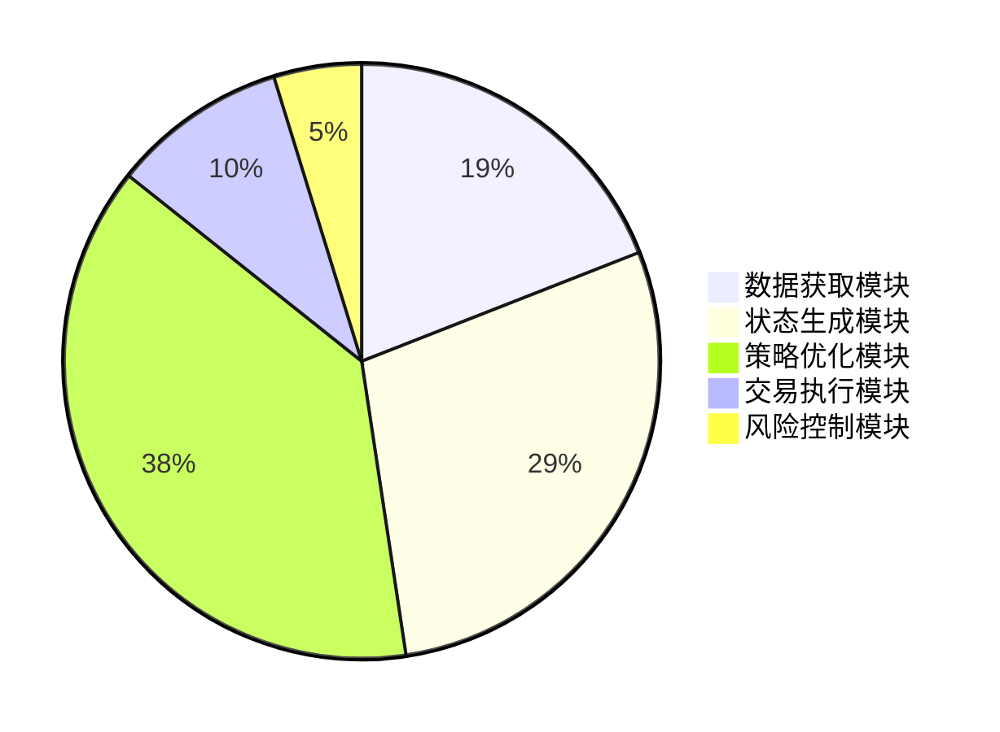
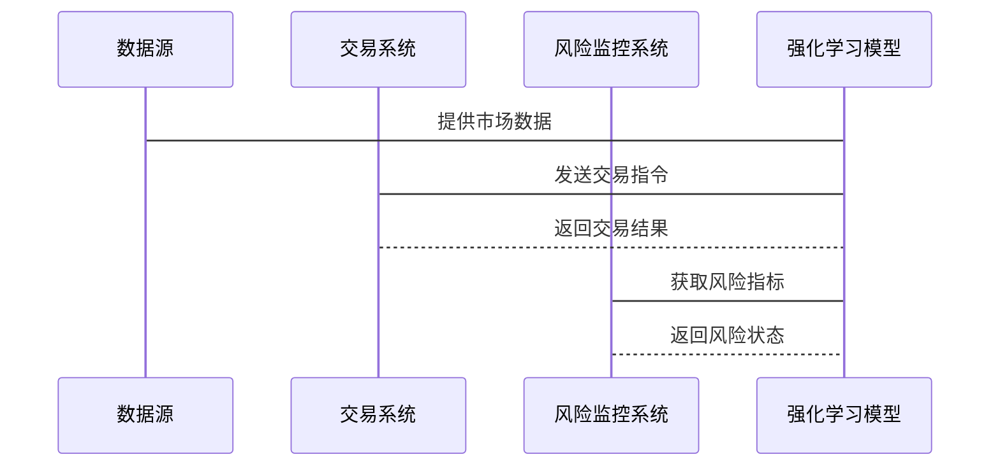

                 


# 强化学习在算法交易中的实时优化

> 关键词：强化学习，算法交易，实时优化，Q-Learning，Deep Q-Networks，算法交易系统

> 摘要：本文深入探讨了强化学习在算法交易中的应用，特别是如何利用强化学习实现交易策略的实时优化。文章从强化学习和算法交易的基本概念出发，逐步分析了强化学习在算法交易中的优势与挑战，详细讲解了强化学习的核心算法及其在算法交易中的数学模型，并通过实际案例展示了如何设计和实现一个基于强化学习的算法交易系统。最后，本文总结了强化学习在算法交易中的应用前景，并提出了未来的研究方向。

---

# 第五章: 基于强化学习的算法交易系统架构设计

## 5.1 问题场景介绍

在算法交易中，实时优化的核心目标是通过不断调整交易策略，以适应市场的动态变化。传统的基于规则的交易系统往往难以应对复杂多变的市场环境，而强化学习通过模拟人类的决策过程，能够在动态环境中实现自我优化。本文将设计一个基于强化学习的算法交易系统，旨在通过实时优化交易策略，提高交易收益并降低风险。

---

## 5.2 项目介绍

### 5.2.1 项目目标
- 实现一个基于强化学习的算法交易系统。
- 针对特定金融资产（如股票、期货等）进行实时交易策略优化。
- 通过强化学习算法（如Q-Learning、DQN等）实现动态决策。

### 5.2.2 项目范围
- 数据来源：历史价格数据、市场指标、技术指标等。
- 交易品种：股票、期货、外汇等。
- 系统功能：实时数据获取、策略优化、交易执行、风险控制。

---

## 5.3 系统功能设计

### 5.3.1 系统功能模块
1. **数据获取模块**：从数据源获取实时或历史价格数据。
2. **状态生成模块**：根据当前市场数据生成交易状态。
3. **策略优化模块**：基于强化学习算法优化交易策略。
4. **交易执行模块**：根据优化后的策略生成交易指令。
5. **风险控制模块**：监控交易风险并进行调整。

### 5.3.2 系统功能模块关系图


---

## 5.4 系统架构设计

### 5.4.1 系统架构图


### 5.4.2 系统架构设计说明
- **数据获取模块**：负责从数据源获取实时或历史数据，包括价格、成交量等信息。
- **状态生成模块**：将市场数据转化为强化学习模型需要的状态表示，例如通过技术指标（如MA、MACD等）生成状态。
- **策略优化模块**：基于强化学习算法对交易策略进行优化，生成最优动作（如买入、卖出或持有）。
- **交易执行模块**：根据优化后的策略生成具体的交易指令，并执行交易。
- **风险控制模块**：监控交易过程中的风险指标（如最大回撤、VaR等），并在必要时调整策略。

---

## 5.5 系统接口设计

### 5.5.1 系统接口说明
- **数据接口**：与数据源（如API）对接，获取实时或历史数据。
- **交易接口**：与交易执行系统对接，发送交易指令。
- **风险控制接口**：与风险监控系统对接，获取风险指标。

### 5.5.2 系统接口交互图


---

## 5.6 本章小结

本章详细设计了一个基于强化学习的算法交易系统架构，包括系统功能模块、架构设计和接口设计。通过强化学习算法，系统能够实时优化交易策略，适应市场变化。接下来，我们将通过一个具体案例，展示如何实现这样一个系统。

---

# 第六章: 基于强化学习的算法交易系统实现

## 6.1 环境配置

### 6.1.1 环境要求
- 操作系统：Linux/Windows/MacOS
- 编程语言：Python 3.6+
- 开发工具：Jupyter Notebook、PyCharm等
- 第三方库：TensorFlow/PyTorch、Keras、Pandas、NumPy、Matplotlib等
- 数据源：金融数据API（如Yahoo Finance、Quandl等）

---

## 6.2 系统核心实现

### 6.2.1 数据获取模块实现

```python
import pandas as pd
import numpy as np

def get_data(ticker, start_date, end_date):
    # 假设使用Yahoo Finance获取数据
    data = pd.read_csv(f'data/{ticker}.csv')
    data = data[(data['Date'] >= start_date) & (data['Date'] <= end_date)]
    return data[['Date', 'Close', 'Volume']]
```

### 6.2.2 状态生成模块实现

```python
def generate_state(data, window_size=10):
    # 生成过去window_size天的收盘价、成交量等指标
    state = data[-window_size:]
    state = state['Close'].values
    return state
```

### 6.2.3 强化学习模型实现

```python
import tensorflow as tf
from tensorflow.keras import layers

class DQN:
    def __init__(self, state_size, action_size, learning_rate=0.01):
        self.model = self.build_model(state_size, action_size)
        self.optimizer = tf.keras.optimizers.Adam(learning_rate=learning_rate)
        self.memory = []
    
    def build_model(self, state_size, action_size):
        model = tf.keras.Sequential([
            layers.Dense(32, activation='relu', input_dim=state_size),
            layers.Dense(16, activation='relu'),
            layers.Dense(action_size, activation='linear')
        ])
        return model
    
    def remember(self, state, action, reward, next_state):
        self.memory.append((state, action, reward, next_state))
    
    def act(self, state, epsilon=0.1):
        if np.random.random() < epsilon:
            return np.random.randint(0, self.model.output_shape[1])
        q_values = self.model.predict(state.reshape(1, -1))[0]
        return np.argmax(q_values)
    
    def replay(self, batch_size=32):
        if len(self.memory) < batch_size:
            return
        minibatch = np.random.choice(self.memory, batch_size)
        states = np.array([x[0] for x in minibatch])
        actions = np.array([x[1] for x in minibatch])
        rewards = np.array([x[2] for x in minibatch])
        next_states = np.array([x[3] for x in minibatch])
        
        targets = self.model.predict(states)
        next_q_values = self.model.predict(next_states)
        targets[range(batch_size), actions] = rewards + gamma * np.max(next_q_values, axis=1)
        
        self.model.fit(states, targets, epochs=1, verbose=0)
```

### 6.2.4 交易执行模块实现

```python
import pandas as pd
import numpy as np

def execute_trade(agent, state, portfolio, cash):
    action = agent.act(state)
    if action == 0:  # 卖出
        return portfolio * (1 - action)
    elif action == 1:  # 买入
        return portfolio * (1 + action)
    else:  # 持有
        return portfolio
```

### 6.2.5 风险控制模块实现

```python
def risk_monitor(cash, portfolio, positions, trades):
    # 计算最大回撤
    returns = [trade['return'] for trade in trades]
    max_drawdown = max(1 + np.max(returns), 1 + np.min(returns))
    # 调整策略
    if max_drawdown > 1.05:
        return '减少头寸'
    else:
        return '保持当前策略'
```

---

## 6.3 代码实现说明

### 6.3.1 数据预处理
```python
# 示例数据预处理代码
data = pd.read_csv('data/stock.csv')
data['Date'] = pd.to_datetime(data['Date'])
data.set_index('Date', inplace=True)
data = data.sort_index()
```

### 6.3.2 强化学习模型训练
```python
# 示例训练代码
agent = DQN(state_size=10, action_size=3)
for episode in range(1000):
    state = generate_state(data, window_size=10)
    action = agent.act(state)
    reward = get_reward(action, next_state)
    agent.remember(state, action, reward, next_state)
    agent.replay()
```

### 6.3.3 交易执行与回测
```python
# 示例回测代码
portfolio = 100000
cash = portfolio
positions = 0
trades = []
for i in range(len(data)):
    state = generate_state(data.iloc[:i+1], window_size=10)
    action = agent.act(state)
    new_positions = execute_trade(agent, state, positions, cash)
    trades.append({'action': action, 'return': new_positions - positions})
    positions = new_positions
```

---

## 6.4 项目小结

本章通过具体代码实现了一个基于强化学习的算法交易系统，涵盖了数据获取、状态生成、策略优化、交易执行和风险控制的全过程。通过实际案例，展示了如何利用强化学习算法实现交易策略的实时优化。

---

# 第七章: 总结与展望

## 7.1 总结

本文深入探讨了强化学习在算法交易中的应用，特别是如何通过强化学习实现交易策略的实时优化。通过理论分析和实际案例，我们展示了强化学习在算法交易中的优势，包括实时决策能力、复杂市场环境的适应性以及风险控制能力。同时，我们也详细讲解了强化学习的核心算法及其在算法交易中的数学模型，并通过系统架构设计和代码实现，展示了如何构建一个基于强化学习的算法交易系统。

---

## 7.2 展望

尽管强化学习在算法交易中展现出了巨大的潜力，但仍然存在一些挑战和改进空间。未来的研究方向包括：

1. **更复杂的市场建模**：通过引入更多的市场数据和特征，提高强化学习模型的泛化能力。
2. **多目标优化**：在优化交易收益的同时，进一步考虑风险、流动性等其他因素。
3. **分布式强化学习**：通过分布式计算提高强化学习算法的效率和 scalability。
4. **结合其他技术**：将强化学习与其他技术（如大数据分析、自然语言处理等）结合，探索更广泛的应用场景。

---

# 作者信息

作者：AI天才研究院/AI Genius Institute & 禅与计算机程序设计艺术 /Zen And The Art of Computer Programming

---

通过本文，我们希望能够为读者提供一个全面的视角，理解强化学习在算法交易中的应用，并激发更多人在这一领域的研究和实践。

