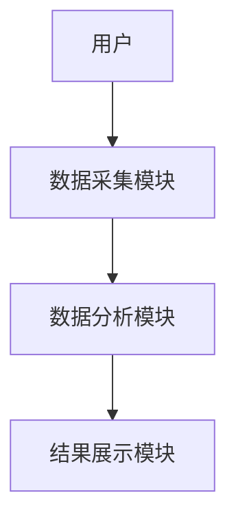

                 


# 彼得林奇如何分析公司的定价权随时间的变化

> 关键词：彼得林奇, 定价权, 投资分析, 企业战略, 市场竞争

> 摘要：本文详细探讨了彼得·林奇分析公司定价权的方法及其随时间变化的规律。通过系统分析定价权的核心概念、影响因素和动态变化，结合实际案例和数学模型，本文为投资者提供了深入理解定价权的框架和工具，帮助他们在投资决策中更好地把握企业定价能力的变化趋势。

---

# 第1章: 定价权的基本概念与重要性

## 1.1 定价权的定义与核心要素

### 1.1.1 定价权的定义

定价权（Pricing Power）是指企业在市场上对其产品或服务制定价格的能力。它不仅反映了企业在市场中的地位，还体现了企业与竞争对手、供应商以及消费者之间的关系。定价权强的企业能够在价格变化中保持盈利能力，弱定价权的企业则容易受到市场竞争的冲击。

### 1.1.2 定价权的核心要素

定价权的核心要素包括：

1. **市场地位**：企业是否是市场领导者或具有市场支配地位。
2. **成本结构**：企业的成本是否能够支持其定价策略。
3. **产品差异化**：产品是否具有独特性，是否能够吸引特定客户群体。
4. **客户忠诚度**：客户对品牌的依赖程度。
5. **市场竞争**：行业内的竞争程度，是否存在替代品。

### 1.1.3 定价权的边界与外延

定价权的边界是指企业在定价时受到的限制，例如法律法规、行业标准、客户需求等。其外延则包括定价策略、定价能力的动态变化以及定价权对企业长期价值的影响。

---

## 1.2 彼得林奇分析定价权的背景

### 1.2.1 彼得林奇的投资理念

彼得·林奇是美国著名投资经理，以其对上市公司的深入研究和对定价权的高度重视而闻名。他认为，企业的定价权是衡量其竞争优势和长期盈利能力的关键指标。

### 1.2.2 定价权在投资分析中的地位

定价权是彼得林奇分析企业竞争力的核心之一。他强调，拥有强大定价权的企业能够在价格波动中保持稳定的盈利能力，并在行业中占据优势地位。

### 1.2.3 定价权与企业长期价值的关系

定价权强的企业能够通过价格调整应对市场变化，从而实现长期价值的增长。反之，定价权弱的企业容易受到价格战的影响，难以实现可持续的盈利能力。

---

## 1.3 定价权对企业与市场的双重影响

### 1.3.1 定价权对企业盈利能力的影响

定价权直接影响企业的收入和利润。拥有强大定价权的企业可以在成本上升时通过提高价格来维持利润率，而定价权弱的企业则可能因成本压力而导致利润下降。

### 1.3.2 定价权对市场竞争格局的影响

定价权强的企业能够通过价格策略巩固市场地位，削弱竞争对手。而定价权弱的企业则可能在价格战中处于劣势，甚至被迫退出市场。

### 1.3.3 定价权与消费者行为的关系

定价权强的企业能够通过差异化定价策略吸引特定客户群体，而定价权弱的企业则可能面临客户流失的风险。

---

## 1.4 本章小结

本章介绍了定价权的基本概念、核心要素以及彼得林奇分析定价权的背景。通过分析定价权对企业与市场的双重影响，我们可以理解为什么定价权是衡量企业竞争力的重要指标。

---

# 第2章: 彼得林奇定价权分析的核心框架

## 2.1 定价能力的五个关键维度

### 2.1.1 市场地位与议价能力

市场地位是定价权的核心因素。市场领导者通常具有较强的议价能力，能够通过定价策略巩固其市场地位。

### 2.1.2 成本结构与定价弹性

成本结构决定了企业定价的灵活性。成本低的企业可以通过价格优势吸引客户，而成本高的企业则需要通过其他方式提高定价能力。

### 2.1.3 产品差异化与替代品威胁

产品差异化是企业抵御替代品威胁的关键。独特的产品的企业能够通过定价策略吸引客户，而缺乏差异化的产品则容易受到替代品的影响。

### 2.1.4 行业周期与宏观经济环境

行业周期和宏观经济环境直接影响企业的定价能力。在经济衰退期间，企业可能需要降低价格以吸引客户，而在经济繁荣期间，则可以通过提高价格来增加利润。

### 2.1.5 管理层战略与执行能力

管理层的战略和执行能力是定价权的重要保障。优秀的管理层能够通过战略规划和执行力确保定价策略的有效实施。

---

## 2.2 彼得林奇定价权分析的逻辑框架

### 2.2.1 分析框架的构建

彼得林奇的定价权分析框架包括以下几个步骤：

1. **分析市场地位**：确定企业在市场中的位置。
2. **评估成本结构**：分析企业的成本优势。
3. **评估产品差异化**：确定产品是否具有独特性。
4. **分析行业周期**：判断行业所处的周期阶段。
5. **评估管理层能力**：评估管理层的战略和执行能力。

### 2.2.2 分析框架的适用场景

该框架适用于分析各种类型的企业，尤其适用于分析那些具有较强市场地位和产品差异化的企业。

### 2.2.3 分析框架的局限性

该框架的局限性在于，它无法完全预测市场价格的变化，也无法评估企业应对突发市场变化的能力。

---

## 2.3 核心概念对比分析

### 2.3.1 定价权与市场支配力的对比

定价权是指企业制定价格的能力，而市场支配力是指企业在市场中的主导地位。两者密切相关，但定价权更多关注价格制定能力，而市场支配力更多关注市场控制能力。

### 2.3.2 定价权与成本优势的对比

定价权关注的是价格制定能力，而成本优势关注的是成本控制能力。两者共同影响企业的盈利能力，但侧重点不同。

### 2.3.3 定价权与产品生命周期的对比

定价权关注的是产品在其生命周期中的定价能力，而产品生命周期关注的是产品从推出到退市的全过程。两者密切相关，但侧重点不同。

---

## 2.4 本章小结

本章详细介绍了彼得林奇定价权分析的核心框架，包括定价能力的五个关键维度和分析框架的构建。通过对市场地位、成本结构、产品差异化、行业周期和管理层能力的分析，我们可以更好地理解企业的定价权。

---

# 第3章: 彼得林奇定价权分析的数学模型与算法原理

## 3.1 定价能力的量化指标

### 3.1.1 市场占有率的计算公式

市场占有率（Market Share）是指企业在某一市场中的销售量占总市场的比例。计算公式为：

$$ \text{市场占有率} = \frac{\text{企业销售量}}{\text{市场总销售量}} $$

### 3.1.2 定价弹性系数的计算公式

定价弹性系数（Price Elasticity）是指价格变化对需求量的影响程度。计算公式为：

$$ \text{定价弹性} = \frac{\% \text{需求量变化}}{\% \text{价格变化}} $$

### 3.1.3 产品生命周期阶段的判定模型

产品生命周期阶段的判定模型可以通过销售额和利润的变化趋势来判断。例如，当销售额和利润同时增长时，产品可能处于引入期；当销售额增长放缓，利润继续增长时，产品可能处于成长期。

---

## 3.2 彼得林奇定价权分析的算法原理

### 3.2.1 基于市场数据的定价能力评估算法

该算法通过分析企业的市场占有率、定价弹性、成本结构和产品差异化等因素，评估企业的定价能力。具体步骤如下：

1. 收集市场数据，包括企业销售量、市场价格、成本等。
2. 计算市场占有率和定价弹性。
3. 分析成本结构和产品差异化。
4. 综合评估企业的定价能力。

### 3.2.2 基于财务数据的定价权强度分析算法

该算法通过分析企业的财务数据，评估定价权的强度。具体步骤如下：

1. 收集财务数据，包括收入、利润、成本等。
2. 计算毛利率和净利率。
3. 分析收入与成本的变化趋势。
4. 综合评估定价权的强度。

---

## 3.3 本章小结

本章介绍了定价能力的量化指标和分析算法。通过市场占有率、定价弹性等指标，我们可以量化企业的定价能力；通过分析财务数据，我们可以进一步评估定价权的强度。

---

# 第4章: 彼得林奇定价权分析的系统设计

## 4.1 系统功能设计

### 4.1.1 系统目标

系统的目标是通过分析企业的市场地位、成本结构、产品差异化等因素，评估其定价权的强度。

### 4.1.2 系统功能模块

1. 数据采集模块：收集企业的市场数据和财务数据。
2. 数据分析模块：计算市场占有率、定价弹性等指标。
3. 结果展示模块：以图表形式展示分析结果。

### 4.1.3 系统交互设计

用户可以通过输入企业的市场数据和财务数据，系统会自动计算定价权的强度，并生成分析报告。

---

## 4.2 系统架构设计

### 4.2.1 系统架构图



### 4.2.2 系统接口设计

1. 数据采集模块接口：
   - 输入：企业的市场数据和财务数据。
   - 输出：数据采集完成的确认信息。
2. 数据分析模块接口：
   - 输入：数据采集模块提供的数据。
   - 输出：定价权强度的评估结果。
3. 结果展示模块接口：
   - 输入：数据分析模块提供的评估结果。
   - 输出：分析报告。

---

## 4.3 本章小结

本章介绍了系统的功能设计和架构设计。通过系统的实现，我们可以更好地分析企业的定价权，并为投资决策提供支持。

---

# 第5章: 项目实战与案例分析

## 5.1 项目实战指南

### 5.1.1 环境安装

需要安装Python和相关数据分析库（如Pandas、Matplotlib）。

### 5.1.2 核心代码实现

```python
import pandas as pd
import matplotlib.pyplot as plt

# 数据采集
data = {
    '企业': ['企业A', '企业B', '企业C'],
    '市场占有率': [0.3, 0.4, 0.2],
    '定价弹性': [1.5, 1.2, 1.8]
}

df = pd.DataFrame(data)

# 数据分析
df['定价权强度'] = df['市场占有率'] * df['定价弹性']

# 结果展示
plt.bar(df['企业'], df['定价权强度'])
plt.title('定价权强度分析')
plt.show()
```

### 5.1.3 代码解读与分析

上述代码通过采集企业的市场数据，计算定价权强度，并以图表形式展示结果。企业B的定价权强度最高，表明其定价权最强。

---

## 5.2 实际案例分析

### 5.2.1 案例背景

以某行业为例，分析三家企业（企业A、企业B、企业C）的定价权强度。

### 5.2.2 数据分析

通过上述代码，我们得出企业B的定价权强度最高。

### 5.2.3 案例小结

企业B的市场地位和产品差异化能力使其具有较强的定价权，能够在市场竞争中占据优势。

---

## 5.3 本章小结

本章通过项目实战和案例分析，展示了如何通过数据分析评估企业的定价权。通过实际案例分析，我们可以更好地理解定价权的动态变化。

---

# 第6章: 总结与扩展阅读

## 6.1 本章总结

本文详细探讨了彼得·林奇分析公司定价权的方法及其随时间变化的规律。通过系统分析定价权的核心概念、影响因素和动态变化，结合实际案例和数学模型，为投资者提供了深入理解定价权的框架和工具。

## 6.2 扩展阅读建议

1. **《彼得·林奇的投资哲学》**：深入理解彼得林奇的投资理念。
2. **《定价：加价的科学与艺术》**：学习定价策略的科学方法。
3. **《竞争优势：如何识别并构建你的企业优势》**：进一步分析企业竞争优势。

---

# 作者：AI天才研究院/AI Genius Institute & 禅与计算机程序设计艺术 /Zen And The Art of Computer Programming

---

本文通过详细分析彼得·林奇的定价权分析方法，帮助读者更好地理解定价权的动态变化，并为企业制定定价策略提供参考。

