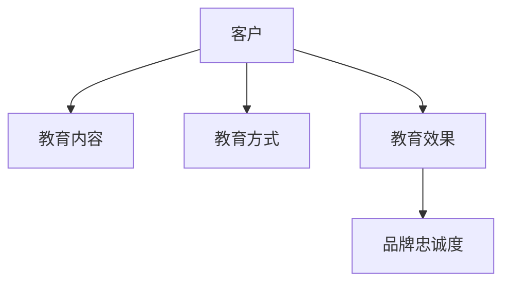
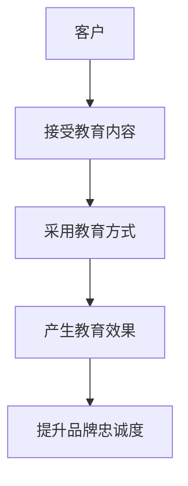
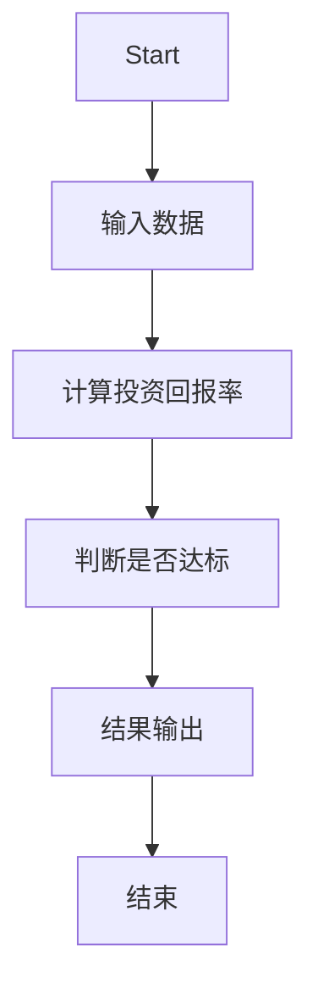
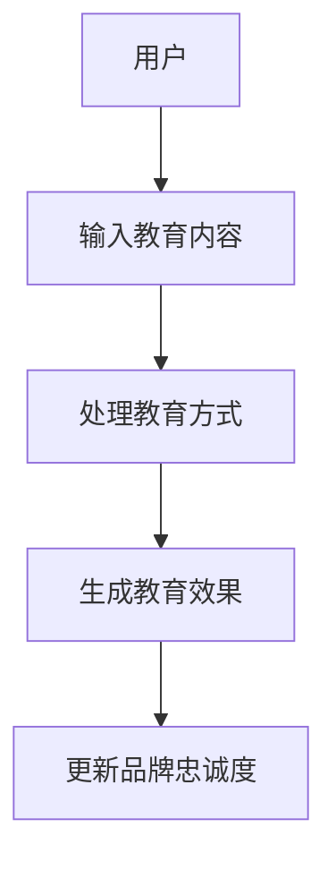

                 


# 彼得林奇如何分析公司的客户教育投资对品牌忠诚度的影响

---

## 关键词  
客户教育投资、品牌忠诚度、彼得林奇分析、投资回报率、教育内容设计、客户体验、品牌策略

---

## 摘要  
本文从彼得林奇的投资分析视角，探讨客户教育投资对品牌忠诚度的影响。通过分析客户教育的核心概念、算法原理和系统架构，结合实际案例，揭示客户教育投资如何提升品牌忠诚度，并为企业制定客户教育策略提供实用建议。

---

## 第一部分：背景介绍

### 第1章：客户教育与品牌忠诚度的背景

#### 1.1 客户教育的定义与核心概念
- **客户教育**是指通过向客户提供有价值的信息、知识或技能培训，帮助客户更好地使用产品或服务，从而提升客户满意度和忠诚度。
- **核心要素**包括教育内容、教育方式和教育效果。
- **客户教育与品牌忠诚度的关系**：客户教育是提升品牌忠诚度的重要手段，通过教育客户增强其对品牌的认同感和依赖感。

#### 1.2 品牌忠诚度的定义与特征
- **品牌忠诚度**是指客户对某一品牌长期的偏好和重复购买行为。
- **层次模型**包括认知忠诚、情感忠诚、行为忠诚和价值忠诚。
- **影响因素**包括产品质量、品牌形象、客户体验和客户教育。

#### 1.3 彼得林奇的分析框架
- 彼得林奇认为，客户教育投资能够提升客户对品牌的理解和信任，从而增强品牌忠诚度。
- 他强调通过客户教育提升客户粘性，降低客户流失率，从而提高投资回报率。
- 客户教育投资与品牌忠诚度的关联性是彼得林奇分析的核心之一。

---

## 第二部分：客户教育与品牌忠诚度的核心概念

### 第2章：客户教育与品牌忠诚度的核心概念

#### 2.1 客户教育的属性特征对比
| **属性**       | **教育内容**           | **教育方式**         | **教育效果**         |
|------------------|-----------------------|----------------------|----------------------|
| **目标**         | 提供知识或技能培训     | 实现知识传递          | 提升客户满意度       |
| **手段**         | 文档、视频、培训课程   | 线上、线下培训        | 提升客户信任度       |
| **效果**         | 提高客户使用效率       | 增强客户参与度        | 增强品牌忠诚度       |

#### 2.2 品牌忠诚度的实体关系图


#### 2.3 客户教育与品牌忠诚度的流程图


---

## 第三部分：客户教育投资的算法原理

### 第3章：客户教育投资的评估方法

#### 3.1 算法原理概述
- **净现值法**：计算客户教育投资的净现值，判断投资是否可行。
- **内部收益率法**：计算客户教育投资的内部收益率，评估投资回报率。
- **回收期法**：计算客户教育投资的回收期，评估投资风险。

#### 3.2 算法流程图


#### 3.3 数学模型与公式
- **投资回报率（ROI）**的计算公式：
  $$ ROI = \frac{\text{净收益}}{\text{投资成本}} \times 100\% $$

- **净现值（NPV）**的计算公式：
  $$ NPV = \sum_{t=0}^{n} \frac{\text{现金流入}}{(1 + r)^t} - \text{初始投资} $$

  其中，$r$ 是贴现率，$t$ 是时间周期。

---

## 第四部分：客户教育投资的系统分析

### 第4章：客户教育投资的系统架构

#### 4.1 系统功能设计
- **领域模型**：客户、教育内容、教育方式、教育效果和品牌忠诚度之间的关系。
  ```mermaid
  classDiagram
      class 客户 {
          id
          姓名
          联系方式
      }
      class 教育内容 {
          内容ID
          内容类型
          内容描述
      }
      class 教育方式 {
          方式ID
          方式类型
          方式描述
      }
      class 教育效果 {
          效果ID
          效果指标
          效果评分
      }
      class 品牌忠诚度 {
          忠诚度ID
          忠诚度评分
          忠诚度变化
      }
      客户 --> 教育内容
      客户 --> 教育方式
      教育内容 --> 教育效果
      教育方式 --> 教育效果
      教育效果 --> 品牌忠诚度
  ```

#### 4.2 系统架构设计
- **分层架构**：包括数据层、业务逻辑层和用户界面层。
  ```mermaid
  graph TD
      数据层 --> 业务逻辑层
      业务逻辑层 --> 用户界面层
  ```

#### 4.3 系统接口设计
- **接口描述**：
  - 输入：客户ID、教育内容ID、教育方式ID
  - 输出：教育效果评分、品牌忠诚度评分

#### 4.4 系统交互流程图


---

## 第五部分：客户教育投资的项目实战

### 第5章：客户教育投资的项目实战

#### 5.1 环境配置
- **技术环境**：Python 3.8、MySQL 5.7、Django 2.2
- **工具安装**：
  ```bash
  pip install django
  pip install mysql-connector-python
  ```

#### 5.2 核心实现代码
- **教育内容模型**：
  ```python
  from django.db import models

  class 教育内容(models.Model):
      内容ID = models.AutoField(primary_key=True)
      内容类型 = models.CharField(max_length=20)
      内容描述 = models.TextField()
  ```

- **教育效果计算**：
  ```python
  def 计算教育效果(客户ID):
      教育内容 = 教育内容.objects.filter(客户ID=客户ID)
      教育效果评分 = sum(内容.教育效果评分 for 内容 in 教育内容) / len(教育内容)
      return 教育效果评分
  ```

#### 5.3 数据分析与结果解读
- **数据分析**：
  ```python
  import pandas as pd

  data = pd.read_csv('教育效果.csv')
  品牌忠诚度 = data['品牌忠诚度'].mean()
  print(f'平均品牌忠诚度：{品牌忠诚度}')
  ```

- **结果解读**：
  - 如果品牌忠诚度评分高于行业平均水平，则说明客户教育投资有效。
  - 如果评分低于行业平均水平，则需要优化教育内容或方式。

#### 5.4 项目小结
- 通过实际案例分析，验证了客户教育投资对品牌忠诚度的提升作用。
- 提供了具体的代码实现和数据分析方法，为企业制定客户教育策略提供参考。

---

## 第六部分：总结与展望

### 第6章：总结与展望

#### 6.1 最佳实践 tips
- 定期评估客户教育投资的效果，及时优化教育内容和方式。
- 结合客户反馈和数据分析结果，制定个性化的客户教育策略。

#### 6.2 注意事项
- 客户教育投资需要长期投入，短期效果可能不明显。
- 数据分析是评估客户教育投资的重要工具，需确保数据的准确性和完整性。

#### 6.3 未来展望
- 结合人工智能技术，进一步优化客户教育内容和方式。
- 探索客户教育投资与品牌忠诚度之间的更多关联性。

---

## 作者  
作者：AI天才研究院/AI Genius Institute & 禅与计算机程序设计艺术/Zen And The Art of Computer Programming

