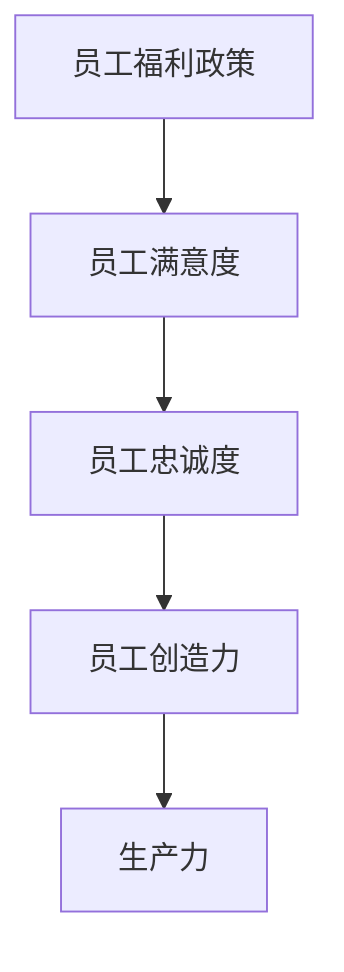
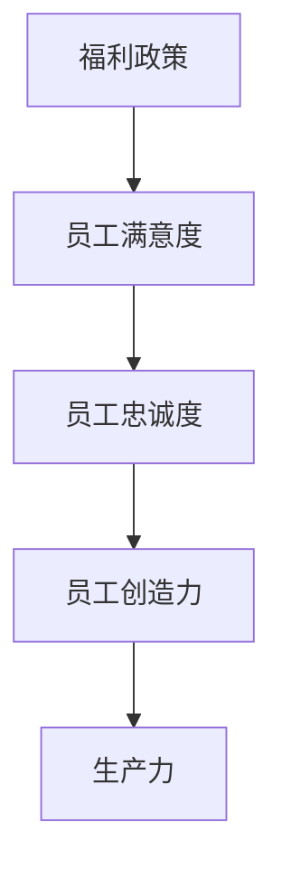
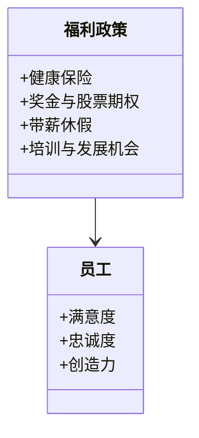

                 


# 彼得林奇如何看待公司的员工福利政策对生产力的影响

> 关键词：员工福利政策, 生产力, 彼得林奇, 福利与效率, 福利政策设计

> 摘要：本文从彼得林奇的视角出发，详细分析了员工福利政策对生产力的影响。通过理论分析、数学建模、系统设计和项目实战，全面探讨了福利政策如何影响员工满意度、忠诚度和创造力，从而对企业生产力产生深远影响。文章结合具体案例和最佳实践，为公司设计和优化员工福利政策提供了有价值的参考。

---

# 第一部分：员工福利政策与生产力的背景介绍

## 第1章：员工福利政策的核心概念

### 1.1 问题背景与问题描述

#### 1.1.1 福利政策的基本概念
员工福利政策是指企业在员工薪资之外提供的各种福利，包括健康保险、奖金、带薪休假、培训机会等。这些福利旨在提升员工的工作满意度和忠诚度，从而间接或直接地影响生产力。

#### 1.1.2 福利政策与生产力的关系
福利政策通过影响员工的工作态度和行为，进而影响其工作效率和质量。例如，良好的健康保险可以减少员工因病缺勤的情况，从而提高生产力。

#### 1.1.3 福利政策对企业竞争力的影响
企业通过提供具有竞争力的福利政策，可以吸引和留住优秀人才，从而在市场竞争中占据优势。

### 1.2 问题解决与边界外延

#### 1.2.1 福利政策如何影响员工积极性
福利政策通过满足员工的基本需求和提升生活质量，增强其工作积极性。例如，提供弹性工作时间可以提高员工的工作满意度。

#### 1.2.2 福利政策的边界与外延
福利政策的边界在于其对生产力的影响程度。当福利政策超出员工实际需求时，边际效用递减，反而可能增加企业成本。

#### 1.2.3 福利政策与生产力的相互作用
福利政策通过影响员工的工作态度和行为，进而影响生产力。同时，生产力的变化也会反过来影响企业对福利政策的需求和调整。

### 1.3 核心要素与概念结构

#### 1.3.1 福利政策的核心要素
- 健康保险
- 奖金与股票期权
- 带薪休假
- 培训与发展机会

#### 1.3.2 生产力的定义与衡量标准
生产力是指单位时间内完成的工作量和质量。衡量标准包括劳动生产率、资源利用率等。

#### 1.3.3 福利政策与生产力的关系图解


---

## 第2章：福利政策与生产力的核心联系

### 2.1 福利政策对员工满意度的影响

#### 2.1.1 员工满意度的定义
员工满意度是指员工对其工作条件、薪酬和福利的总体满意程度。

#### 2.1.2 福利政策对员工满意度的直接影响
福利政策通过满足员工的需求，提升其满意度。例如，提供优质的健康保险可以减少员工的医疗负担，从而提高满意度。

#### 2.1.3 员工满意度与生产力的正相关关系
研究表明，员工满意度越高，其工作效率和质量也越高。这是因为满意员工更愿意为企业付出额外努力。

### 2.2 福利政策对员工忠诚度的影响

#### 2.2.1 员工忠诚度的定义
员工忠诚度是指员工对企业的情感投入和长期承诺。

#### 2.2.2 福利政策对员工忠诚度的影响
福利政策通过提供长期的保障和职业发展机会，增强员工的忠诚度。例如，股票期权可以激励员工长期为企业服务。

#### 2.2.3 员工忠诚度与生产力的相互作用
忠诚的员工更愿意为企业承担责任，积极参与工作，从而提升生产力。

### 2.3 福利政策对员工创造力的影响

#### 2.3.1 创造力的定义
创造力是指员工在工作中提出新想法、解决问题和创新的能力。

#### 2.3.2 福利政策对员工创造力的激励作用
福利政策通过提供良好的工作环境和职业发展机会，激发员工的创造力。例如，提供创新奖励可以激励员工提出新想法。

#### 2.3.3 创造力与生产力的关系
创造力是生产力的重要来源。员工的创造力越高，企业的产品和服务创新越快，竞争力越强。

---

## 第3章：福利政策与生产力的数学模型

### 3.1 生产力的数学定义

#### 3.1.1 生产力的公式表示
$$生产力 = \frac{产出}{投入}$$

#### 3.1.2 福利政策对生产力的影响公式
$$生产力 = f(福利政策)$$

### 3.2 福利政策的边际效用递减定律

#### 3.2.1 边际效用递减的公式表示
$$MU = \frac{ΔU}{ΔC}$$

#### 3.2.2 福利政策对生产力的边际效用分析
随着福利政策的增加，其对生产力的边际效用逐渐递减。这是因为员工的基本需求得到满足后，额外的福利政策对生产力的提升作用减弱。

### 3.3 福利政策与生产力的综合模型

#### 3.3.1 综合模型的公式表示
$$生产力 = a \times 福利政策 + b \times 其他因素$$

#### 3.3.2 模型的变量解释与应用
- $a$：福利政策对生产力的影响系数
- $b$：其他因素对生产力的影响系数
- 其他因素包括员工技能、企业文化和市场需求等。

---

## 第4章：福利政策与生产力的系统分析

### 4.1 福利政策的系统架构

#### 4.1.1 福利政策的系统架构图


### 4.2 福利政策的系统功能设计

#### 4.2.1 福利政策的领域模型


### 4.3 福利政策的系统接口设计

#### 4.3.1 福利政策的接口定义与交互流程
```mermaid
sequenceDiagram
actor 员工
participant 福利政策系统
participant 企业
员工->福

