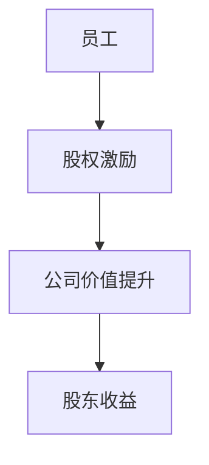

                 


# 彼得林奇如何看待公司的员工股权激励

## 关键词：彼得林奇，员工股权激励，投资理念，公司治理，激励机制

## 摘要：  
彼得·林奇作为全球著名投资家，他对员工股权激励有着独特的见解。本文从彼得林奇的投资哲学出发，深入分析股权激励的核心概念、实施要点、算法原理以及系统架构设计，结合实际案例，为读者提供全面的解读和实践指导。

---

## 第一部分: 背景介绍

### 第1章: 员工股权激励的定义与背景

#### 1.1 员工股权激励的定义
- **基本概念**：员工股权激励是指公司通过给予员工一定比例的股权，将员工的个人利益与公司利益绑定，以激励员工为公司创造更大价值。
- **类型**：常见的类型包括股票期权、限制性股票、股票增值权等。
- **目标与意义**：股权激励能够激发员工积极性，增强公司凝聚力，同时有助于吸引和留住优秀人才。

#### 1.2 股权激励的背景与重要性
- **现代企业治理的挑战**：随着市场竞争加剧，企业需要更有效的激励机制来应对挑战。
- **吸引与留住人才**：股权激励成为吸引和保留核心员工的重要手段。
- **公司长期发展**：股权激励有助于员工与公司共同发展，实现长期目标。

#### 1.3 股权激励的现状与问题
- **实践现状**：许多公司已开始实施股权激励计划，但效果参差不齐。
- **常见问题**：激励机制设计不合理、员工参与度低、短期行为与长期目标冲突。
- **治理边界**：股权激励应与公司治理结构相结合，避免过度激励或激励不足。

### 第2章: 彼得林奇与投资理念

#### 2.1 彼得林奇的个人简介
- **生平与成就**：彼得·林奇是富达投资的传奇基金经理，创造了长期优异的投资业绩。
- **投资哲学**：长期投资、价值发现、注重基本面分析。
- **股权激励观点**：他认为股权激励能够增强管理层与股东的利益一致性，是公司治理的重要组成部分。

#### 2.2 彼得林奇的投资理念
- **长期投资**：关注企业的长期价值，而非短期波动。
- **股东利益最大化**：强调管理层和股东利益的统一。
- **企业治理**：认为有效的公司治理是企业长期成功的关键。

#### 2.3 彼得林奇视角下的股权激励
- **企业价值**：股权激励有助于提升企业价值，实现管理层与股东利益一致。
- **管理层激励**：支持合理的股权激励计划，避免过度依赖短期绩效。
- **投资决策**：在投资决策中，关注公司是否有合理的激励机制。

---

## 第二部分: 核心概念与联系

### 第3章: 股权激励的核心概念与原理

#### 3.1 股权激励的核心概念
- **参与者**：包括公司、员工（通常是管理层或核心员工）、股东。
- **实现方式**：股票期权、限制性股票、股票增值权等。
- **实施条件**：公司需具备一定的盈利能力和发展潜力。

#### 3.2 股权激励的原理与机制
- **激励机制**：通过给予员工股权，激励员工为公司创造更多价值。
- **约束机制**：设置 vesting period（禁售期），确保员工长期 commitment。

#### 3.3 核心概念对比表
| 激励类型 | 定义 | 优点 | 缺点 |
|----------|------|------|------|
| 股票期权 | 公司给予员工在特定价格购买公司股票的权利 | 激励员工创造价值 | 期权价值依赖公司股价表现 |
| 限制性股票 | 公司给予员工一定数量的公司股票，通常需满足特定条件 | 员工与公司利益绑定 | 可能稀释现有股东权益 |

#### 3.4 激励模型
使用 Mermaid 绘制激励模型图：


---

## 第三部分: 算法原理讲解

### 第4章: 股权激励的算法原理

#### 4.1 算法原理
- **股票期权定价模型**：常用 Black-Scholes 模型计算期权价值。
- **模型公式**：
  $$ C = S_0 \cdot N(d_1) - K \cdot e^{-rT} \cdot N(d_2) $$
  其中：
  - \( S_0 \)：当前股价
  - \( K \)：行权价
  - \( r \)：无风险利率
  - \( T \)：时间到期
  - \( N(d) \)：标准正态分布函数
  - \( d_1 = \frac{\ln(S_0/K) + (r + \sigma^2/2)T}{\sigma \sqrt{T}} \)
  - \( d_2 = d_1 - \sigma \sqrt{T} \)

#### 4.2 Python 实现
```python
import numpy as np
from scipy.stats import norm

def black_scholes(S, K, r, T, sigma):
    """
    计算股票期权的理论价值
    参数:
        S: 当前股价
        K: 行权价
        r: 无风险利率
        T: 到期时间（年）
        sigma: 股价波动率
    返回:
        期权理论价值
    """
    d1 = (np.log(S/K) + (r + 0.5*sigma**2)*T) / (sigma*np.sqrt(T))
    d2 = d1 - sigma*np.sqrt(T)
    C = S * norm.cdf(d1) - K * np.exp(-r*T) * norm.cdf(d2)
    return C

# 示例计算
S = 100
K = 105
r = 0.01
T = 1
sigma = 0.2

price = black_scholes(S, K, r, T, sigma)
print(f"期权理论价值: {price}")
```

---

## 第四部分: 系统分析与架构设计

### 第5章: 系统分析与架构设计

#### 5.1 系统功能设计
- **领域模型**：
  ```mermaid
  classDiagram
      class 员工 {
          ID
          姓名
          股权数量
      }
      class 股权激励计划 {
          计划ID
          目标股价
          行权时间
      }
      class 股权激励系统 {
          +员工列表
          +激励计划列表
          -计算期权价值()
          -分配股权()
      }
      员工 <|-- 股权激励计划
      股权激励系统 <|-- 员工
      股权激励系统 <|-- 股权激励计划
  ```

#### 5.2 系统架构设计
- **架构图**：
  ```mermaid
  container 股权激励系统 {
      前端界面
      后端逻辑
      数据库
  }
  ```

#### 5.3 系统交互设计
- **序列图**：
  ```mermaid
  sequenceDiagram
      前端 -> 后端: 发起股权激励请求
      后端 -> 数据库: 查询员工信息
      数据库 -> 后端: 返回员工信息
      后端 -> 前端: 返回计算结果
  ```

---

## 第五部分: 项目实战

### 第6章: 项目实战

#### 6.1 环境安装
- 需要安装 Python 和相关库（如 numpy、scipy）

#### 6.2 核心代码实现
- 使用上面的 Black-Scholes 模型实现股权激励计划的计算。

#### 6.3 实际案例分析
- 以某科技公司为例，设计一个股权激励计划，包括股权分配、行权条件等。

---

## 第六部分: 最佳实践

### 第7章: 最佳实践

#### 7.1 小结
- 股权激励是公司治理的重要工具，设计时需结合公司实际情况。

#### 7.2 注意事项
- 确保激励机制与公司战略一致。
- 合理设计行权条件，避免短期行为。

#### 7.3 拓展阅读
- 推荐书籍：《彼得·林奇的成功投资》、《公司治理与股权激励》

---

## 结语

彼得·林奇认为，股权激励是公司治理中的重要环节，能够有效绑定管理层与股东利益。通过本文的分析，我们了解了股权激励的核心概念、算法原理和系统设计，为实际应用提供了指导。

---

## 作者

作者：AI天才研究院/AI Genius Institute & 禅与计算机程序设计艺术 /Zen And The Art of Computer Programming

