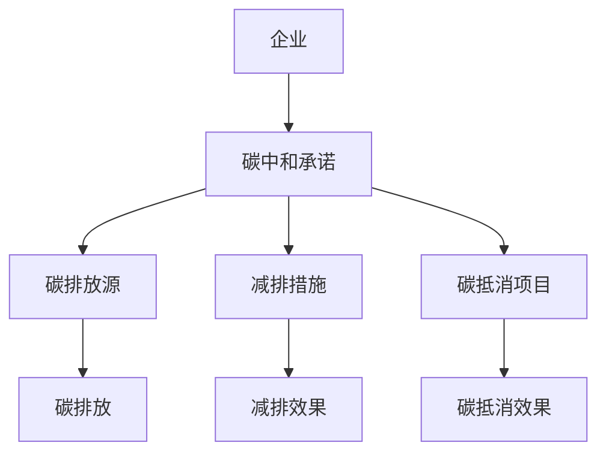

                 


# 彼得林奇如何看待公司的碳中和承诺对估值的影响

> 关键词：彼得·林奇，碳中和承诺，企业估值，投资策略，风险管理，可持续发展

> 摘要：本文深入探讨了彼得·林奇对碳中和承诺在企业估值中的影响的看法。通过分析碳中和承诺的核心概念、算法模型、投资策略、风险管理等方面，结合实际案例，展示了碳中和承诺如何影响企业价值，并为投资者提供了实用的建议。

---

## 第一部分: 背景介绍

### 第1章: 碳中和承诺的定义与目标

#### 1.1 碳中和的定义与目标
- **1.1.1 碳中和的定义**
  - 碳中和是指企业通过减少碳排放或抵消碳排放，实现净零碳排放的目标。
  - 碳中和承诺是企业对自身碳排放进行管理和减少的具体行动计划。

- **1.1.2 碳中和的目标与意义**
  - 碳中和的目标是实现全球气候稳定，减少温室气体排放。
  - 对企业而言，碳中和承诺不仅是社会责任，还能提升品牌形象和竞争力。

- **1.1.3 碳中和承诺的背景与现状**
  - 全球气候变化问题日益严重，企业社会责任意识增强。
  - 碳中和承诺已成为企业可持续发展的重要组成部分。

#### 1.2 公司为何要做出碳中和承诺
- **1.2.1 碳中和承诺的驱动因素**
  - 政策法规要求：许多国家和地区出台碳减排政策，企业需遵守相关规定。
  - 市场需求变化：消费者和投资者越来越关注企业的环保表现。
  - 竞争优势：碳中和承诺可以提升企业的品牌形象和市场竞争力。

- **1.2.2 碳中和承诺与企业社会责任**
  - 碳中和承诺是企业履行社会责任的重要体现。
  - 通过减少碳排放，企业可以为全球气候变化问题贡献力量。

- **1.2.3 碳中和承诺对品牌形象的影响**
  - 碳中和承诺可以提升企业的社会形象。
  - 符合消费者和投资者的环保需求，增强市场信任。

### 第2章: 碳中和承诺与企业价值的关系

#### 2.1 碳中和承诺对企业财务表现的影响
- **2.1.1 碳中和承诺对成本的影响**
  - 碳中和承诺可能增加企业的初期投入，如购买可再生能源设备或碳抵消 credits。
  - 但长期来看，绿色技术的应用可以降低运营成本。

- **2.1.2 碳中和承诺对收入的影响**
  - 碳中和承诺可能提升企业的市场竞争力，吸引更多环保意识强的消费者。
  - 可能带来新的收入来源，如绿色产品或服务。

- **2.1.3 碳中和承诺对风险的影响**
  - 碳中和承诺可以降低企业面临的碳风险，如碳关税或政策罚款。
  - 提升企业的风险管理能力，增强抗风险能力。

#### 2.2 碳中和承诺与企业估值的核心联系
- **2.2.1 碳中和承诺对资产价值的影响**
  - 碳中和承诺可能增加企业的无形资产，如品牌价值和声誉。
  - 绿色资产（如可再生能源设施）的价值可能在碳中和承诺下得到提升。

- **2.2.2 碳中和承诺对负债价值的影响**
  - 碳中和承诺可能增加企业的负债，如碳排放权的购买成本。
  - 但通过减少碳排放，企业可能降低未来的负债风险。

- **2.2.3 碳中和承诺对股东权益的影响**
  - 碳中和承诺可能提升股东对企业未来盈利能力的信心，从而提升股价。
  - 股东可能更愿意投资那些具有可持续发展能力的企业。

---

## 第二部分: 核心概念与联系

### 第3章: 碳中和承诺的核心概念与属性特征

#### 3.1 碳中和承诺的核心概念
- **3.1.1 碳中和承诺的构成要素**
  - 时间范围：承诺的期限和阶段。
  - 行动计划：具体减排措施和实现路径。
  - 监测与报告：减排效果的监测和公开报告。

- **3.1.2 碳中和承诺的实现路径**
  - 技术创新：采用绿色技术减少碳排放。
  - 能源转型：使用可再生能源，减少化石能源依赖。
  - 碳抵消：通过植树等方式抵消剩余碳排放。

- **3.1.3 碳中和承诺的评估标准**
  - � 减排效果：是否实现净零碳排放。
  - 行动计划的可行性：承诺是否具有可操作性。
  - 监测与报告的透明性：企业是否公开减排进展。

#### 3.2 碳中和承诺与企业价值的对比分析
- **3.2.1 碳中和承诺的属性特征**
  - 时间性：承诺具有明确的时间范围。
  - 约束性：承诺需要企业采取具体行动。
  - 可衡量性：承诺的效果可以量化和评估。

- **3.2.2 企业价值的属性特征**
  - 财务表现：企业盈利能力、资产价值等。
  - 市场地位：企业在市场中的竞争地位。
  - 可持续性：企业长期发展的潜力。

- **3.2.3 碳中和承诺与企业价值的对比表格**

| 属性       | 碳中和承诺                 | 企业价值                 |
|------------|--------------------------|-------------------------|
| 时间范围   | 明确的时间范围             | 动态变化                 |
| 约束性     | 具体行动和目标             | 受市场和内部管理影响     |
| 可衡量性   | 可以量化减排效果           | 受多种因素影响，难以单一量化 |

### 第4章: 碳中和承诺的ER实体关系图

#### 4.1 实体关系图的构建
- **4.1.1 实体关系图的定义**
  - 碳中和承诺涉及多个实体，包括企业、碳排放源、减排措施、碳抵消项目等。

- **4.1.2 实体关系图的结构**
  - 中心实体：碳中和承诺。
  - 关联实体：企业、碳排放源、减排措施、碳抵消项目。

- **4.1.3 实体关系图的Mermaid流程图**



---

## 第三部分: 算法原理讲解

### 第5章: 碳中和承诺对企业估值的算法模型

#### 5.1 算法原理
- 碳中和承诺对企业估值的影响可以通过调整企业现金流折现模型（DCF模型）来体现。
- 需要将碳中和承诺的投入成本和未来收益纳入模型中。

#### 5.2 算法的数学模型和公式
- **现金流调整公式：**
  $$ \text{调整后的现金流} = \text{原现金流} - \text{碳中和投入成本} + \text{碳中和带来的收益} $$

- **DCF模型调整公式：**
  $$ \text{企业价值} = \sum_{t=1}^{n} \frac{\text{调整后的现金流}}{(1 + r)^t} $$

#### 5.3 算法实现
- **步骤1：确定碳中和承诺的投入成本和收益**
- **步骤2：调整企业现金流**
- **步骤3：计算企业价值**

#### 5.4 案例分析
- **案例：假设一家企业计划在未来5年内投入1000万美元用于可再生能源项目，预计每年可节约碳排放成本200万美元。**
- **调整后的现金流计算：**
  $$ \text{调整后的现金流} = \text{原现金流} - 1000万 + 200万 \times 5 = \text{原现金流} + 1000万 $$

---

## 第四部分: 投资策略与风险管理

### 第6章: 碳中和承诺的投资策略

#### 6.1 投资策略
- **长期投资策略：** 投资那些有明确碳中和承诺且具有可持续发展潜力的企业。
- **短期投资策略：** 通过碳中和承诺带来的品牌提升和成本降低，寻找短期内股价可能上涨的投资机会。

#### 6.2 风险管理
- **风险识别：** 识别碳中和承诺可能带来的财务风险和市场风险。
- **风险评估：** 评估这些风险对企业估值的具体影响。
- **风险应对：** 制定应对策略，如分散投资、设置止损点等。

---

## 第五部分: 行业分析

### 第7章: 不同行业的碳中和承诺与投资机会

#### 7.1 行业分析
- **科技行业：** 通过技术创新实现碳中和，投资机会包括绿色技术开发企业。
- **制造业：** 通过转型实现碳中和，投资机会包括绿色制造企业。
- **能源行业：** 通过发展可再生能源实现碳中和，投资机会包括风能、太阳能等企业。

---

## 第六部分: 风险管理与总结

### 第8章: 碳中和承诺的风险管理与总结

#### 8.1 碳中和承诺的风险管理
- **压力测试：** 评估碳中和承诺对企业估值的影响在极端情况下的表现。
- **情景分析：** 分析不同情景下碳中和承诺对企业估值的影响。

#### 8.2 总结
- 碳中和承诺不仅是企业社会责任的体现，也是影响企业估值的重要因素。
- 投资者需要将碳中和承诺纳入投资决策中，寻找具有可持续发展潜力的企业。

---

## 第七部分: 项目实战

### 第9章: 碳中和承诺的项目实战

#### 9.1 环境安装
- 需要安装的工具：Python、Mermaid、Latex。
- 数据获取：获取企业的碳排放数据和碳中和承诺相关数据。

#### 9.2 核心实现
- 使用Python编写碳中和承诺对企业估值的算法模型。
- 使用Mermaid绘制实体关系图和流程图。

#### 9.3 代码实现
- **Python代码示例：**

```python
import numpy as np

def calculate_adjusted_cash_flow(original_cash_flow, carbon_cost, carbon_benefit):
    return original_cash_flow - carbon_cost + carbon_benefit

# 示例数据
original_cash_flow = 1000  # 美元
carbon_cost = 100  # 美元
carbon_benefit = 50  # 美元

adjusted_cash_flow = calculate_adjusted_cash_flow(original_cash_flow, carbon_cost, carbon_benefit)
print(f"调整后的现金流为：{adjusted_cash_flow} 美元")
```

---

## 第八部分: 总结

### 第10章: 结论与展望

#### 10.1 总结
- 碳中和承诺对企业估值的影响是多方面的，需要从财务、市场、风险等多个角度进行综合分析。
- 投资者和企业管理者需要充分考虑碳中和承诺的长期影响，制定科学的投资和管理策略。

#### 10.2 展望
- 未来的研究可以进一步探索碳中和承诺在不同行业中的具体影响。
- 可能的方向包括碳中和承诺对企业创新能力和国际竞争力的影响。

---

## 作者信息

作者：AI天才研究院/AI Genius Institute & 禅与计算机程序设计艺术 /Zen And The Art of Computer Programming

---

**说明：** 以上内容为完整的技术博客文章框架和部分详细内容，您可以根据实际需要进一步补充和完善。

