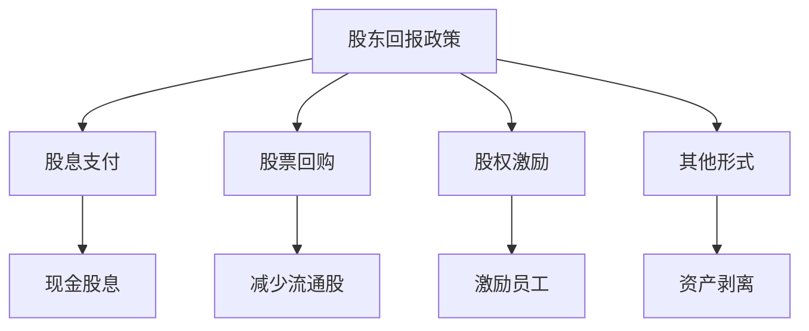
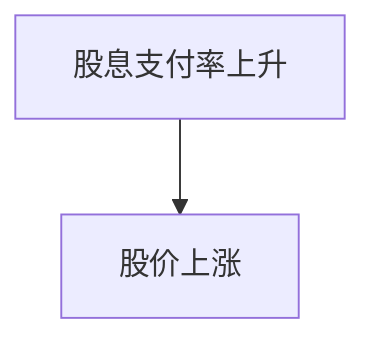
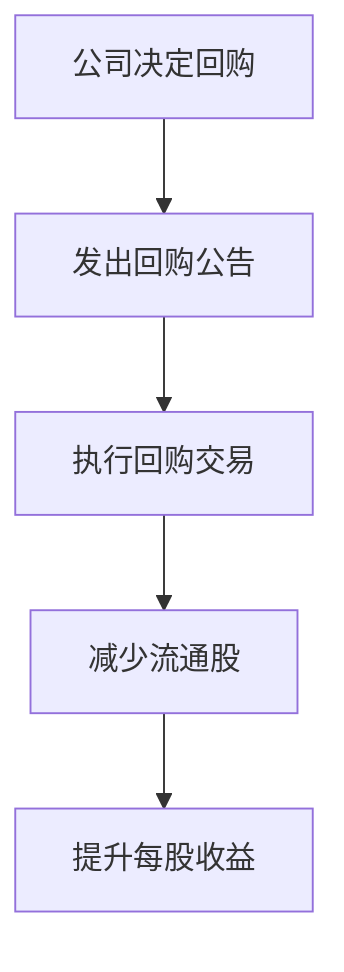

                 

# 彼得林奇如何看待公司的股东回报政策

## 关键词：
- 彼得·林奇
- 股东回报政策
- 股息支付
- 股票回购
- 投资策略

## 摘要：
本文深入探讨了彼得·林奇对股东回报政策的看法，分析了股东回报政策的类型、制定与评估、实施与挑战，并结合经典案例进行了详细解读。文章从理论到实践，结合彼得·林奇的投资理念，提供了关于股东回报政策的全面分析，帮助投资者和企业管理者更好地理解和应用这一政策。

---

# 第一部分：股东回报政策的背景与重要性

## 第1章：股东回报政策概述

### 1.1 股东回报政策的定义与核心概念

#### 1.1.1 股东回报政策的定义
股东回报政策是指公司通过股息支付、股票回购、股权激励等形式，将利润或资产价值返还给股东的政策。这种政策旨在平衡股东利益与公司发展的长期目标。

#### 1.1.2 股东回报政策的核心要素
- **股息支付**：公司将部分利润以现金形式分配给股东。
- **股票回购**：公司用自有资金从市场上回购股票，减少流通股数量，提升每股价值。
- **股权激励**：通过股票期权或其他形式激励员工，增强公司凝聚力。
- **其他形式**：如特别股息分配、资产剥离等。

#### 1.1.3 股东回报政策的重要性
- 提升股东满意度，增强市场对公司的信心。
- 优化公司资本结构，降低财务风险。
- 通过合理的回报政策吸引长期投资者，提升股价稳定性。

### 1.2 彼得·林奇与股东回报政策的关联

#### 1.2.1 彼得·林奇的投资者理念
彼得·林奇是美国著名投资家，被誉为“股票投资专家”。他强调长期投资、基本面分析和对公司管理层的信任。他认为，股东回报政策是衡量公司管理层是否重视股东利益的重要标准。

#### 1.2.2 林奇对股东回报政策的重视
林奇认为，一家公司如果能够持续稳定地向股东分配利润，说明公司管理层具有良好的财务管理和盈利能力。他倾向于投资那些能够通过股息支付或股票回购等方式回报股东的公司。

#### 1.2.3 林奇投资策略中的股东回报考量
在林奇的投资策略中，股东回报政策是评估公司投资价值的重要指标之一。他关注公司的股息支付率、股息增长能力以及股票回购计划等。

---

## 第2章：股东回报政策的类型与选择

### 2.1 股东回报的主要形式

#### 2.1.1 股息支付
股息支付是股东回报最常见的形式。公司通过将利润分配给股东，直接增加股东的现金收益。林奇认为，稳定的股息支付率是公司财务健康的重要标志。

#### 2.1.2 股票回购
股票回购是指公司用自有资金从市场上回购股票，减少流通股数量，从而提升每股收益和股价。林奇认为，股票回购是公司管理层对公司未来增长有信心的体现，但也需谨慎评估市场环境和公司财务状况。

#### 2.1.3 股权激励
股权激励是通过股票期权、限制性股票等方式激励管理层和员工，增强团队凝聚力。林奇认为，合理的股权激励政策能够有效绑定管理层利益，提升公司长期绩效。

#### 2.1.4 其他回报形式
包括特别股息分配、资产剥离等。这些形式在特定情况下可以为股东创造额外价值。

### 2.2 彼得·林奇对不同回报形式的看法

#### 2.2.1 股息支付的优缺点
- **优点**：稳定收益，增强市场信心。
- **缺点**：过度支付股息可能影响公司发展。

#### 2.2.2 股票回购的策略分析
- **优点**：提升股价，优化资本结构。
- **缺点**：资金使用不当可能影响公司未来发展。

#### 2.2.3 股权激励的有效性
- **优点**：激励管理层，绑定利益。
- **缺点**：设计不合理可能导致短期行为。

#### 2.2.4 综合运用不同回报形式
林奇认为，公司应根据自身情况灵活运用多种回报形式，平衡股东利益与公司发展需求。

---

## 第3章：股东回报政策的制定与评估

### 3.1 制定股东回报政策的步骤

#### 3.1.1 确定公司财务状况
公司需评估自身盈利能力、现金流状况和资产负债情况，确保回报政策的可行性。

#### 3.1.2 评估股东需求
了解股东结构和需求，制定符合大多数股东利益的回报政策。

#### 3.1.3 结合公司战略目标
将股东回报政策与公司长期战略目标相结合，确保政策的可持续性。

### 3.2 评估股东回报政策的指标

#### 3.2.1 股东满意度
通过股东反馈和市场反应评估政策效果。

#### 3.2.2 股票市场表现
股价走势是衡量政策效果的重要指标。

#### 3.2.3 财务健康状况
关注公司的盈利能力、现金流和资产负债率等财务指标。

#### 3.2.4 竞争对手对比
将公司政策与行业平均水平和主要竞争对手进行对比。

---

## 第4章：股东回报政策的实施与挑战

### 4.1 政策实施的关键因素

#### 4.1.1 财务可行性
确保公司有足够的现金流和利润支持回报政策。

#### 4.1.2 市场环境影响
关注宏观经济和行业趋势，避免在不利环境下盲目实施政策。

#### 4.1.3 公司治理结构
良好的公司治理能够确保政策的顺利实施和公平分配。

### 4.2 实施中的常见挑战

#### 4.2.1 短期 vs 长期回报的平衡
过度关注短期回报可能损害公司长期发展。

#### 4.2.2 利益相关者冲突
不同股东之间的利益冲突可能影响政策实施。

#### 4.2.3 市场波动的影响
市场波动可能影响政策效果，需灵活调整。

---

## 第5章：案例分析：彼得·林奇的经典投资案例

### 5.1 成功案例解析

#### 5.1.1 某公司如何通过合理回报政策提升股价
以某公司为例，分析其通过合理股息支付和股票回购提升股价的案例。

#### 5.1.2 林奇如何评估和选择回报政策良好的公司
林奇通过分析公司股息支付率、回购计划和股权激励政策，选择具有良好股东回报政策的公司。

### 5.2 失败案例分析

#### 5.2.1 过度回报导致的财务危机
分析因过度股息支付或股票回购导致公司财务危机的案例。

#### 5.2.2 忽视股东需求的后果
探讨因忽视股东需求而引发的市场信任危机和股价下跌的案例。

---

## 第6章：最佳实践与投资建议

### 6.1 最佳实践总结

#### 6.1.1 如何制定有效的股东回报政策
结合公司财务状况、股东需求和战略目标，制定灵活且可持续的回报政策。

#### 6.1.2 林奇的三大投资原则
- **长期投资**：关注公司长期发展。
- **基本面分析**：评估公司财务健康和盈利能力。
- **管理层信任**：信任管理层的决策能力。

#### 6.1.3 风险管理的重要性
通过分散投资和风险评估，降低投资风险。

### 6.2 投资者策略建议

#### 6.2.1 关注公司回报政策
分析公司的股息支付率、回购计划和股权激励政策。

#### 6.2.2 分析公司财务健康状况
关注公司的盈利能力、现金流和资产负债率等指标。

#### 6.2.3 长期投资 vs 短期收益
平衡短期收益与长期投资价值，选择具有持续回报能力的公司。

---

## 第7章：未来趋势与展望

### 7.1 数字化与股东回报

#### 7.1.1 数字化对企业回报政策的影响
数字化转型可能改变股东回报的方式和效率。

#### 7.1.2 新兴技术对股东回报方式的改变
区块链等技术可能改变股息支付和股票回购的实现方式。

### 7.2 ESG投资与股东回报

#### 7.2.1 ESG因素对股东回报的影响
环境、社会和治理因素逐渐成为影响股东回报的重要因素。

#### 7.2.2 未来股东回报政策的演变
随着ESG投资的兴起，股东回报政策将更加注重可持续发展和社会责任。

---

## 第8章：总结与小结

### 8.1 全书总结

#### 8.1.1 主要观点回顾
股东回报政策是公司治理的重要组成部分，合理的政策能够提升股东满意度和市场信心。

#### 8.1.2 关键概念总结
- 股息支付
- 股票回购
- 股权激励
- 股东满意度

### 8.2 致谢与展望

#### 8.2.1 致谢
感谢读者的关注和支持。

#### 8.2.2 对未来研究的展望
未来将深入研究新兴技术和ESG投资对股东回报政策的影响。

---

## 图表目录

### 图表1：股东回报政策的概念结构图

### 图表2：股息支付与股价上涨的关联性

### 图表3：股票回购的步骤流程图

---

## 作者信息

作者：AI天才研究院/AI Genius Institute & 禅与计算机程序设计艺术 /Zen And The Art of Computer Programming

